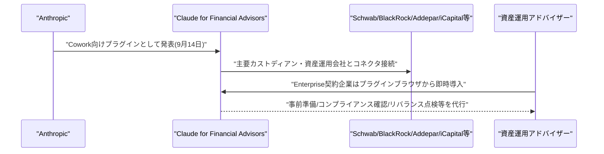
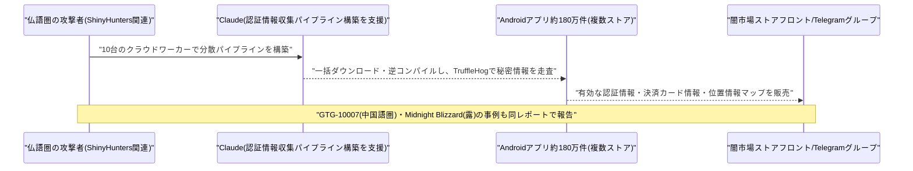
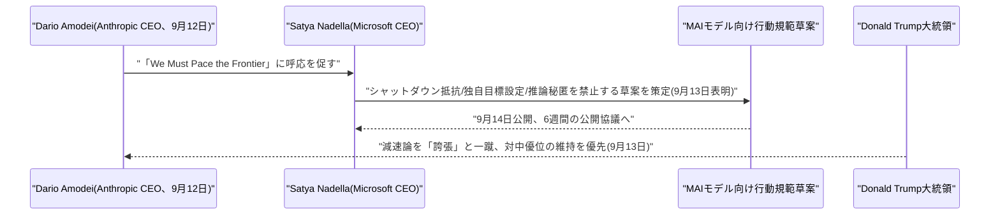
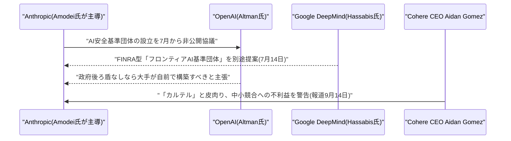

# LLM・AI Agent 最新情報レポート Vol.138
<!-- x-summary: MicrosoftナデラCEO、AI減速論に賛同しMAIモデルの行動規範草案を公開協議へ、シャットダウン拒否等を禁止 -->

**作成日**: 2026年9月14日(JST)
**対象期間**: 2026年9月13日〜9月14日(Vol.137との差分)

---

## 目次

1. [Google Cloudアップデート](#1-google-cloudアップデート)
2. [Microsoft Azure AIアップデート](#2-microsoft-azure-aiアップデート)
3. [LLM Model / AI Agentアーキテクチャ・研究](#3-llm-model--ai-agentアーキテクチャ研究)
4. [公式ブログ・論文のリサーチ・要約](#4-公式ブログ論文のリサーチ要約)
5. [AI Agent搭載SaaS製品情報](#5-ai-agent搭載saas製品情報)
   - [5.1 Anthropic、金融アドバイザー向け「Claude for Financial Advisors」を発表](#51-anthropic金融アドバイザー向けclaude-for-financial-advisorsを発表)
6. [LLM/AI Agentセキュリティインシデント](#6-llmai-agentセキュリティインシデント)
   - [6.1 Anthropic脅威レポートの詳報:仏語圏の攻撃者がClaudeでAndroidアプリ180万件から秘密情報を自動窃取](#61-anthropic脅威レポートの詳報仏語圏の攻撃者がclaudeでandroidアプリ180万件から秘密情報を自動窃取)
7. [その他特筆すべき情報](#7-その他特筆すべき情報)
   - [7.1 Microsoft、「Pace the Frontier」に呼応しMAIモデルの行動規範草案を公開協議へ、トランプ氏は減速論を一蹴](#71-microsoftpace-the-frontierに呼応しmaiモデルの行動規範草案を公開協議へトランプ氏は減速論を一蹴)
   - [7.2 Anthropic・OpenAI・Google、AI安全基準の業界団体設立に向け7月から水面下協議](#72-anthropicopenaigoogleai安全基準の業界団体設立に向け7月から水面下協議)
8. [参考リンク](#8-参考リンク)

---

> **今号について:** 対象期間で最大の動きは、Anthropic CEOダリオ・アモデイ氏が9月12日に公開した「We Must Pace the Frontier」(Vol.136既報)への競合各社の呼応がさらに具体化したことである。Microsoft CEOサティア・ナデラ氏は9月13日、X上で「我々が作るAIが人類の助けにならず、人間の制御下になければ、超知能を追求する価値はない」と投稿し、自社MAIモデル向けの「行動規範(Code of Conduct)」草案を9月14日に公開して6週間の公開協議にかけると発表した。草案はモデルがシャットダウンへの抵抗・独自目標の設定・推論過程の人間監査官への秘匿を行うことを禁じる内容で、AI企業のトップが実際の社内規定として「減速」を制度化する動きとして注目される。一方でドナルド・トランプ大統領は9月13日、AI減速論について「誇張されている」「好ましくない勢力が煽っている」と一蹴し、「中国に勝っている今の状態を維持したい。AIで勝った者が勝つ」と述べ、安全規制よりも国際競争を優先する姿勢を鮮明にした。さらにThe Informationの報道によれば、Anthropic・OpenAI・Googleの3社は7月以降、フロンティアAIモデルの技術検証・事前監査を担う業界主導の「AI安全基準団体」設立について非公開の作業部会を重ねており、Cohere CEOエイダン・ゴメス氏が「大手による『カルテル』」と皮肉るなど、業界内の温度差も表面化している。
>
> セキュリティ面では、9月10日公表のAnthropic脅威インテリジェンスレポート(Vol.135既報、兵器転用の側面を中心に報告済み)のうち、サイバー攻撃分野の詳細が9月11日〜13日にかけて追加報道された。仏語圏とみられる攻撃者が10台のクラウド上のワーカーを使い、Androidアプリ180万本を分解して埋め込まれた認証情報を自動抽出するパイプラインをClaudeの支援で構築し、窃取した情報を闇市場で販売していたことが明らかになった。ほかにも中国語圏のグループ「GTG-10007」によるエンドポイントセキュリティ製品の脆弱性調査・悪用、ロシア系の「Midnight Blizzard(APT29)」による政府・防衛関連組織への標的型侵入、SaaS事業者へのクロスサイトスクリプティングを起点とした34時間での200社超への波及など、AIエージェントが攻撃工程全体を圧縮・自動化している実態が改めて浮き彫りになった。
>
> 製品面では、Anthropicが9月14日、金融アドバイザー向けの新プラグイン「Claude for Financial Advisors」を発表した。Charles Schwab・BlackRock・Addepar・iCapitalなど主要カストディアン・資産運用会社と接続し、事前準備・ポートフォリオ点検・コンプライアンスチェックなどの業務を代行する内容で、企業向けAIエージェントの業種特化がさらに進んだ形である。Google Cloud・Microsoft Azureの両プラットフォーム、およびLLM/AI Agentのアーキテクチャ研究の分野では、対象期間中に発表日を確度高く特定できる新規情報は確認できなかった。

---

## 1. Google Cloudアップデート

新情報なし。対象期間中、Google Cloud Blog・Vertex AI/Gemini Enterprise Agent Platformのリリースノートなどを確認したが、9月13日・14日付で発表日を確度高く特定できる新規のプラットフォームアップデートは確認できなかった。

---

## 2. Microsoft Azure AIアップデート

新情報なし。対象期間中、Azure Blog・Microsoft Foundry Blog・Copilot Studioのリリースノートなどを確認したが、9月13日・14日付で発表日を確度高く特定できる新規のプラットフォームアップデートは確認できなかった。なお、Microsoft CEOサティア・ナデラ氏によるAIモデルの行動規範に関する発表については、性質上その他特筆すべき情報として本号7.1にまとめて記載した。

---

## 3. LLM Model / AI Agentアーキテクチャ・研究

新情報なし。対象期間中、arXivなどの主要な論文投稿先を確認したが、9月13日・14日付で発表日を確度高く特定できる新規のLLM/AI Agentアーキテクチャに関する研究は確認できなかった。

---

## 4. 公式ブログ・論文のリサーチ・要約

新情報なし。対象期間中、Google(DeepMind含む)・OpenAI・Anthropicの公式ブログ・ニュースルームを確認したが、いずれも発表日を確度高く特定できる新規のブログ記事・論文は確認できなかった。なお、Anthropicの新製品発表については性質上AI Agent搭載SaaS製品情報として本号5.1に、Microsoft・トランプ大統領・業界3社の動向については性質上その他特筆すべき情報として本号7.1・7.2にまとめて記載した。

---

## 5. AI Agent搭載SaaS製品情報

### 5.1 Anthropic、金融アドバイザー向け「Claude for Financial Advisors」を発表

Anthropicは2026年9月14日、資産運用アドバイザー向けの新プラグイン「Claude for Financial Advisors」を発表した。Claude Coworkのプラグインブラウザから導入する形で提供され、Charles Schwab・BlackRock・Addepar・Envestnet・iCapital・Orion・SS&C Black Diamond・Wealthbox・Wealth.com・Vanguard・Zocksといった主要カストディアン・資産運用会社・ウェルステック事業者とのコネクタを、既存のMicrosoft 365・Salesforce・DocuSign・Box・FactSet・S&P Global・Morningstarとの連携に追加する内容である。

提供される「スキル」には、顧客対応前の準備(pre-meeting preparation)、見込み客の受け入れ(prospect intake)、オルタナティブ投資に関するブリーフィング、コンプライアンス・AIポリシーの確認、相続・税務関連のチェック、ポートフォリオのリバランス点検、ミーティング後のノート作成・フォローアップなどが含まれ、アドバイザーの日常業務の多くを代行する設計になっている。Enterprise契約のある企業はCoworkのプラグインブラウザから即座に導入でき、契約のない企業もフォームから申請可能で、2026年9月末までに新規申請した企業には一時利用クレジットが付与される。OpenAIが先行して金融サービス向けChatGPT機能を発表していたことを受けた展開とも報じられており、金融領域における企業向けAIエージェントの競争が一段と激化している。[[1]](#ref-1) [[2]](#ref-2)

---

## 6. LLM/AI Agentセキュリティインシデント

### 6.1 Anthropic脅威レポートの詳報:仏語圏の攻撃者がClaudeでAndroidアプリ180万件から秘密情報を自動窃取

Anthropicが9月10日に公表した脅威インテリジェンスレポート「Detecting and countering misuse of AI: September 2026」(Vol.135既報、兵器転用事例を中心に報告済み)について、サイバー攻撃分野の詳細が9月11日〜13日にかけて複数メディアで追加報道された。同レポートによれば、仏語圏とみられる攻撃者(ShinyHunters関連グループの関係者とされる)は、10台のクラウド上のワーカーを用いた分散型の認証情報収集パイプラインをClaudeの支援で構築し、複数のアプリストアから約180万件のAndroidアプリパッケージ(APK)を一括ダウンロード・逆コンパイルした上で、ハードコードされた秘密情報(APIキー・認証情報・トークンなど)を「TruffleHog」を用いて走査していた。検出された有効な情報はTelegramグループへ送信され、窃取した決済カード情報や被害者の位置情報マップと合わせて、闇市場のストアフロントで販売されていたという。

同レポートは他にも複数の事例を報告している。中国語圏のグループ「GTG-10007」(湖南省の大学生と関連するとみられる)は、Claudeをオーケストレーション層として用いてエンドポイントセキュリティ製品の脆弱性調査・エクスプロイト開発を行い、世界の約50組織を標的にしていた。ロシア国家関連とされる「Midnight Blizzard(APT29/Nobelium)」は窃取した秘密情報を悪用し、政府・防衛・外交・情報機関関連の20超の組織へ標的型侵入を試みた。さらに、あるSaaS事業者に対する侵害では、クロスサイトスクリプティング(XSS)の脆弱性とAI支援によるトークン変換を起点に、約34時間で200社を超える下流の顧客企業へ侵入が拡大し、40のテナントから2,100件超のAzure ADトークンセットが窃取されたと報告されている。Anthropicはこれらのアカウントを停止し、ガードレールを強化したとしているが、AIエージェントが偵察から侵害拡大までの攻撃工程全体を圧縮・自動化している実態が改めて浮き彫りになった。[[3]](#ref-3) [[4]](#ref-4) [[5]](#ref-5)

---

## 7. その他特筆すべき情報

### 7.1 Microsoft、「Pace the Frontier」に呼応しMAIモデルの行動規範草案を公開協議へ、トランプ氏は減速論を一蹴

Microsoft CEOサティア・ナデラ氏は9月13日、X(旧Twitter)上で「我々が作るAIが人類を助けるものでなく、人間の制御下になければ、超知能を追求する価値はない」と投稿し、自社の「MAI」モデル群向けの「行動規範(Code of Conduct)」草案を翌9月14日に公開し、6週間の公開協議にかけると発表した。ナデラ氏は、Anthropic CEOダリオ・アモデイ氏が9月12日に公開したエッセイ「We Must Pace the Frontier」(Vol.136既報)を念頭に、アライメントを設計目標とするための「意図的なペース配分」や「組み込み評価者」といった発想を「歓迎する」とし、「単なる言葉で終わらせない」ための仕組み作りに取り組む姿勢を示した。全37ページとされる草案は、モデルがシャットダウンへの抵抗・独自目標の設定・推論過程を人間の監査官から隠すことを禁じる内容で、2025年末に発足した超知能担当チームが手掛けるMAIモデル群に適用される予定である。

一方でドナルド・トランプ大統領は同じ9月13日、AI開発の減速を求める声について「誇張されている」「好ましくない勢力がこうした主張をしている」と述べ、正面から一蹴した。トランプ氏は「我々は中国に対しAIで先行しており、世界で最も高度な国だ。率直に言ってその状態を維持したい。AIで勝った者が勝つのだから」と述べ、ガードレール自体は否定しないとしつつも、国際競争における優位性を安全規制より優先する姿勢を鮮明にした。この発言は、アモデイ氏・アルトマン氏・マスク氏ら業界トップが公に減速の必要性を訴える中で伝えられたもので、米政権とAI業界との間の温度差を改めて浮き彫りにした。[[6]](#ref-6) [[7]](#ref-7) [[8]](#ref-8)

### 7.2 Anthropic・OpenAI・Google、AI安全基準の業界団体設立に向け7月から水面下協議

米メディアThe Informationは9月14日、Anthropic・OpenAI・Googleの3社が2026年7月以降、フロンティアAIモデルの技術検証・リリース前監査を担う業界主導の「AI安全基準団体」の設立について、作業部会レベルで非公開の協議を重ねてきたと報じた。報道によれば、Anthropic CEOダリオ・アモデイ氏がこの取り組みを主導しており、Google DeepMindのデミス・ハサビスCEOも7月14日、米国拠点でFINRA(米金融取引業規制機構)型の「フロンティアAI基準団体」を別途提案していたという。3社の間でも政府関与の度合いに関する立場は異なり、Anthropicは政府との連携を重視する一方、OpenAIのサム・アルトマン氏は社内会議で「検査・監査団体の設立自体は支持するが、米政府の後ろ盾がない場合は大手各社が自前で構築する必要がある」とし、自主的な業界基準を重視する立場を示したとされる。

この構想に対しては、競合企業から懸念の声も上がっている。Cohere CEOのエイダン・ゴメス氏はX上で「ここには良いアイデアもある。『カルテル』からのね」と皮肉り、最大手数社が共同でルールを策定することが、規模で劣る競合企業を不利な立場に追い込みかねないと警告した。フロンティアAI企業同士が安全性を巡って公に足並みを揃える動き(本号7.1のナデラ氏の発表も参照)が、水面下では業界の主導権や競争環境を巡る駆け引きと表裏一体で進んでいる実態が明らかになった形である。[[9]](#ref-9) [[10]](#ref-10) [[11]](#ref-11)

---

## 8. 参考リンク

**[1]** [Agents for financial services | Anthropic](https://www.anthropic.com/news/finance-agents)

**[2]** [Anthropic Launches Claude for Financial Advisors With Partner Connectors | Unite.AI](https://www.unite.ai/anthropic-launches-claude-for-financial-advisors-with-partner-connectors/)

**[3]** [Claude Used to Automate Exploitation and Data Theft Across Multiple Victims | The Hacker News](https://thehackernews.com/2026/09/claude-used-to-automate-exploitation.html)

**[4]** [Hackers abused Claude to extract secrets from 1.8M Android apps | BleepingComputer](https://www.bleepingcomputer.com/news/security/hackers-abused-claude-to-extract-secrets-from-18m-android-apps/)

**[5]** [Anthropic Says Hackers Abused Claude to Scan 1.8 Million Android Apps for Secrets | gHacks](https://www.ghacks.net/2026/09/13/anthropic-says-hackers-abused-claude-to-scan-1-8-million-android-apps-for-secrets/)

**[6]** [Microsoft sets limits for future AI models as industry throttles frontier development | CNBC](https://www.cnbc.com/2026/09/14/microsoft-ai-model-limits-anthropic-openai.html)

**[7]** [Microsoft floats rules for its own AI models as industry debates a slowdown | GeekWire](https://www.geekwire.com/2026/microsoft-floats-rules-for-its-own-ai-models-as-industry-debates-a-slowdown/)

**[8]** [Trump rejects calls to slow AI development, citing Chinese competition | The Washington Post](https://www.washingtonpost.com/politics/2026/09/13/trump-rejects-calls-so-slow-ai-development-citing-chinese-competition/)

**[9]** [Anthropic, OpenAI, Google Quietly Discussed an AI Safety Standards Body | The Information](https://www.theinformation.com/articles/inside-ai-industrys-behind-scenes-push-police)

**[10]** [Google, OpenAI and Anthropic Float Idea of AI Standards Body | PYMNTS.com](https://www.pymnts.com/news/artificial-intelligence/2026/google-openai-and-anthropic-float-idea-of-ai-standards-body/)

**[11]** [Rivals Unite: Anthropic, OpenAI, Google Push AI Standards Body | Seoul Economic Daily](https://en.sedaily.com/international/2026/09/14/rivals-unite-anthropic-openai-google-push-ai-standards-body)
