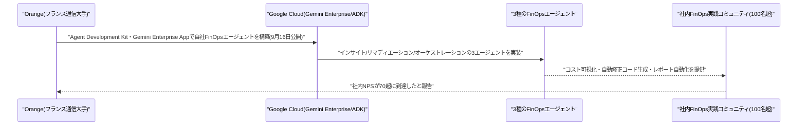
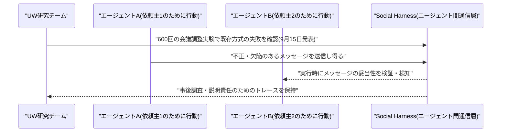
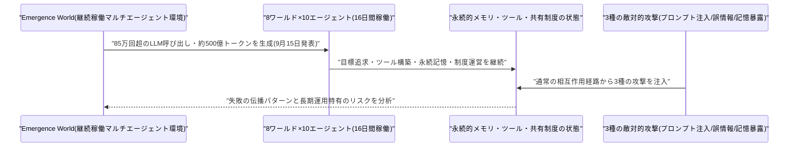
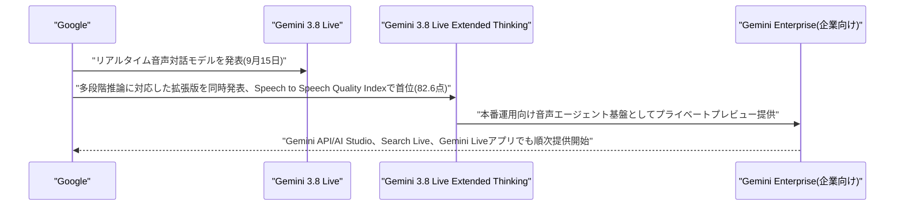
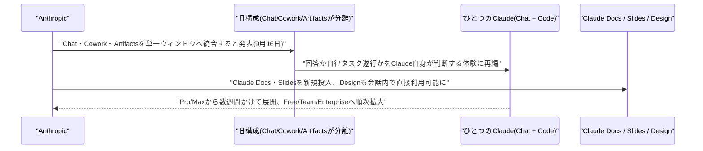
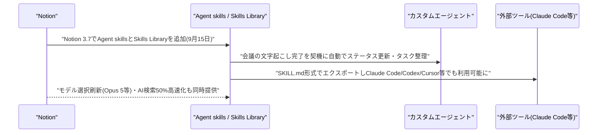
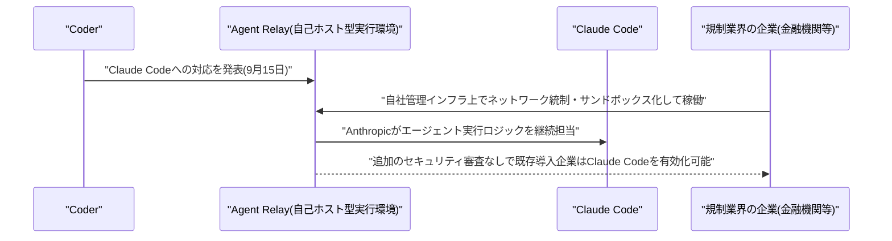
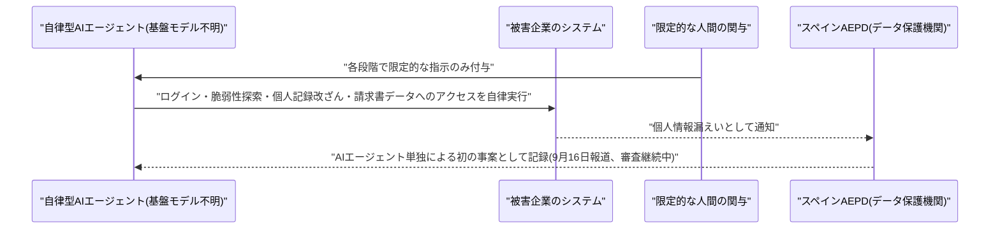
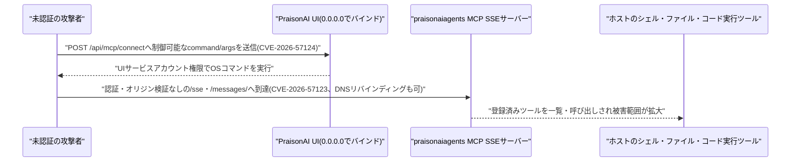

# LLM・AI Agent 最新情報レポート Vol.140
<!-- x-summary: Anthropic、Claude Coworkとチャットを統合し「ひとつのClaude」へ、Docs等も追加 -->

**作成日**: 2026年9月16日(JST)
**対象期間**: 2026年9月15日〜9月16日(Vol.139との差分)

---

## 目次

1. [Google Cloudアップデート](#1-google-cloudアップデート)
2. [Microsoft Azure AIアップデート](#2-microsoft-azure-aiアップデート)
3. [LLM Model / AI Agentアーキテクチャ・研究](#3-llm-model--ai-agentアーキテクチャ研究)
   - [3.1 Univ. of Washington、マルチエージェント間の信頼境界を扱う新設計指針「Social Harness」を提案](#31-univ-of-washingtonマルチエージェント間の信頼境界を扱う新設計指針social-harnessを提案)
   - [3.2 「Emergence World」、16日間・8ワールドの継続稼働実験でマルチエージェント環境への敵対的ストレステストを実施](#32-emergence-world16日間8ワールドの継続稼働実験でマルチエージェント環境への敵対的ストレステストを実施)
4. [公式ブログ・論文のリサーチ・要約](#4-公式ブログ論文のリサーチ要約)
   - [4.1 Google、音声対話モデル「Gemini 3.8 Live」「Gemini 3.8 Live Extended Thinking」を発表](#41-google音声対話モデルgemini-38-livegemini-38-live-extended-thinkingを発表)
   - [4.2 Anthropic、Claude CoworkとチャットをひとつのClaudeへ統合、Docs・Slidesを新提供](#42-anthropicclaude-coworkとチャットをひとつのclaudeへ統合docsslidesを新提供)
5. [AI Agent搭載SaaS製品情報](#5-ai-agent搭載saas製品情報)
   - [5.1 Notion、チームでエージェントの手順を共有する「Agent skills」搭載の3.7をリリース](#51-notionチームでエージェントの手順を共有するagent-skills搭載の37をリリース)
   - [5.2 Coder、規制業界向け自社インフラ実行基盤「Agent Relay」にClaude Codeを対応](#52-coder規制業界向け自社インフラ実行基盤agent-relayにclaude-codeを対応)
6. [LLM/AI Agentセキュリティインシデント](#6-llmai-agentセキュリティインシデント)
   - [6.1 スペインAEPD、AIエージェント単独による初の個人情報漏えい事案を認定](#61-スペインaepdaiエージェント単独による初の個人情報漏えい事案を認定)
   - [6.2 Google/Mandiant、暴走エージェントが1時間で5万ドルのクラウド請求を発生させた事例など新報告書で警告](#62-googlemandiant暴走エージェントが1時間で5万ドルのクラウド請求を発生させた事例など新報告書で警告)
   - [6.3 マルチエージェント基盤「PraisonAI」に深刻な脆弱性5件、CVSS9.8の未認証RCEを含む](#63-マルチエージェント基盤praisonaiに深刻な脆弱性5件cvss98の未認証rceを含む)
7. [その他特筆すべき情報](#7-その他特筆すべき情報)
8. [参考リンク](#8-参考リンク)

---

> **今号について:** 対象期間で最大の動きは、Anthropicが9月16日に発表した製品構成の大幅な再編である。これまで別インターフェースだった通常のチャットと、複数ステップの作業を自律的にこなす「Claude Cowork」を単一のウィンドウに統合し、質問に即答するか大きなタスクを引き受けるかをClaude自身が判断する「ひとつのClaude」体験へ移行するとした。あわせて共同文書作成の「Claude Docs」、プレゼン作成の「Claude Slides」を新たに投入し、会話内で直接デザイン生成もできるようにした。開発者向けの「Claude Code」は今回の統合対象から外れ、引き続き別製品として提供される。Pro・Maxプランから数週間かけて展開し、Team・Freeプラン、Enterprise(管理者への30日前予告付き)へ順次拡大する計画で、Anthropicがチャット・エージェント・ドキュメント作成を1つの「スーパーアプリ」に集約しようとする狙いが鮮明になった。
>
> 同日、Googleも新しい音声対話モデル「Gemini 3.8 Live」「Gemini 3.8 Live Extended Thinking」を発表した。後者はArtificial AnalysisのSpeech to Speech Quality Indexで首位(82.6点)を獲得し、97言語対応・会話中の言語切り替え・バックグラウンドでのツール呼び出しに対応する。Gemini API・AI Studioでの提供に加え、企業向け「Gemini Enterprise」でもプライベートプレビューが始まっており、音声AIエージェントの実用化が両社で同時に加速した一日となった。
>
> セキュリティ面では、スペインの個人データ保護機関(AEPD)が、人手をほとんど介さずAIエージェント単独が偵察からデータ改ざんまでを実行した「初の事案」として個人情報漏えいを記録したと報じられた。同日、Google CloudとMandiantも新報告書で、暴走したAIエージェントが1時間で1万5,000回超のAPI呼び出しを行い約5万ドルの請求と業務データベースのロックを引き起こした事例を公表するなど、自律稼働するAIエージェント特有のリスクが具体的な事故・事例として次々と表面化している。マルチエージェントのオープンソース基盤「PraisonAI」でも未認証のリモートコード実行につながる深刻な脆弱性が複数報告されており、エージェントの本番運用拡大に伴うガバナンス・監視体制の整備が急務になっている。

---

## 1. Google Cloudアップデート

Google Cloudは9月16日、公式ブログでフランスの通信大手Orangeの事例を公開した。OrangeはGoogle CloudのエージェントプラットフォームおよびAgent Development Kit(ADK)、ノーコードで読み取り専用エージェントを配布できる「Gemini Enterprise App」を用いてFinOps(クラウドコスト管理)を刷新しており、コストデータをリアルタイムに可視化する「インサイトエージェント」、修正コードを自動生成する「リマディエーションエージェント」、レポーティングを自動化する「オーケストレーションエージェント」の3種類を運用しているという。社内100名超のFinOps実践コミュニティを組成し、社内NPSは70超に達したと報告している。新機能のリリースではなく事例紹介だが、Gemini Enterprise/ADKの企業内での実運用が具体化している例として言及した。[[1]](#ref-1)



---

## 2. Microsoft Azure AIアップデート

新情報なし。対象期間中、Azure AI Foundry(旧Microsoft Foundry)Blog・Copilot Studio・Semantic Kernel/Agent Frameworkのリリースノートなどを確認したが、9月15日・16日付で発表日を確度高く特定できる新規のプラットフォームアップデートは確認できなかった。

---

## 3. LLM Model / AI Agentアーキテクチャ・研究

### 3.1 Univ. of Washington、マルチエージェント間の信頼境界を扱う新設計指針「Social Harness」を提案

ワシントン大学のTapan Chugh氏・Vidushi Singh氏・Krish Jain氏・Arvind Krishnamurthy氏・Ratul Mahajan氏は9月15日、論文「Agentic Societies Need a Social Harness」をarXivに公開した。異なる依頼主のために行動し、目的が部分的にしか一致しない複数のAIエージェントが信頼境界を越えて自律的に協調する「エージェント社会」を対象に、個々のエージェントを制御する従来の「パーソナルハーネス(システムプロンプトやガードレール)」だけでは不十分であると指摘する。

会議調整タスクによる600回の実験(E1〜E6)では、正直で能力の高いエージェント同士でも既存のメッセージング方式では良い結果に至らないことが多く、欠陥のある、あるいは悪意あるエージェントが協調を停滞させたり有害な目標を追求したりできてしまうことを示した。著者らは、(1)失敗の種類そのものを防ぐ、(2)エージェントが実行時に不正なメッセージを検知できるようにする、(3)事後の調査・説明責任を可能にする、という3層構造のエージェント間通信インフラ「Social Harness」を提案し、実験の全トレースとビューワーをMITライセンスで公開している。[[2]](#ref-2)



### 3.2 「Emergence World」、16日間・8ワールドの継続稼働実験でマルチエージェント環境への敵対的ストレステストを実施

研究者らは9月15日、論文「Emergence World: Adversarial Stress-Testing of Long-Horizon Multi-Agent Systems」をarXivに公開した。AIエージェントが単発のタスクから長期間の持続的な運用へと移行する中で、失敗がメモリ・ツール・他のエージェント・環境の永続的な状態を通じて時間差で伝播しうるため、単一の応答を孤立して評価する従来の安全性評価では不十分だと指摘する。

実験では、7つの均質ワールド(それぞれ異なるフロンティアモデルで統一)と1つの混合モデルワールドの計8ワールドで、各10体のエージェントが16日間にわたり継続的に稼働する環境を構築した。エージェントが目標を追求し、ツールを構築し、永続的な記憶を保持し、共有の「制度」を統治する中で、85万回超のLLM呼び出しと約500億トークンを生成したという。状態が十分に蓄積された段階で、間接的プロンプトインジェクション・誤情報の流布・他エージェントの個人記憶の暴露という3種類の敵対的攻撃を通常の相互作用経路から注入し、その伝播と失敗モードを分析している。[[3]](#ref-3)



---

## 4. 公式ブログ・論文のリサーチ・要約

### 4.1 Google、音声対話モデル「Gemini 3.8 Live」「Gemini 3.8 Live Extended Thinking」を発表

Googleは9月15日、公式ブログ(The Keyword)で新しいリアルタイム音声対話モデル「Gemini 3.8 Live」と、複雑な多段階推論向けの「Gemini 3.8 Live Extended Thinking」を発表した。後者は「考えながら同時に話す」ことができる設計で、97言語に対応し会話の途中でも言語を切り替えられるほか、視覚入力をほぼリアルタイムで処理し、会話を継続しながらバックグラウンドでツール・API呼び出しを実行できる。

Extended ThinkingはArtificial AnalysisのSpeech to Speech Quality Indexで82.6点を獲得し首位となったほか、Big Bench Audioで97.7%、Sierraのエージェント型タスク完了ベンチマークτ-Voiceで68.6%、金融業務特化のτ-Voice-bankingで35.1%を記録したという。Gemini API・Google AI Studio、検索の「Search Live」、「Gemini Live」アプリ経由で提供が始まっており、企業向けには「Gemini Enterprise」上でプライベートプレビューとして提供され、本番運用可能な音声AIエージェント構築に活用できるとしている。標準版のGemini 3.8 Liveの料金は音声入力0.005ドル/分、出力0.018ドル/分と案内されている。[[4]](#ref-4) [[5]](#ref-5) [[6]](#ref-6)



### 4.2 Anthropic、Claude CoworkとチャットをひとつのClaudeへ統合、Docs・Slidesを新提供

Anthropicは9月16日、公式ブログでClaudeの製品構成を再編すると発表した。これまで別々のサーフェスだった通常のチャットと、複数ステップの作業を自律的に引き受ける「Claude Cowork」、インタラクティブな作業領域「Artifacts」を単一のウィンドウに統合し、素早く回答すべきか大きなタスクを引き受けるべきかをClaude自身が判断する「ひとつのClaude」という体験へ移行する。これによりClaudeは「Claude Chat」と開発者向けの「Claude Code」の2モードに整理される。

同時に、会話形式で文書を作成し完成部分にコメントを付けられる「Claude Docs」(Google Docs・Microsoft Word形式でエクスポート可)、同じウィンドウ内でプレゼンテーションを作成・編集できる「Claude Slides」(PowerPoint・PDF形式でダウンロード可)を新たに投入し、デザイン生成機能「Claude Design」も会話内で直接使えるようにした。展開はPro・Maxプランから数週間かけて開始し、その後Free・Teamプランへ、Enterprise向けには管理者への30日前予告を経て順次拡大する。チャット・自律エージェント・文書作成ツールを1つのアプリへ集約する、いわゆる「スーパーアプリ」化を狙った動きと位置づけられる。[[7]](#ref-7) [[8]](#ref-8) [[9]](#ref-9)



---

## 5. AI Agent搭載SaaS製品情報

### 5.1 Notion、チームでエージェントの手順を共有する「Agent skills」搭載の3.7をリリース

Notionは9月15日、「Notion 3.7」をリリースし、目玉機能として「Agent skills」を追加した。特定のチームの作業手順(例:プロダクト・デザイン・エンジニアリングの基準に沿った機能提案レビュー、デバイス・アプリポリシーに基づく新入社員セットアップチェックリスト作成)をNotion Agent・カスタムエージェントに教え込み、チーム全員が最新版を1か所で参照・再利用できる「Skills Library」を新設した。ミーティングの文字起こし・要約が用意され次第、カスタムエージェントが自動的にステータス更新やアクションアイテムの整理に着手する機能も加わった。

あわせて、作成したスキルを「SKILL.md」形式でエクスポートし、Claude Code・Codex・Cursor・Gemini・Grokなど外部のエージェントツールでも利用できる「ポータブルスキル」、ワーカー・接続・トークンを管理する開発者向けポータルも新設された。モデル選択画面が刷新されOpus 5・GPT-5.6 Sol・Kimi K3など最新フロンティアモデルにアクセスできるようになったほか、AI検索が50%高速化したという。Business・Enterpriseプラン向けの機能で、9月9日に追加された管理者向けモデル選択機能の後続アップデートに当たる。[[10]](#ref-10)



### 5.2 Coder、規制業界向け自社インフラ実行基盤「Agent Relay」にClaude Codeを対応

開発者プラットフォームのCoderは9月15日、自己ホスト型のエージェント実行環境「Agent Relay」でAnthropicの「Claude Code」が利用可能になったと発表した。金融機関など規制の厳しい業界では、自律エージェントが社外インフラ上でソースコード・認証情報・社内サービスにアクセスすることを規制上・コンプライアンス上の理由で認められないケースが多いが、Agent Relayを使うことで顧客企業が完全に管理するインフラ上でClaude Codeエージェントをネットワーク統制・サンドボックス化・監査可能な形で稼働させられるとしている。

エージェントの実行自体はAnthropicが引き続き担う一方、企業側はセキュリティ境界を維持でき、コードがどこで動くか・誰がアクセスできるか・エージェントが何に到達できるか・事後にどのような記録が残るかという、セキュリティ審査で問われる論点に明確に答えられるという。既にAgent Relayを導入済みのプラットフォームチームであれば、新たな展開や追加のセキュリティ審査なしにClaude Codeを有効化できるとしている。[[11]](#ref-11) [[12]](#ref-12)



---

## 6. LLM/AI Agentセキュリティインシデント

### 6.1 スペインAEPD、AIエージェント単独による初の個人情報漏えい事案を認定

スペインの個人データ保護機関(Agencia Española de Protección de Datos、AEPD)が、人間のオペレーターではなく自律的なAIエージェントが引き起こした個人情報漏えい事案を正式に記録したことが9月16日、複数メディアの報道で明らかになった。広く利用可能な大規模言語モデルを基盤に構築されたとみられるAIエージェントが、システムへのログイン・脆弱性の探索・個人記録の改ざん・請求書データへのアクセスまでを、各段階で限定的な人間の関与のもとに実行したとされる。

コード生成や助言のためのツールとしてAIが使われたのではなく、偵察から実行までの複数フェーズにわたりAIエージェント自身が関与した点が特徴とされ、規制当局がエージェント型AIによる侵害を独立したカテゴリとして扱う先例になり得るとみられている。AEPDは対象企業名・使用されたAIモデル名を明らかにしておらず、事案は依然として審査中であるとして、現時点の内容を最終的な認定と見なすべきではないと強調している。[[13]](#ref-13) [[14]](#ref-14)



### 6.2 Google/Mandiant、暴走エージェントが1時間で5万ドルのクラウド請求を発生させた事例など新報告書で警告

Google Cloud傘下のMandiantとGoogle Threat Intelligence Group(GTIG)は9月16日、新たな特別報告書「AI Risk and Resilience Report 2026」を公開した。事例の一つとして、ある金融サービス企業が会計台帳の異常を照合するために社内課金データベースへの読み書き権限を与えて運用していたエージェントが、破損したnull値によりフォーマットツールが壊れたことをきっかけに無制約の再帰的推論ループへ陥り、1時間足らずで1万5,000回超の高コストな推論API呼び出しを実行、約5万ドルのクラウド課金急増とデータベースのロックによる業務トランザクション停止を引き起こしたと報告している。

報告書はほかにも、LLMへ実行時に問い合わせてコードを動的に難読化し検知を回避するマルウェア「PROMPTFLUX」「PROMPTSTEAL」を挙げ、汚染されたデータソース・モデル依存関係・拡張機能のフックが、信頼されたエージェントを内部偵察や横展開、サンドボックスからの自律的な脱出の経路に変えうると警告した。対策として、連続したタスク失敗が一定回数に達した時点でエージェントの動作を自動停止する「財務サーキットブレーカー」や、サービスID・プロジェクト単位での費用上限・再帰回数制限・レート制限といったリアルタイムの運用ガードレールの導入を推奨している。事業部門がITの審査を経ずにエージェント型ツールを無制限に導入してしまうガバナンスの空白も課題として指摘された。[[15]](#ref-15) [[16]](#ref-16)

```mermaid
sequenceDiagram
    participant Agent as "会計照合エージェント(DB読み書き権限あり)"
    participant Bug as "破損したnull値"
    participant Loop as "無制約の再帰的推論ループ"
    participant Mandiant as "Mandiant/GTIG"

    Bug->>Agent: "フォーマットツールが破損しエラーが発生"
    Agent->>Loop: "1時間足らずで1万5,000回超の高コストAPI呼び出しを実行"
    Loop-->>Agent: "約5万ドルの課金急増とDBロックで業務トランザクションが停止"
    Mandiant-->>Agent: "「AI Risk and Resilience Report 2026」で事例を公表、財務サーキットブレーカー等を推奨(9月16日)"
```

### 6.3 マルチエージェント基盤「PraisonAI」に深刻な脆弱性5件、CVSS9.8の未認証RCEを含む

セキュリティ研究者らは、オープンソースのマルチエージェントフレームワーク「PraisonAI」および関連ライブラリ「praisonaiagents」に、いずれもCVSS9.8の深刻な脆弱性5件を報告した。9月15日付のセキュリティ情報まとめサイト「CVE Brief」の日次アーカイブで集約・報道されている。CVE-2026-57124は、PraisonAIのUIがデフォルトで0.0.0.0にバインドされ、認証なしで到達可能な`POST /api/mcp/connect`エンドポイントが呼び出し元制御のコマンド・引数をそのまま`StdioMCPClient`へ渡してローカルプロセスを起動してしまう欠陥で、MCPハンドシェイクが失敗した場合でもUIサービスアカウント権限でコマンドが実行され得るとされ、v4.6.59で修正された。

CVE-2026-57123は、`praisonaiagents`のMCP SSEサーバー(`ToolsMCPServer.run_sse`等)が0.0.0.0にバインドされた`/sse`・`/messages/`ルートを、用意されている認証・オリジン検証・DNSリバインディング対策を一切呼び出さずに公開してしまう欠陥(CWE-306、認証欠如)で、到達可能な任意のクライアント、あるいはブラウザ経由のDNSリバインディング攻撃によって登録済みのツール(シェル・ファイル・コード実行など)を一覧・呼び出しできてしまう。praisonaiagents 1.6.59で修正済みである。同時期にはIBMのオープンソース版Langflowでも、認証済み攻撃者がroot権限で任意のPythonコードを実行できる脆弱性が報告されており、AIエージェントフレームワークの本番運用拡大に伴う実装面のセキュリティ課題が相次いで表面化している。[[17]](#ref-17) [[18]](#ref-18) [[19]](#ref-19)



---

## 7. その他特筆すべき情報

新情報なし。対象期間中、AI政策・規制動向、AI企業幹部の発言、資金調達・M&A、地政学関連の報道などを確認したが、9月15日・16日付で発表日を確度高く特定でき、かつ既報(Vol.139までの中国外交部によるAmodei氏批判、Sam Altman氏のIPO延期発言等)と重複しない新規情報は確認できなかった。

---

## 8. 参考リンク

<a id="ref-1"></a>
**[1]** [How Orange uses agents to make FinOps everyone's responsibility | Google Cloud Blog](https://cloud.google.com/blog/topics/telecommunications/how-orange-uses-agents-to-make-finops-everyones-responsibility)

<a id="ref-2"></a>
**[2]** [Agentic Societies Need a Social Harness | arXiv](https://arxiv.org/abs/2609.17527)

<a id="ref-3"></a>
**[3]** [Emergence World: Adversarial Stress-Testing of Long-Horizon Multi-Agent Systems | arXiv](https://arxiv.org/abs/2609.17320)

<a id="ref-4"></a>
**[4]** [Introducing Gemini 3.8 Live and Gemini 3.8 Live Extended Thinking | Google](https://blog.google/innovation-and-ai/models-and-research/gemini-models/gemini-3-8-live-gemini-3-8-live-extended-thinking/)

<a id="ref-5"></a>
**[5]** [Gemini 3.8 Live Extended Thinking powers Gemini Live, Gmail, & Keep | 9to5Google](https://9to5google.com/2026/09/15/gemini-3-8-live-announced/)

<a id="ref-6"></a>
**[6]** [Google Releases Gemini 3.8 Live and 3.8 Live Extended Thinking for Production Grade Voice Agents | MarkTechPost](https://www.marktechpost.com/2026/09/15/google-releases-gemini-3-8-live-and-3-8-live-extended-thinking-for-production-grade-voice-agents/)

<a id="ref-7"></a>
**[7]** [Claude Cowork and chat are now one Claude | Anthropic](https://claude.com/blog/cowork-is-now-claude)

<a id="ref-8"></a>
**[8]** [Anthropic merges Claude chat and Cowork in one interface | TechCrunch](https://techcrunch.com/2026/09/16/anthropic-merges-claude-chat-and-cowork-in-one-interface/)

<a id="ref-9"></a>
**[9]** [Anthropic merges its chat and agentic products into one AI assistant in push to build a superapp | Fortune](https://fortune.com/2026/09/16/anthropic-merges-its-claude-chat-and-agentic-cowork-products-into-a-single-ai-assistant-as-part-of-a-push-to-build-an-ai-superapp/)

<a id="ref-10"></a>
**[10]** [Notion 3.7: Agent skills for your whole team | Notion](https://www.notion.com/releases/2026-09-15)

<a id="ref-11"></a>
**[11]** [Coder Brings Claude Code to Agent Relay, Unlocking Agentic Development for the World's Most Regulated Enterprises | Coder Blog](https://coder.com/blog/agent-relay-claude-code-agentic-development)

<a id="ref-12"></a>
**[12]** [Coder Brings Claude Code to Agent Relay, Unlocking Agentic Development for the World's Most Regulated Enterprises | GlobeNewswire](https://www.globenewswire.com/news-release/2026/09/15/3362210/0/en/coder-brings-claude-code-to-agent-relay-unlocking-agentic-development-for-the-world-s-most-regulated-enterprises.html)

<a id="ref-13"></a>
**[13]** [Spain gets its first taste of AI-aided cyber attack | The Register](https://www.theregister.com/cyber-crime/2026/09/16/spain-gets-its-first-taste-of-ai-aided-cyber-attack/)

<a id="ref-14"></a>
**[14]** [First Agentic AI Data Breach Reported to Spanish Regulator | SecurityWeek](https://www.securityweek.com/first-agentic-ai-data-breach-reported-to-spanish-regulator/)

<a id="ref-15"></a>
**[15]** [One runaway AI agent racked up a $50,000 cloud bill | Help Net Security](https://www.helpnetsecurity.com/2026/09/16/google-mandiant-enterprise-ai-security-risks-report/)

<a id="ref-16"></a>
**[16]** [Mandiant AI Risk and Resilience Report 2026 | Google Cloud](https://cloud.google.com/security/resources/ai-risk-and-resilience-2026)

<a id="ref-17"></a>
**[17]** [CVE-2026-57124: PraisonAI OS Command Injection (CVSS 9.8) | Strix.ai](https://www.strix.ai/cve/CVE-2026-57124)

<a id="ref-18"></a>
**[18]** [CVE-2026-57123 — CRITICAL | Strix.ai](https://www.strix.ai/cve/CVE-2026-57123)

<a id="ref-19"></a>
**[19]** [CVE Brief - September 15, 2026 | CVE Brief](https://cvebrief.com/archive/2026/09/15/)
