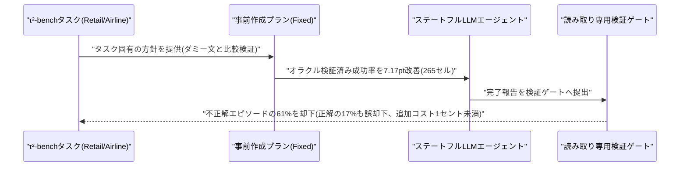
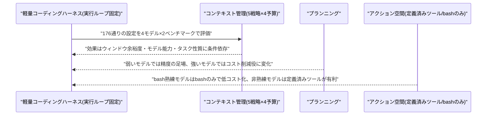
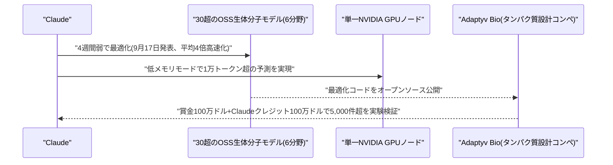
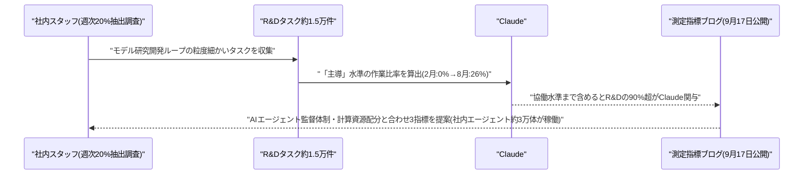
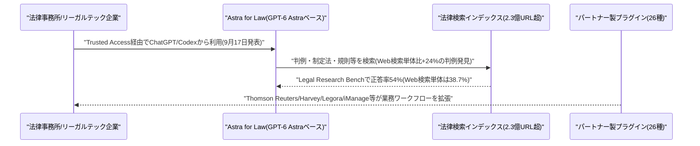
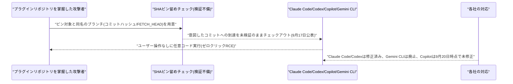
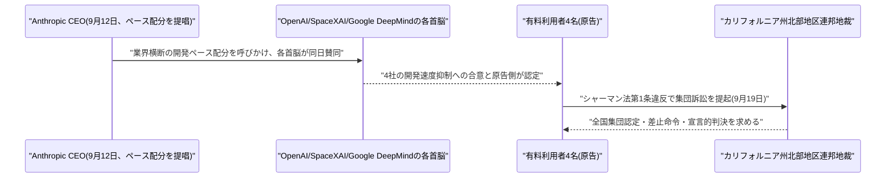

# LLM・AI Agent 最新情報レポート Vol.143
<!-- x-summary: OpenAI、GPT-6 Astra搭載の法律特化AI「Astra for Law」発表、判例DB2.3億件と連携 -->

**作成日**: 2026年9月20日(JST)
**対象期間**: 2026年9月19日〜9月20日(Vol.142との差分)。あわせて、レポート未発行日(9月17日)に発表され、これまで未掲載だった主要ニュースを補完的に収録

---

## 目次

1. [Google Cloudアップデート](#1-google-cloudアップデート)
2. [Microsoft Azure AIアップデート](#2-microsoft-azure-aiアップデート)
3. [LLM Model / AI Agentアーキテクチャ・研究](#3-llm-model--ai-agentアーキテクチャ研究)
   - [3.1 論文「How Do Agent Harnesses Create Value?」、プランニング指示と検証ゲートの効果を定量分離](#31-論文how-do-agent-harnesses-create-valueプランニング指示と検証ゲートの効果を定量分離)
   - [3.2 論文、コーディングエージェント用ハーネスの構成要素を実証比較](#32-論文コーディングエージェント用ハーネスの構成要素を実証比較)
4. [公式ブログ・論文のリサーチ・要約](#4-公式ブログ論文のリサーチ要約)
   - [4.1 Anthropic、Claudeが30超のオープンソース生体分子モデルを平均4倍高速化](#41-anthropicclaudeが30超のオープンソース生体分子モデルを平均4倍高速化)
   - [4.2 Anthropic、Claudeが自社R&Dの26%を「主導」と初の定量指標を公開](#42-anthropicclaudeが自社rdの26を主導と初の定量指標を公開)
5. [AI Agent搭載SaaS製品情報](#5-ai-agent搭載saas製品情報)
   - [5.1 OpenAI、GPT-6 Astra搭載の法律特化AI「Astra for Law」を発表](#51-openaigpt-6-astra搭載の法律特化aiastra-for-lawを発表)
6. [LLM/AI Agentセキュリティインシデント](#6-llmai-agentセキュリティインシデント)
   - [6.1 「Plugin4Shell」、主要4大コーディングエージェントに影響するゼロクリックRCE](#61-plugin4shell主要4大コーディングエージェントに影響するゼロクリックrce)
7. [その他特筆すべき情報](#7-その他特筆すべき情報)
   - [7.1 Anthropic・OpenAI・Google・SpaceXAIの「AI減速合意」に反トラスト法違反の集団訴訟](#71-anthropicopenaigooglespacexaiのai減速合意に反トラスト法違反の集団訴訟)
8. [参考リンク](#8-参考リンク)

---

> **今号について:** 前回号(Vol.142、9月19日発行)は9月18〜19日の情報をカバーしたが、その前のVol.141(9月18日発行)との間にレポート未発行日(9月17日)があり、同日発表の重要ニュース(Anthropicの2件の公式発表、OpenAIの法律AI新製品)が未掲載のまま残っていた。今号ではこれらを補完しつつ、9月19〜20日の新着情報(AI企業4社への反トラスト訴訟、Plugin4Shell脆弱性の続報)を中心にまとめる。Google Cloud・Microsoft Azureについては、対象期間中に発表日を確度高く特定できる新機能アップデートは確認できなかった。

---

## 1. Google Cloudアップデート

新情報なし。対象期間中、Vertex AI・Gemini Enterprise Agent Platform・Google Workspace(Gemini)で、発表日を確度高く特定できる新機能アップデートは確認できなかった。なお、Googleの開発者向けコーディングエージェント「Gemini CLI」は、6.1で扱う脆弱性「Plugin4Shell」の影響を受け、後継の「Antigravity CLI」へ利用者を誘導する形での事実上の提供終了が案内されている。

---

## 2. Microsoft Azure AIアップデート

新情報なし。対象期間中、Azure AI Foundry(Microsoft Foundry)・Copilot Studio・Semantic Kernel/Azure AI Agent Service・Microsoft 365 Copilotの新機能で、発表日を確度高く特定できるものは確認できなかった。なお、Microsoft傘下のGitHub Copilotは6.1で扱う脆弱性「Plugin4Shell」の影響を受けており、対象期間終了時点(9月20日)でも修正パッチは未提供のままである。

---

## 3. LLM Model / AI Agentアーキテクチャ・研究

### 3.1 論文「How Do Agent Harnesses Create Value?」、プランニング指示と検証ゲートの効果を定量分離

Yukun Zhang氏ら3名の研究者は、論文「How Do Agent Harnesses Create Value? Planning Information and Release Control in Stateful LLM Agents」をarXivに公開した。エージェントハーネス(実行を制御する周辺の仕組み)が提供する「プランニング指示」と「完了判定のゲート(リリースコントロール)」という2つの構成要素が、タスク成功率・誤承認率・コストにそれぞれどう寄与するかを、τ²-benchのRetail・Airlineドメインで分離検証した。

タスク specificな事前作成プランと、同じ単語数にシャッフルしただけのダミー方針文とを比較したところ、265の比較セルにおいて事前作成プランはオラクル検証済み成功率を7.17ポイント改善し、特に複雑度の高いタスクで効果が大きかった。また、読み取り専用のターミナル検証ゲートは、Retailドメインでオラクル上不正解だったエピソードの61%を却下する一方、正解エピソードの17%も誤って差し戻す(追加コストは1エピソードあたり1セント未満)結果となった。どちらの構成要素がより重要かは、誤承認に伴う損失の大きさ次第で入れ替わり、誤承認の許容度が低い場面では検証ゲートの価値が、許容度が高い場面ではプランニング指示の価値がそれぞれ上回るという。[[1]](#ref-1)

### 3.2 論文、コーディングエージェント用ハーネスの構成要素を実証比較

別の研究チームは、論文「An Empirical Study of Harness Design for Coding Agents」をarXivに公開した。コーディングエージェント用ハーネスを構成する「プランニング」「アクション空間(ツール構成)」「コンテキスト管理」の3要素を、実行ループを固定した軽量ハーネス上で個別に切り替え、5種類のコンテキスト管理戦略・4種類のコンテキストウィンドウ予算・プランニングとアクション空間の絞り込み実験を組み合わせた176通りの設定を、4つのモデルでSWE-Bench VerifiedとTerminal-Bench 2.1により評価した。

結果、コンテキスト管理・プランニング・アクション空間のいずれも、コンテキストウィンドウの余裕度・モデルの能力・タスクがどれだけシェル操作中心かに応じて条件付きでしか効果を発揮しないことが判明した。プランニングは、能力の低いモデルでは精度を支える足場として機能する一方、能力の高いモデルでは精度をほぼ変えずにコスト削減の役割へと性質が変化する。また、あらかじめ定義されたツールはbash操作に不慣れなモデルの性能を押し上げるが、bash操作に長けたモデルはbashオンリーのインターフェースでも十分に機能し、コマンドライン中心タスクでは大幅に低いコストを達成できるという。[[2]](#ref-2)

---

## 4. 公式ブログ・論文のリサーチ・要約

### 4.1 Anthropic、Claudeが30超のオープンソース生体分子モデルを平均4倍高速化

Anthropicは9月17日付の研究ブログで、Claudeが4週間弱かけて、共同フォールディング・構造予測(14パッケージ)、ハルシネーション対策(3)、構造生成(6)、逆フォールディング(3)、ゲノミクス(7)、タンパク質言語モデル(3)の6分野にまたがる30超のオープンソース生体分子モデルを最適化し、平均で約4倍高速化したと発表した。あわせてメモリ利用効率も改善し、単一のNVIDIA GPUノード上で1万トークン(アミノ酸・核酸・低分子/イオン由来の原子を含む)を超える大規模な生体分子系の予測を可能にする低メモリモードも実現したという。

Anthropicは最適化済みコードをオープンソースとして公開するとともに、Adaptyv Bioと共同で賞金総額100万ドルのタンパク質設計コンペティションを立ち上げた。Adaptyvの自動実験室で5,000件超の設計を無償で実験検証するもので、Anthropicは別途100万ドル相当のClaudeクレジットも提供する。[[3]](#ref-3) [[4]](#ref-4)

### 4.2 Anthropic、Claudeが自社R&Dの26%を「主導」と初の定量指標を公開

Anthropicは9月17日、AI開発の進行ペースを外部に説明可能にするための測定手法を示した研究ブログ「Measurements for understanding the pace of AI development inside frontier labs」を公開した。社内のモデル研究開発ループを構成する各部門から毎週スタッフの20%を無作為抽出し、約15,000件の粒度の細かいR&Dタスクを収集・分析した結果として、Claudeが「高レベルの指示から人間の監督下でタスクの大部分をエンドツーエンドで完了できる」水準である「主導(lead)」の状態にある研究開発作業が全体の26%に達したと公表した。2026年2月時点ではこの割合はゼロで、8月にこの水準へ到達したという。あわせて、人間の緊密な指示のもとで作業の大部分を担う「協働(collaborate)」の水準までを含めると、研究開発全体の90%超がClaudeとの協働下にあるとした。

このブログはDario Amodei CEOが提唱した業界全体でのフロンティア開発の「ペース配分」構想の具体化の一環で、AI主導のR&Dの度合い・AIエージェントに対する監督体制・計算資源配分という3つの指標を用いて、他のAI企業にも同様の情報開示を促す狙いがある。なお2026年8月時点で、Anthropic社内では研究・エンジニアリング業務にあたるエージェントが約3万体稼働していたことも明らかにされた。[[5]](#ref-5) [[6]](#ref-6)

---

## 5. AI Agent搭載SaaS製品情報

### 5.1 OpenAI、GPT-6 Astra搭載の法律特化AI「Astra for Law」を発表

OpenAIは9月17日、最新モデル「GPT-6 Astra」を法律実務向けに構成した新製品「Astra for Law」を発表した。米国の判例・制定法・規則・裁判所規則・行政決定などを横断する法律専用検索インデックス(2億3,000万件超のURLを対象に日次更新)と、法律分析・文書作成に特化したカスタム指示を組み合わせている。ベンチマークでは、Vals AIの「Legal Research Bench」の200問において総合正答率54%を達成し、Web検索のみのGPT-6 Astra(38.7%)を大きく上回った。判例検索に絞った設問では、Web検索のみの場合より24%多くの関連判例を発見できたという。

提供形態は、選定された法律事務所向けにChatGPTおよびCodex上の「Trusted Access」プログラムを通じてモデルピッカーに「GPT-6 Astra Law」として表示される方式で、API版(gpt-6-astra-law)は後日提供予定。法律AI企業のHarvey TechnologiesとLegoraがAPI利用の顧客として名を連ねる。同時に、Thomson Reuters・Harvey・Legora・iManageなどパートナー各社が開発した計26種のプラグインも提供され、法律実務向けのSaaSエコシステムを形成する狙いがある。[[7]](#ref-7) [[8]](#ref-8)

---

## 6. LLM/AI Agentセキュリティインシデント

### 6.1 「Plugin4Shell」、主要4大コーディングエージェントに影響するゼロクリックRCE

セキュリティ企業Air Securityの研究者は9月17日、Anthropic Claude Code・OpenAI Codex・GitHub Copilot・Google Gemini CLIという主要4大AIコーディングエージェントに共通して影響する、ユーザー操作不要(ゼロクリック)のリモートコード実行(RCE)脆弱性「Plugin4Shell」を公表した。プラグインを特定のコミットSHAに固定(ピン留め)する仕組みの不備を突くもので、エージェントは意図したコミットをチェックアウトしたかのように見えても、実際にそこへ到達したかまでは検証していない。攻撃者がプラグインのリポジトリを掌握していれば、Claude Code・Codex・Copilotに対してはピン留め対象のコミットハッシュ(40文字)と同名のブランチを用意することで、Gitがブランチ参照をコミットオブジェクトより優先してチェックアウトする挙動を悪用でき、Gemini CLIに対しては「FETCH_HEAD」という名前のブランチを用意することで同様にチェックアウト先を差し替えられるという。

対象期間終了時点(9月20日)での対応状況は製品ごとに分かれている。AnthropicはClaude Code 2.1.179で、OpenAIはCodex 0.146.0でそれぞれ修正済み。GoogleはGemini CLI自体を事実上廃止し、後継の「Antigravity CLI」への移行を案内している。一方、Microsoft傘下のGitHub Copilotについては、GitHub側は緩和策を実施済みと主張しているものの、研究者はその適用範囲に疑義を呈しており、9月20日時点でも実効的な修正パッチは提供されていない。悪用が実際に確認された報告はないが、AIコーディングエージェントのサプライチェーン全体に共通する設計上の前提の脆さを浮き彫りにした事例といえる。[[9]](#ref-9) [[10]](#ref-10) [[11]](#ref-11)

---

## 7. その他特筆すべき情報

### 7.1 Anthropic・OpenAI・Google・SpaceXAIの「AI減速合意」に反トラスト法違反の集団訴訟

有料AIサービスの利用者4名は9月19日(金)、カリフォルニア州北部地区連邦地方裁判所に、Anthropic・OpenAI・Google・SpaceXAIを被告とする反トラスト法(シャーマン法第1条)違反の集団訴訟を提起した。訴状によれば、発端は9月12日にAnthropicのDario Amodei CEOが「フロンティア開発のペース配分」を業界全体に呼びかけるエッセイを公表したことで、同日中にOpenAIのSam Altman CEO、SpaceXAIのElon Musk CEO、Google DeepMindの共同創業者兼会長Demis Hassabis氏がそれぞれ公にこれに賛同する発言を行った。原告側は、競合関係にある大手AI企業4社が開発速度を意図的に抑制することで合意したとすれば競争制限にあたり、ChatGPT・Claude・Grok・Geminiの有料利用者が受け取る対価的価値を損なうものだと主張し、全国規模の集団訴訟としての認定、差止命令、および反トラスト法違反の宣言的判決を求めている。

Amodei氏は当初のエッセイの中で、こうした across-lab(研究所横断)の安全性に関する協議を可能にするため、米国政府による仲介や、特定の安全対話に対する反トラスト法上の「狭い適用除外」の発出が望ましいとの認識を示していた。しかし訴状は、そうした適用除外は現時点で存在せず、議会による立法措置も、政府機関による行為の強制もないと指摘しており、この「ペース配分」構想が、AI安全性を巡る協調と独占禁止法の緊張関係を法廷の場に持ち込む事例となった。[[12]](#ref-12) [[13]](#ref-13) [[14]](#ref-14)

---

## 8. 参考リンク

**[1]** [How Do Agent Harnesses Create Value? Planning Information and Release Control in Stateful LLM Agents | arXiv](https://arxiv.org/abs/2609.20474)

**[2]** [An Empirical Study of Harness Design for Coding Agents | arXiv](https://arxiv.org/abs/2609.20804)

**[3]** [How Claude is uplifting biomolecular modeling | Anthropic](https://www.anthropic.com/research/claude-uplifts-biomolecular-modeling)

**[4]** [Anthropic Reports Claude Optimized 30+ Open-Source Biomolecular Models | Unite.AI](https://www.unite.ai/anthropic-reports-claude-optimized-30-plus-open-source-biomolecular-models/)

**[5]** [Measurements for understanding the pace of AI development inside frontier labs | Anthropic](https://www.anthropic.com/institute/measuring-pace-of-ai-development)

**[6]** [Anthropic shares 3 metrics to help AI companies monitor pace of development | CNBC](https://www.cnbc.com/2026/09/17/anthropic-shares-3-metrics-to-help-ai-companies-monitor-development.html)

**[7]** [OpenAI on X: Astra for Law announcement](https://x.com/OpenAI/status/2100679992720142459)

**[8]** [OpenAI Releases Astra for Law, A GPT-6 Model Tailored for Legal Work | LawSites](https://www.lawnext.com/2026/09/openai-releases-astra-for-law-a-gpt-6-model-configured-for-legal-work.html)

**[9]** [Plugin4Shell Lets Repository Owners Swap Pinned Plugin Code Across Four AI Coding Agents | The Hacker News](https://thehackernews.com/2026/09/plugin4shell-lets-repository-owners.html)

**[10]** [Zero-click RCE vulnerability hit four major AI coding agents, two remain unpatched | Help Net Security](https://www.helpnetsecurity.com/2026/09/18/plugin4shell-ai-coding-agents-vulnerability/)

**[11]** [Plugin4Shell: The AI Coding Flaw Microsoft Won't Patch | Eastern Herald](https://easternherald.com/2026/09/20/plugin4shell-ai-coding-agents-supply-chain-vulnerability/)

**[12]** [Lawsuit says Anthropic, OpenAI, SpaceXAI and Google made illegal deal on AI slowdown | CBS News](https://www.cbsnews.com/news/ai-slowdown-lawsuit-openai-anthropic-google/)

**[13]** [Lawsuit says Anthropic, OpenAI, more made illegal agreement on AI slowdown | CNN Business](https://www.cnn.com/2026/09/19/business/ai-slowdown-lawsuit-antitrust)

**[14]** [Lawsuit says Anthropic, OpenAI, SpaceXAI and Google made illegal agreement on AI slowdown | PBS News](https://www.pbs.org/newshour/nation/lawsuit-says-anthropic-openai-spacexai-and-google-made-illegal-agreement-on-ai-slowdown)
