# LLM・AI Agent 最新情報レポート Vol.144
<!-- x-summary: Alibaba、Qwen-Image-2.1を公開も従来のApache 2.0撤回し研究限定ライセンスへ転換 -->

**作成日**: 2026年9月21日(JST)
**対象期間**: 2026年9月20日〜9月21日(Vol.143との差分)

---

## 目次

1. [Google Cloudアップデート](#1-google-cloudアップデート)
   - [1.1 Google、Workspace Studioにカスタムスターター・ステップ・サードパーティ連携・Webhookを追加](#11-googleworkspace-studioにカスタムスターターステップサードパーティ連携webhookを追加)
2. [Microsoft Azure AIアップデート](#2-microsoft-azure-aiアップデート)
3. [LLM Model / AI Agentアーキテクチャ・研究](#3-llm-model--ai-agentアーキテクチャ研究)
   - [3.1 論文「ArenaFlow」、トーナメント型軌跡比較でエージェントRLの階層的信用割当を実現](#31-論文arenaflowトーナメント型軌跡比較でエージェントrlの階層的信用割当を実現)
   - [3.2 論文、深さ再帰型言語モデルの予測が浅い層で「決着」する理由を定量分析](#32-論文深さ再帰型言語モデルの予測が浅い層で決着する理由を定量分析)
   - [3.3 論文、ターン単位の評価指標改善とワークフロー全体の成功率には大きな乖離があると指摘](#33-論文ターン単位の評価指標改善とワークフロー全体の成功率には大きな乖離があると指摘)
4. [公式ブログ・論文のリサーチ・要約](#4-公式ブログ論文のリサーチ要約)
   - [4.1 OpenAI、自己改善AI(RSI)への懸念を踏まえ米国主導での国際技術標準策定を提言](#41-openai自己改善airsiへの懸念を踏まえ米国主導での国際技術標準策定を提言)
5. [AI Agent搭載SaaS製品情報](#5-ai-agent搭載saas製品情報)
   - [5.1 ヘルスケア給付ブローカレッジのCorridor、AIエージェント活用で2,500万ドルのシード調達](#51-ヘルスケア給付ブローカレッジのcorridoraiエージェント活用で2500万ドルのシード調達)
   - [5.2 Meta「Muse」、急成長の一方でAmazon.comへのアクセスを遮断される](#52-metamuse急成長の一方でamazoncomへのアクセスを遮断される)
6. [LLM/AI Agentセキュリティインシデント](#6-llmai-agentセキュリティインシデント)
   - [6.1 「Plugin4Shell」続報、GitHubの緩和策は限定的と研究者が指摘、Copilotは対象期間終了時点でも未修正](#61-plugin4shell続報githubの緩和策は限定的と研究者が指摘copilotは対象期間終了時点でも未修正)
   - [6.2 Meta「Muse」、macOSでローカル権限昇格の欠陥 音声入力を横取り可能](#62-metamusemacosでローカル権限昇格の欠陥-音声入力を横取り可能)
   - [6.3 ChatGPTの広告用Cookie「__obi」、1,000超のサイトを横断してユーザーを追跡](#63-chatgptの広告用cookie__obi1000超のサイトを横断してユーザーを追跡)
7. [その他特筆すべき情報](#7-その他特筆すべき情報)
   - [7.1 米中、AI安全性の「通知メカニズム」創設へ協議 Trump-Xi首脳会談を前に](#71-米中ai安全性の通知メカニズム創設へ協議-trump-xi首脳会談を前に)
   - [7.2 Anthropic、GPT-6 Astra対抗の新モデルを検討と報道 アモデイ氏のペース減速提言からわずか1週間余り](#72-anthropicgpt-6-astra対抗の新モデルを検討と報道-アモデイ氏のペース減速提言からわずか1週間余り)
   - [7.3 ソフトバンク、OpenAI追加出資の原資として110億ドル超のジャンク債発行](#73-ソフトバンクopenai追加出資の原資として110億ドル超のジャンク債発行)
   - [7.4 Alibaba、Qwen-Image-2.1を公開 Apache 2.0を撤回し研究限定ライセンスへ転換](#74-alibabaqwen-image-21を公開-apache-20を撤回し研究限定ライセンスへ転換)
8. [参考リンク](#8-参考リンク)

---

> **今号について:** 対象期間(9月20日〜21日)は、AI開発ペースと国際政策を巡る動きが目立った。OpenAIは9月21日、国連総会のハイレベルウィークに合わせ、AIが自らの開発を主導する「再帰的自己改善(RSI)」を今後10年で最重要級の安全課題と位置づけ、米国主導での国際技術標準策定を提言する公式ブログを公開した。同じ週末には、米財務長官とAI政策を巡り、米中がAIインシデントの「通知メカニズム」創設へ向けた協議を行ったことも判明し、トランプ・習近平首脳会談への提案が予定されている。競争環境では、Anthropicのアモデイ氏が9月12日に公表した「ペース配分」提言からわずか1週間余りで、当のAnthropicがOpenAIのGPT-6 Astraに対抗する新モデルの投入を検討していると報じられ、提言と競争圧力の緊張関係が浮き彫りになった。プロダクト面では、AlibabaがQwen-Image-2.1を公開した一方、従来のApache 2.0ライセンスを撤回し研究限定ライセンスへ転換したことが物議を醸している。セキュリティ面では、9月17日公表の脆弱性「Plugin4Shell」についてGitHub Copilotが対象期間終了時点でも実効的な修正に至っていないことが改めて確認されたほか、Metaの消費者向けAIエージェント「Muse」を巡ってはローカル権限昇格の脆弱性と、ChatGPTの広告用Cookieによる横断的なユーザー追跡という、2件の異なるプライバシー・セキュリティ上の懸念が新たに表面化した。Google Cloudでは、Workspace Studioにカスタムスターター・ステップ・サードパーティ連携・Webhookが追加されている。

---

## 1. Google Cloudアップデート

### 1.1 Google、Workspace Studioにカスタムスターター・ステップ・サードパーティ連携・Webhookを追加

Googleは、Google Workspace内のノーコード自動化・エージェントビルダー「Workspace Studio」に4つの新機能を追加したと発表した。Rapid Releaseドメインへの展開は9月21日から順次開始される。追加された機能は、(1) カスタムスターター: 他アプリのイベントを検知してフローを起動するカスタムのリアルタイムトリガーを作成・公開できる機能、(2) カスタムステップ: Apps Script等によるカスタムロジックをフロー内で実行できる機能、(3) サードパーティ連携(ベータ): Asana・Confluence・HubSpot・Jira・Mailchimp・QuickBooks・Salesforce・Slackとの連携、(4) Webhook: フローから任意の外部URLへHTTPリクエストを送信できる機能、の4種類である。あわせて、エージェント的な自動化の範囲を管理者権限で細かく制御できるガバナンス機能も強化された。

Vertex AI・Gemini Enterprise Agent Platform・Agentspaceについては、対象期間中に発表日を確度高く特定できる新機能アップデートは確認できなかった。[[1]](#ref-1) [[2]](#ref-2)

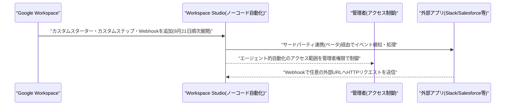

---

## 2. Microsoft Azure AIアップデート

新情報なし。対象期間中、Azure AI Foundry(Microsoft Foundry)・Copilot Studio・Semantic Kernel/Azure AI Agent Service・Microsoft 365 Copilotの新機能で、発表日を確度高く特定できるものは確認できなかった。なお、Microsoft傘下のGitHub Copilotは、6.1で扱う脆弱性「Plugin4Shell」への対応が対象期間終了時点(9月21日)でも完了しておらず、GitHubが公表した緩和策の適用範囲についても研究者から異議が呈されている。

---

## 3. LLM Model / AI Agentアーキテクチャ・研究

### 3.1 論文「ArenaFlow」、トーナメント型軌跡比較でエージェントRLの階層的信用割当を実現

Qiang Zhang氏らの研究者は、論文「ArenaFlow: From Trajectory Ranking to Hierarchical Credit Propagation for Open-Ended Agent RL」をarXivに公開した。信頼できるスカラー報酬を定義しづらいオープンエンドなエージェントタスクの強化学習(RL)を対象に、トーナメント形式で軌跡(トラジェクトリ)同士を相対的に順位付けする手法を、2階層の信用割当(クレジットアサインメント)へと精緻化している。第一に、ステップレベルでは、トーナメント比較の中でどれだけ深く勝ち残ったかに基づいて「要所となるステップ」を特定し、軌跡レベルのアドバンテージをそのステップへ伝播させる。第二に、スキルレベルでは、グループ単位の利用実績から再利用可能な「スキル」の有用性を推定し、有用性に応じて更新・剪定・検索を行うグローバルなスキルメモリを維持する。

プロンプト内の指示だけでなく、エージェントの学習プロセスそのものにトーナメント型の相対評価と階層的なスキル記憶を組み込む、アーキテクチャ上の提案である。[[3]](#ref-3)

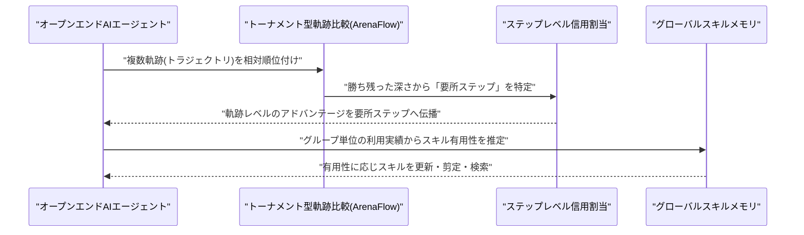

### 3.2 論文、深さ再帰型言語モデルの予測が浅い層で「決着」する理由を定量分析

Xinyue Luo氏、Fei Yu氏は、論文「Prediction Dynamics in Depth-Recurrent Language Models」をarXivに公開した。固定層数のTransformerではなく、同じ再帰ブロックを繰り返し適用して潜在表現を反復的に洗練させる「深さ再帰型」言語モデル(Huginn-3.5B、Ouro-1.4Bなど)を対象に、生の出力スコアが深さ(反復回数)を通じて変化し続ける一方で、モデルの中間的な予測がすでに最終回答と一致しているケースが多いのはなぜかを分析した。研究チームは、スコアの保守性(なかなか変化しないこと)を、(1) 全候補に共通する平行移動項、(2) 現在の最有力候補に対する方向、(3) 各競合候補の更新とスコア差のペアリング、の3要素に分解する「マージン特性化」を導出した。

Huginn-3.5BとOuro-1.4Bで全回答テキストのスコアリングを行ったところ、単に共通の平行移動項を除去するだけでなく、更新方向と競合候補のペアリングまで考慮することで、回答が「決着」する最も浅い深さの平均値を、モデル全体の深さに対してさらに22.5〜34.4%短縮できることが分かった。早期打ち切り(early-exit)や適応的な計算量配分を伴う推論の設計に示唆を与える結果である。[[4]](#ref-4)

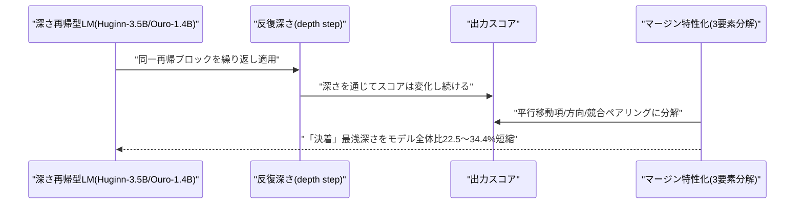

### 3.3 論文、ターン単位の評価指標改善とワークフロー全体の成功率には大きな乖離があると指摘

Chao Li氏、Yingying Yu氏、Yunfeng Li氏は、論文「When Better Turns Do Not Make Better Agents: Diagnosing the Gap Between Next-Turn Metrics and Workflow Success」をarXivに公開した。正解の対話履歴(ゴールド履歴)を与えた上で次の1手を予測させる、一般的な「ターン単位」のエージェント評価が、自律的な複数ターンにわたるワークフロー全体の成功をどれだけ予測できるかを検証した。Qwen3(4B/14B)とGemma 3(4B/12B)について、教師ありファインチューニング(SFT)前後のモデルをマルチターンのカスタマーサポート業務で比較したところ、SFTはゴールド履歴を用いたターン単位の評価では一貫して精度を改善した一方、自律実行によるホリスティックなワークフロー評価では、検証した4モデルいずれも安定した成功を収められず、厳密な軌跡完遂によるワークフロー成功率は最大でも10.4%にとどまった。

ターン単位の指標改善が実運用でのエージェント性能向上を保証しない、評価設計上の大きな乖離を定量的に示した研究であり、Vol.143で紹介したハーネス設計に関する2本の論文とも通じる、エージェント評価手法をめぐる論点の一つといえる。[[5]](#ref-5)

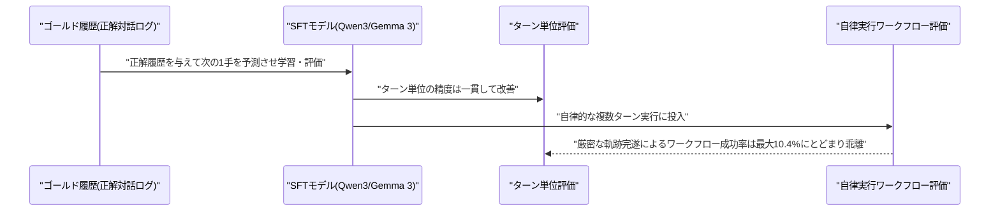

---

## 4. 公式ブログ・論文のリサーチ・要約

### 4.1 OpenAI、自己改善AI(RSI)への懸念を踏まえ米国主導での国際技術標準策定を提言

OpenAIは9月21日、フロンティアAIに関する国際的な技術標準の策定を米国が主導すべきだとする公式ブログを公開した。国連総会のハイレベルウィーク開催に合わせた発信で、Sam Altman CEOも同週内(9月23日頃)に国連安全保障理事会でAI安全性について説明する予定とされる。記事は、AIシステムが自社の研究・改良プロセスに関与する度合いを強めていることを踏まえ、AIが自律的に自らの開発を加速・主導する「再帰的自己改善(RSI: Recursive Self-Improvement)」を「今後10年で最も重大な可能性のあるフロンティア安全上の課題」と位置づけた。その上で「完全に自律的なRSIは現時点で起きていないし、安全に実施できると確認されるまでは追求すべきではない」としつつ、AIはすでに次世代モデルの開発・アラインメントに用いる研究の一部を加速させていると認めた。

具体策としては、各国のAI安全機関、米国のAI標準・イノベーションセンター(CAISI)、ISOやFrontier Model Forumといった国際機関を活用し、(1) RSIに関連する能力進展の評価手法、(2) 人間による監督が必要となるトリガーポイント、(3) アラインメント関連インシデントの分類・報告プロトコル、を対象に国際標準を整備するよう米国政府に呼びかけた。CAISIの役割はあくまで「評価を実施し緩和策を提言すること」であり「配備を承認・ブロックすることではない」と明言し、許認可制の導入は意図していないとした。OpenAIは、政府の支援の有無にかかわらず複数ラボ間の自主的な標準策定を進める方針も示した。この提言は、Anthropicのダリオ・アモデイCEOが9月12日に公表した業界横断の「ペース配分」エッセイに続く、フロンティアAI安全性を巡る主要ラボからの呼応する動きと位置づけられる。

なお、AnthropicおよびGoogle/Google DeepMindについては、対象期間中に発表日を確度高く特定できる新規の公式ブログ・研究発表は確認できなかった。[[6]](#ref-6) [[7]](#ref-7) [[8]](#ref-8)

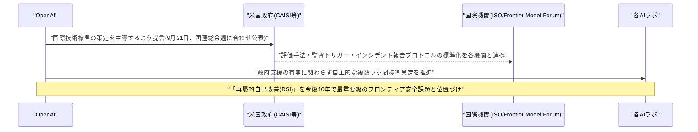

---

## 5. AI Agent搭載SaaS製品情報

### 5.1 ヘルスケア給付ブローカレッジのCorridor、AIエージェント活用で2,500万ドルのシード調達

中小企業(従業員1〜500人)向けにAIエージェントが健康保険プランの見積もり・比較・管理を行う「Corridor」は9月21日、Bain Capital Venturesを主導とする2,500万ドルのシードラウンドを発表した。BoxGroup、Definition Capitalのほか、OpenAI・Scale AI・Rampの関係者らエンジェル投資家も参加した。KFF(Kaiser Family Foundation)のデータを引用し、中小企業の従業員は大企業の従業員より控除額(deductible)が平均57%高いと指摘した上で、AIエージェントによる保険プランの見積もり・比較・管理と、有資格の人間アドバイザーを組み合わせることで、利用企業は福利厚生コストを平均約20%削減できるとしている。創業者は元Scale AIのJackson Wagner氏。[[9]](#ref-9)

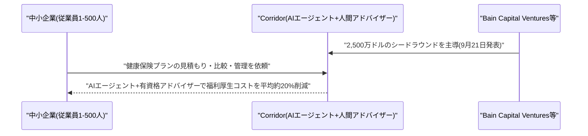

### 5.2 Meta「Muse」、急成長の一方でAmazon.comへのアクセスを遮断される

Metaの消費者向けAIエージェントアプリ「Muse」は9月21日、米国・カナダにおけるモバイルアプリのダウンロード数・DAU(デイリーアクティブユーザー数)が、ChatGPTのモバイルアプリが登場して最初の12日間を記録した水準を上回ったと報じられた。急成長する一方で、同日には別の摩擦も表面化している。MuseのユーザーがAmazon.com上で購入操作を行おうとすると、「認可されていないAIエージェントによる継続的なアクセスは、お客様が同意されたAmazonの利用規約に違反します」とのエラーが表示されるようになった。

エージェントによる自律的な購買行動(エージェンティックコマース)を巡り、プラットフォーム側がアクセスを制限する事例が具体化した形で、AIエージェントの急成長とプラットフォーム側の防御的な対応が同時に進行している状況を象徴する出来事といえる。[[10]](#ref-10) [[11]](#ref-11)

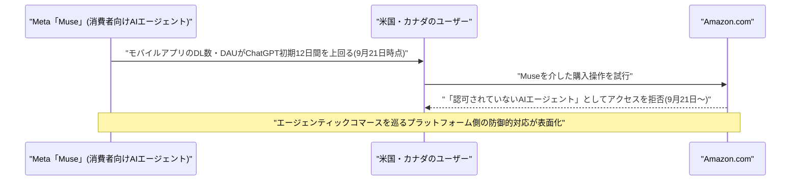

---

## 6. LLM/AI Agentセキュリティインシデント

### 6.1 「Plugin4Shell」続報、GitHubの緩和策は限定的と研究者が指摘、Copilotは対象期間終了時点でも未修正

9月17日に公表された、AIコーディングエージェント4製品(Claude Code・Codex・GitHub Copilot・Gemini CLI)に影響するゼロクリックRCE「Plugin4Shell」を巡り、対象期間終了時点(9月21日)でもGitHub Copilotの実効的な修正は完了していないことが確認された。CopilotのCLIは9月18日にv1.0.87へ更新されたが、Plugin4Shellに関する修正は含まれていない。GitHubは「GitHub上ではコミットSHAに酷似したブランチ名・タグ名の作成をそもそも許可していないため、報告された脆弱性はGitHub上では悪用され得ない」との緩和策を説明しているが、発見元のAir Securityはこれに異議を唱えている。CopilotはGitHub以外にBitbucket・GitLabおよびセルフホスト型のマーケットプレイスにも対応しており、これらの環境にはGitHubの緩和策が及ばないため、サポートされている構成の中で依然として脆弱性が悪用可能な状態にあるという。Plugin4Shellには対象期間終了時点でCVE番号が付与されていない。[[12]](#ref-12) [[13]](#ref-13)

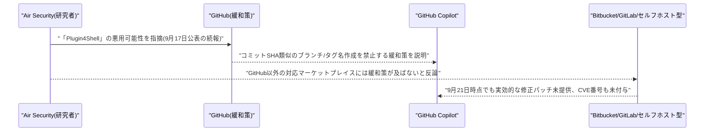

### 6.2 Meta「Muse」、macOSでローカル権限昇格の欠陥 音声入力を横取り可能

macOSセキュリティ研究者Patrick Wardle氏は9月21日、Metaの消費者向けAIエージェントアプリ「Muse」に、ローカルの権限昇格につながるゼロデイ脆弱性を発見したと公表した。アプリ内に存在する、文書化されておらず保護もされていない設定キー「endo_voyager_dictation_endpoint」を操作することで、権限を持たないローカルのプロセスであっても、アプリの音声入力(ディクテーション)通信をMetaのサーバーに届く前に横取り・リダイレクトできるという。悪用された場合、音声で入力したAIへのプロンプトや認証情報の窃取、さらにはアシスタントへのプロンプトインジェクションにつながる恐れがある。Wardle氏は「隣人が悪人だからといって、その隣人が建物内の全戸に自動的にアクセスできるわけではない」とOSのサンドボックス機構が期待通りに機能していない点を指摘した。対象期間終了時点でMetaからの修正パッチは公表されておらず、取材への回答もなかった。[[14]](#ref-14)

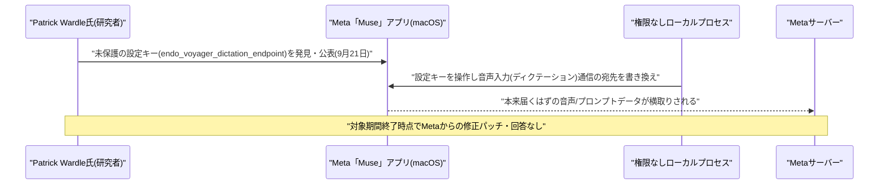

### 6.3 ChatGPTの広告用Cookie「__obi」、1,000超のサイトを横断してユーザーを追跡

セキュリティ研究者「Buchodi」氏は9月20日、OpenAIの広告計測システム(社内呼称「Bazaar」、収集エンドポイントはbzr.openai.com)を解析した調査結果を公開した。ChatGPTは、OpenAIの各種Cookieの中で唯一「SameSite=None」かつ有効期限1年という組み合わせを持つ「__obi」というCookieを発行しており、これがOpenAIの広告ピクセルを埋め込んだ外部サイトへ横断的に送信されることで、サイトを跨いだ閲覧行動をChatGPTアカウントに紐づけ得ることが判明した。調査では、Chewy・Wayfair・HelloFresh・Courseraなど1,029ホスト、936種類の広告主向けピクセルでこの挙動が確認されたほか、ピクセル経由でメールアドレス・電話番号・位置情報(国・地域・市区町村・郵便番号)などのページ上の個人情報も収集され得るという。OpenAIはこのCookieを「マーケティング」ではなく「分析」用と分類しているため、マーケティングCookieの同意を拒否したユーザーやログアウト状態のユーザーに対しても機能してしまう。SafariのIntelligent Tracking Preventionはこの挙動をブロックするが、Chrome(Android版含む)はブロックしない。対象期間終了時点でOpenAIからの公式な反応は確認されていない。[[15]](#ref-15) [[16]](#ref-16)

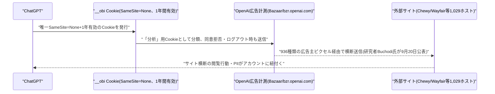

---

## 7. その他特筆すべき情報

### 7.1 米中、AI安全性の「通知メカニズム」創設へ協議 Trump-Xi首脳会談を前に

米財務長官Scott Bessent氏と中国副首相・何立峰氏は9月20日(現地時間日曜)、ニューヨークでの米中通商協議で、AI関連のインシデントが国家安全保障上のレベルに達した場合に両国間で通知し合う「通知メカニズム」を含む新たなAI対話の枠組みを協議した。Bessent氏は「世界第1位と第2位のAI大国の間で、不透明な状態から、より透明性のある状態へ移行することは非常に重要だ」と述べ、同週後半(9月24〜25日頃)に予定されるトランプ・習近平両首脳の会談にこの提案を諮る意向を示した。もっとも、同じ協議についての中国国営新華社の発表では、AIが議題に上ったことのみが伝えられ、米国側が提案した通知メカニズムへの言及はなく、合意にはまだ至っていない可能性を示唆している。

米国内では、AI政策を巡りNvidiaのジェンスン・フアンCEOがトランプ大統領の非公式な有力アドバイザーとして影響力を強めているとも報じられており、フアン氏はAI安全性を「政策課題ではなく技術的な課題」だと位置づけ新たな規制に反対する立場を取っている。AIの急速な開発を巡る国家間・関係者間の緊張が、外交・国内政治の両面で同時に表面化した形だ。[[17]](#ref-17) [[18]](#ref-18) [[19]](#ref-19)

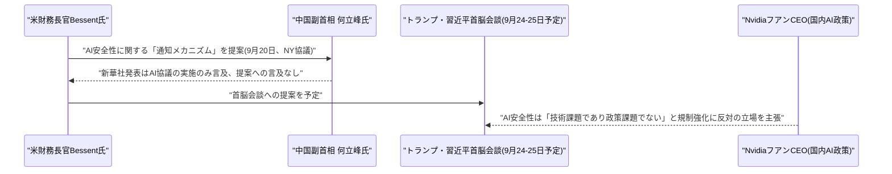

### 7.2 Anthropic、GPT-6 Astra対抗の新モデルを検討と報道 アモデイ氏のペース減速提言からわずか1週間余り

通信社ロイターは9月19〜20日、匿名の関係者3名の話として、AnthropicがOpenAIの「GPT-6 Astra」への対抗上、新モデルのリリースを検討していると報じた。Rampの企業支出データによれば、GPT-6 Astraは法人向けAI支出の約13%を占める一方、Anthropicの「Claude Fable」は約8%にとどまり、OpenRouter上でもOpenAI系モデルの利用額が2年半超ぶりにAnthropic系モデルを上回ったという。注目されるのは、この報道が、ダリオ・アモデイCEOが9月12日に公表した「AIモデルの能力向上ペースを減速させるべきだ」とする3,800語のエッセイからわずか1週間余り後だという点である。Anthropicは新モデルの安全性評価を検討プロセスの一部として実施しているとされ、リリースの有無・時期は未確定でコメントも得られていない。なお、Anthropicの年換算売上高は2026年7月時点で650億ドルを突破しており(2025年末の90億ドルから急増)、IPOに向けた準備も進めているとされる。[[20]](#ref-20) [[21]](#ref-21)

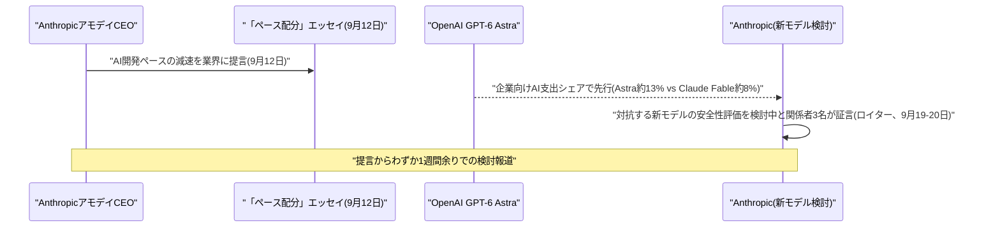

### 7.3 ソフトバンク、OpenAI追加出資の原資として110億ドル超のジャンク債発行

ソフトバンクグループは9月20〜21日、OpenAIへの追加出資(第3弾)の原資として、110億ドル超の高利回り債(ジャンク債)発行計画を発表した。ドル建て10億ドル(3.5/5.5/7.5年債)とユーロ建て10億ユーロ(4/6年債)を組み合わせた構成で、価格決定は9月24日、決済は9月29日を予定する。調達資金は、10月1日に決済予定のOpenAIへの100億ドルの追加出資に充当されるほか、同じOpenAI出資のために組成した100億ドルのブリッジローンの返済にも充てられる。フィッチ・レーティングスは投機的格付けの最上位である「BB+」を付与した。計画通り実行されれば、2021年1月のセブン&アイ・ホールディングスによる109.3億ドル調達を上回り、アジア太平洋・日本地域の非金融事業会社による過去最大級の社債発行となる見込み。[[22]](#ref-22) [[23]](#ref-23)

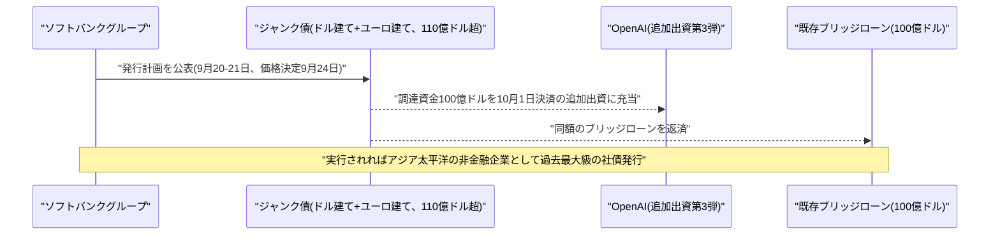

### 7.4 Alibaba、Qwen-Image-2.1を公開 Apache 2.0を撤回し研究限定ライセンスへ転換

Alibaba傘下のQwenチーム(杭州通義実験室科技)は9月20日、画像生成・編集モデル「Qwen-Image-2.1」を公開した。70億パラメータ・32層のシングルストリームDiT(Diffusion Transformer)構成で、Hugging FaceとModelScopeに重みが公開されている。ネイティブ2048×2048解像度出力、透過(RGBA)画像のネイティブ生成、最大10枚の参照画像を用いたマルチリファレンス編集、単一チェックポイントでのローカル編集など幅広い機能を備える。

注目されているのは、2025年8月公開の200億パラメータ版を含め、これまでのQwen-Imageシリーズが一貫してApache 2.0ライセンスで提供されてきたのに対し、今回は9月20日付の新設ライセンス「Qwen Research License Agreement」の下で提供され、非商用の研究・評価目的に利用が制限された点である。商用利用には杭州通義実験室科技との別途ライセンス契約が必要となり、Alibabaのオープンライセンス路線からの後退として受け止められている。[[24]](#ref-24) [[25]](#ref-25)

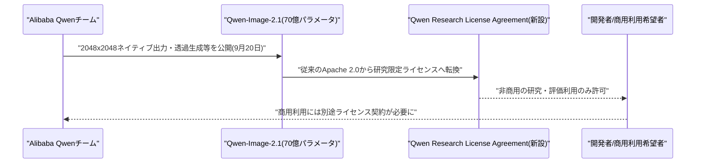

---

## 8. 参考リンク

**[1]** [Automate workflows with custom starters and steps, third-party integrations, and webhooks in Workspace Studio | Google Workspace Updates](https://workspaceupdates.googleblog.com/2026/09/automate-workflows-with-custom-starters-and-steps-third-party-integrations-and-webhooks-in-Workspace-Studio.html)

**[2]** [Google Workspace Studio adds custom steps and webhooks | Technobezz](https://www.technobezz.com/news/google-workspace-studio-custom-steps-webhooks)

**[3]** [ArenaFlow: From Trajectory Ranking to Hierarchical Credit Propagation for Open-Ended Agent RL | arXiv](https://arxiv.org/abs/2609.21378)

**[4]** [Prediction Dynamics in Depth-Recurrent Language Models | arXiv](https://arxiv.org/abs/2609.21383)

**[5]** [When Better Turns Do Not Make Better Agents: Diagnosing the Gap Between Next-Turn Metrics and Workflow Success | arXiv](https://arxiv.org/abs/2609.21187)

**[6]** [OpenAI Pushes US to Lead Effort to Set Global Standards for AI | Bloomberg](https://www.bloomberg.com/news/articles/2026-09-21/openai-pushes-us-to-lead-effort-to-set-global-standards-for-ai)

**[7]** [OpenAI calls for US-led global AI safety standards amid RSI concerns | CNBC](https://www.cnbc.com/2026/09/21/open-ai-alignment-rsi.html)

**[8]** [OpenAI Urges Global Guardrails on Autonomous AI Development | PYMNTS](https://www.pymnts.com/news/artificial-intelligence/2026/openai-urges-global-guardrails-on-autonomous-ai-development/)

**[9]** [Corridor raises $25M seed to build a health benefits brokerage for SMBs | TechCrunch](https://techcrunch.com/2026/09/21/corridor-raises-25m-seed-to-build-a-health-benefits-brokerage-for-smbs/)

**[10]** [Meta's AI agent has been blocked from using Amazon.com | TechCrunch](https://techcrunch.com/2026/09/21/metas-ai-agent-has-been-blocked-from-using-amazon-com/)

**[11]** [Meta's Muse is outpacing ChatGPT's early mobile launch | TechCrunch](https://techcrunch.com/2026/09/21/metas-muse-is-outpacing-chatgpts-early-mobile-launch/)

**[12]** [Plugin4Shell: GitHub Copilot exposed via Bitbucket plugins | Windows Forum](https://windowsforum.com/news/plugin4shell-github-copilot-exposed-via-bitbucket-plugins.444897/)

**[13]** [Plugin4Shell | Air Security](https://www.air.security/blog-posts/plugin4shell)

**[14]** [Meta Muse AI app flaw lets local malware redirect dictation traffic | The Register](https://www.theregister.com/ai-and-ml/2026/09/21/meta-muse-ai-app-flaw-lets-local-malware-redirect-dictation-traffic/5297980)

**[15]** [ChatGPT Ad Tracking Cookie Follows Users Across Third-Party Advertiser Websites | Cyber Security News](https://cybersecuritynews.com/chatgpt-ad-tracking-cookie-follows-users/)

**[16]** [ChatGPT's __obi cookie follows you to other websites | Notebookcheck](https://www.notebookcheck.net/ChatGPT-s_obi-cookie-follows-you-to-other-websites.1404436.0.html)

**[17]** [US, China open high-level talks ahead of Trump-Xi summit | CNN](https://edition.cnn.com/2026/09/20/business/us-china-trade-talks-ai-intl-hnk)

**[18]** [US proposes exchanging AI safety alerts with China, Bessent says | NBC News](https://www.nbcnews.com/world/asia/us-proposes-exchanging-ai-safety-alerts-china-bessent-says-rcna598923)

**[19]** [Nvidia CEO Jensen Huang emerges as Trump's top ally in AI debate | CNBC](https://www.cnbc.com/2026/09/20/nvidia-ceo-jensen-huang-emerges-as-trumps-top-ally-in-ai-debate.html)

**[20]** [Anthropic weighs new AI model launch as OpenAI gains ground - Reuters | Investing.com](https://www.investing.com/news/company-news/anthropic-weighs-new-ai-model-launch-as-openai-gains-ground--reuters-4908022)

**[21]** [Anthropic Mulls New AI Model Amid Investors' Pre-IPO Worries | PYMNTS](https://www.pymnts.com/news/artificial-intelligence/2026/anthropic-mulls-new-ai-model-amid-investors-pre-ipo-worries/)

**[22]** [SoftBank Seeks Over $11 Billion in Junk-Bond Deal for OpenAI Bet | Bloomberg](https://www.bloomberg.com/news/articles/2026-09-21/softbank-seeks-over-11-billion-in-junk-bond-deal-for-openai-bet)

**[23]** [SoftBank plans $11 billion junk bonds for OpenAI bet | The Japan Times](https://www.japantimes.co.jp/business/2026/09/21/companies/softbank-11-billion-junk-bonds-openai-bet/)

**[24]** [Alibaba Qwen Releases Qwen-Image-2.1 | MarkTechPost](https://www.marktechpost.com/2026/09/21/alibaba-qwen-releases-qwen-image-2-1/)

**[25]** [Qwen-Image-2.1 Ships 7B Weights Under a Research License | DEV Community](https://dev.to/techaiwire/qwen-image-21-ships-7b-weights-under-a-research-license-1iag)
