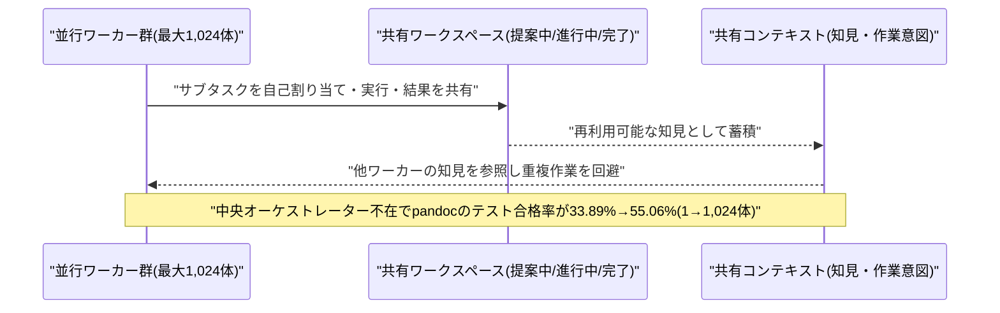
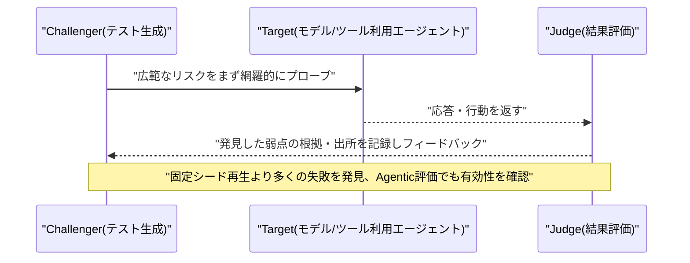
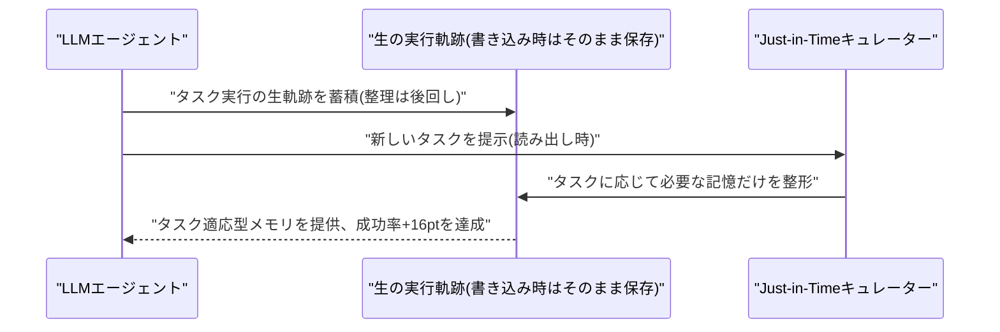
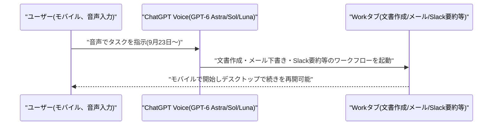
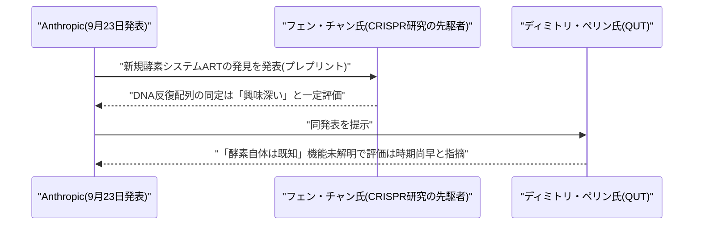
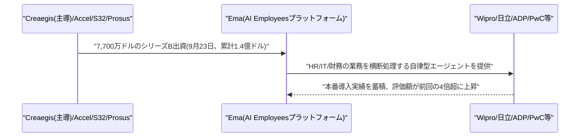
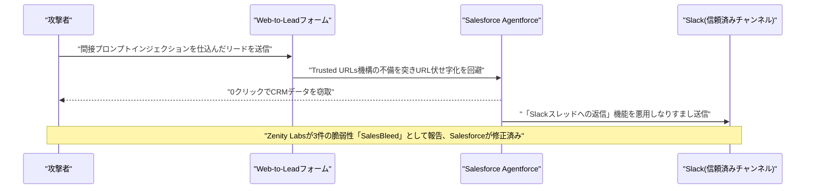
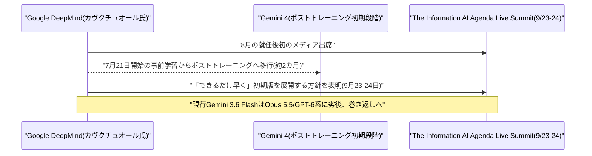

# LLM・AI Agent 最新情報レポート Vol.147
<!-- x-summary: Google DeepMind、次期最強モデル「Gemini 4」が学習後段階に到達と表明、年内早期の投入を目指す -->

**作成日**: 2026年9月24日(JST)
**対象期間**: 2026年9月23日〜9月24日(Vol.146との差分)

---

## 目次

1. [Google Cloudアップデート](#1-google-cloudアップデート)
2. [Microsoft Azure AIアップデート](#2-microsoft-azure-aiアップデート)
3. [LLM Model / AI Agentアーキテクチャ・研究](#3-llm-model--ai-agentアーキテクチャ研究)
   - [3.1 論文、中央オーケストレーターを排した自己組織化マルチエージェント基盤「Agensh」で1,024体規模へスケール](#31-論文中央オーケストレーターを排した自己組織化マルチエージェント基盤agenshで1024体規模へスケール)
   - [3.2 論文、発見した失敗から自ら学習し続けるレッドチーミング手法「CART」を提案](#32-論文発見した失敗から自ら学習し続けるレッドチーミング手法cartを提案)
   - [3.3 論文、記憶を「書く時」ではなく「使う時」に整理するエージェント記憶手法「Just-in-Time Memory」を提案](#33-論文記憶を書く時ではなく使う時に整理するエージェント記憶手法just-in-time-memoryを提案)
4. [公式ブログ・論文のリサーチ・要約](#4-公式ブログ論文のリサーチ要約)
   - [4.1 OpenAI、ChatGPTモバイルアプリに音声ベースのエージェント機能を追加](#41-openaichatgptモバイルアプリに音声ベースのエージェント機能を追加)
   - [4.2 Anthropicの新規酵素システム発見、科学界からは「時期尚早」との慎重な反応も](#42-anthropicの新規酵素システム発見科学界からは時期尚早との慎重な反応も)
5. [AI Agent搭載SaaS製品情報](#5-ai-agent搭載saas製品情報)
   - [5.1 企業向けAIエージェント「AI Employees」のEma、7,700万ドルのシリーズB調達](#51-企業向けaiエージェントai-employeesのema7700万ドルのシリーズb調達)
6. [LLM/AI Agentセキュリティインシデント](#6-llmai-agentセキュリティインシデント)
   - [6.1 Salesforce Agentforceに0クリックでCRM情報を窃取・なりすましフィッシングを許す脆弱性群「SalesBleed」](#61-salesforce-agentforceに0クリックでcrm情報を窃取なりすましフィッシングを許す脆弱性群salesbleed)
7. [その他特筆すべき情報](#7-その他特筆すべき情報)
   - [7.1 Google DeepMind、次期フラッグシップ「Gemini 4」がポストトレーニング段階に到達と表明](#71-google-deepmind次期フラッグシップgemini-4がポストトレーニング段階に到達と表明)
8. [参考リンク](#8-参考リンク)

---

> **今号について:** 対象期間(9月23日〜24日)は、フロンティアラボ各社が製品・研究・ガバナンスの各面で動いた一日となった。OpenAIは9月23日、ChatGPTモバイルアプリに音声で文書作成やメール下書き、Slack要約などを実行できるエージェント機能を追加し、Google DeepMindは9月23〜24日、次期フラッグシップモデル「Gemini 4」がポストトレーニング(学習後調整)段階に入ったとトップ自らが明らかにした。前号(Vol.146)で報じたAnthropicのClaudeによる新規酵素システム「ART」発見については、CRISPR研究の先駆者フェン・チャン氏らから一定の評価を得た一方、査読前のプレプリントである点や機能未解明である点を指摘する慎重な声も出ている。研究面では、中央のオーケストレーターを置かずに1,024体規模までスケールする自己組織化マルチエージェント基盤「Agensh」、失敗から適応的に学習を続けるレッドチーミング手法「CART」、メモリを書き込み時ではなく参照時に整形する「Just-in-Time Memory」など、エージェントの規模・安全性・記憶に関するアーキテクチャ研究が相次いで発表された。SaaS領域では、企業向け自律型AIエージェント「AI Employees」を手がけるEmaが7,700万ドルのシリーズBを調達し、評価額を前回ラウンドの4倍超に伸ばした。セキュリティ面では、Salesforce Agentforceにおいて、悪意ある問い合わせフォーム経由の間接プロンプトインジェクションを起点に、クリック不要でCRMデータを窃取し、Slack上でエージェントになりすましたフィッシングまで行える脆弱性群「SalesBleed」が報告された。Google Cloud・Microsoft Azureについては、対象期間中に発表日を確度高く特定できる新機能アップデートは確認できなかった。

---

## 1. Google Cloudアップデート

新情報なし。対象期間中、Vertex AI・Gemini Enterprise Agent Platform・Google Agentspace・Google Workspace Studioについて、発表日を確度高く特定できる新規の製品アップデートは確認できなかった。Google Cloud Blogの直近記事にも、本対象期間に該当する具体的な新機能の発表は見当たらなかった。

---

## 2. Microsoft Azure AIアップデート

新情報なし。対象期間中、Azure AI Foundry(Microsoft Foundry)・Copilot Studio・Semantic Kernel/Azure AI Agent Service・Microsoft 365 Copilotの新機能で、発表日を確度高く特定できるものは確認できなかった。

---

## 3. LLM Model / AI Agentアーキテクチャ・研究

### 3.1 論文、中央オーケストレーターを排した自己組織化マルチエージェント基盤「Agensh」で1,024体規模へスケール

研究チームは、論文「Agensh: Scaling Organizational Intelligence to 1,024 Agents」をarXivに公開した。従来のマルチエージェントシステムの多くは、単一の中央オーケストレーターがタスクを分配・統合する構成を取るため、エージェント数を増やすほどオーケストレーター自身がボトルネックとなり性能が頭打ちになる問題を抱えていた。提案する「Agensh」は中央オーケストレーターを持たない自己組織化ハーネスで、並行して稼働する多数のワーカーが、共有ワークスペース(提案中・進行中・完了済みの作業を保持)・メッセージインターフェース・共有コンテキスト(再利用可能な知見や作業意図を保持)という3つのインフラ要素を介して、コンテキスト収集、サブタスクの自己割り当て、実行、結果の検証、進捗のマージを非同期に繰り返す。

コード変換ツールpandocを題材にした評価では、エージェント数を1体から1,024体に増やすことでテスト合格率が33.89%から55.06%まで向上し、1体から128体への拡張でも平均テスト合格率が19.31%から28.78%へ、相対で約49%向上したという。エージェント数そのものをマルチエージェント組織の新しいスケーリング軸として位置付けた点が特徴である。[[1]](#ref-1)

### 3.2 論文、発見した失敗から自ら学習し続けるレッドチーミング手法「CART」を提案

Dongdong Zhang氏らMicrosoft Researchの研究チームは、論文「CART: Closed-Loop Adaptive Red Teaming for Large Language Models」を発表した。自動化されたレッドチーミングの多くは、あらかじめ用意した固定のプロンプト集合を繰り返し実行するにとどまり、既知のリスクは測定できてもテスト中に見つかった失敗から学習できない点を課題とする。提案する「CART」は、テストを作る「Challenger」・テスト対象である「Target」(テキストのみのモデルから、限定的にツールを使うエージェントまでを含む)・結果を評価する「Judge」の3役を分離した閉ループ構成を取り、広い範囲のリスクをまず洗い出した上で、見つかった弱点を追いかけつつ新しいプローブの多様性を保ち、すべての発見について根拠と出所を記録していく。

Frontier・JAH・Agenticという3つの評価群を横断して、比較対象がある全てのTargetにおいて、固定シード再生方式よりも多くの失敗を発見し、平均リスクも高く測定できたという。ツールを介したエージェントのテストでも効果があったとしており、文脈に応じた適応的な攻撃生成が、プロンプトの単純な再生では見つからない弱点を明らかにできることを示した。[[2]](#ref-2)

### 3.3 論文、記憶を「書く時」ではなく「使う時」に整理するエージェント記憶手法「Just-in-Time Memory」を提案

Salesforce AI ResearchのYefan Zhou氏らは、論文「Just-in-Time Memory: Learning to Curate Task-Adaptive Memory for LLM Agents」を発表した。従来のエージェント記憶システムの多くは、タスクの実行軌跡を固定的な要約に蒸留する形で「書き込み時」に記憶を整理するが、その時点では将来どのようなタスクで参照されるかが分からないため、後で必要になる情報を不可逆に捨ててしまい、どの情報を残すべきかという長期の信用割当問題を生んでいた。提案する「Just-in-Time Memory」は、生の実行軌跡をそのまま保存しておき、現在のタスクが判明した「読み出し時」になって初めて、そのタスクに適応させた形で記憶を整理し直すアプローチを取る。

ヒューリスティックな要約手法・強化学習で訓練された書き込み時要約手法の双方と比較し、タスク成功率で+16ポイントの改善を達成したという。1つのキュレーター(整理器)が異なる実行エージェント間で転用可能である点も示しており、長期運用されるエージェントの記憶設計に新しい選択肢を提示するものとなっている。[[3]](#ref-3)

---

## 4. 公式ブログ・論文のリサーチ・要約

### 4.1 OpenAI、ChatGPTモバイルアプリに音声ベースのエージェント機能を追加

OpenAIは9月23日、ChatGPTモバイルアプリに音声ベースのエージェント機能を追加すると発表した。Plus・Proユーザーはスマートフォン上の「Work」タブから、音声だけで文書の作成、メールの下書き、Slackメッセージの要約といったワークフローを起動できるようになる。これらのユーザーはサイト構築やプレゼンテーション作成、クラウドブラウザの利用、財務関連タスクへのアクセスなども音声から行えるとしている。Free・Goユーザー向けには、プラグインおよび連携アプリを介した機能が提供される。

あわせて音声会話の出力テキストがより詳細になり、テキストと音声をシームレスに切り替えられるようになったほか、モバイルで始めた会話やタスクをデスクトップ側で続きから再開できるようになった。ChatGPT Voiceは同社のGPT-6系モデル(Astra・Sol・Luna)で駆動され、メール・カレンダー・Slackなどのプラグインも音声から利用可能になっている。7月のGPT-Live投入、デスクトップ版Work/Codexタブへの音声統合に続き、モバイルへも音声主導のエージェント体験を広げる動きである。[[4]](#ref-4) [[5]](#ref-5)

### 4.2 Anthropicの新規酵素システム発見、科学界からは「時期尚早」との慎重な反応も

前号(Vol.146)で報じた、Anthropicが9月23日に発表したClaudeによる新規酵素システム「ART(array-associated reverse transcriptases)」発見について、対象期間中に科学界からの反応が相次いで報じられた。CRISPR研究の先駆者でMIT/ブロード研究所のフェン・チャン氏は、Claudeが見出した規則的な間隔で並ぶDNA反復配列の同定を「純粋に興味深く、さらなる調査に値する」と一定の評価を示した一方、豪クイーンズランド工科大学の計算機科学者ディミトリ・ペリン氏は「酵素自体はすでに知られていたものだ」と指摘し、新規性はあくまで既知の逆転写酵素が周辺遺伝子・DNA反復配列と組み合わさった「システム」としての気づきに限られる点を強調した。

報道では、Anthropicの成果が査読前のプレプリントとして公開されており、ARTが実際にどのような機能を持つのかは依然として不明である点も改めて指摘されている。AIエージェントが大量のデータベースを高速に探索し仮説候補を絞り込む有用性は認めつつも、生物学的発見における「発見」の意味そのものについて、拙速な評価を戒める声が専門家の間で広がっている。[[6]](#ref-6) [[7]](#ref-7)

---

## 5. AI Agent搭載SaaS製品情報

### 5.1 企業向けAIエージェント「AI Employees」のEma、7,700万ドルのシリーズB調達

インド・ベンガルール拠点のEmaは9月23日、7,700万ドルのシリーズB資金調達を完了したと発表した。Creaegisが主導し、既存投資家のAccel・S32・Prosusが追加出資した。これにより累計調達額は1.4億ドルに達し、評価額は前回ラウンドの4倍超に伸びたという(具体的な金額は非公表)。同社が展開する「AI Employees」は、企業のHR・IT・財務部門の業務を横断的に処理する自律型AIエージェントで、Wipro・日立・ADP・PwCといった大企業に導入されている。

調達資金は、既に採用した複数の幹部を含むGTM(市場開拓)体制の拡充と、プラットフォームへの継続投資に充てられる計画。パイロット導入から本番稼働への転換率が全体の1割程度にとどまるとされる中、大企業の基幹業務プロセスに定着した実績を持つエージェント企業への資金集中が続いている状況を象徴する案件といえる。[[8]](#ref-8) [[9]](#ref-9)

---

## 6. LLM/AI Agentセキュリティインシデント

### 6.1 Salesforce Agentforceに0クリックでCRM情報を窃取・なりすましフィッシングを許す脆弱性群「SalesBleed」

セキュリティ企業Zenity Labsは、Salesforceのエージェント基盤「Agentforce」に存在する3件の脆弱性群「SalesBleed」を発見し、Salesforceに報告のうえ対象期間中に詳細が公表された。攻撃はまず、Web-to-Leadフォームを悪用して間接的なプロンプトインジェクションをSalesforce内部に仕込むところから始まる。Agentforceが外部への遷移先を制限し、信頼できないURLを含むリンクや画像を伏せ字にするはずの「Trusted URLs」機構には、認識されないトップレベルドメインで終わるホスト名を検知できない、特定の文字を含めるとURL解析が誤動作するという2つの弱点があり、これらを組み合わせることで悪意ある指示を含む文字列がURL伏せ字化を回避してしまうことが判明した。

この仕組みにより、リードを介して仕込んだ指示でAgentforceを乗っ取り、クリックなど利用者の操作を一切介さずにCRMデータを窃取できることに加え、「Slackスレッドへの返信」アクションの制御不備を悪用すれば、従業員が最も信頼するSlackチャンネル内でエージェントになりすましたフィッシングメッセージを送信することも可能だったという。今回の一連の攻撃チェーンはSalesforceによる修正により既に成立しなくなっているが、AIエージェントに何へのアクセスを許すか、そしてガードレールを迂回された場合に何が起きるかという制御の難しさを改めて浮き彫りにした。[[10]](#ref-10) [[11]](#ref-11)

---

## 7. その他特筆すべき情報

### 7.1 Google DeepMind、次期フラッグシップ「Gemini 4」がポストトレーニング段階に到達と表明

Google DeepMindのトップであるコライ・カヴクチュオール氏は、9月23日〜24日に開催された「The Information AI Agenda Live Summit」で、8月にDeepMindの上級副社長に就任して以降初となるメディア出席を果たし、次期フラッグシップモデル「Gemini 4」がポストトレーニング(学習後調整)の初期段階に入ったことを明らかにした。同氏は「有望な結果が既に見えているため、できるだけ早く初期のポストトレーニング版を展開したい」と述べ、具体的な公開時期は示さなかったものの、年内のできるだけ早い時期での投入を目指す考えを示した。

Google DeepMindは7月21日にGemini 4に向けた最大規模の事前学習を開始したと発表しており、約2カ月でポストトレーニング段階へ移行したことになる。前世代のGemini 3.5 Proが6月以降パートナーテストの段階に留まっているのに対し、圧縮されたタイムラインといえる。現行のフラッグシップGemini 3.6 FlashはIntelligence Index v4.3.2で34.0にとどまり、AnthropicのOpus 5.5(57.6)、OpenAIのGPT-6 Astra(52.7)・GPT-6 Sol(47.5)に後れを取っているとされ、Gemini 4の早期投入表明は、フロンティアモデル競争でのGoogleの巻き返し姿勢を示すものとなっている。[[12]](#ref-12) [[13]](#ref-13)

---

## 8. 参考リンク

**[1]** [Agensh: Scaling Organizational Intelligence to 1,024 Agents | arXiv](https://arxiv.org/abs/2609.26781)

**[2]** [CART: Closed-Loop Adaptive Red Teaming for Large Language Models | arXiv](https://arxiv.org/abs/2609.27336)

**[3]** [Just-in-Time Memory: Learning to Curate Task-Adaptive Memory for LLM Agents | arXiv](https://arxiv.org/abs/2609.27334)

**[4]** [ChatGPT mobile app gets voice-based agentic features | TechCrunch](https://techcrunch.com/2026/09/23/chatgpt-mobile-app-gets-voice-based-agentic-features/)

**[5]** [OpenAI brings voice-powered work features to ChatGPT mobile | TechBriefly](https://techbriefly.com/2026/09/24/openai-voice-features-chatgpt-mobile/)

**[6]** [Claude Found a Mysterious CRISPR-Like System—but Anthropic Can't Say What It's Capable of | Gizmodo](https://gizmodo.com/claude-found-a-mysterious-crispr-like-system-but-anthropic-cant-say-what-its-capable-of-2000816906)

**[7]** [Claude Agents Find a CRISPR-Like Enzyme System | Technology.org](https://www.technology.org/2026/09/24/claude-discovers-art-crispr-like-enzyme-system/)

**[8]** [Ema secures $77m Series B to scale AI Employees | FinTech Global](https://fintech.global/2026/09/23/ema-secures-77m-series-b-to-scale-ai-employees/)

**[9]** [Ema raises $77M in funding to deploy AI employees across enterprise HR, IT and finance departments | SiliconANGLE](https://siliconangle.com/2026/09/23/ema-raises-77m-in-funding-to-deploy-ai-employees-across-enterprise-hr-it-and-finance-departments/)

**[10]** [Salesforce Agentforce vulns allowed 0-click CRM data theft, anonymous phishing | The Register](https://www.theregister.com/security/2026/09/24/salesforce-agentforce-vulns-allowed-0-click-crm-data-theft-anonymous-phishing/5298958)

**[11]** ['Salesbleed' Exploits Salesforce Agents to Enable Slack Phishing | Dark Reading](https://www.darkreading.com/application-security/salesbleed-exploits-salesforce-agents-slack-phishing)

**[12]** [Google says Gemini 4 release is coming 'as soon as possible' | 9to5Google](https://9to5google.com/2026/09/24/google-says-gemini-4-release-is-coming-as-soon-as-possible/)

**[13]** [Google's DeepMind Nears Launch of Gemini 4 AI Model | GuruFocus](https://www.gurufocus.com/news/9094960/googles-deepmind-nears-launch-of-gemini-4-ai-model)
