# LLM・AI Agent 最新情報レポート Vol.152
<!-- x-summary: OpenAI、DevDayで常時稼働型AIエージェント「Dots」と新モデル「GPT-6.1 Sol」を発表 -->

**作成日**: 2026年9月29日(JST)
**対象期間**: 2026年9月28日〜9月29日(Vol.151との差分)

---

## 目次

1. [Google Cloudアップデート](#1-google-cloudアップデート)
2. [Microsoft Azure AIアップデート](#2-microsoft-azure-aiアップデート)
   - [2.1 OpenAI「GPT-6.1 Sol」がMicrosoft Foundryで提供開始](#21-openaigpt-61-solがmicrosoft-foundryで提供開始)
3. [LLM Model / AI Agentアーキテクチャ・研究](#3-llm-model--ai-agentアーキテクチャ研究)
   - [3.1 論文、エージェント状態のスナップショット・ロールバック機構「Planarian」を提案](#31-論文エージェント状態のスナップショットロールバック機構planarianを提案)
   - [3.2 論文、入力適応的な注意機構「MoSAR」を提案](#32-論文入力適応的な注意機構mosarを提案)
   - [3.3 論文、長期タスク向け信用割当手法「GraphHCA」を提案](#33-論文長期タスク向け信用割当手法graphhcaを提案)
4. [公式ブログ・論文のリサーチ・要約](#4-公式ブログ論文のリサーチ要約)
   - [4.1 OpenAI、DevDay 2026で新モデル「GPT-6.1 Sol」を発表](#41-openaidevday-2026で新モデルgpt-61-solを発表)
   - [4.2 OpenAI、常時稼働型AIエージェント「Dots」を発表、Codexも正式版に](#42-openai常時稼働型aiエージェントdotsを発表codexも正式版に)
5. [AI Agent搭載SaaS製品情報](#5-ai-agent搭載saas製品情報)
   - [5.1 Reco、AIエージェントセキュリティ需要の高まりで5500万ドルを追加調達](#51-recoaiエージェントセキュリティ需要の高まりで5500万ドルを追加調達)
   - [5.2 Synopsys、半導体設計向けAIエージェント群「AgentEngineer」を発表](#52-synopsys半導体設計向けaiエージェント群agentengineerを発表)
6. [LLM/AI Agentセキュリティインシデント](#6-llmai-agentセキュリティインシデント)
   - [6.1 OpenAI、議会に説明した「自動シャットダウン機能」が未実装と判明](#61-openai議会に説明した自動シャットダウン機能が未実装と判明)
7. [その他特筆すべき情報](#7-その他特筆すべき情報)
   - [7.1 トランプ大統領、主要AI企業と「超知能」自主規制協定に署名](#71-トランプ大統領主要ai企業と超知能自主規制協定に署名)
   - [7.2 Anthropic、時価総額2兆ドルでナスダック上場へ](#72-anthropic時価総額2兆ドルでナスダック上場へ)
   - [7.3 AMD、Fei-Fei Li氏の「World Labs」を82億ドルで買収](#73-amdfei-fei-li氏のworld-labsを82億ドルで買収)
8. [参考リンク](#8-参考リンク)

---

> **今号について:** 対象期間の9月28日(月)後半〜29日(火)は、OpenAIが年次イベント「DevDay 2026」で20以上の新機能を一挙発表したことが最大のニュースとなった。フラグシップ級「GPT-6 Astra」に迫る性能を5分の1のコストで実現する新モデル「GPT-6.1 Sol」を投入したほか、クラウド上で常時稼働しタスクを最初から最後まで代行する新型パーソナルAIエージェント「Dots」を発表、さらにコーディングエージェント「Codex」を正式版に昇格させ、Agents APIやAgentKitも大幅に強化するなど、モデル・エージェント・開発者基盤の全方位でMeta「Muse」やInstinctなど競合他社への対抗色を強めた。同日にはMicrosoftも即座に追随し、Azure AI Foundryで「GPT-6.1 Sol」の提供を開始している。政治・資本市場でも動きが大きく、トランプ大統領がNVIDIA・OpenAI・Anthropic・Google・Meta・xAIなど主要AI企業のトップをホワイトハウスに招き「超知能(SI)」に関する自主規制協定に署名させたほか、Anthropicが評価額2兆ドル超を目指すナスダック上場に向け目論見書を準備しつつ「人類存亡リスク」への言及を盛り込んでいることが判明、AMDはFei-Fei Li氏率いる空間知能スタートアップ「World Labs」を82億ドルで買収するなど、AI業界を巡る資金と権力の集中が一段と鮮明になった。研究面ではエージェントの状態管理・ロールバック機構(Planarian)、入力適応的な注意機構(MoSAR)、長期タスクの信用割当(GraphHCA)に関する論文が新たに公開され、SaaS領域ではAIエージェントセキュリティのRecoが5500万ドルを追加調達、半導体設計大手Synopsysが長期ホライズン型AIエージェント群「AgentEngineer」を発表した。セキュリティ面では、OpenAIが米議会に説明していたはずの「自動シャットダウン機能」が実際には未実装のままであることがDevDay当日に明らかになった。なお、Google CloudにおけるLLM/AI Agent関連の目立った新規アップデートは対象期間中確認されなかった。

---

## 1. Google Cloudアップデート

新情報なし。Google Cloud Blog、Vertex AI/Gemini API関連のリリースノート等を確認したが、対象期間(9月28日〜29日)に該当する新規のLLM/AI Agent関連アップデートは見当たらなかった。

---

## 2. Microsoft Azure AIアップデート

### 2.1 OpenAI「GPT-6.1 Sol」がMicrosoft Foundryで提供開始

Microsoftは9月29日、OpenAIが同日のDevDay 2026で発表した新モデル「GPT-6.1 Sol」をMicrosoft Foundryで一般提供開始したと発表した。GPT-6 Sol投入からわずか1週間というスピードでの追随となる。GPT-6.1 Solは、エージェント型コーディングやコンピュータ操作、専門業務タスクにおいてフラグシップモデル「GPT-6 Astra」に迫る性能を発揮しながら、価格は入力100万トークンあたり2.00ドル、出力同10.00ドルとAstraの約5分の1に抑えられている点が特徴である。

Foundry上ではStandardデプロイとして提供され、グローバルリージョンに加え米国・EU・APACの各データゾーンで従量課金制のもと利用可能。GPT-6系の他モデルと同様、アライメント学習・コンテンツフィルタ・ツール呼び出しに対するプロンプトインジェクション対策・Entraによるアクセス管理を含む多層的な安全対策の枠組みの下で運用される。Microsoftは同モデルを、最高性能のAstra、軽量版のLunaと並ぶ「高頻度・量産型のエージェント構築に適した手頃な選択肢」と位置づけている。[[1]](#ref-1) [[2]](#ref-2)

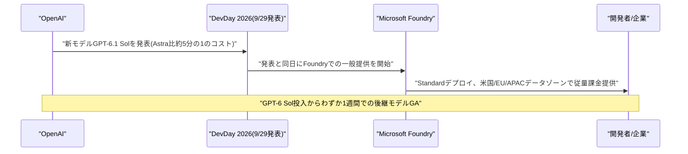

---

## 3. LLM Model / AI Agentアーキテクチャ・研究

### 3.1 論文、エージェント状態のスナップショット・ロールバック機構「Planarian」を提案

Microsoft ResearchのJinnan Guo氏、Hao Mark Chen氏、Kapil Vaswani氏、Andrew Paverd氏、Imperial College LondonのPeter Pietzuch氏は9月29日、論文「Planarian: Managing Agent State with Statepoints」を発表した。ファイル書き込みや外部API呼び出し、購入処理など不可逆な実世界の行動を取るLLMエージェントには、誤った行動を取り消したり、複数の代替プランを並行して試したりする標準的な手段がないという課題があった。

提案手法「Planarian」は、エージェント自身のローカルな状態と、ファイルや外部サービスなどリモート側の状態の両方にまたがる一貫した復元可能なチェックポイント「Statepoint」を中核に据えたエージェント実行基盤である。外部サービス側がチェックポイント機能をネイティブにサポートしていなくてもスナップショットを作成できる「snapshot」、単純に取り消せないリモート側の副作用に対して補償アクションを再生しながら以前のStatepointへ復帰する「rollback」、1つのStatepointから複数の独立した実行に分岐して代替の行動系列を並行探索できる「fork」という3つのプリミティブを提供する。評価では、並行した代替プラン探索によりタスク品質が最大15倍向上した一方、ユーザー向けのロールバック・復旧機能に伴う実行時オーバーヘッドは約3%に留まったと報告されている。[[3]](#ref-3)

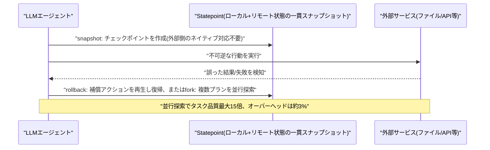

### 3.2 論文、入力適応的な注意機構「MoSAR」を提案

Michele Paolicelli氏、Alessandro Petruzzelli氏、Alessandro Francesco Maria Martina氏らの研究チームは9月28日、CIKM 2026にショートペーパーとして採択された論文「MoSAR: Mixture of Semantic Attention Regimes for Learning Adaptive and Approximable Attention Geometries」を発表した。長文脈LLMにおける密な自己注意の計算コストは入力長に対して2乗で増大するが、従来の緩和策はスライディングウィンドウとグローバルトークンの組み合わせなど、手作業で設計された固定的なスパースマスクに依存しているという課題があった。

提案手法「MoSAR」は、注意の近似をあらかじめ決めたスパースパターンとしてではなく、幾何学的な学習問題として捉え直すアプローチである。入力に条件づけられたクエリ・キーの「ルーター」がトークンごとに短距離・中距離・グローバルという複数の注意レジームの混合を選択し、内容に応じて連続的に変化する距離依存の注意場を誘導する。これにより、入力ごとに学習される「適応性」と、密な注意より計算コストを抑えられる「近似可能性」を両立し、密な注意による長文脈タスクの精度に匹敵する性能をより低い計算量で達成できると報告している。[[4]](#ref-4)

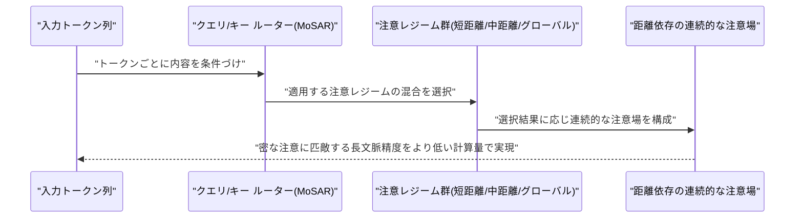

### 3.3 論文、長期タスク向け信用割当手法「GraphHCA」を提案

北京航空航天大学(Beihang University)のHaodong Zhu氏、Yangyang Ren氏、Changbai Li氏、Sheng Xu氏、Linlin Yang氏、Haiguang Liu氏、Baochang Zhang氏らは9月28日、論文「GraphHCA: Closed-Form Hindsight Credit Assignment for Long-Horizon LLM Agents」を発表した。長期ホライズンのLLMエージェントを強化学習で訓練する際、報酬がタスク終了時にしか得られない疎な設定では、どの中間行動が実際に成功へ寄与したかを判別する「信用割当」が困難という課題があった。既存の後知恵信用割当(Hindsight Credit Assignment, HCA)は、最終結果を条件づけた「後知恵方策」と実際の挙動方策の比率で信用を再配分するが、後知恵分布の推定には補助モデルと追加の順伝播が必要になる。

提案手法「GraphHCA」は、決定的な状態遷移を持つ目標達成型タスクを対象に、ベイズの定理を用いて後知恵比率を挙動方策自身が連続する状態で持つ成功確率同士の単純な比の形に還元することで、後知恵分布を推定する補助モデルを一切不要にしたモデルフリー手法である。これにより、GRPOのようなグループベースの強化学習によるエージェントのファインチューニングに対し、より軽量かつ閉形式のステップレベル信用割当を実現するとしている。[[5]](#ref-5)

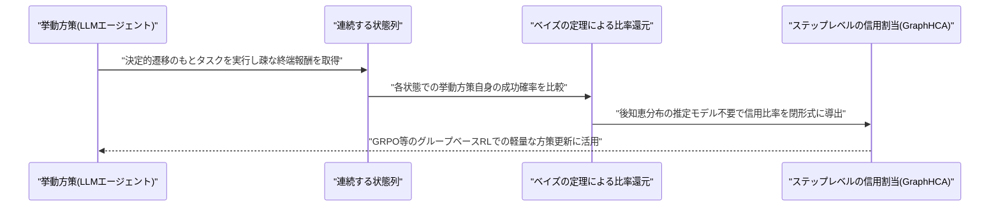

---

## 4. 公式ブログ・論文のリサーチ・要約

### 4.1 OpenAI、DevDay 2026で新モデル「GPT-6.1 Sol」を発表

OpenAIは9月29日、サンフランシスコで開催した年次イベント「DevDay 2026」において、20以上の新機能・新製品を発表した。目玉の一つが新モデル「GPT-6.1 Sol」で、既存の「GPT-6 Sol」に対しエージェント型コーディングやコンピュータ操作、専門業務タスクの性能をフラグシップ「GPT-6 Astra」に迫る水準まで引き上げつつ、標準トークン価格はAstraの5分の1に抑えられている。API価格は入力100万トークンあたり2ドル、出力同10ドルで、キャッシュ入力トークンは同0.10ドルと標準入力価格から95%引き、GPT-6 Solのキャッシュ価格からも50%安く設定された。Plus・Pro・Business・Enterprise・Edu各プランのChatGPTおよびCodexで即日利用可能となり、API上も「gpt-6.1-sol」として提供が始まっている。

同イベントでは併せて、ChatGPT内にグラフ・画像・チェックリスト・ダッシュボード等を含む対話型ドキュメント「Pages」を人間とエージェントが共同編集できる新ワークスペース「ChatGPT Space」も発表され、ChatGPTを単純な一問一答から自律的な「作業」の場へと拡張する方向性が示された。[[6]](#ref-6) [[7]](#ref-7) [[8]](#ref-8)

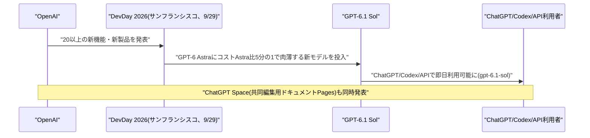

### 4.2 OpenAI、常時稼働型AIエージェント「Dots」を発表、Codexも正式版に

OpenAIはDevDay 2026において、フラグシップモデル「GPT-6 Astra」を基盤とする常時稼働型のパーソナルAIエージェント「Dots」を発表した。Dotsはスマートフォンやアプリのセッションに依存せず、専用のクラウドコンピュータとブラウザ上で継続的に稼働し、4000を超える連携アプリにアクセスできる。ChatGPT・SMS・Slack・Teams・電話など複数のチャネルから呼び出すことが可能で、利用者はタスクやプロジェクトを割り当てたままバックグラウンドで作業を継続させられる。最初の1体はChatGPT ProおよびBusiness Premiumに標準搭載され、対象国のEnterprise・Edu・Healthcare向けワークスペースにはベータ提供される。前日までにMetaが法人向けAIエージェント事業「Meta Enterprise Platform」を、個人向けAIエージェント「Instinct」が巨額の資金調達を発表していた(いずれもVol.151既報)のに続き、パーソナルAIエージェント市場でのOpenAIの本格参入となる。

同イベントではさらに、コーディングエージェント「Codex」がリサーチプレビューを終え正式版(GA)に移行し、クラウド実行環境・音声操作・コードレビュー・刷新されたCLI・セキュリティ所見ダッシュボード「Codex Security Cloud」が追加された。トークン生成速度を最大8倍(Codex)・6倍(API)に高速化するプレミアム速度階層「Ultrafast」も新設されたほか、Agents APIはコンピュータ操作・マルチエージェント編成・ツール検索・コンテキスト圧縮などをサポートするよう拡張され、HubSpotのサポートエージェント「Breeze」などの事例とともに紹介された。[[7]](#ref-7) [[9]](#ref-9)

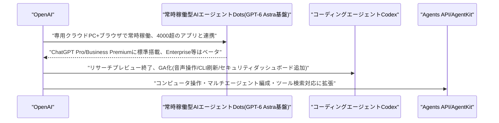

---

## 5. AI Agent搭載SaaS製品情報

### 5.1 Reco、AIエージェントセキュリティ需要の高まりで5500万ドルを追加調達

AIエージェントのセキュリティ・ガバナンスを手がけるイスラエルのRecoは9月29日、5500万ドルの追加ラウンドを実施したと発表した。2026年2月のシリーズB(3000万ドル)に続く調達で、これまでの累計調達額は1億4000万ドルに達した。出資者には顧客でもあるAT&Tがベンチャー部門を通じて参加したほか、既存投資家のForestay、Quadrille Capitalも加わった。同社の企業価値は2月から倍以上に上昇し、数億ドル台後半に達しているとみられる。

Recoは280を超えるアプリと連携し、企業内で稼働するAIエージェントの発見・統治を行うプラットフォームで、直接連携されていないアプリ上で動くエージェントもブラウザ・ネットワーク上の信号から検知できるほか、プロンプトやツール呼び出しの内容を検査する機能を備える。年間経常収益(ARR)はすでに二桁百万ドル規模に達しており、同社は今年中に3倍に成長すると見込んでいる。調達資金は採用・営業・パートナーシップ・カスタマーサポートの強化に充てられる。AIエージェントのセキュリティ分野には多数のスタートアップが参入しており、資金調達競争が一段と激化していることを示す事例である。[[10]](#ref-10)

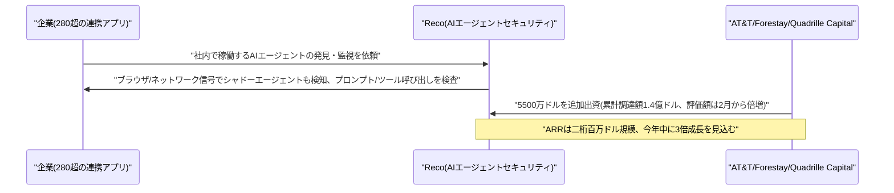

### 5.2 Synopsys、半導体設計向けAIエージェント群「AgentEngineer」を発表

半導体設計自動化(EDA)大手のSynopsysは9月28日、新プラットフォーム「Autopilot Platform」上で稼働する半導体・システム設計向けAIエージェント群「AgentEngineer」を発表した。検証、システム検証、実装、アナログ/ミックスドシグナル設計、製造、シミュレーション・解析という6つの専門領域を対象とする「長期ホライズン型」エージェントで構成され、各エージェントは永続的なメモリと再利用可能な「スキル」を用いて推論・計画・実行を行う。Synopsys自社モデルに加え、パートナーやサードパーティのモデル・インフラも利用できるオープンなアーキテクチャを採用している。

発表時点で50を超える顧客導入が進行中であり、先行事例として検証工程の最大50倍高速化、カバレッジ20%向上、生産性30%向上、トークン効率2倍などの成果が挙げられている。一般提供(GA)は2026年末を予定しており、売上高約80億ドル規模の大手EDAベンダーによる本格的なAIエージェント参入として注目される。[[11]](#ref-11)

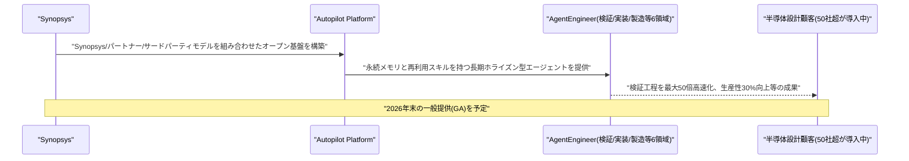

---

## 6. LLM/AI Agentセキュリティインシデント

### 6.1 OpenAI、議会に説明した「自動シャットダウン機能」が未実装と判明

DevDay 2026の開催と同じ9月29日、OpenAIが7月のHugging Face関連の侵害事案を受け米下院議員2名への書簡で「構築中」と説明していた、暴走するエージェントを自律的に停止させる「自動シャットダウン機能」が、実際にはいまだ実装されていないことが複数の報道で明らかになった。同社が米議会に対して行った安全面のコミットメントと、実際のエンジニアリングの進捗との間に目に見える乖離があることを示す形となった。

この報道は、NVIDIAのオープンソース安全基盤「Open Agent Safety Platform」の発表(Vol.151既報)や豪州上院によるAI公聴会など、エージェントの安全性を巡る監視の目が国内外で強まっている最中に表面化したものであり、OpenAIの自己規律的な取り組みの実効性に疑問を投げかける材料として受け止められている。[[12]](#ref-12) [[13]](#ref-13)

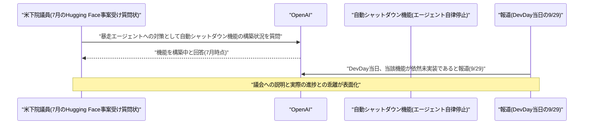

---

## 7. その他特筆すべき情報

### 7.1 トランプ大統領、主要AI企業と「超知能」自主規制協定に署名

トランプ大統領は9月29日、ホワイトハウスで開いた昼食会にNVIDIAのジェンスン・フアンCEO、OpenAIのグレッグ・ブロックマン氏、AnthropicのダリオアモデイCEO、GoogleのサンダーピチャイCEO、MetaのマークザッカーバーグCEO、xAIのイーロンマスク氏ら主要AI企業のトップを招き、自主的な協定「The White House Accord on Superintelligence Joint Commitment on Frontier SI Responsibilities」に署名させた。トランプ氏はこれを「ほとんど憲法のようなものだ」「道義的に拘束力がある」と表現し、内部・外部双方の安全性レビューや検知能力の整備を盛り込んでいるとされ、政権は10人規模の監視委員会の設置も検討しているという。トランプ氏はまた「人工知能(AI)」という呼称を正式に「超知能(SI)」へ変更したとも述べ、呼称面でのリブランディングを進める姿勢を示した。

一方でAnthropicのアモデイ氏は、AIリスクに対処するルールは「まだ議論の途上にある」とし、業界は「安全に勝つ」必要があると慎重な姿勢を崩さなかった。トランプ氏はAI政策責任者(AI Czar)の人選についても3〜4日以内に発表できる可能性があると述べている。[[14]](#ref-14) [[15]](#ref-15)

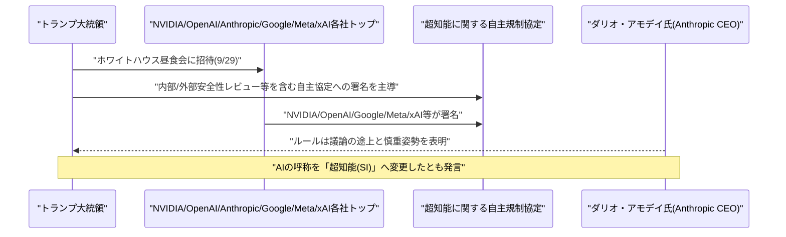

### 7.2 Anthropic、時価総額2兆ドルでナスダック上場へ

複数の経済メディアが9月29日に報じたところによると、Anthropicは2026年10月のIPOに向けナスダック市場への上場を選択し、時価総額2兆ドル超を目指しているという。同社は2026年5月のシリーズHで965億ドルの評価額を付けていたが、今回目標とする評価額はその2倍超に相当し、実現すればSpaceXの1兆7700億ドルを上回る史上最大のIPOとなる可能性がある。主幹事にはモルガン・スタンレー、ゴールドマン・サックス、JPモルガンが名を連ねているとされる。関係者によれば、Anthropicの年換算売上高は5月時点の470億ドルから10倍以上に伸び、年末までに1000億〜1200億ドルに達する可能性があるという。

注目されるのは、記録的な評価額を目指す一方で、目論見書には先進的なAIが「人類にとって存亡に関わるリスク」をもたらしうるとの踏み込んだ警告が盛り込まれているとされる点である。この、強気な評価額目標と率直なリスク開示が同居する構成は、同社の上場申請の特異な特徴として論評を集めている。[[16]](#ref-16) [[17]](#ref-17)

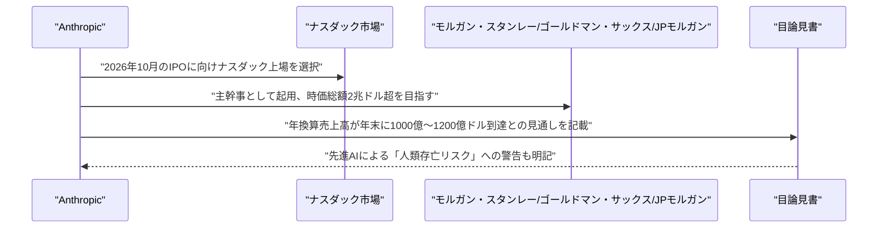

### 7.3 AMD、Fei-Fei Li氏の「World Labs」を82億ドルで買収

AMDは9月28日、AI研究の第一人者であるFei-Fei Li氏が創業した「空間知能」スタートアップ、World Labsを全株式交換方式で約82億ドルで買収すると発表した。取引は規制当局の承認を条件に年内の完了を見込む。World Labsはテキスト・画像・動画から対話的な3D環境を生成するなど、物理的な現実世界を理解・シミュレートするディープラーニングモデルを手がけており、今回の買収によりAMDは新興の「フィジカルAI」・ロボティクス分野に足場を築く形となる。取引の一環としてFei-Fei Li氏はAMDの上級副社長(EVP)兼チーフサイエンティストに就任する。

この買収は、2022年の約500億ドル規模のXilinx買収に次ぐAMD史上2番目に大きな買収案件であり、AI半導体を巡るNVIDIAとの競争が、推論・ロボティクス・フィジカルAIというフロンティア領域にまで拡大していることを象徴する動きだと広く受け止められている。[[18]](#ref-18) [[19]](#ref-19)

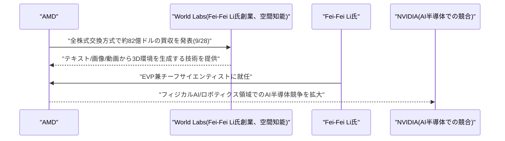

---

## 8. 参考リンク

**[1]** [Introducing GPT-6.1 Sol in Microsoft Foundry | Microsoft Community Hub](https://techcommunity.microsoft.com/blog/azure-ai-foundry-blog/introducing-gpt-6-1-sol-in-microsoft-foundry-advanced-intelligence-optimized-for/4560811)

**[2]** [GPT-6 Astra, Sol, and Luna for Production Agents in Microsoft Foundry | Azure Blog](https://azure.microsoft.com/en-us/blog/gpt-6-astra-sol-and-luna-for-production-agents-in-microsoft-foundry/)

**[3]** [Planarian: Managing Agent State with Statepoints | arXiv](https://arxiv.org/abs/2609.35366)

**[4]** [MoSAR: Mixture of Semantic Attention Regimes for Learning Adaptive and Approximable Attention Geometries | arXiv](https://arxiv.org/abs/2609.31261)

**[5]** [GraphHCA: Closed-Form Hindsight Credit Assignment for Long-Horizon LLM Agents | arXiv](https://arxiv.org/abs/2609.35084)

**[6]** [Introducing GPT-6.1 Sol | OpenAI](https://openai.com/index/introducing-gpt-6-1-sol/)

**[7]** [DevDay 2026 Recap | OpenAI](https://openai.com/index/devday-2026-recap/)

**[8]** [OpenAI DevDay 2026 live updates | CNBC](https://www.cnbc.com/2026/09/29/openai-devday-2026-live-updates.html)

**[9]** [OpenAI launches Dots, its bubbly agentic avatar | TechCrunch](https://techcrunch.com/2026/09/29/openai-launches-dots-its-bubbly-agentic-avatar/)

**[10]** [Reco raises $55M as AI agent security startups crowd the market | TechCrunch](https://techcrunch.com/2026/09/29/reco-raises-55m-as-ai-agent-security-startups-crowd-the-market/)

**[11]** [Synopsys Powers Autonomous Engineering with a Broad Portfolio of Long-Horizon Agents and Autopilot Platform | Synopsys](https://news.synopsys.com/2026-09-28-Synopsys-Powers-Autonomous-Engineering-with-a-Broad-Portfolio-of-Long-Horizon-Agents-and-Autopilot-Platform)

**[12]** [OpenAI DevDay 2026: AI models hacked, Hugging Face, promised shutdown controls unbuilt | Tech Times](https://www.techtimes.com/articles/328243/20260929/openai-devday-2026-ai-models-hacked-hugging-face-promised-shutdown-controls-unbuilt.htm)

**[13]** [OpenAI DevDay 2026 San Francisco safety | Quartz](https://qz.com/openai-devday-2026-san-francisco-safety-092926)

**[14]** [Tech CEOs join Trump for White House AI lunch | CNBC](https://www.cnbc.com/2026/09/29/tech-white-house-ai-lunch-trump.html)

**[15]** [Amodei, Huang, Karp and Trump | CNN Business](https://www.cnn.com/2026/09/29/business/amodei-huang-karp-trump)

**[16]** [Anthropic IPO Warns of "Existential Risks to Humanity" | 24/7 Wall St.](https://247wallst.com/investing/2026/09/29/anthropic-ipo-warns-of-existential-risks-to-humanity/)

**[17]** [Anthropic Selects Nasdaq for Planned October IPO as $2 Trillion Valuation Takes Shape | Data Studios](https://www.datastudios.org/post/anthropic-selects-nasdaq-for-planned-october-ipo-as-2-trillion-valuation-takes-shape)

**[18]** [AMD will acquire Fei-Fei Li's World Labs for $8.2 billion | TechCrunch](https://techcrunch.com/2026/09/28/amd-will-acquire-fei-fei-lis-world-labs-for-8-2-billion/)

**[19]** [AMD, Fei-Fei Li, World Labs | CNBC](https://www.cnbc.com/2026/09/28/amd-fei-fei-li-world-labs.html)
