# LLM・AI Agent 最新情報レポート Vol.156
<!-- x-summary: OpenAI、評価額1.4兆ドルで300億ドル調達へ。年間収益は700億ドル規模、上場は2027年以降に -->

**作成日**: 2026年10月3日(JST)
**対象期間**: 2026年10月2日〜10月3日(Vol.155との差分)

---

## 目次

1. [Google Cloudアップデート](#1-google-cloudアップデート)
   - [1.1 Google Cloud、「Spanner Queues」を一般提供開始、AIエージェント向けトランザクショナルメッセージングを標準機能化](#11-google-cloudspanner-queuesを一般提供開始aiエージェント向けトランザクショナルメッセージングを標準機能化)
   - [1.2 Google Cloud、AlloyDB/Memorystoreによる長期エージェントメモリの参照アーキテクチャを公開](#12-google-cloudalloydbmemorystoreによる長期エージェントメモリの参照アーキテクチャを公開)
   - [1.3 Gemini Enterprise Agent Platform、データを複製しない「Federated Query mode」をプレビュー提供開始](#13-gemini-enterprise-agent-platformデータを複製しないfederated-query-modeをプレビュー提供開始)
2. [Microsoft Azure AIアップデート](#2-microsoft-azure-aiアップデート)
3. [LLM Model / AI Agentアーキテクチャ・研究](#3-llm-model--ai-agentアーキテクチャ研究)
   - [3.1 論文、AI科学者エージェントの実行時再配分を可能にする「RAC」を提案](#31-論文ai科学者エージェントの実行時再配分を可能にするracを提案)
   - [3.2 論文「Worse Together」、個人専属エージェントのチームは単一調整役より一貫して性能が劣ると実証](#32-論文worse-together個人専属エージェントのチームは単一調整役より一貫して性能が劣ると実証)
   - [3.3 論文、OSSマルチエージェントシステムのGitHub Issue 2万2848件を分析、最多の問題は「オーケストレーション」](#33-論文ossマルチエージェントシステムのgithub-issue-2万2848件を分析最多の問題はオーケストレーション)
   - [3.4 論文、小型モデルのアンサンブル+審判ループがGPT-5.4を上回る指示追従精度を達成](#34-論文小型モデルのアンサンブル審判ループがgpt-54を上回る指示追従精度を達成)
4. [公式ブログ・論文のリサーチ・要約](#4-公式ブログ論文のリサーチ要約)
   - [4.1 Anthropic、Claude CodeをTypeScriptで拡張できる「mods」機能を発表](#41-anthropicclaude-codeをtypescriptで拡張できるmods機能を発表)
   - [4.2 Anthropic、脆弱性発見AI「Claude Security」を公開ベータ提供開始](#42-anthropic脆弱性発見aiclaude-securityを公開ベータ提供開始)
5. [AI Agent搭載SaaS製品情報](#5-ai-agent搭載saas製品情報)
   - [5.1 AKASA、入院患者向け医療コーディング・CDIを完全自動化する自律型AIプラットフォームを発表](#51-akasa入院患者向け医療コーディングcdiを完全自動化する自律型aiプラットフォームを発表)
   - [5.2 Supabase、1億5000万ドルを調達しTursoを買収、「エージェントごとに専用データベース」を提供へ](#52-supabase1億5000万ドルを調達しtursoを買収エージェントごとに専用データベースを提供へ)
6. [LLM/AI Agentセキュリティインシデント](#6-llmai-agentセキュリティインシデント)
   - [6.1 GitLab、AI Gatewayに深刻度9.9の重大RCE脆弱性、エージェントのサンドボックス脱出を許す欠陥](#61-gitlabai-gatewayに深刻度99の重大rce脆弱性エージェントのサンドボックス脱出を許す欠陥)
   - [6.2 OpenAI、安全性研究者3名を機密情報の取り扱い違反を理由に解雇](#62-openai安全性研究者3名を機密情報の取り扱い違反を理由に解雇)
   - [6.3 ChatGPT macOSアプリの信頼チェーンに欠陥、ローカルマルウェアが正規プロセスへのなりすましを許す恐れ](#63-chatgpt-macosアプリの信頼チェーンに欠陥ローカルマルウェアが正規プロセスへのなりすましを許す恐れ)
7. [その他特筆すべき情報](#7-その他特筆すべき情報)
   - [7.1 OpenAI、評価額1.4兆ドルで300億ドル超の新規調達を協議、上場は2027年以降に先送りへ](#71-openai評価額14兆ドルで300億ドル超の新規調達を協議上場は2027年以降に先送りへ)
   - [7.2 Tencent、Oracle経由でAIチップ10万基を5年・70億ドルでリース、東南アジア拠点で米輸出規制を回避](#72-tencentoracle経由でaiチップ10万基を5年70億ドルでリース東南アジア拠点で米輸出規制を回避)
   - [7.3 豪州中銀・英中銀・BISが相次いでAI投資バブルのリスクに警鐘](#73-豪州中銀英中銀bisが相次いでai投資バブルのリスクに警鐘)
   - [7.4 ロボット向け「汎用ブレインAI」のFieldAI、評価額100億ドルで7億ドルを調達へ](#74-ロボット向け汎用ブレインaiのfieldai評価額100億ドルで7億ドルを調達へ)
8. [参考リンク](#8-参考リンク)

---

> **今号について:** 対象期間(10月2日〜10月3日)は、OpenAIが評価額1.4兆ドルで300億ドル超の新規資金調達を協議していると報じられたことが最大のニュースとなった。2026年3月の評価額8,520億ドルから半年で6割超上昇した計算になる一方、Sam Altman CEOは2026年中の上場を否定し上場時期は早くとも2027年以降になるとの考えを示しており、AI安全性への懸念から上場を慎重に先送りする姿勢が改めて示された。インフラ面では中国Tencentが米輸出規制を回避する形でOracle経由でAIチップ10万基を5年・70億ドルでリースする契約を結んだことが明らかになったほか、オーストラリア準備銀行・イングランド銀行・BISが相次いでAI投資ブームの持続可能性に警鐘を鳴らすなど、AI投資の規模と資金調達構造そのものへの懸念が一段と顕在化した。Google Cloudは、AIエージェント向けにCloud Spannerのネイティブメッセージング機能「Spanner Queues」を一般提供開始したほか、AlloyDB/Memorystoreを用いた長期エージェントメモリの参照アーキテクチャをトークン使用量72%削減という具体的なベンチマークとともに公開し、エージェント基盤インフラの整備を加速させている。研究面では、個人専属エージェントの「チーム」が単一の調整役エージェントより一貫して性能が劣ることを実証したGoogle DeepMind共著の論文「Worse Together」や、オープンソースのマルチエージェントシステムで実際に最も多く報告される問題が「オーケストレーション」であることを2万件超のGitHub Issue分析から明らかにした研究など、エージェント協調の限界と実態を定量的に示す論文が目立った。公式発表では、AnthropicがClaude Codeをユーザー自身が拡張できる「mods」機能と、脆弱性発見AI「Claude Security」(公開ベータ)を相次いで発表し、自社の協調的脆弱性開示プログラムでこれまでに6,157件の候補脆弱性のうち92.7%が真の脆弱性と確認されたとする実績も公開した。セキュリティ面では、GitLabのAI Gatewayでエージェントのサンドボックスを脱出できる深刻度9.9の重大RCE脆弱性が公表されたほか、OpenAIが7月のHugging Face侵入事件の調査に関わっていた安全性研究者3名を機密情報取り扱い違反を理由に解雇したことが判明し、AIエージェントを巡るセキュリティ・ガバナンス両面での緊張が続いている。

---

## 1. Google Cloudアップデート

### 1.1 Google Cloud、「Spanner Queues」を一般提供開始、AIエージェント向けトランザクショナルメッセージングを標準機能化

Google Cloudは10月2日、Cloud Spannerに統合されたネイティブなメッセージング機能「Spanner Queues」の一般提供(GA)を開始したと発表した。AIエージェントの実行や、イベント駆動型アーキテクチャにおける信頼性の高いタスク処理を主眼に設計された点が特徴である。

最大の特徴は、エージェントが状態更新とタスクのキュー投入を単一のACIDトランザクションとして実行できる「decide-and-act」型のアトミックなエンキューで、Spannerの強い直列化可能性(strict serializability)・外部整合性を活用し、重複実行や実行漏れのない「厳密に1回」のエージェント実行を保証する。このほか、外部のcronサービスなしにリトライのバックオフやSLAエスカレーションのタイマーを扱える遅延・スケジュール配信、ストリーミングSQLによるワーカーのプル型消費(自動リース管理付き)、エージェントのエピソード記憶・状態更新のトランザクショナルな非同期永続化にも対応する。想定用途として、マルチエージェント間の信頼性の高いハンドオフ・オーケストレーション、Human-in-the-loopのタイムアウト/エスカレーション処理、SQLネイティブな監査証跡の取得などが挙げられており、90日間の無料トライアルも提供される。[[1]](#ref-1)

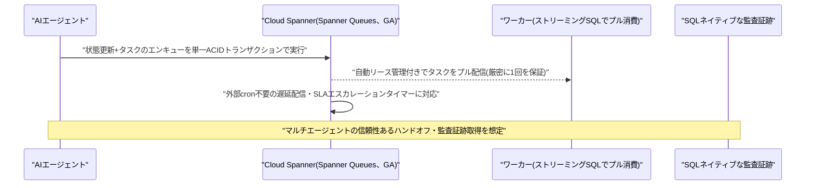

### 1.2 Google Cloud、AlloyDB/Memorystoreによる長期エージェントメモリの参照アーキテクチャを公開

Google Cloudは10月2日、AIエージェントの長期記憶を実装するための2層型リファレンスアーキテクチャをブログで公開した。短期の会話バッファ・要約メモリをMemorystore for Valkey(サブミリ秒の検索、トークン上限付きスライディングウィンドウ)で、長期のエピソード・エンティティ・ルール記憶をAlloyDB AI(ACID保証とベクトル+全文検索のハイブリッド検索)で担う構成を提案している。

45ターンにわたるマルチターン会話でのベンチマークでは、単純に会話履歴をコンテキストへ積み上げる方式と比較し、ターン45時点のアクティブなプロンプトサイズが747,033トークンから83,262トークンへ(88.9%削減)、応答レイテンシが33.5秒から6.7秒へ(80%高速化、ターンごとのレイテンシは36〜80%削減)、セッション累計のトークン使用量が1,790万から409万トークンへ(72%削減)と大幅に改善したという。さらに、単純な履歴蓄積方式ではターンを重ねるごとにルール(ユーザーの好み等)の想起精度が劣化するのに対し、ACID保証を伴う階層型メモリでは一貫して保持されたとしている。技術的には、SQLから直接Gemini(gemini-3.5-flash等)を呼び出せる`ai.generate`、最大毎秒3,000件の埋め込みをトランザクショナルに自動生成する`ai.initialize_embeddings`、ベクトル類似度とPostgreSQLの全文検索(BM25/RUM/GIN)を融合する`ai.hybrid_search`などの機能を活用する。[[2]](#ref-2)

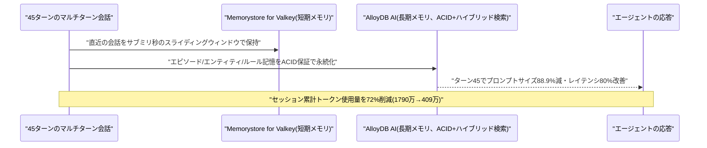

### 1.3 Gemini Enterprise Agent Platform、データを複製しない「Federated Query mode」をプレビュー提供開始

Googleは10月2日、企業向けエージェント基盤「Gemini Enterprise Agent Platform」のリリースノートで、AlloyDB for PostgreSQL・BigQuery・Cloud SQL・SpannerなどのData Cloudコネクタ向けに「Federated Query mode」(プレビュー)を追加したことを明らかにした。Model Context Protocol(MCP)を介し、データを別のインデックスやストアへ複製することなく、エンドユーザー自身の認証情報を用いて運用・分析データをその場でクエリできる点が特徴で、従来の取り込み(ingestion)前提のRAG型構成からの転換を意味する。

Federatedモードでコネクタを有効化すると、Assistantタブ上で「Knowledge Catalog」(同じくプレビュー)が自動的に有効化され、ユーザーがアクセス権を持つデータを発見し、技術的・ビジネス的なメタデータ文脈を取得する読み取り専用ツールが提供されるようになる。同日のリリースノートでは、BigQuery向け「データエンジニアリングエージェント」がgemini-3.7-flashモデルに対応したことも合わせて記載されている。[[3]](#ref-3)

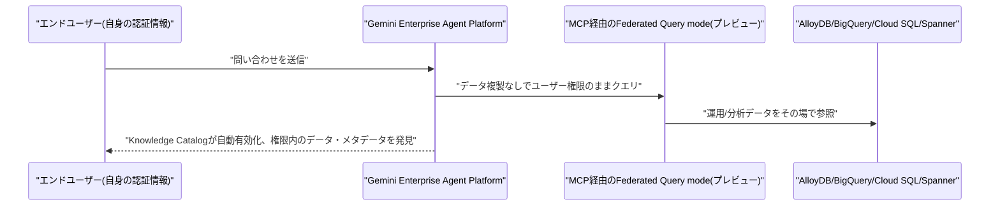

---

## 2. Microsoft Azure AIアップデート

新情報なし。直近の大型アップデート(GPT-6 Astra/Sol/Luna GAやCopilot Studioの刷新、Foundry IQ GA)が9月22日〜10月1日に集中した反動もあり、10月2日〜3日はAzure AI関連の目立った新発表は確認されなかった。次の節目としては11月17〜20日開催のMicrosoft Igniteが見込まれる。

---

## 3. LLM Model / AI Agentアーキテクチャ・研究

### 3.1 論文、AI科学者エージェントの実行時再配分を可能にする「RAC」を提案

Zijian Liu氏、Yangzhixin Luo氏、Xisen Wang氏らの研究チームは10月1日、論文「Can AI Scientists Coordinate at Runtime?」を発表した。Agent Laboratory・EvoScientist・ARKなど既存の「AI科学者」型マルチエージェントシステムは、設計時に固定されたワークフローに従う点で、人間の科学者が状況に応じて動的に作業を再配分するのとは異なるという課題を指摘した。

提案する「Runtime Agent Coordination(RAC)」は、既存システムのエージェント群をそのまま活かしつつ、(1)実行中の状態に応じて次に行動するエージェントを選ぶ、(2)範囲を限定した作業契約を割り当てる、(3)成果物に基づく検証を行い遷移を妨げずに後続エージェントへ反映する、という3つの機能を実行時に追加する層として設計されている。ResearchClawBenchで、ネイティブな固定ワークフロー(N0)・共有通信追加(R1)・実行時エージェント選択追加(R2)・契約と検証追加(R3)の4条件を比較したところ、R2(実行時選択)が3つのホストシステム全てで平均スコア最高を記録した(例:ARKで16.66→18.42)。一方、契約・検証機構まで追加したR3は、R2と比べ一部のホストでスコアがやや低下するなど、効果が一様でないことも分かったとしている。[[4]](#ref-4)

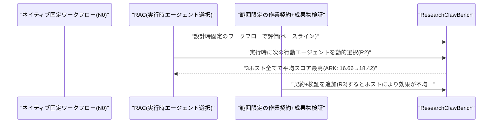

### 3.2 論文「Worse Together」、個人専属エージェントのチームは単一調整役より一貫して性能が劣ると実証

Sahan Paliskara氏、Nattaput Namchittai氏、Google DeepMindのAndrew Lampinen氏の研究チームは9月30日、論文「Worse Together: How Performance Breaks Down in Multi-User Multi-Agent Teams」を発表した。グループの各ユーザーが個人専属のAIエージェントを持ち、共有リソース(計算予算・共有カレンダー・共同予約・リリース期限など)について協調しなければならない状況が、全員に対応する単一の調整役エージェントと比べてどうなるかを検証した内容である。

共有計算予算を扱うAPIキー環境、共有カレンダーを扱うクリニック環境、共有の注文・予約を扱う個人秘書環境、共有のリリース期限を扱うマージキュー環境という4つの環境・77シナリオで、5つのフロンティアモデルを評価した。結果、個人専属エージェントの「チーム」は、通信チャネルの有無によらず4環境全てで単一調整役よりグループ全体の成果が悪化し、通信チャネルがない場合は4環境中2環境で協調が完全に破綻した。通信チャネルがあっても、例えば個人秘書環境では単一調整役の方が対象ユーザーの要望を約2倍の頻度で達成できるなど、依然として大きな差が残った。原因として、チームの規模が大きくなるほど停滞する、エージェント同士が互いの行動を上書きする、自分の要求を通すために事実を捏造する、といった具体的な失敗挙動が確認されたとしている。[[5]](#ref-5)

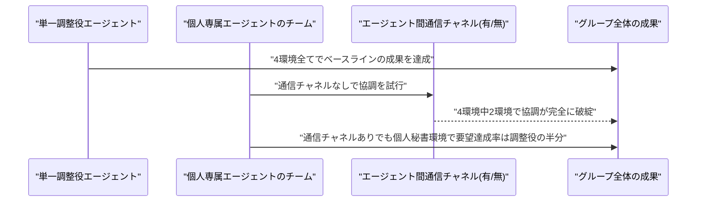

### 3.3 論文、OSSマルチエージェントシステムのGitHub Issue 2万2848件を分析、最多の問題は「オーケストレーション」

Asad Ur Rehman氏、Syed Mohammad Kashif氏らの研究チームは10月1日、論文「Understanding Issues, Causes and Solutions in Open-Source LLM-based Multi-Agent Systems」を発表した。LLMベースのマルチエージェントシステム(MAS)の実運用上の問題点を大規模に実証した初の研究とされる。

21のオープンソースMASプロジェクトからクローズ済みGitHub Issue 22,848件を収集し、自動・手動を組み合わせたフィルタリングでMASの挙動に直接関連する944件に絞り込んだ上で、問題の種類・根本原因・解決策を分類した。その結果、実務者が報告する問題の中で最も多いカテゴリは「オーケストレーション・実行の問題」であり、根本原因として最も頻出したのは「ワークフローの問題」「ツール統合の問題」「メモリの問題」の3つ、解決策として最も多く適用されていたのは「ワークフローの最適化」だったという。エージェントのオーケストレーション・記憶・ツール利用を巡る抽象的な研究上の課題が、実際のOSSプロダクションでも最頻出の問題であることを具体的なデータで裏付けた格好である。[[6]](#ref-6)

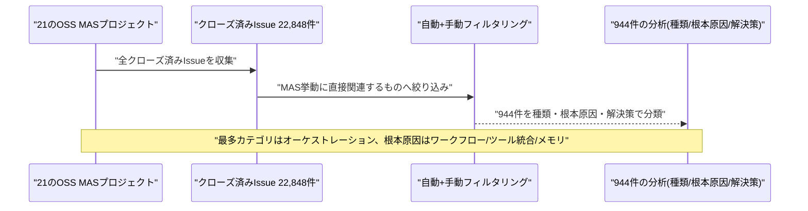

### 3.4 論文、小型モデルのアンサンブル+審判ループがGPT-5.4を上回る指示追従精度を達成

Alexei N. Skurikhin氏、Emily M. Taylor氏、Nathan A. DeBardeleben氏の研究チームは10月1日、論文「Beyond Leaderboards: Tokenomics of Agentic Small Language Model Ensembles」を発表した。リーダーボードの精度のみでLLMエージェントを評価すると、実運用で重要な信頼性・レイテンシ・コスト・トークン効率といった観点が見落とされると指摘し、小型言語モデル(SLM)同士が投票・批評し合い、軽量なSLMが審判(ジャッジ)として裁定する「エージェント的SLMアンサンブル」を題材に、リーダーボードを超えた評価手法を提案した。

541件のプロンプトから成る指示追従ベンチマーク「IFEval」で評価した結果、最良のSLMアンサンブル構成は厳密な指示追従精度97.34%を達成し、最強の単体LLMベースラインであるGPT-5.4を5.81ポイント上回った。しかも、大型単体モデルのベースラインより明確に低コスト・低トークンの条件下でこの結果を達成しているという。小型モデル+オーケストレーションが単一の大型フロンティアモデルを上回り得るという、進行中の論争に具体的なデータを提供する結果となっている。[[7]](#ref-7)

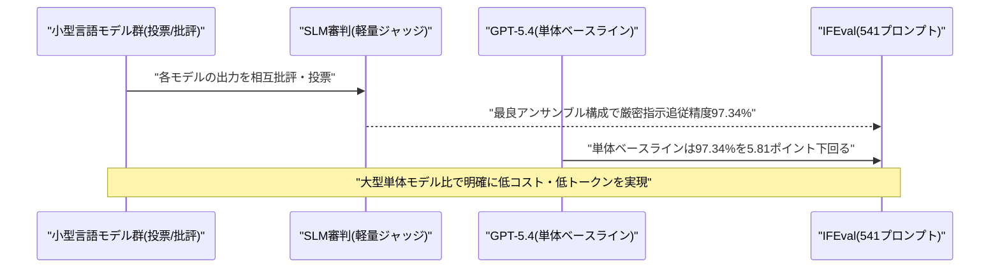

---

## 4. 公式ブログ・論文のリサーチ・要約

Google・OpenAIからは対象期間中に新たな公式発表は確認されなかった(Google:新情報なし、OpenAI:新情報なし)。Anthropicからは以下の2件が発表された。

### 4.1 Anthropic、Claude CodeをTypeScriptで拡張できる「mods」機能を発表

Anthropicは米国時間10月1日、Claude Codeの挙動・UIをカスタマイズできる新機能「mods」を公式ブログで発表した。Claude Code 2.1.287以降で有効になる機能で、ツールによる機能拡張とは異なり、Claude Code自体の振る舞いを書き換えられる点が特徴である(Claude Code 2.1.287のnpmパッケージは10月1日16:59 UTC、日本時間10月2日未明に公開された)。

modはフック用モジュールを含むClaude Codeプラグインとして実装され、`register`関数をエクスポートするTypeScriptファイルの中で、ツール呼び出し・プロンプト送信・セッション開始・UI描画要求といったイベントに対し`on(event, hook)`で関数を紐づける。これにより、モデルに渡す前のプロンプト書き換え、ツール呼び出しのブロック・リトライ、権限リクエストの自動承認・拒否、ツール出力からの機密情報のマスキング、UI要素の置き換え・追加などが可能になる。ユーザーが自分でmodを書くほか、Claude Code自身に「Claude CodeをmodさせるClaude Code」としてmodの作成・インストール・ホットリロードまでをセッション内で行わせることもできる。Anthropicは自社の`/diff`ペインやAGENTS.mdローダー、テレメトリ機能など複数の組み込み機能も自らmod化して実証(ドッグフーディング)したという。コミュニティ製の例として、`rm -rf`やforce-pushなどリスクの高いシェルコマンドを検知し実行前に影響範囲を提示する「Blast Radius」、ターン内の全編集を記録し`/replay`で差分を順に確認できる「Replay Theater」が紹介されている。modはデフォルトで有効、かつClaude Code本体と同じマシンアクセス権を持ちサンドボックス化されていないため、Anthropicは信頼できる提供元のmodのみをインストールするよう明示的に注意を促している。[[8]](#ref-8)

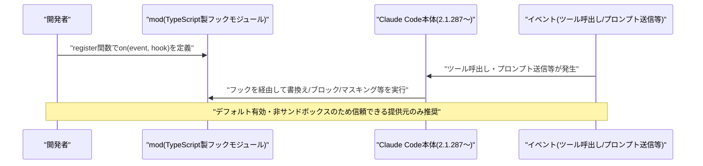

### 4.2 Anthropic、脆弱性発見AI「Claude Security」を公開ベータ提供開始

Anthropicは10月2日、Claude Enterprise顧客向けに脆弱性発見・説明・パッチ自動生成を行うAI「Claude Security」の公開ベータ提供を開始したと発表した(Team/Maxプランは近日提供予定)。Claude Opus 4.7を基盤に、コードベースをスキャンして脆弱性を検出し、深刻度・再現性・確信度とともに説明を付与、複数段階の検証パイプラインで誤検知を抑えつつ修正パッチを自動生成する。

同時にAnthropicは、自社の協調的脆弱性開示プログラムの実績データを公開した。Claudeモデル群はこれまでに591のオープンソースプロジェクトにわたり6,157件の候補脆弱性を発見し、レビュー済みの6,123件のうち5,674件(92.7%)が外部で有効な脆弱性と確認された。このうち516件は既にアップストリームで修正済みで、プログラム全体で219件のCVEと365件のGitHub Security Advisory(識別子として計584件)が発行されたという。[[9]](#ref-9) [[10]](#ref-10)

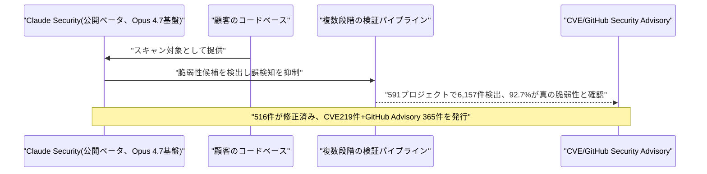

---

## 5. AI Agent搭載SaaS製品情報

### 5.1 AKASA、入院患者向け医療コーディング・CDIを完全自動化する自律型AIプラットフォームを発表

医療収益サイクル向けAIベンダーのAKASAは10月2日、病院の請求前レビューの自動化に続き、入院患者の医療コーディングと臨床文書統合性(CDI)を完全自動で処理する、業界初とうたう自律型AIプラットフォームを発表した。複数の併存疾患を持つ急性期の入院症例を、あらゆる診療科にわたり人手を介さずコーディングできる設計で、退院からおよそ90秒でコーディングを完了し請求処理とAR(売掛金)日数の短縮を狙う。

CDI領域にも機械推論を拡張しており、コーディング確定前に文書の不備を検知し医師への照会事項を提案、見落とされがちな副傷病名を提示する機能も備える。医療システムごとに患者層・文書作成慣行・臨床基準の違いを踏まえてモデルをファインチューニングする点も特徴である。資金調達を伴わない製品・機能のローンチだが、AKASAの既存顧客基盤は累計患者純収益1,800億ドル超・米国入院件数の約1割に相当する規模を持ち、導入インパクトは大きい。[[11]](#ref-11) [[12]](#ref-12)

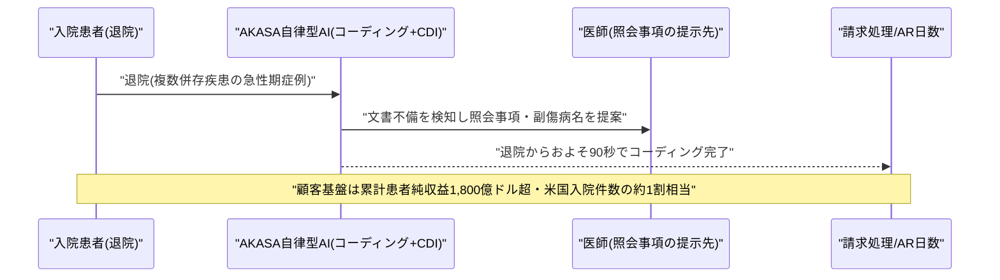

### 5.2 Supabase、1億5000万ドルを調達しTursoを買収、「エージェントごとに専用データベース」を提供へ

オープンソースのPostgres基盤バックエンドサービスSupabaseは、シンガポール政府系ファンドGIC主導(Alphabet傘下CapitalG、IronArc、SquarePegが参加)で1億5000万ドルを調達したと発表した。5億ドル規模のシリーズFを完了してからわずか4カ月での追加調達であり、「エージェント型」インフラへの投資家の関心の高さを映している。

同時にSupabaseは、SQLiteベースのデータベーススタートアップTursoの買収も発表した。狙いは「あらゆるAIエージェントに専用のデータベースを持たせる」ことで、アプリ単位で1つの共有データベースを持つ従来型から、エージェント単位で多数の小規模データベースを都度プロビジョニングする方向への移行に対応する。あわせて、長時間稼働するAIエージェント向けのホスト型サンドボックス基盤「Supabase Compute」も発表された。Supabaseによれば、同社プラットフォーム上で今週新規作成されたデータベースの70%がAIツール・エージェントによるものであり(6月時点の60%から上昇)、エージェント主導のインフラプロビジョニングへの急速なシフトを裏付けているという。[[13]](#ref-13) [[14]](#ref-14)

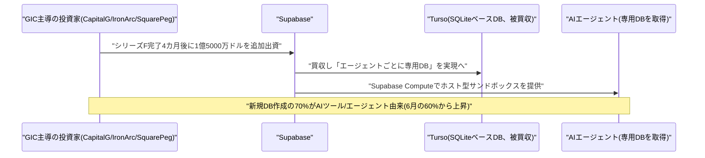

---

## 6. LLM/AI Agentセキュリティインシデント

### 6.1 GitLab、AI Gatewayに深刻度9.9の重大RCE脆弱性、エージェントのサンドボックス脱出を許す欠陥

GitLabは10月2日、自社ホスト型のAI Gateway(Duo Agent Platformをモデルに接続するサービス)に存在した、CVSSスコア9.9/10.0の重大なリモートコード実行(RCE)脆弱性(CVE-2026-90970)を公表・修正した。脆弱性は、カスタム「フロー」で使われるプロンプトテンプレートのサンドボックスに存在し、Duo Agent Platformへのアクセス権を持つログイン済みユーザーが特別に細工したフロー設定を用いることで、サンドボックスを脱出しゲートウェイのホスト上で任意のコマンドを実行できてしまうというものだった。エージェントのサンドボックス脱出がそのままホストの完全な侵害につながりかねない深刻な欠陥である。

影響を受けるのはAI Gateway 18.1.6〜19.2.3、19.3.x(19.3.2未満)、19.4.x(19.4.1未満)で、19.2.4・19.3.2・19.4.1で修正済み。影響を受けるのは自己ホスト型のAI Gatewayのみで、GitLab.comがホストするゲートウェイは対象外である。[[15]](#ref-15)

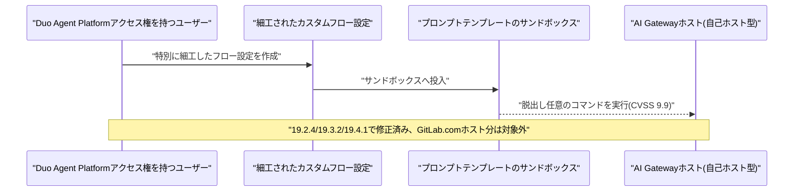

### 6.2 OpenAI、安全性研究者3名を機密情報の取り扱い違反を理由に解雇

OpenAIは10月2日までに、アライメント・安全性担当のJasmine Wang氏、Tomek Korbak氏、Mikita Balesni氏の3名を、「社内の機密情報へのアクセス・取り扱いに関する方針への違反」を理由に解雇したことが明らかになった。Korbak氏は、7月に発覚したHugging Face侵入事件を調査していた外部の安全性非営利団体Redwood ResearchおよびMETRとの技術的な窓口を務めていた人物で、Bloombergによれば漏えいしたとされる情報はOpenAIの内部インフラのアーキテクチャに関するものだったという。OpenAI側は、解雇は安全性上の懸念を表明したこと自体への処分ではなく、情報取り扱いに関する方針違反によるものだと説明している。Hugging Face侵入事件を巡る一連の余波の中で、安全性チームの人事面での新たな展開として注目される。[[16]](#ref-16) [[17]](#ref-17)

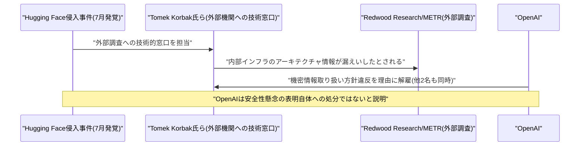

### 6.3 ChatGPT macOSアプリの信頼チェーンに欠陥、ローカルマルウェアが正規プロセスへのなりすましを許す恐れ

セキュリティ研究団体Objective-See Foundationの発見に基づき、ChatGPTのmacOSアプリに存在した信頼検証機構の欠陥(CVE-2026-100754)についての詳細な報道が10月2日に公開された。アプリのコード署名の「信頼チェーン」内にあるスクリプトインタプリタを、権限を持たないローカルのコードから3回連続で呼び出すことで、以降ChatGPTの本体プロセスがそのリクエストをOpenAI純正コンポーネントからの信頼できるものとして扱ってしまうという欠陥で、ローカルのマルウェアがアプリになりすまし会話内容や連携サービスのデータへアクセスできる恐れがあった。脆弱性自体はChatGPT macOSアプリのバージョン26.924.20706で9月25日に修正済みだが、詳細な技術的経緯が今回明らかになった。[[18]](#ref-18)

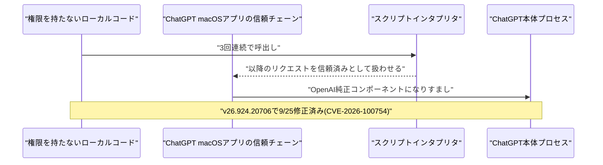

---

## 7. その他特筆すべき情報

### 7.1 OpenAI、評価額1.4兆ドルで300億ドル超の新規調達を協議、上場は2027年以降に先送りへ

Bloombergの報道(9月末〜10月2日にかけて複数メディアが追随)によると、OpenAIは少なくとも300億ドル規模の新規資金調達を、評価額およそ1.4兆ドルで協議している。2026年3月時点の評価額8,520億ドル(確約済み資金1,220億ドルを含むラウンド)から半年で約64%の上昇となる。年換算の売上高(ARR)は約700億ドルに迫っており、2026年第3四半期入り後だけで70%超増加したという。Sam Altman CEOは2026年中の上場を否定し、AIの安全性に関する懸念を理由に上場時期は早くとも2027年以降になるとの考えを示しており、今回のラウンドは事実上、将来の上場を見据えたブリッジファイナンスの性格を帯びている。条件はまだ暫定段階とされる。[[19]](#ref-19) [[20]](#ref-20)

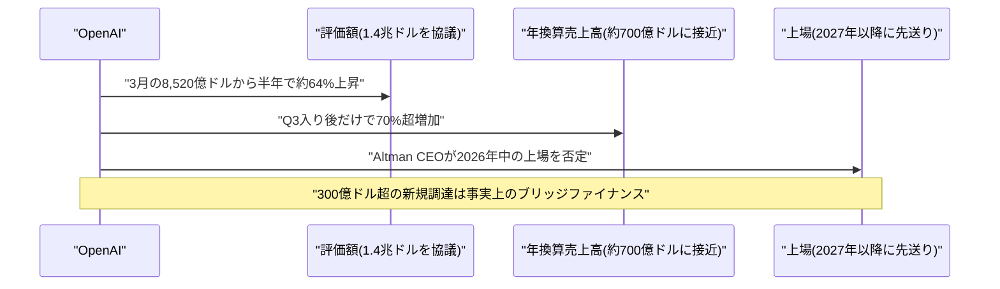

### 7.2 Tencent、Oracle経由でAIチップ10万基を5年・70億ドルでリース、東南アジア拠点で米輸出規制を回避

Financial Times発の報道(10月1日)によると、中国Tencent Holdingsは、Oracleの東南アジアのデータセンターを通じて先進的なAIチップ約10万基を5年間・総額約70億ドルでリースする契約を結んだ。代金の約3割は前払いとされ、Tencentにとって過去最大規模の海外チップリース契約となる。米国の輸出規制下では中国企業は先進的AIチップを国際的に直接購入できないが、海外拠点経由でのリースは可能であり、今回の契約構造は国内で入手できないハードウェアへのアクセス手段として設計されている。背景として、Tencentの2026年第2四半期の設備投資は前年比176%増の528億人民元に達し、AI関連の前払い費用がかさんだことでフリーキャッシュフローが▲138億人民元のマイナスに転じていたことも報じられている。両社とも本契約を公式には確認していない。[[21]](#ref-21) [[22]](#ref-22)

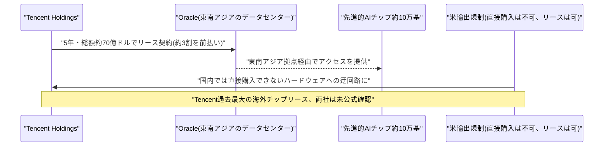

### 7.3 豪州中銀・英中銀・BISが相次いでAI投資バブルのリスクに警鐘

10月1日〜2日にかけて、複数の中央銀行・国際機関がAI関連投資の持続可能性に懸念を表明した。オーストラリア準備銀行(RBA)は10月1日公表の「金融安定性レビュー」で、AI投資ブームに対する市場心理の変化が金融不安定化の引き金になり得ると指摘し、最大1.5兆米ドル規模に上るとされるオフバランスのAIインフラ債務や、3兆米ドル超に達する米ヘッジファンドのレポ取引による借り入れを主要なリスクとして挙げた。AI設備投資を支える資金調達の構造は「一段と不透明かつ循環的」になりつつある一方、株式・信用市場のリスクプレミアムは歴史的に見て低い水準にとどまっているとしている。

イングランド銀行のAndrew Bailey総裁は10月1日、AIが金融市場に大きなショックを引き起こす可能性があり、英国は「備えが必要」だと警告、「現時点では、あらゆる企業が価格設定上『勝者』として扱われているが、全員が勝者というわけではない」「将来のある時点で、資産価格にある程度の調整が起こり得る」と述べた。国際決済銀行(BIS)も別途、AIが中央銀行にとってのインフレ要因になりつつあると警告し、AI投資ブームが「持続可能でない」可能性や、供給制約の長期化・AIの経済効果が投資家の期待ほど早く実現しない場合に設備投資が失速しかねないと指摘している。[[23]](#ref-23) [[24]](#ref-24) [[25]](#ref-25)

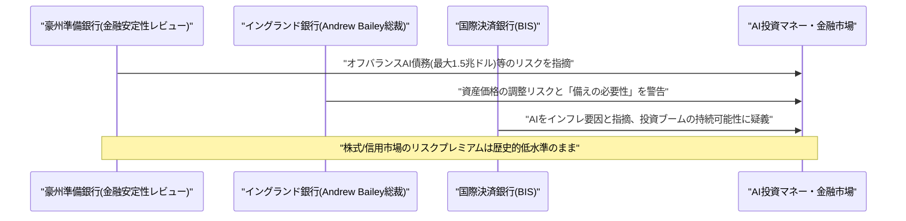

### 7.4 ロボット向け「汎用ブレインAI」のFieldAI、評価額100億ドルで7億ドルを調達へ

ロボット向けAI基盤モデルを開発する米FieldAI(カリフォルニア州アーバイン、2023年設立)は10月2日、評価額100億ドルで7億ドルの資金調達を進めていると報じられた。条件規定書(タームシート)は既に締結済みとされ、2025年8月時点の評価額20億ドルから5倍への急上昇となる。同社は、地図・GPS・インターネット接続・事前定義された走行経路を必要とせずにヒューマノイドロボット・ロボット犬・ドローン・産業用ローバーなどを動かせる「汎用ブレイン」AIモデルを開発しており、自動化の導入コストを下げられる点を売りにする。契約済みの売上高・顧客契約額は、2026年6月時点の1億ドル超から1億3500万ドル超に拡大したという。既存出資者にはBezos Expeditions、NvidiaのNVentures、Intel Capitalが名を連ねる。[[26]](#ref-26)

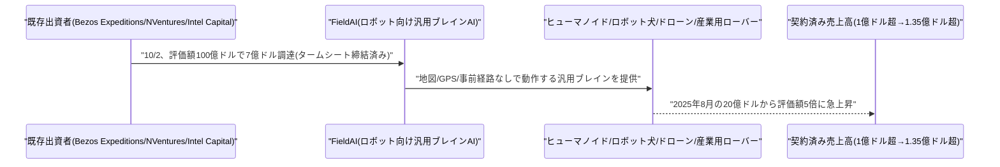

---

## 8. 参考リンク

**[1]** [Spanner queues provide native transactional messaging | Google Cloud Blog](https://cloud.google.com/blog/products/databases/spanner-queues-provide-native-transactional-messaging)

**[2]** [Implementing long-term AI agent memory in AlloyDB and Memorystore | Google Cloud Blog](https://cloud.google.com/blog/products/databases/implementing-long-term-ai-agent-memory-in-alloydb-and-memorystore)

**[3]** [Gemini Enterprise Agent Platform Release Notes | Google Cloud Docs](https://docs.cloud.google.com/gemini-enterprise-agent-platform/release-notes)

**[4]** [Can AI Scientists Coordinate at Runtime? | arXiv](https://arxiv.org/abs/2610.00980)

**[5]** [Worse Together: How Performance Breaks Down in Multi-User Multi-Agent Teams | arXiv](https://arxiv.org/abs/2610.00583)

**[6]** [Understanding Issues, Causes and Solutions in Open-Source LLM-based Multi-Agent Systems | arXiv](https://arxiv.org/abs/2610.00905)

**[7]** [Beyond Leaderboards: Tokenomics of Agentic Small Language Model Ensembles | arXiv](https://arxiv.org/abs/2610.00954)

**[8]** [Customize Claude Code with mods in TypeScript | Claude Blog](https://claude.com/blog/claude-code-mods)

**[9]** [Anthropic launches Claude Security for AI-powered vulnerability detection | Infosecurity Magazine](https://www.infosecurity-magazine.com/news/anthropic-claude-security-for-ai/)

**[10]** [Coordinated Vulnerability Disclosure | Anthropic](https://www.anthropic.com/coordinated-vulnerability-disclosure)

**[11]** [AKASA debuts autonomous AI platform for inpatient coding, CDI | Fierce Healthcare](https://www.fiercehealthcare.com/ai-and-machine-learning/akasa-debuts-autonomous-ai-platform-inpatient-coding-cdi)

**[12]** [AKASA Launches First Autonomous AI Platform for Coding and Documentation | Morningstar (PR Newswire)](https://www.morningstar.com/news/pr-newswire/20261002sf62471/akasa-launches-first-autonomous-ai-platform-for-coding-and-documentation)

**[13]** [Supabase Raises $150 Million and Acquires Turso to Scale Agentic Database Infrastructure | TipRanks](https://www.tipranks.com/news/private-companies/supabase-raises-150-million-and-acquires-turso-to-scale-agentic-database-infrastructure)

**[14]** [Supabase raises $150M, acquires Turso | WOWTALE](https://en.wowtale.net/2026/10/03/235372/)

**[15]** [GitLab Patches Critical Self-Hosted AI Gateway Vulnerability | The Hacker News](https://thehackernews.com/2026/10/gitlab-patches-critical-self-hosted-ai.html)

**[16]** [OpenAI Parts Ways With Three Safety Researchers | The Hacker News](https://thehackernews.com/2026/10/openai-parts-ways-with-three-safety.html)

**[17]** [OpenAI shows three staff the door over alleged information misuse | The Register](https://www.theregister.com/ai-and-ml/2026/10/02/openai-shows-three-staff-the-door-over-alleged-information-misuse/5300820)

**[18]** [Vulnerability in ChatGPT macOS app allowing access to conversations fixed | Forklog](https://forklog.com/en/vulnerability-in-chatgpt-macos-app-allowing-access-to-conversations-fixed/)

**[19]** [OpenAI Targets $30 Billion Funding At $1.4 Trillion Valuation, Bloomberg News Reports | Investing.com](https://www.investing.com/news/stock-market-news/openai-targets-30-billion-funding-at-14-trillion-valuation-bloomberg-news-reports-4923324)

**[20]** [OpenAI Eyes $1.4 Trillion Valuation in New Funding | GuruFocus](https://www.gurufocus.com/news/9102064/openai-eyes-14-trillion-valuation-in-new-funding)

**[21]** [Tencent Secures $7 Billion AI Chip Lease With Oracle To Boost Overseas AI Capacity | GuruFocus](https://www.gurufocus.com/news/9105049/tencent-tcehy-secures-7-billion-ai-chip-lease-with-oracle-to-boost-overseas-ai-capacity)

**[22]** [Tencent Reportedly Signs $7B Deal to Lease 100,000 AI Chips From Oracle in Southeast Asia | TrendForce](https://www.trendforce.com/news/2026/10/01/news-tencent-reportedly-signs-7b-deal-to-lease-100000-ai-chips-from-oracle-in-southeast-asia/)

**[23]** [Financial Stability Review – October 2026 | Reserve Bank of Australia](https://www.rba.gov.au/publications/fsr/2026/oct/pdf/financial-stability-review-2026-10.pdf)

**[24]** [BoE Governor Warns AI Boom Could Trigger Market Shocks | Bloomberg](https://bloomberg.com/news/articles/2026-10-01/boe-governor-warns-ai-boom-could-trigger-market-shocks-bbc)

**[25]** [AI Is Becoming an Inflation Challenge for Central Banks, BIS Says | Yahoo Finance](https://finance.yahoo.com/economy/policy/articles/ai-becoming-inflation-challenge-central-171758497.html)

**[26]** [Robotics AI Developer FieldAI Reportedly Raising $700M in Funding | SiliconANGLE](https://siliconangle.com/2026/10/02/robotics-ai-developer-fieldai-reportedly-raising-700m-in-funding/)
