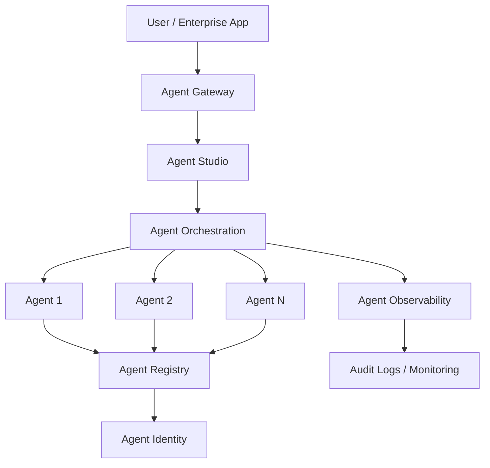
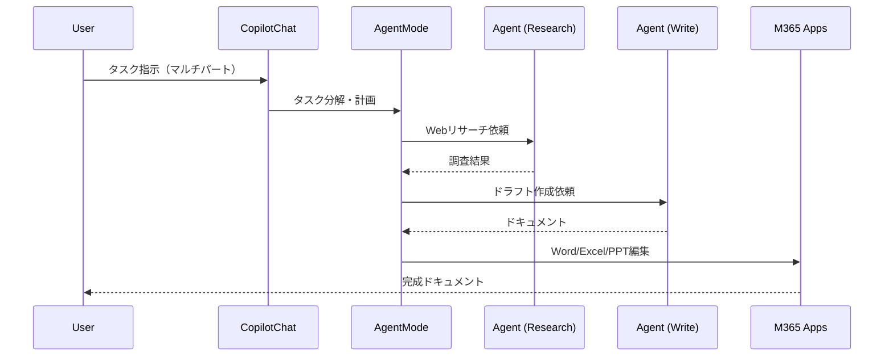
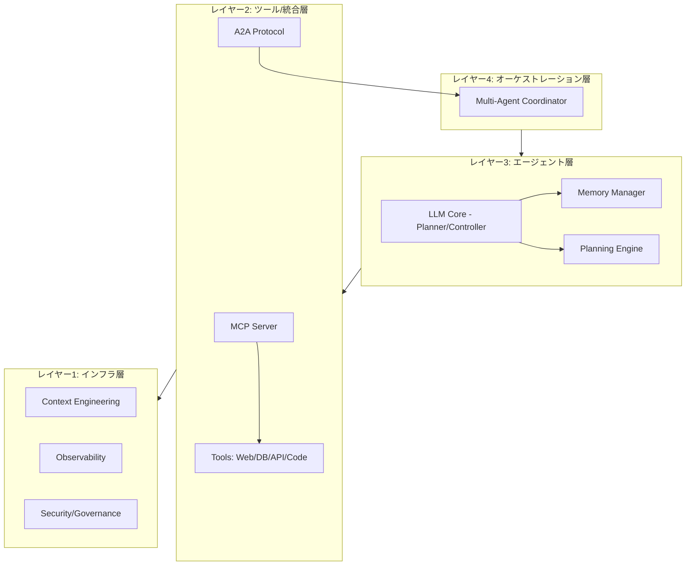
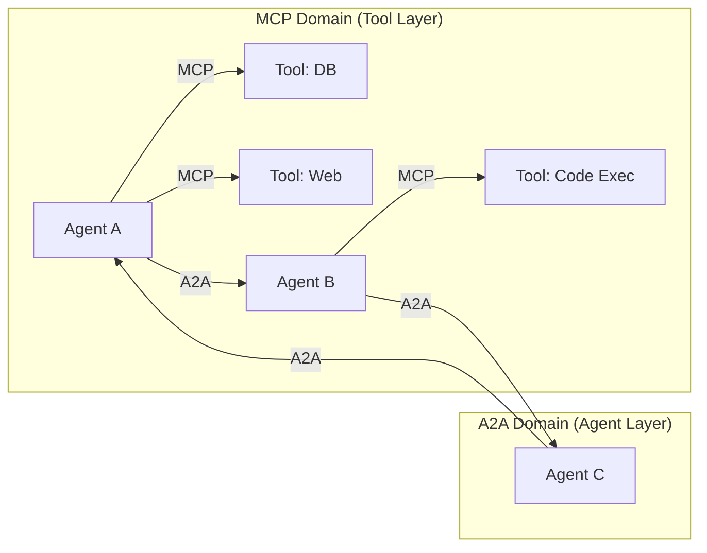
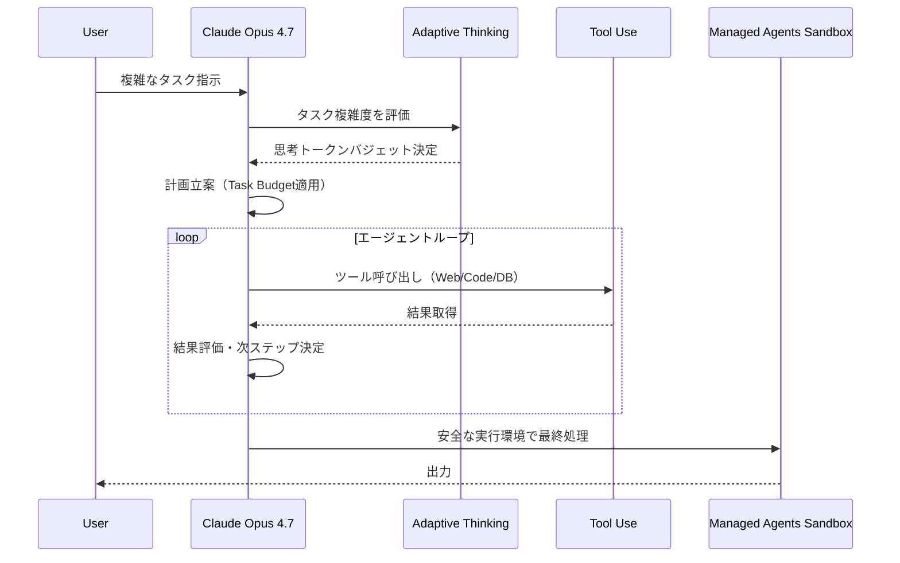
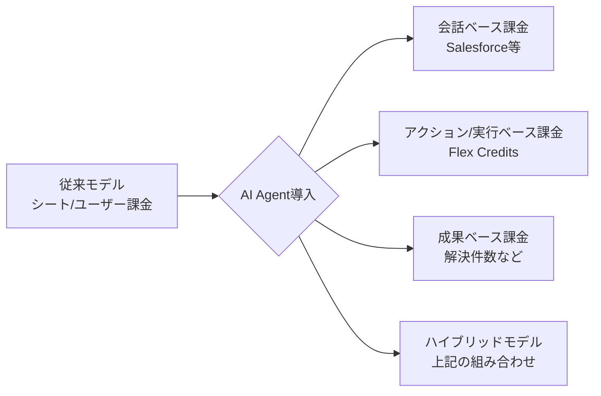

# LLM・AI Agent 最新情報レポート

**作成日**: 2026年5月4日  
**対象期間**: 2026年4月〜5月初旬

---

## 目次

1. [Google Cloud AIアップデート](#1-google-cloud-aiアップデート)
2. [Microsoft Azure AIアップデート](#2-microsoft-azure-aiアップデート)
3. [LLM Model / AI Agentアーキテクチャ](#3-llm-model--ai-agentアーキテクチャ)
4. [公式ブログ・論文のリサーチ・要約](#4-公式ブログ論文のリサーチ要約)
   - [Google / DeepMind](#41-google--deepmind)
   - [OpenAI](#42-openai)
   - [Anthropic](#43-anthropic)
5. [AI Agent搭載SaaS製品情報](#5-ai-agent搭載saas製品情報)
6. [その他特筆すべき情報](#6-その他特筆すべき情報)
7. [参考リンク](#7-参考リンク)

---

## 1. Google Cloud AIアップデート

### 1.1 Gemini Enterprise Agent Platform

Google Cloud Next 2026にて、**Gemini Enterprise Agent Platform**を発表。Vertex AIを進化させた包括的なエージェント基盤であり、以下のコンポーネントで構成される。

| コンポーネント | 概要 |
|---|---|
| **Agent Studio** | エージェント開発・テスト環境 |
| **Agent-to-Agent Orchestration** | 複数エージェント間の協調制御 |
| **Agent Registry** | エージェントの登録・管理 |
| **Agent Identity** | エージェント固有のID管理 |
| **Agent Gateway** | 外部システムとの接続ゲートウェイ |
| **Agent Observability** | 監視・トレーシング基盤 |

### 1.2 新しいGeminiモデル

#### Gemini 3.1 Pro（プレビュー）
- 最先端の推論モデル
- **1Mトークンコンテキストウィンドウ**対応
- テキスト、音声、画像、動画、PDF、コードリポジトリ全体を横断した複雑な問題を解決可能
- Deep Research MaxのバックボーンLLMとして採用

#### Gemini Embedding 2
- 業界初の**ネイティブマルチモーダル埋め込みモデル**
- テキスト・画像・動画・音声・ドキュメントを単一の埋め込み空間にマッピング
- マルチモーダル検索・分類を実現

### 1.3 インフラアップデート（TPU）

| TPU | 用途 | 特徴 |
|---|---|---|
| **TPU 8t** | 学習 | 前世代比3倍のコンピュート性能、大規模モデルの学習時間を短縮 |
| **TPU 8i** | 推論・強化学習 | 超低レイテンシ、パフォーマンス/ドル比80%向上、エージェントワークフローに最適 |

### 1.4 ガバナンス・セキュリティ強化

- 安全分類（Safety Classification）
- コンテンツモデレーション
- 監査ログ（Audit Logging）

GeminiおよびVertex AI全体に統合され、エンタープライズのリスク管理・規制要件に対応。

---

## 2. Microsoft Azure AIアップデート

### 2.1 モデルアップデート

| モデル | 特徴 |
|---|---|
| **GPT-5.2** | 命令フォロー・数学・コーディング性能向上。Copilot Chatのデフォルトモデル |
| **GPT-5.3 Thinking** | 深い推論のための思考モード（有料プレビュー） |
| **GPT-5.4 Instant** | 高速レスポンス向け（有料プレビュー） |
| **GPT-5.5** | 2026年4月24日リリース。最新の旗艦モデル。アジェンティックタスクに特化 |

### 2.2 Microsoft Foundryの拡充

- **AnthropicのClaudeモデルをMicrosoft Foundryで提供開始**
- 既存のOpenAI GPTモデルに加え、Claudeも選択可能
- エンタープライズのセキュリティ・コンプライアンスを維持しつつ、モデル選択の柔軟性を向上
- **Foundry IQ / Fabric IQ**: システムやデータソース間の接続を簡素化

### 2.3 Microsoft 365 Copilot

- Word、Excel、PowerPoint、Outlook、OneNoteへのCopilot Chat展開を継続
- **Agent Mode**の追加: ユーザーがCopilotと反復的に作業し、文書・スプレッドシート・プレゼンテーションを作成・改善
- カレンダーイベントの作成、メールの下書き・ルーティング、Wordドキュメントのライブ編集が可能

### 2.4 Copilot Studio マルチエージェント

- 2026年4月より全適格顧客に**マルチエージェント機能が一般提供（GA）**
- 改善されたマルチエージェントオーケストレーション、接続体験、高速プロンプトイテレーション

### 2.5 Azure HorizonDB

- AI最適化データベース
- ベクトルインデックスをビルトインでサポート

---

## 3. LLM Model / AI Agentアーキテクチャ

### 3.1 現代的なAI Agentの4層アーキテクチャ

プロダクション環境で動くすべてのエージェントスタックは、採用するLLMに関係なく以下の4層で構成される。

### 3.2 MCP（Model Context Protocol）の現状と2026ロードマップ

Anthropicが2024年11月に公開したオープン標準。エージェントがツール・データソース・外部システムと接続する方法を標準化する。

**採用状況（2026年Q1時点）:**
- エンタープライズサーバー: **10,000以上**で実装
- SDK累計ダウンロード: **9,700万回超**
- Anthropic、OpenAI、Google、Microsoft、AWSが採用
- Q1 2026時点のCTO調査: **67%が「12ヶ月以内にMCPをデフォルトのエージェント統合基準にする」と回答**

**2026年ロードマップの重点領域:**
- トランスポートのスケーラビリティ
- エージェント間通信
- ガバナンス成熟化
- エンタープライズ対応強化
- Tasksプリミティブ（実験的）: リトライセマンティクスと結果保持ポリシー

### 3.3 A2A（Agent-to-Agent Protocol）

Googleが提唱する新興標準。MCP（ツール・リソース層）とは相補的に機能し、エージェント間の直接通信（エージェント調整層）を担う。

| | MCP | A2A |
|---|---|---|
| **提唱者** | Anthropic | Google |
| **対象** | エージェント ↔ ツール/データ | エージェント ↔ エージェント |
| **2026年4月時点の採用** | 10,000+エンタープライズサーバー | 150以上の組織（主にクラウド・SaaS） |

### 3.4 2026年のAI Agent研究トレンド

- **コンテキスト品質の重要性**: コンテキストの量ではなく「質」が制約要因に
  - 検索品質・要約・重複排除・情報階層の整備が必要
- **タスク時間の延長**: AIがこなせるタスクの継続時間が**7ヶ月ごとに倍増**
  - 2025年初頭: 1時間タスク → 2026年末: 8時間ワークストリームへ
- **能力向上の源泉**: より大きなモデルだけでなく、**システム設計**による改善が主流に

---

## 4. 公式ブログ・論文のリサーチ・要約

### 4.1 Google / DeepMind

#### Deep Research Max（2026年4月）
- Gemini 3.1 Proを搭載した自律リサーチエージェント
- **MCP対応**、ネイティブビジュアライゼーション
- 最大限の網羅性・高品質合成を目的とした拡張テスト時間コンピュート
- 夜間バッチ（クロンジョブ）等の非同期ワークフローに最適
- カスタムソースやWebを横断した長期間リサーチワークフローをサポート

#### Gemini Deep Think（2026年3月）
- IMO（国際数学オリンピック）金メダル水準を2025年7月に達成後、さらに進歩
- IMO-ProofBench Advancedテストで最大**90%のスコア**（推論時コンピュートのスケールに伴う向上）
- 数学・物理・コンピュータサイエンスを横断した専門的研究問題を解決する論文を2本発表

#### Gemini 3 Deep Think（2026年2月）
- 数学・競技プログラミングを超え、化学・物理など広範な科学分野へ展開
- 2025年国際物理オリンピック・化学オリンピック（記述部門）で金メダル水準を達成

#### Gemini Robotics-ER 1.6（2026年4月）
- 物理エージェント（ロボット）向けの推論特化モデルの大幅アップグレード
- 空間推論・マルチビュー理解の強化
- 次世代物理エージェントへの新たな自律性レベルを提供

### 4.2 OpenAI

#### GPT-5.5（2026年4月24日リリース）
- **コーディング・ナレッジワーク・リサーチにおけるエージェント能力を強化**
- コード作成・デバッグ、Webリサーチ、データ分析、ドキュメント・スプレッドシート作成、ソフトウェア操作を一貫して実行
- 「自分で計画し、ツールを使い、作業を確認し、曖昧さを乗り越えて継続する」能力
- 科学・技術研究ワークフローで意味のある改善
- 内部版がRamsey数に関する新しい証明を発見し、Leanで検証するという研究成果を達成

#### GPT-5.5 × NVIDIA Codex
- OpenAIのCodexシステムはGPT-5.5をバックボーンとしてNVIDIAインフラ上で動作
- エージェントコーディング能力をさらに高度化

### 4.3 Anthropic

#### Claude Opus 4.7（2026年4月16日 一般提供開始）
Anthropicの最上位モデルとして一般公開。

**主要アップデート:**

| 機能 | 詳細 |
|---|---|
| **コーディング性能** | 93タスクベンチマークでOpus 4.6比13%改善。Opus 4.6とSonnet 4.6どちらも解けなかった4タスクを解決 |
| **ビジョン強化** | 最大画像解像度が1,568px → 2,576px（長辺）へ。視覚容量が約3倍に |
| **Adaptive Thinking** | タスク複雑さに応じて思考トークンバジェットを動的に割り当て |
| **xhigh努力レベル** | highとmaxの間の新しい努力レベル。推論と遅延のトレードオフをより細かく制御 |
| **Task Budgets** | エージェントループ全体（思考・ツール呼び出し・出力）のトークン目標を設定 |
| **価格** | Opus 4.6と同じ：入力$5/Mトークン、出力$25/Mトークン |

**提供プラットフォーム:** Claude製品全体・API、Amazon Bedrock、Google Cloud Vertex AI、Microsoft Foundry

#### Managed Agents（2026年5月）
- Claude Platform上でホストされる長時間エージェント作業サービス
- セッション・ハーネス・サンドボックスの安定したインターフェース
- 永続的な状態（Durable State）、安全なツールアクセス、高速スタートアップを重視

#### Claude Design（2026年4月17日）
- AIによるインタラクティブビジュアルジェネレーター
- 説明を入力するだけでランディングページ・アプリ・ピッチデッキ・マーケティング資料の初版をLive HTMLとして即時生成

#### Claude Opus 4.7のエージェントワークフロー概要

---

## 5. AI Agent搭載SaaS製品情報

### 5.1 Salesforce Agentforce

- **ARR: $8億ドル到達**（FY2026末時点）
- Q4だけで29,000件のディールをクローズ
- **3つの料金モデルを並行展開:**
  1. 会話ベース料金（サポートユースケース向け）
  2. Flex Credits（AI実行アクション単位課金）
  3. 従来の1ユーザーあたり定額ライセンス

### 5.2 ServiceNow

- **Autonomous Workforce Initiative**（2026年2月開始）
  - Moveworks（28.5億ドルで買収）を統合
  - ITサポートチケットの**90%以上**を人間の介入なしに解決すると主張
- 全製品ポートフォリオがAI対応（別途購入不要でデフォルト搭載）
- AI、データ接続、ワークフロー実行、セキュリティ、ガバナンスを標準提供
- **料金戦略**: AIを無料化してプラットフォーム全体の価値を高める戦略に転換

### 5.3 Notion AI Agent

- ユーザーがNotion AIエージェントを使ってワークフロー全体を実行
- Confluentと連携してAI機能をスケール

### 5.4 SaaS業界の料金モデル変革

**キーメッセージ:** サブスクリプション・シートライセンス中心のモデルから、使用量・成果ベースのハイブリッドアプローチへの移行が加速。

---

## 6. その他特筆すべき情報

### 6.1 オープンソースモデルの台頭

| モデル | 開発元 | 特徴 |
|---|---|---|
| **Mistral 3** | Mistral AI | プロプライエタリモデルと競合する品質。GitHubフォーク・PRが3ヶ月で倍増 |
| **Llama 4** | Meta | ビジネスタスクで広範に競合品質を達成。一部大型モデルはプロプライエタリ化へシフト |
| **GLM-4.7** | Zhihu AI | Huawei Ascendシリコンで学習（NVIDIAハードウェア不使用）。幻覚率1.2%（最低水準）。入力$0.11/Mトークン |
| **DeepSeek** | DeepSeek | プロプライエタリモデルとのギャップを継続的に縮小 |

### 6.2 Meta Muse Spark

- Chief AI Officer Alexandr Wang率いる新設Superintelligence Labsが開発した旗艦LLM
- マルチモーダル知覚・推論・ヘルス・エージェントタスクで競合性能を実現
- Llama 4中規模モデルに比べて大幅に低いコンピュートコストを実現
- Metaが**ハイブリッド戦略（一部プロプライエタリ化）**に転換する兆候

### 6.3 NVIDIA Ising

- 量子コンピューティングを加速することを目的としたオープンソースAIモデルファミリー
- 誤り訂正デコードで従来手法に比べ**最大2.5倍高速・3倍高精度**

### 6.4 Stanford AI Index 2026

- AIのタスク継続時間が**7ヶ月ごとに倍増**していることを示すトレンドを報告
- 2025年初頭〜2026年末にかけて：1時間タスク → 8時間ワークストリームへ

### 6.5 Anthropic × Amazon拡大協業

- 2026年4月20日発表
- **最大5ギガワットの新規コンピュートを確保**するための協業拡大

---

## 7. 参考リンク

### Google Cloud
- [Google Cloud Next 2026 Wrap Up](https://cloud.google.com/blog/topics/google-cloud-next/google-cloud-next-2026-wrap-up)
- [Welcome to Google Cloud Next26](https://cloud.google.com/blog/topics/google-cloud-next/welcome-to-google-cloud-next26)
- [Introducing Gemini Enterprise Agent Platform](https://cloud.google.com/blog/products/ai-machine-learning/introducing-gemini-enterprise-agent-platform)
- [New Enhanced Tool Governance in Vertex AI Agent Builder](https://cloud.google.com/blog/products/ai-machine-learning/new-enhanced-tool-governance-in-vertex-ai-agent-builder)
- [Google Cloud Next 2026: Agents Are the Architecture Now](https://techresearchonline.com/news/google-cloud-next-2026-enterprise-ai-agents/)

### Google DeepMind
- [Deep Research Max: a step change for autonomous research agents](https://blog.google/innovation-and-ai/models-and-research/gemini-models/next-generation-gemini-deep-research/)
- [Gemini Deep Think: Redefining the Future of Scientific Research](https://deepmind.google/blog/accelerating-mathematical-and-scientific-discovery-with-gemini-deep-think/)
- [Gemini 3 Deep Think: Advancing science, research and engineering](https://blog.google/innovation-and-ai/models-and-research/gemini-models/gemini-3-deep-think/)
- [Gemini Robotics ER 1.6](https://deepmind.google/blog/gemini-robotics-er-1-6/)

### OpenAI
- [Introducing GPT-5.5](https://openai.com/index/introducing-gpt-5-5/)
- [Introducing GPT-5.2](https://openai.com/index/introducing-gpt-5-2/)
- [OpenAI Research](https://openai.com/research/index/)

### Anthropic
- [Introducing Claude Opus 4.7](https://www.anthropic.com/news/claude-opus-4-7)
- [Claude's new constitution](https://www.anthropic.com/news/claude-new-constitution)
- [Anthropic News](https://www.anthropic.com/news)
- [Alignment Science Blog](https://alignment.anthropic.com/)

### Microsoft Azure
- [What's New in Microsoft 365 Copilot | April 2026](https://techcommunity.microsoft.com/blog/microsoft365copilotblog/what%E2%80%99s-new-in-microsoft-365-copilot--april-2026/4510935)
- [Copilot Studio 2026 release wave 1](https://learn.microsoft.com/en-us/power-platform/release-plan/2026wave1/microsoft-copilot-studio/)
- [What's new in Copilot Studio: Updates to multi-agent systems](https://www.microsoft.com/en-us/microsoft-copilot/blog/copilot-studio/new-and-improved-multi-agent-orchestration-connected-experiences-and-faster-prompt-iteration/)

### MCP / Architecture
- [The 2026 MCP Roadmap](https://blog.modelcontextprotocol.io/posts/2026-mcp-roadmap/)
- [MCP Adoption Statistics 2026](https://www.digitalapplied.com/blog/mcp-adoption-statistics-2026-model-context-protocol/)
- [AI Agent Systems: Architectures, Applications, and Evaluation](https://arxiv.org/html/2601.01743v1)
- [Agentic AI: Architectures, Taxonomies, and Evaluation of LLM Agents](https://arxiv.org/html/2601.12560v1)
- [LLM Agent Survey](https://arxiv.org/abs/2503.21460)

### SaaS
- [How SaaS Companies Are Monetizing AI Agents in 2026](https://www.saasmag.com/how-saas-companies-monetizing-ai-agents/)
- [ServiceNow Just Made AI Free and the Pricing War Is Live](https://saasintelligence.substack.com/p/servicenow-just-made-ai-free-and)
- [SaaS meets AI agents: Deloitte Insights](https://www.deloitte.com/us/en/insights/industry/technology/technology-media-and-telecom-predictions/2026/saas-ai-agents.html)

### オープンソース・その他
- [Scoop: Meta to open source versions of its next AI models](https://www.axios.com/2026/04/06/meta-open-source-ai-models)
- [Stanford's AI Index for 2026](https://spectrum.ieee.org/state-of-ai-index-2026)
- [LLM News Today (May 2026)](https://llm-stats.com/ai-news)
