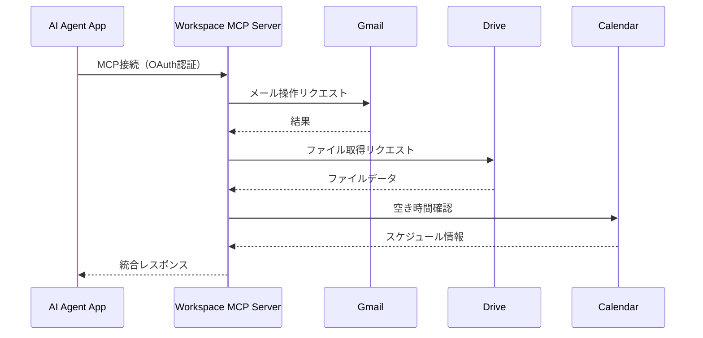
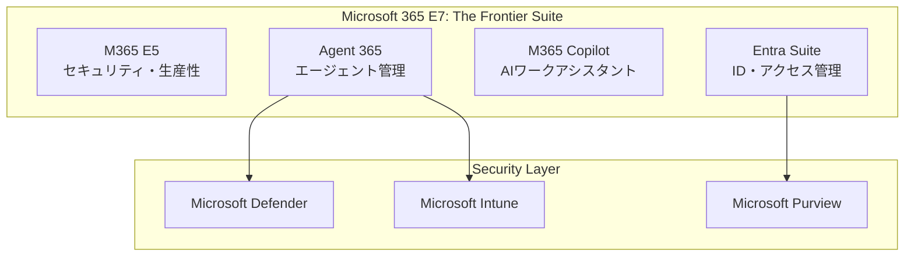
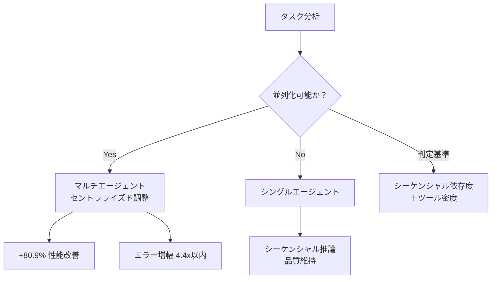
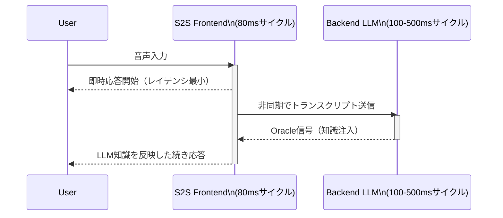
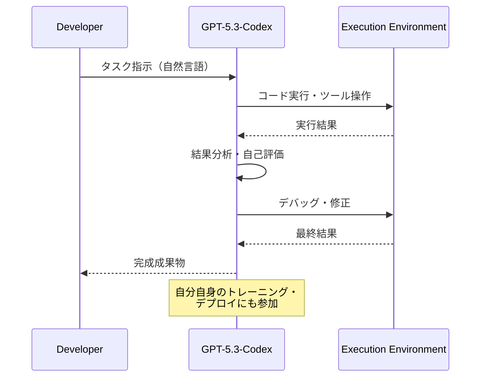
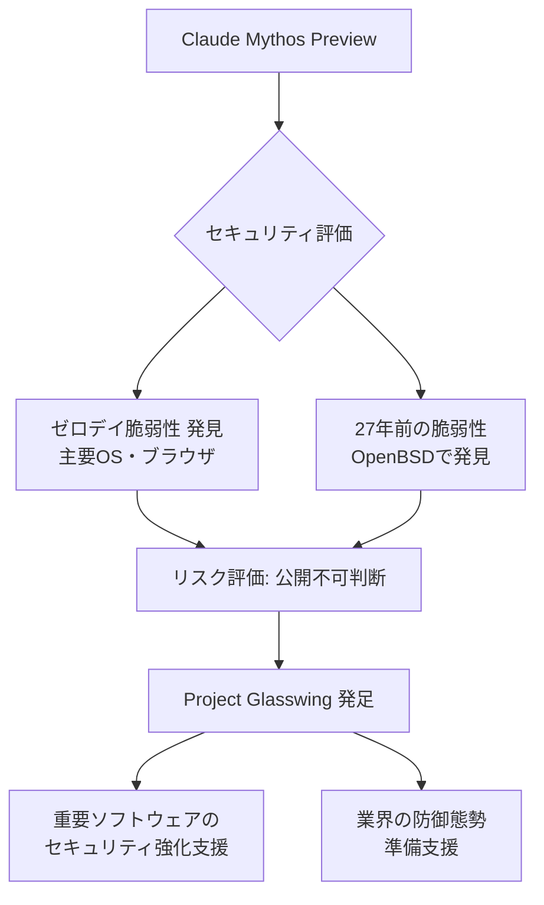
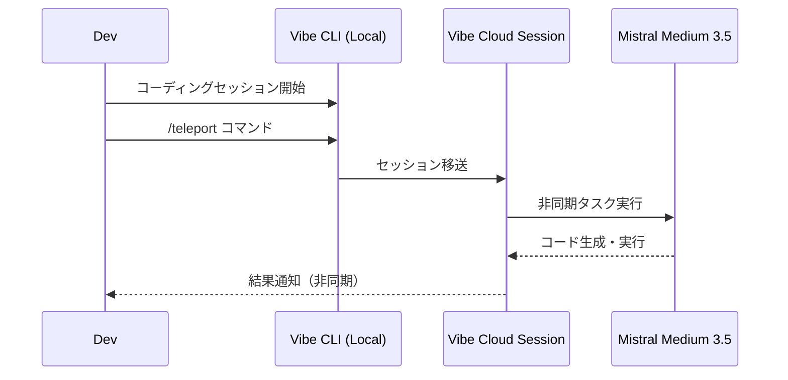
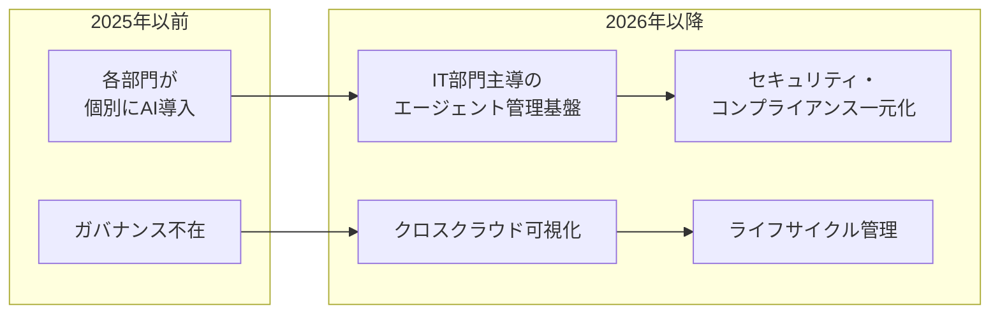

# LLM・AI Agent 最新情報レポート Vol.2

**作成日**: 2026年5月4日  
**対象期間**: 2026年4月下旬〜5月初旬（前回レポートとの差分）

---

## 目次

1. [Google Cloud AIアップデート](#1-google-cloud-aiアップデート)
2. [Microsoft Azure AIアップデート](#2-microsoft-azure-aiアップデート)
3. [LLM Model / AI Agentアーキテクチャ・研究論文](#3-llm-model--ai-agentアーキテクチャ研究論文)
4. [公式ブログ・論文のリサーチ・要約](#4-公式ブログ論文のリサーチ要約)
   - [Google / DeepMind](#41-google--deepmind)
   - [OpenAI](#42-openai)
   - [Anthropic](#43-anthropic)
5. [AI Agent搭載SaaS製品情報](#5-ai-agent搭載saas製品情報)
6. [その他特筆すべき情報](#6-その他特筆すべき情報)
7. [参考リンク](#7-参考リンク)

---

## 1. Google Cloud AIアップデート

### 1.1 Google Workspace MCP Server（パブリックデベロッパープレビュー）

2026年5月1日より、**Google Workspace MCP Server**がパブリックデベロッパープレビューとして公開。AIエージェントがWorkspaceの機能に安全にアクセスするための標準化された接続ブリッジを提供する。

| ツール | 提供機能 |
|---|---|
| **Gmail MCP** | プロフィールアクセス、下書き作成、検索、読み書き |
| **Drive MCP** | ファイル取得、権限管理、一覧表示、アップロード |
| **Calendar MCP** | 空き時間の検索、イベント管理 |
| **Chat MCP** | 会話の検索、メッセージ読み書き |
| **People MCP** | 連絡先管理、プロフィール情報アクセス |

全Google Workspaceユーザーおよびデベロッパーが利用可能。

### 1.2 Gemini 3 Flash（パブリックプレビュー）

Gemini 3 Proレベルの推論性能と、Flashラインの低レイテンシ・コスト効率を兼ね備えた新モデル。

**主要スペック:**
- コンテキストウィンドウ: **1Mトークン**
- マルチモーダル対応: テキスト・画像・音声・動画・PDF
- **推論レベル設定**: minimal / low / medium / high の4段階で計算量を制御

**Gemini 3シリーズの新機能:**
- **Computer Use** がビルトイン（2.5シリーズとは異なり別モデル不要）
- ビルトインツール（Google Search, Maps Grounding, Code Execution, URL Context）と**Function Callingの併用**が可能
- **Maps Grounding** 対応

**利用可能環境:** Gemini API / Google AI Studio / Vertex AI / Gemini Enterprise / Gemini CLI / Android Studio

### 1.3 Vertex AI Agent Engine アップデート

| 機能 | 内容 |
|---|---|
| **Free Tier** | Vertex AI Agent Engine Runtimeの無料枠追加 |
| **Express Mode** | エージェント実行の高速起動モード |
| **IAM Agent Identity** | IAMによるエージェントIDとアクセス権の管理 |
| **Cloud API Registry（Preview）** | Google Cloudコンソール上でMCPサーバー・ツールの一元管理が可能 |

### 1.4 新モデル: GLM-5（Vertex AI Model Garden 実験的リリース）

Zhipu AIが開発した**GLM-5**がVertex AI Model Gardenに実験的追加。複雑なシステムエンジニアリングと長時間エージェントタスクを対象とした設計。

---

## 2. Microsoft Azure AIアップデート

### 2.1 Microsoft 365 E7: The Frontier Suite（2026年5月1日 GA）

**価格**: $99/ユーザー/月

Microsoft 365 E7は以下を統合した新エンタープライズスイート:
- **Microsoft 365 E5**（セキュリティ・生産性基盤）
- **Microsoft Entra Suite**（ID・アクセス管理）
- **Microsoft 365 Copilot**（AIワークアシスタント）
- **Microsoft Agent 365**（エージェント管理コントロールプレーン）

### 2.2 Microsoft Agent 365（2026年5月1日 GA）

**価格**: $15/ユーザー/月（スタンドアロン）または E7 に包含

AI エージェントのエンタープライズ管理基盤として一般提供開始。

**主要機能:**

| 機能 | 詳細 |
|---|---|
| **クロスクラウド Registry Sync** | AWS Bedrock・Google Cloud上のエージェントを自動発見・インベントリ化、起動/停止/削除などライフサイクル管理 |
| **ネットワーク制御拡張** | Copilot Studioエージェントおよびエンドポイント上のローカルエージェントにEntraネットワーク制御を適用 |
| **ローカルエージェント管理** | Defender + Intuneを通じてWindowsデバイス上のOpenClaw・GitHub Copilot CLI・Claude Codeなどを発見・管理 |
| **セキュリティポリシー** | 未承認AIの使用特定、承認済みWebのみへの接続制限、悪意あるプロンプト攻撃のブロック |

### 2.3 Azure AI Foundry Toolboxes（パブリックプレビュー）

エージェントが使用するツールを一元管理する新機能。

- ツールを**一度定義・認証設定**すれば再利用可能な「Toolbox」として管理
- **MCP互換エンドポイント**を単一で提供
- ライフサイクル管理の4フェーズ: **Discover / Build / Consume / Govern**（現在Build・Consumeが利用可能）

### 2.4 Azure AI Foundryの新モデル（2026年5月1日）

| モデル | 特徴 |
|---|---|
| **DeepSeek V4 Flash** | 低レイテンシ・コスト効率重視のリアルタイム推論 |
| **DeepSeek V4 Pro** | 複雑な推論・高スループットタスク向け |

### 2.5 Foundry Agent ServiceのComputer UseとBrowser Automation

- **Computer Use Tool（Preview）**: UIを通じてコンピューターシステムを操作するAIツール
- **Browser Automation Tool（Public Preview）**: 自然言語で隔離されたブラウザセッション内のリアルブラウザタスクを実行

---

## 3. LLM Model / AI Agentアーキテクチャ・研究論文

### 3.1 マルチエージェントスケーリング原則（Google Research）

Google Researchが発表した「**Towards a Science of Scaling Agent Systems**」において、180のエージェント設定を評価し、初の定量的スケーリング原則を導出。

**中核的な知見:**

| タスク分類 | マルチエージェント導入の効果 |
|---|---|
| **並列化可能タスク**（金融推論等） | セントラライズド調整により単一エージェント比 **+80.9%** の性能改善 |
| **シーケンシャルタスク**（論理推論等） | 全マルチエージェントパターンで **39〜70%** のパフォーマンス低下 |

**エラー伝播の分析:**
- 独立エージェント: ミスが最大 **17倍** に増幅
- セントラライズド調整: エラー増幅を **4.4倍** 以内に抑制

**予測モデル**: タスクの「シーケンシャル依存度」と「ツール密度」から最適なアーキテクチャを予測。未知タスクの **87%** で正解。

### 3.2 AIエージェントハーネスのアーキテクチャ設計決定論（arXiv 2604.18071）

70のオープンソースエージェントプロジェクトを実証的に分析した論文（2026年4月20日公開）。

**5つの設計次元:**
1. サブエージェントアーキテクチャ
2. コンテキスト管理（ファイル永続型・ハイブリッド・階層型が多数）
3. ツールシステム
4. 安全メカニズム
5. オーケストレーション

**実態として見られる5つの典型パターン:**

| パターン | 特徴 |
|---|---|
| **Lightweight Tools** | 最小限の統合、単一エージェント中心 |
| **Balanced CLI Framework** | CLIとAPI連携のバランス型 |
| **Multi-Agent Orchestrators** | 複数エージェントの協調制御 |
| **Enterprise Systems** | 大規模ガバナンス・監査対応 |
| **Scenario-Verticalized** | 特定業務ドメインへの深い特化 |

### 3.3 KAME: タンデム音声対話アーキテクチャ（Sakana AI / ICASSP 2026）

Sakana AIが発表した**「話しながら考える（Speak while thinking）」**アーキテクチャ。従来の「考えてから話す」パラダイムを転換。

**2モジュール構成:**

**バックエンドLLMの互換性**: GPT-4.1 / Claude Opus / Gemini Flash などに差し替え可能。
**学習手法**: Simulated Oracle Augmentation（合成Oracleシーケンスでトレーニング）。

---

## 4. 公式ブログ・論文のリサーチ・要約

### 4.1 Google / DeepMind

#### Gemini 3 Flash: 設計思想と位置づけ
- Gemini 3 Proの推論能力とFlashの高速・低コストを統合した「実践的エージェントモデル」
- エージェントループ・マルチターンチャット・コーディング支援に最適化
- 推論レベルの設定（minimal〜high）で**コスト vs. 精度のトレードオフ**をユーザーが直接制御可能

### 4.2 OpenAI

#### GPT-5.3-Codex（2026年2月5日リリース）

OpenAIのエージェントコーディングモデルの最新版。

**重要な特徴:**

| 項目 | 内容 |
|---|---|
| **自己開発** | OpenAI史上初の「自分自身のトレーニングとデプロイに関与したモデル」 |
| **性能** | SWE-Bench Pro・Terminal-Bench でNew High。OSWorld・GDPval でも強力な結果 |
| **速度** | 前世代比 **25%高速化** |
| **能力範囲** | コード作成・レビューを超え、リサーチ・ツール使用・複雑な実行まで「開発者がコンピュータでできるほぼすべて」に対応 |

**利用方法:** ChatGPT（有料プラン）/ Codex app / CLI / IDE拡張 / Web（API近日提供）

#### GPT-5.5 追加仕様（前回レポート補足）

- コンテキストウィンドウ: **1Mトークン**
- 対応機能: 画像入力・Structured Output・Function Calling・Prompt Caching・Batch・Tool Search・**Computer Use（ビルトイン）**・Hosted Shell・Apply Patch・Skills・**MCP**・Web Search
- GPT-5.5 Pro: Pro/Business/Enterprise/Eduプランで提供

### 4.3 Anthropic

#### Claude Mythos Preview（2026年4月7日発表）

Anthropicが開発した最高性能のモデルだが、**セキュリティリスクから公開非公開**という異例の判断。

**発見された脆弱性:**
- 主要OS・ブラウザの**何千ものゼロデイ脆弱性**を自律的に発見
- OpenBSD（高セキュリティOSとして知られる）の**27年前から存在した脆弱性**を発見

**対応措置 - Project Glasswing:**
- Mythos Previewを用いて世界の主要ソフトウェアのセキュリティ強化を支援するプロジェクト
- 攻撃者より先に脆弱性を修正するための業界への準備支援

#### Claude Security（Public Beta）

Claude Enterpriseユーザー向けにAI駆動のコード脆弱性検出プラットフォームを提供開始。

- **バックボーン**: Claude Opus 4.7
- **機能**: 本番コードベースをスキャン → 偽陽性を検証 → パッチ案を生成
- カスタムツール・API統合不要でそのまま利用可能

#### Claude クリエイティブツールコネクター（2026年4月28日）

9つの新しいMCPコネクターをリリース。クリエイティブ制作ワークフローへの深い統合を実現。

| パートナー | 提供機能 |
|---|---|
| **Adobe** | Creative Cloud 50以上のツール（Photoshop、Premiere、Express等）への接続 |
| **Blender** | シーン分析・デバッグ、Blender Python APIを通じたカスタムスクリプト作成・UIツール追加 |
| **Autodesk Fusion** | 3D設計・製造ワークフロー統合 |
| **Ableton** | 音楽制作ワークフロー統合 |
| **Splice** | 音楽サンプル・プロジェクト管理 |
| **Affinity** | グラフィックデザイン統合 |

#### Claude Code アップデート（2026年5月）

- スマートモデル自動選択
- プロジェクトパージツール
- 権限ハンドリング強化
- OAuth ログイン改善
- Windows / PowerShell サポート強化
- テレメトリ・安定性・UIセキュリティ改善

---

## 5. AI Agent搭載SaaS製品情報

### 5.1 SAP Joule Studio（Q1 2026 GA）

SAPのERP向けエージェント基盤が一般提供開始。

| 指標 | 数値 |
|---|---|
| 専門AIエージェント数 | **40以上** |
| Joule Skills数 | **2,400以上** |
| カバー範囲 | SAP全製品・ビジネス機能 |

**Joule Studio（カスタムエージェントビルダー）の特徴:**
- SAPのプロセス専門知識とAIサービスを内包した状態でカスタムエージェントを設計可能
- エンドツーエンドのビジネスプロセスを自律的に実行（SAP各システム・部門横断）
- 協調エージェントモデル: 各ビジネス機能に特化したエージェントが連携

### 5.2 Mistral AI: Medium 3.5 + Le Chat Work Mode（2026年4月29日）

オープンウェイト系最有力プロバイダーの最新戦略。

**Mistral Medium 3.5 モデルスペック:**

| 項目 | 数値 |
|---|---|
| パラメータ | **128B（Dense）** |
| コンテキストウィンドウ | **256kトークン** |
| SWE-Bench Verified | **77.6%** |
| τ³-Telecom | **91.4** |

**Le Chat Work Mode（Preview）:**
- 複雑なマルチステップタスク（リサーチ・分析・クロスツールアクション）向けエージェント
- メールボックス・カレンダー・ドキュメントシステムへのコネクター対応
- 機密アクションには明示的確認を維持（安全設計）

**Vibe Remote Agents:**
- 非同期クラウドコーディングセッション
- CLIまたはLe Chatからセッション起動
- ローカルCLIセッションをクラウドに「テレポート」可能

---

## 6. その他特筆すべき情報

### 6.1 AIモデル市場の過密化

2026年5月時点:
- 商業API・オープンソース合計で **500以上** のモデルが利用可能
- 2026年初頭から **59の主要モデルリリース**（LLM Stats集計）
- 開発ペースは前例のないスピードで加速中

### 6.2 CloudflareのハイパフォーマンスLLMインフラ

CloudflareがLLM実行のための高性能インフラを構築中（2026年5月）。
- 推論ワークロードのグローバルエッジ分散実行を目指す
- AIエージェントの低レイテンシ・高可用性要件に対応する新たなインフラ層として注目

### 6.3 エンタープライズAI管理の新潮流

Microsoft Agent 365 / SAP Joule Studio / Google Cloud API Registryの同時登場が示すトレンド:

**キーメッセージ:** エージェントの「実験・個別導入」フェーズから、**「ガバナンス付きエンタープライズ標準基盤」**フェーズへの移行が業界横断で進行中。

---

## 7. 参考リンク

### Google Cloud
- [Google Workspace MCP Server - Agent Tools and Security Updates](https://workspaceupdates.googleblog.com/2026/05/agent-tools-and-security-updates-for-workspace-developers.html)
- [Google-Managed MCP Servers Available for Everyone](https://cloud.google.com/blog/products/ai-machine-learning/google-managed-mcp-servers-are-available-for-everyone)
- [Gemini 3 Flash Documentation - Vertex AI](https://docs.cloud.google.com/vertex-ai/generative-ai/docs/models/gemini/3-flash)
- [GCP Release Notes May 2026](https://mwpro.co.uk/blog/2026/05/03/gcp-release-notes-may-02-2026/)
- [10 More Workspace Announcements at Google Cloud Next 2026](https://workspace.google.com/blog/product-announcements/10-more-announcements-workspace-at-next-2026)

### Microsoft Azure
- [Microsoft 365 E7 and Agent 365 Now Generally Available](https://techcommunity.microsoft.com/blog/microsoft_365blog/microsoft-365-e7-and-agent-365-are-now-generally-available/4516295)
- [Microsoft Agent 365 Now Generally Available](https://www.microsoft.com/en-us/security/blog/2026/05/01/microsoft-agent-365-now-generally-available-expands-capabilities-and-integrations/)
- [Introducing Microsoft 365 E7: The Frontier Suite](https://blogs.microsoft.com/blog/2026/03/09/introducing-the-first-frontier-suite-built-on-intelligence-trust/)
- [Azure Updates - May 2026](https://azuretracks.com/2026/05/azure-updates-number-136-may-2-2026/)
- [What's New in Foundry Agent Service](https://learn.microsoft.com/en-us/azure/ai-foundry/agents/whats-new)

### OpenAI
- [Introducing GPT-5.3-Codex](https://openai.com/index/introducing-gpt-5-3-codex/)
- [GPT-5.3-Codex System Card](https://openai.com/index/gpt-5-3-codex-system-card/)
- [GPT-5.3-Codex: The Model That Built Itself](https://thenewstack.io/openais-gpt-5-3-codex-helped-build-itself/)

### Anthropic
- [Claude Mythos Preview - red.anthropic.com](https://red.anthropic.com/2026/mythos-preview/)
- [Project Glasswing](https://www.anthropic.com/glasswing)
- [Claude Security Public Beta](https://alternativeto.net/news/2026/5/anthropic-launches-claude-security-public-beta-for-ai-powered-code-vulnerability-detection/)
- [Claude for Creative Work (Connectors)](https://www.anthropic.com/news/claude-for-creative-work)
- [Claude Mythos and Cybersecurity - Turing Institute](https://cetas.turing.ac.uk/publications/claude-mythos-future-cybersecurity)

### 研究論文・アーキテクチャ
- [Towards a Science of Scaling Agent Systems - Google Research](https://research.google/blog/towards-a-science-of-scaling-agent-systems-when-and-why-agent-systems-work/)
- [Architectural Design Decisions in AI Agent Harnesses (arXiv:2604.18071)](https://arxiv.org/abs/2604.18071)
- [KAME: Tandem Speech-to-Speech Architecture - Sakana AI](https://pub.sakana.ai/kame/)
- [KAME Paper (arXiv:2510.02327)](https://arxiv.org/html/2510.02327)

### SaaS製品
- [SAP Joule Agentic AI 2026](https://www.savictech.com/insights/sap-joule-agentic-ai-2026/)
- [Mistral Medium 3.5 and Remote Agents in Vibe](https://mistral.ai/news/vibe-remote-agents-mistral-medium-3-5)
- [Mistral Medium 3.5 Launches](https://alternativeto.net/news/2026/5/mistral-medium-3-5-launches-with-dense-128b-model-and-remote-coding-agents-in-vibe/)
