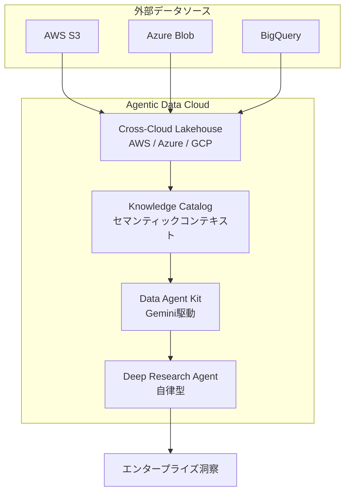
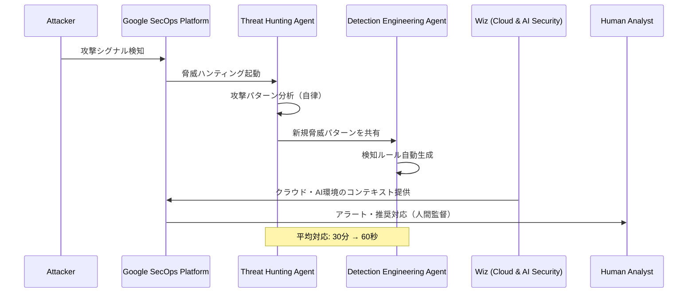
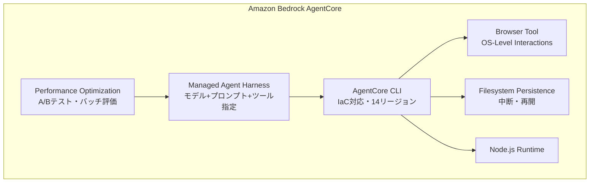
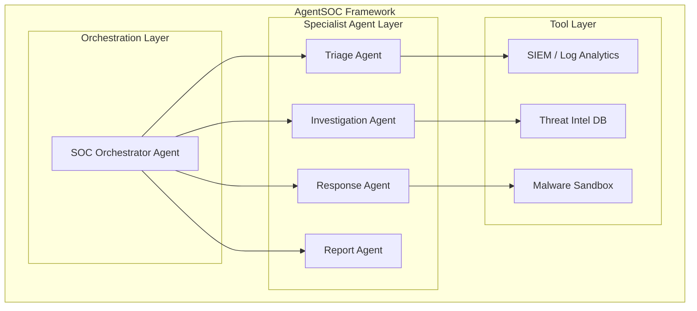
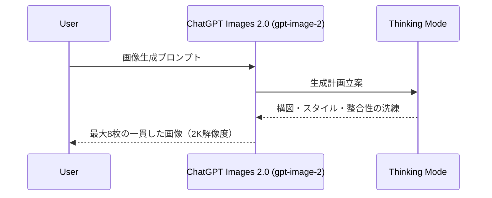
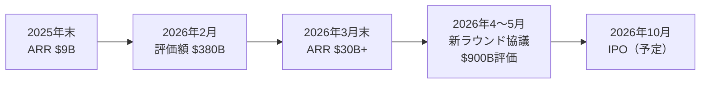
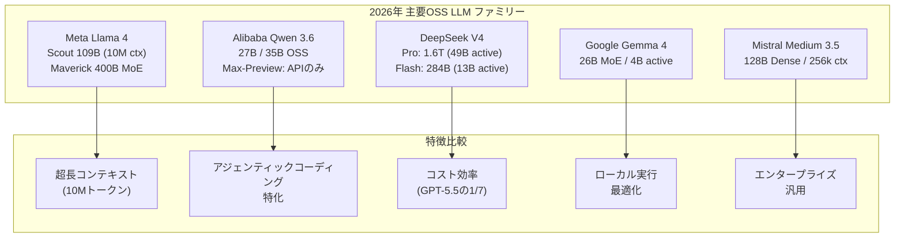
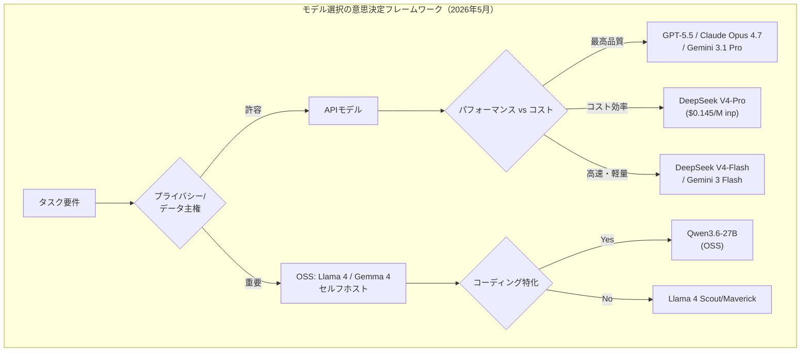

# LLM・AI Agent 最新情報レポート Vol.3

**作成日**: 2026年5月4日  
**対象期間**: 2026年4月下旬〜5月初旬（Vol.1・Vol.2との差分）

---

## 目次

1. [Google Cloud AIアップデート](#1-google-cloud-aiアップデート)
2. [AWS Amazon BedrockアップデートAIアップデート](#2-aws-amazon-bedrockアップデート)
3. [LLM Model / AI Agentアーキテクチャ・研究論文](#3-llm-model--ai-agentアーキテクチャ研究論文)
4. [公式ブログ・論文のリサーチ・要約](#4-公式ブログ論文のリサーチ要約)
   - [OpenAI](#41-openai)
   - [Anthropic](#42-anthropic)
5. [オープンソースモデル最新動向](#5-オープンソースモデル最新動向)
6. [AI Agent搭載SaaS・インフラ製品情報](#6-ai-agent搭載saasインフラ製品情報)
7. [その他特筆すべき情報](#7-その他特筆すべき情報)
8. [参考リンク](#8-参考リンク)

---

## 1. Google Cloud AIアップデート

### 1.1 Agentic Data Cloud

Google Cloud Next 2026で発表された**Agentic Data Cloud**は、エンタープライズのデータプラットフォームを静的リポジトリから動的推論エンジンへと進化させる新アーキテクチャ。

**主要コンポーネント:**

| コンポーネント | 概要 |
|---|---|
| **Cross-Cloud Lakehouse** | AWS・Azure横断でのゼロコピーアクセス対応AIネイティブデータレイク |
| **Knowledge Catalog** | エンタープライズ全体のセマンティックコンテキストでエージェントをグラウンディング |
| **Data Agent Kit** | Geminiを活用したデータサイエンス向けエージェント開発ツール |
| **Deep Research Agent** | データ横断の自律的インテリジェンスエージェント |



### 1.2 Google Cloud Security: AI駆動の自律的防御

Google Cloud Next 2026で、Wiz統合を中核としたAI駆動サイバーセキュリティ基盤を発表。

**3つの新セキュリティオペレーションエージェント（Google SecOps）:**

| エージェント | 状態 | 機能 |
|---|---|---|
| **Threat Hunting Agent** | プレビュー | 新たな攻撃パターン・ステルス型脅威の自律的プロアクティブハンティング |
| **Detection Engineering Agent** | プレビュー | カバレッジギャップの特定と新規検知ルールの自動生成 |
| **Third-Party Context Agent** | プレビュー | サードパーティ製品・ベンダーのコンテキスト情報を自動収集・統合 |

**Wiz統合の拡張:**
- 新規対応プラットフォーム: **AWS AgentCore**・**Gemini Enterprise Agent Platform**・**Microsoft Azure Copilot Studio**・**Salesforce Agentforce**・**Databricks**
- コードからクラウド、ランタイムまでマルチクラウド・ハイブリッド・AI環境をカバー

**成果指標:**
- Google Triage and Investigation Agent: **500万件以上のアラートを処理済み**
- 手作業30分の分析を**60秒**に短縮



**業界へのメッセージ（Google Cloud COO Francis deSouza）:**
> 「人間主導の防御戦略から、人間がループに入る防御戦略を経て、人間が監督するAI主導の防御戦略へと移行した」

### 1.3 Google Lyria 3 / Lyria 3 Pro（音楽生成モデル）

DeepMindが開発した高忠実度音楽生成モデル。2026年2月18日に初期リリース、Google Cloud Next 2026で開発者向け一般公開。

**モデルラインナップ:**

| モデル | 生成時間 | 主な用途 |
|---|---|---|
| **Lyria 3** | 最大30秒 | 高速プロトタイピング・SNS向けアセット・短尺音声生成 |
| **Lyria 3 Pro** | 最大3分 | イントロ・バース・コーラス・ブリッジなど構造を持つ完全楽曲生成 |

**主な特徴:**
- テキストプロンプト + **画像入力**（ムード・スタイル・雰囲気の指定）対応
- 全生成トラックに**SynthIDデジタルウォーターマーク**を埋め込み（改変後も検証可能）
- 音符から音符への自然な流れを持つ高忠実度音楽を生成

**提供環境:** Vertex AI / Google AI Studio / Gemini API / Google Vids / Gemini App / ProducerAI

---

## 2. AWS Amazon Bedrockアップデート

### 2.1 Amazon Bedrock AgentCore の大規模機能拡張（2026年4月〜5月）

AWSが**Amazon Bedrock AgentCore**に多数の新機能を追加。エージェントを「分で構築・デプロイ」できる環境を整備。

**主要新機能一覧:**

| 機能 | 発表日 | 概要 |
|---|---|---|
| **Managed Agent Harness（プレビュー）** | 2026年4月 | モデル・システムプロンプト・ツールを指定するだけでオーケストレーションコード不要でエージェント実行 |
| **AgentCore CLI** | 2026年4月 | IaC（Infrastructure as Code）ガバナンス付きエージェントデプロイ。14リージョン対応、追加料金なし |
| **Browser OS-Level Interactions** | 2026年4月8日 | OSレベルの操作が必要なブラウザワークフローを自動化 |
| **Filesystem Persistence** | 2026年4月 | ローカルセッション状態を外部化し、エージェントがタスク途中で一時停止・完全再開可能 |
| **Node.js Runtime サポート** | 2026年4月28日 | Pythonに加え、Node.jsでの直接コードデプロイが可能 |
| **Agent Performance Optimization** | 2026年4月30日 | バッチ評価・A/Bテストによる性能検証と推奨機能（プレビュー） |
| **サンパウロリージョン展開** | 2026年5月 | 南米でのデータレジデンシー要件対応 |



### 2.2 Amazon Bedrock: OpenAI モデル・Codex・Managed Agents（Limited Preview）

2026年4月発表。AWSがOpenAIのモデルをAmazon Bedrock上で提供開始（リミテッドプレビュー）。

- **OpenAIモデル**: Bedrockコンソールから直接利用可能
- **Codex**: エージェントコーディング機能をBedrockに統合
- **Managed Agents**: Anthropic Managed Agentsと同様の長時間エージェント基盤

### 2.3 Amazon Nova シリーズ

| モデル/サービス | 概要 |
|---|---|
| **Nova Act** | ブラウザ操作型AIエージェント。Nova 2 Liteをバックボーンとし、Webブラウザ上の高信頼性アクション実行 |
| **Nova Forge SDK** | Nova モデルのファインチューニング・カスタマイズを簡素化 |
| **Nova 2 Lite** | 思考深度（Thinking）を調整可能なコスト効率の高い推論モデル |
| **S3 Vectors** | S3上でのネイティブベクトルストレージ（RAGアーキテクチャの簡素化） |

---

## 3. LLM Model / AI Agentアーキテクチャ・研究論文

### 3.1 Agentic Architect（arXiv: 2604.25083）

**「LLM駆動のコード進化×サイクル精度シミュレーション」**によるコンピュータアーキテクチャ設計探索フレームワーク。2026年4月28日公開。

**概要:**
- コンピュータアーキテクチャ（キャッシュ置換・ブランチ予測・プリフェッチ）の自動設計最適化
- 人間アーキテクトがシード設計・スコアリング関数・シミュレータインターフェースを指定
- LLMがその制約内で候補実装を探索・進化させる

**重要な知見:**
- シード設計の品質が探索結果の上限を規定する（進化は既存メカニズムの洗練・拡張は可能だが、弱い基盤は補えない）
- 各コンポーネントは既知の技術に対応。新規性は**それらを調整する仕組みとポリシー**
- 初のエンドツーエンドオープンソースなアジェンティックAIアーキテクチャ探索フレームワーク

### 3.2 AgentSOC: セキュリティオペレーション自動化（arXiv: 2604.20134）

セキュリティオペレーションセンター（SOC）の完全自動化を目指す**マルチレイヤーアジェンティックAIフレームワーク**。



### 3.3 Architecture Without Architects（arXiv: 2604.04990）

「AIコーディングエージェントはソフトウェアアーキテクチャをどう形成するか」を分析した論文。

**主な発見:**
- エージェントは短期的なタスク遂行を優先し、アーキテクチャ的な整合性を欠く傾向
- 人間アーキテクトが明示的に介入しない場合、エージェントはモノリシックな構造を生成しやすい
- アーキテクチャガイダンスをプロンプトに埋め込むことで品質が向上

---

## 4. 公式ブログ・論文のリサーチ・要約

### 4.1 OpenAI

#### ChatGPT Images 2.0（2026年4月21日）

OpenAI初の**ネイティブ推論機能搭載**画像生成モデル。APIモデルID: `gpt-image-2`

**主要スペック:**

| 項目 | 詳細 |
|---|---|
| **解像度** | 最大2K |
| **アスペクト比** | 3:1〜1:3まで柔軟対応 |
| **バッチ生成** | 単一プロンプトから**最大8枚**の一貫したキャラクター・オブジェクト描写 |
| **推論機能** | 生成前に計画・洗練を行う「Thinking」モード搭載 |
| **提供範囲** | 全ChatGPTプラン（Free含む）+ OpenAI API |



#### GPT-5.3 Instant Mini

GPT-5 Instant Miniの後継として投入された新フォールバックモデル。

- **目的**: GPT-5.3 Instantのレートリミット到達後に切り替わるフォールバック
- **改善点**: 前世代比でより自然な会話、ライティング品質・文脈理解の向上

### 4.2 Anthropic

#### Anthropic 資金調達・IPO動向（2026年4月〜5月）

AnthropicのビジネスはAI業界で最も急成長している企業の1つとして注目を集めている。

**財務指標:**

| 指標 | 数値 | 時期 |
|---|---|---|
| ARR | $9B | 2025年末 |
| ARR | **$30B+** | 2026年3月末 |
| 最終調達ラウンド評価額 | $380B | 2026年2月 |
| 新ラウンド想定評価額 | **$850B〜$900B** | 2026年4月〜5月 |
| 新ラウンド調達額 | **$40B〜$50B** | 2026年5月以降（予定） |
| IPO予定 | **2026年10月**（報道） | — |

**背景:**
- OpenAIが2026年初頭に$852B評価額で$122Bを調達したことがAnthropicの評価額算定の参考基準に
- 今回のラウンドはIPO前の最終プライベートラウンドと見られている
- VCから$800B評価額での投資オファーを複数受領済み



---

## 5. オープンソースモデル最新動向

### 5.1 DeepSeek V4（2026年4月24日）

DeepSeekの最新モデルファミリー。**2バリアント、1Mトークンコンテキスト対応。**

| モデル | パラメータ | Active params | コンテキスト |
|---|---|---|---|
| **DeepSeek V4-Pro** | 1.6T（MoE） | 49B | 1Mトークン |
| **DeepSeek V4-Flash** | 284B（MoE） | 13B | 1Mトークン |

**ベンチマーク（V4-Pro）:**

| ベンチマーク | スコア | 比較 |
|---|---|---|
| Codeforces Rating | **3,206** | GPT-5.4（3,168）を上回る |
| SWE-bench Verified | **80.6%** | Claude Opus 4.6（80.8%）とほぼ同等 |
| MMLU-Pro | **87.5** | オープンモデルトップクラス |
| GPQA Diamond | **90.1** | — |
| LiveCodeBench | **93.5** | — |

**コスト優位性（V4-Pro）:**
- 入力: $0.145/Mトークン（GPT-5.5・Claude Opus 4.7の約**1/7**）
- 出力: $1.74/Mトークン（約**1/6**）

### 5.2 Alibaba Qwen 3.6シリーズ（2026年4月）

**Qwen3.6-Max-Preview（2026年4月20日）:** アジェンティックコーディング6ベンチマーク同時1位を達成した旗艦モデル。

**主要ベンチマーク1位達成:**
- SWE-bench Pro
- Terminal-Bench 2.0
- SkillsBench
- SciCode
- QwenClawBench
- QwenWebBench

**注目点:** Alibaba初の**オープンウェイトなし**モデル（Alibaba Cloud Model Studio APIのみで提供）

**Qwen3.6-27B（2026年4月18日）:** フルオープン、Apache 2.0ライセンス。397Bの前世代を上回るアジェンティックコーディング性能。

**Qwen3.5との比較:**

| | Qwen3.5-122B-A10B | Qwen3.6-Max-Preview |
|---|---|---|
| **公開方式** | OSS（Apache 2.0） | APIのみ（クローズド） |
| **パラメータ** | 122B（10B active） | 非公開 |
| **目標** | ローカル実行・汎用 | アジェンティックコーディング特化 |

### 5.3 Google Gemma 4（2026年）

Googleの軽量ローカル実行向け最新モデル。

- **アーキテクチャ**: MoE（Mixture-of-Experts）
- **総パラメータ**: 26B
- **アクティブパラメータ**: 4B/トークン
- **推論速度**: コンシューマーハードウェアで**85トークン/秒**
- **特徴**: フロンティアレベルの知能をコンパクトなパッケージで実現

### 5.4 2026年オープンソースモデル全体の状況



**市場の注目点:**
- Alibaba（Qwen3.6-Max-Preview）とDeepSeek（V4-Pro）が相次いでアジェンティックコーディングベンチマークで首位を競い合う構図
- Alibaba初の「クローズドウェイト」フラグシップはオープンソース戦略の転換を示唆

---

## 6. AI Agent搭載SaaS・インフラ製品情報

### 6.1 Stripe Link: AI エージェント向け決済ウォレット（2026年4月30日）

Stripeの年次カンファレンス**Sessions 2026**で発表。AIエージェントがユーザーに代わって安全に決済を実行できるインフラ。

**仕組み（OAuthベースフロー）:**

```mermaid
sequenceDiagram
    participant User
    participant Agent as AI Agent
    participant Link as Stripe Link
    participant Merchant

    User->>Link: カード/銀行/暗号資産を登録
    User->>Agent: 購入・予約タスクを依頼
    Agent->>Link: OAuth認証でアクセスリクエスト
    Link->>User: 支出承認を要求（明細付き）
    User-->>Link: 承認
    Link->>Agent: ワンタイムカード or SPT（Shared Payment Token）発行
    Agent->>Merchant: 決済実行
    Merchant-->>User: 完了通知
```

**主な特徴:**
- **対応決済手段**: クレジットカード・銀行口座・暗号資産ウォレット・BNPL
- **セキュリティ**: エージェントに基礎となる決済情報を直接渡さず、ワンタイムカードまたはSPTを発行
- **将来計画**: ユーザーが設定できる支出上限、事前承認不要のエージェント権限設定、ステーブルコイン対応

**Stripe Sessions 2026: 288のローンチ**:
- AI経済インフラ全体の整備を目指し、エージェント対応機能を大規模に拡充

### 6.2 amazee.ai: amazeeClaw（Managed OpenClaw Hosting）

開発者・エンタープライズ向けの**OpenClawマネージドホスティングプラットフォーム**。

- **データ主権対応**: リージョナルコントロールで自社データの管理権を維持
- **迅速デプロイ**: AI エージェントを素早く展開できる環境を提供
- **対象**: OpenClawを利用するエンタープライズのセルフホスト不要化

---

## 7. その他特筆すべき情報

### 7.1 AIモデル市場の競争激化と商業戦略

2026年5月時点での市場動向:

| 指標 | 数値 |
|---|---|
| 利用可能モデル総数（商業API + OSS） | **500以上** |
| 2026年初頭からの主要モデルリリース数 | **59件以上** |

**クローズドウェイト化の潮流:**
- Alibaba（Qwen3.6-Max-Preview）がAPI専用のクローズドモデルを初投入
- Meta（Muse Spark）が一部モデルでプロプライエタリ化をテスト（Vol.1既報）
- オープンソース優位のナラティブが変化しつつある

### 7.2 セキュリティ脅威の深刻化とAI防御の必要性

Google Cloud Next 2026で示された数値:
- **脅威アクターの動作変化**: 初期アクセスから二次脅威アクターへの引き渡し時間が**8時間→22秒**（3年間で激変）
- **AI活用の現状**: 企業のAIエージェント導入者のうち**46%**がサイバーセキュリティに活用

この速度差がAIによる自律防御を不可欠にしつつある。

### 7.3 エージェントのコスト構造と選択の複雑化

DeepSeek V4・Qwen 3.6の登場により、エンタープライズのLLM選択はより複雑化。



---

## 8. 参考リンク

### Google Cloud
- [What's New in the Agentic Data Cloud](https://cloud.google.com/blog/products/data-analytics/whats-new-in-the-agentic-data-cloud)
- [Next '26: Redefining security for the AI era with Google Cloud and Wiz](https://cloud.google.com/blog/products/identity-security/next26-redefining-security-for-the-ai-era-with-google-cloud-and-wiz)
- [Google Cloud Next 2026: Agentic AI to Become 'Operational Necessity' for Security](https://biztechmagazine.com/article/2026/04/google-cloud-next-2026-agentic-ai-become-operational-necessity-security)

### Google DeepMind / Lyria
- [Lyria 3 — Google DeepMind](https://deepmind.google/models/lyria/)
- [Lyria 3 and Lyria 3 Pro on Vertex AI](https://cloud.google.com/blog/products/ai-machine-learning/lyria-3-and-lyria-3-pro-on-vertex-ai)
- [Build with Lyria 3, our newest music generation model](https://blog.google/innovation-and-ai/technology/developers-tools/lyria-3-developers/)
- [Google launches Lyria 3 Pro music generation model - TechCrunch](https://techcrunch.com/2026/03/25/google-launches-lyria-3-pro-music-generation-model/)

### AWS Amazon Bedrock
- [Amazon Bedrock AgentCore adds new features to help developers build agents faster](https://aws.amazon.com/about-aws/whats-new/2026/04/agentcore-new-features-to-build-agents-faster/)
- [Amazon Bedrock now offers OpenAI models, Codex, and Managed Agents](https://aws.amazon.com/about-aws/whats-new/2026/04/bedrock-openai-models-codex-managed-agents/)
- [Amazon Bedrock AgentCore Browser adds OS-level interaction capabilities](https://aws.amazon.com/about-aws/whats-new/2026/04/agentcore-browser-os-actions/)
- [Get to your first working agent in minutes: Announcing new features in Amazon Bedrock AgentCore](https://aws.amazon.com/blogs/machine-learning/get-to-your-first-working-agent-in-minutes-announcing-new-features-in-amazon-bedrock-agentcore/)
- [AWS accelerates AI agent development in Amazon Bedrock AgentCore](https://siliconangle.com/2026/04/22/aws-accelerates-ai-agent-development-amazon-bedrock-agentcore/)

### OpenAI
- [Introducing ChatGPT Images 2.0](https://openai.com/index/introducing-chatgpt-images-2-0/)
- [ChatGPT Images 2.0: Full Developer Breakdown (2026)](https://www.buildfastwithai.com/blogs/chatgpt-images-2-0-gpt-image-2-2026)

### Anthropic
- [Anthropic Nears $50B Raise at Up to $900B Valuation Ahead of Potential IPO](https://theaiinsider.tech/2026/04/30/anthropic-nears-50b-raise-at-up-to-900b-valuation-ahead-of-potential-ipo/)
- [Sources: Anthropic could raise a new $50B round at a valuation of $900B - TechCrunch](https://techcrunch.com/2026/04/29/sources-anthropic-could-raise-a-new-50b-round-at-a-valuation-of-900b/)

### オープンソースモデル
- [DeepSeek V4 Preview Release](https://api-docs.deepseek.com/news/news260424)
- [DeepSeek V4 Complete Guide (2026)](https://codersera.com/blog/deepseek-v4-complete-guide-2026/)
- [Qwen3.6 Open Source Model Beats a 397B Giant](https://www.remio.ai/post/qwen3-6-open-source-model-beats-a-397b-giant-while-alibaba-quietly-closes-weights-on-its-flagshi)
- [Qwen 3.6 Series: Alibaba's Open-Source LLM Revolution in 2026](https://aimlapi.com/blog/qwen-3-6-series-alibabas-open-source-llm-revolution-in-2026)
- [Best Open-Source LLM in May 2026: Llama 4 vs Qwen 3.5 vs DeepSeek V4 vs Gemma 4 vs Mistral Medium 3.5](https://codersera.com/blog/best-open-source-llm-2026-llama-4-qwen-3-5-deepseek-v4-gemma-4-mistral/)

### 研究論文
- [Agentic Architect (arXiv:2604.25083)](https://arxiv.org/abs/2604.25083)
- [AgentSOC: A Multi-Layer Agentic AI Framework for Security Operations Automation (arXiv:2604.20134)](https://arxiv.org/abs/2604.20134)
- [Architecture Without Architects (arXiv:2604.04990)](https://arxiv.org/html/2604.04990v1)

### SaaS・インフラ
- [Stripe updates Link, a digital wallet that autonomous AI agents can use, too - TechCrunch](https://techcrunch.com/2026/04/30/stripe-link-digital-wallet-ai-agents-shopping/)
- [Giving agents the ability to pay - Stripe Blog](https://stripe.com/blog/giving-agents-the-ability-to-pay)
- [Stripe builds out the economic infrastructure for AI with 288 launches](https://stripe.com/newsroom/news/sessions-2026)
