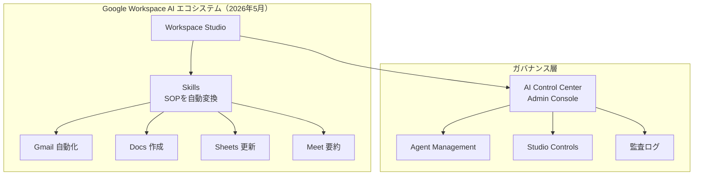
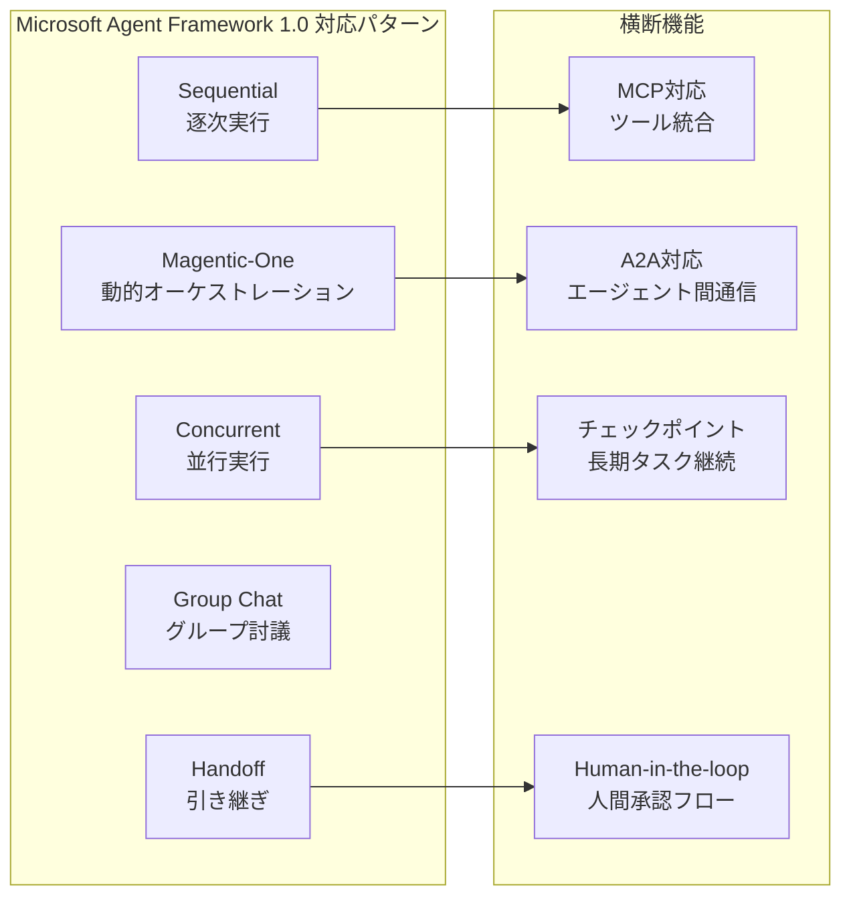
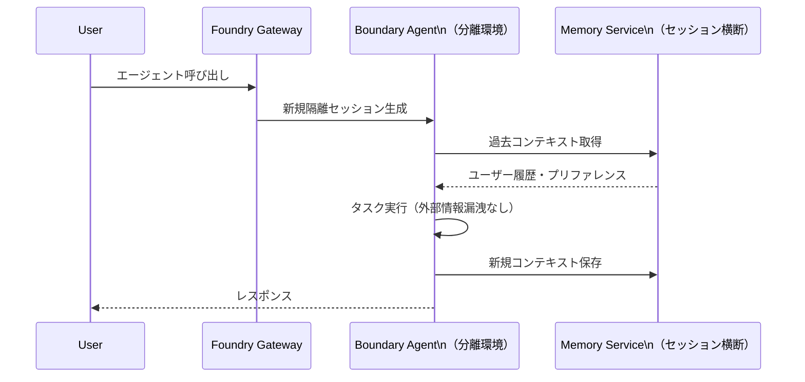
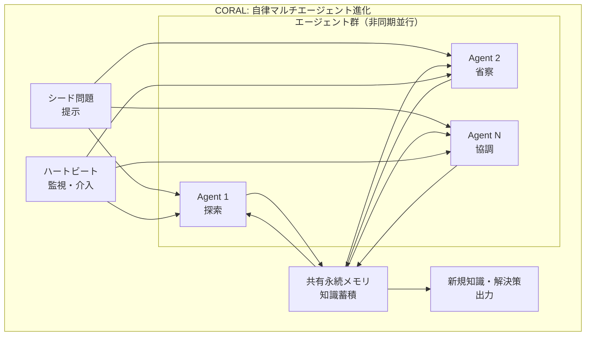
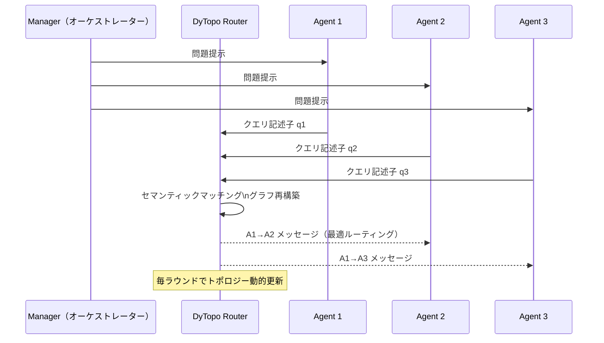
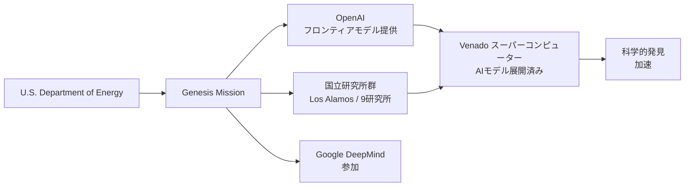
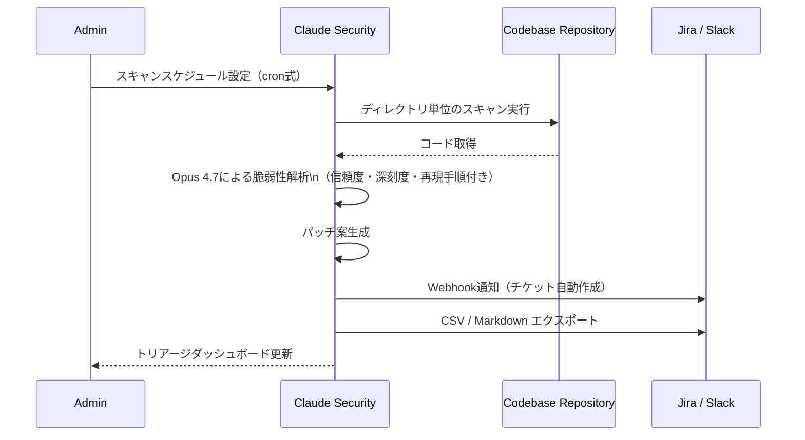
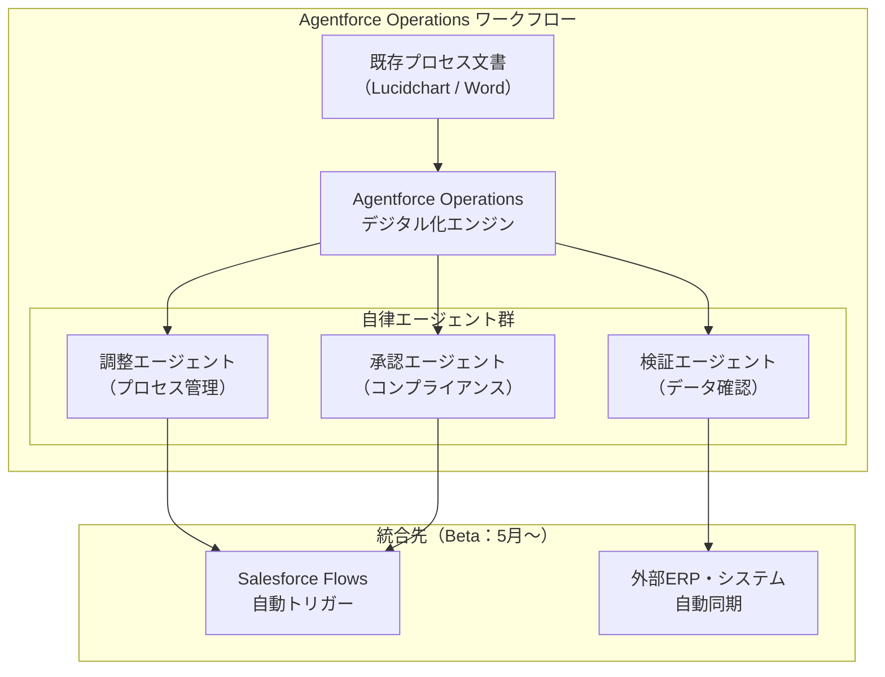
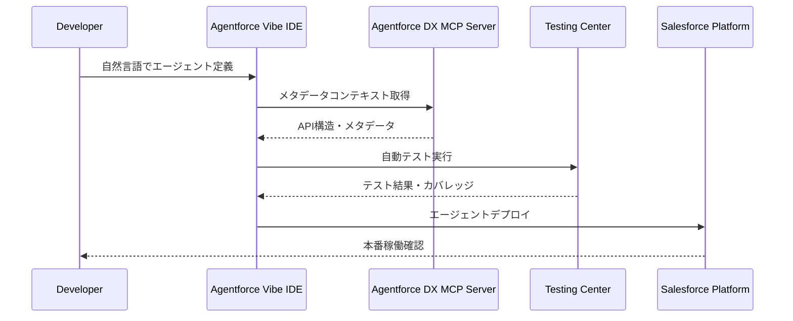
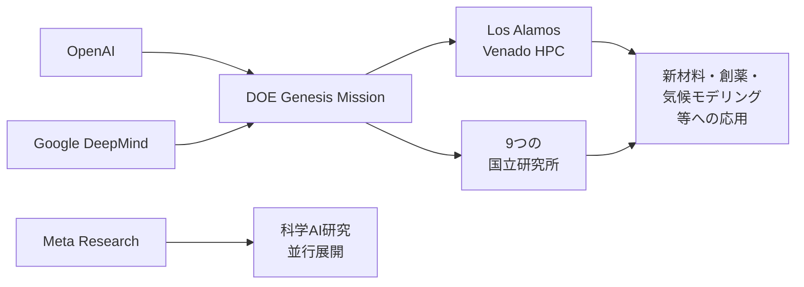

# LLM・AI Agent 最新情報レポート Vol.5

**作成日**: 2026年5月5日  
**対象期間**: 2026年5月初旬（Vol.1〜4との差分）

---

## 目次

1. [Google Cloud AIアップデート](#1-google-cloud-aiアップデート)
2. [Microsoft Azure AIアップデート](#2-microsoft-azure-aiアップデート)
3. [LLM Model / AI Agentアーキテクチャ・研究論文](#3-llm-model--ai-agentアーキテクチャ研究論文)
4. [公式ブログ・論文のリサーチ・要約](#4-公式ブログ論文のリサーチ要約)
   - [OpenAI](#41-openai)
   - [Anthropic](#42-anthropic)
5. [AI Agent搭載SaaS製品情報](#5-ai-agent搭載saas製品情報)
6. [その他特筆すべき情報](#6-その他特筆すべき情報)
7. [参考リンク](#7-参考リンク)

---

## 1. Google Cloud AIアップデート

### 1.1 Google Workspace AI Control Center（2026年5月4日 ロールアウト開始）

Google Cloudが**Workspace AI Control Center**をAdmin Console上に提供開始。エージェントのWorkspaceデータへのアクセスをガバナンス・監査するための新しい制御プレーン。

**主要機能:**

| 機能 | 内容 |
|---|---|
| **Agent Management** | Workspace Studio上のエージェントを一元的に発見・管理 |
| **Workspace Studio Controls** | 作成・共有済みエージェントへのアクセスをきめ細かく制御 |
| **AI Control Center** | 生成AIおよびエージェントアクションのWorkspaceデータアクセスを管理 |
| **監査ログ統合** | エージェントの全アクションをタイムスタンプ付きで追跡 |

**Workspace Studio Skills（同時展開）:**

Workspace Studioに**Skills**機能を追加。Geminiを使って標準業務手順（SOP）をSkillsに変換し、チーム全体でエージェント自動化を再利用可能な形で共有できる。

---

## 2. Microsoft Azure AIアップデート

### 2.1 Microsoft Agent Framework 1.0 GA（2026年4月3日）

Microsoft が **AutoGen** と **Semantic Kernel** を統合した**Microsoft Agent Framework 1.0**を一般提供（GA）。オープンソースで.NETおよびPython向けに公開された、エンタープライズ向けエージェント開発の新標準フレームワーク。

**アーキテクチャ概要:**

| 要素 | 内容 |
|---|---|
| **起源** | Semantic Kernel（エンタープライズ機能）+ AutoGen（マルチエージェント抽象化）を統合 |
| **状態管理** | セッションベースの状態管理、型安全性、ミドルウェア |
| **オーケストレーション** | グラフベースのマルチエージェントワークフロー（DAG対応） |
| **Protocol対応** | MCP（Model Context Protocol）・A2A（Agent-to-Agent）に対応 |
| **長期タスク** | ストリーミング・チェックポイント・Human-in-the-loop・一時停止/再開 |

**対応するマルチエージェントパターン:**

**移行戦略:** Semantic KernelおよびAutoGenは引き続きサポートされるが、投資はAgent Frameworkに集中。既存コードは`Kernel`/プラグインパターンを`Agent`/`Tool`抽象化に置き換えることで移行可能。

### 2.2 Foundry Agent Service: Boundary Agents（プレビュー）とメモリ機能（プレビュー）

Azure AI Foundry Agent Serviceに2つの新機能が追加（プレビュー段階）。

**Boundary Hosted Agents（プレビュー）:**
- 各エージェントセッションを**独立した分離環境**（Boundary）で実行
- セッション間の情報漏洩リスクをゼロに抑制
- マルチテナント・マルチクライアント環境での安全なエージェント実行を実現

**Memory（プレビュー）:**
- Foundry Agent Serviceに**「メモリ as a Service」**を追加
- エージェントがセッションをまたいで情報を保持・想起可能
- 長期的なユーザーコンテキストの維持とパーソナライゼーションを実現

---

## 3. LLM Model / AI Agentアーキテクチャ・研究論文

### 3.1 CORAL: 自律マルチエージェント進化フレームワーク（arXiv:2604.01658）

**論文タイトル:** "CORAL: Towards Autonomous Multi-Agent Evolution for Open-Ended Discovery"  
**公開日:** 2026年4月  
**機関:** Human-Agent-Society

**概要:** オープンエンドな発見タスクにおける自律マルチエージェント進化の**初のフレームワーク**。固定的な進化探索アルゴリズムを廃し、エージェント自身が探索・省察・協調を通じて進化する仕組みを提案。

**中核的なアーキテクチャ要素:**

| 要素 | 説明 |
|---|---|
| **共有永続メモリ** | 全エージェントが共有するメモリストアで知識を蓄積・参照 |
| **非同期マルチエージェント実行** | エージェントが独立して並行動作し、ブロッキングなしに協調 |
| **ハートビートベース介入** | 定期的なハートビートで停滞エージェントを検出・介入 |

**性能結果（10タスクで評価）:**
- 固定進化探索ベースライン比 **3〜10倍** の改善率
- **より少ない評価回数**で同等以上の探索成果

### 3.2 DyTopo: セマンティックマッチングによる動的マルチエージェントトポロジー（arXiv:2602.06039）

**論文タイトル:** "DyTopo: Dynamic Topology Routing for Multi-Agent Reasoning via Semantic Matching"  
**公開日:** 2026年2月

**課題:** 従来のマルチエージェントシステムは固定の通信トポロジーを採用しており、タスクの性質に応じた最適な情報経路を動的に構成できない。

**提案アプローチ:**
- 各推論ラウンドで**エージェント間のスパース有向通信グラフ**を再構築
- 各エージェントが**自然言語クエリ・キー記述子**を出力
- DyTopoがこれらをエンベッドし、**セマンティックマッチング**で最適なメッセージルーティングを決定

**実験結果:** コード生成・数学推論ベンチマーク × 4 LLMバックボーンで、最強ベースライン比平均 **+6.2** の性能向上

---

## 4. 公式ブログ・論文のリサーチ・要約

### 4.1 OpenAI

#### OpenAI × U.S. Department of Energy: Genesis Mission（2026年5月）

OpenAIが米国エネルギー省（DOE）との**協力覚書（MOU）**を締結し、AIを活用した科学的発見の加速を推進。

**概要:**

| 項目 | 内容 |
|---|---|
| **フレームワーク** | Genesis Mission（DOEが主導する産学政連携AI科学イニシアティブ） |
| **参加組織** | 24組織が協力協定を締結（Google DeepMindも参加） |
| **実績** | フロンティアモデルをLos Alamos国立研究所の**Venado**スーパーコンピューターに展開済み |
| **活動歴** | 「1,000 Scientists AI Jam」を通じ9つの国立研究所の科学者1,000人と協働 |
| **戦略的意図** | 「2026年を科学の年（Year of Science）と位置づけ、フロンティアモデル・計算資源・実研究環境のアクセスが科学的発見を加速する」 |

#### OpenAI Advanced Account Security（2026年5月4日）

高リスクユーザー向けのオプトイン型アカウントセキュリティ強化機能を提供開始。

**強化内容:**

| 施策 | 内容 |
|---|---|
| **フィッシング耐性サインイン** | パスキーベースの強化認証 |
| **リカバリコントロール強化** | 不正回復手続きへの防御 |
| **セッション短縮** | 自動的にセッション有効期間を短縮 |
| **ログインアラート** | 新規ログイン時の即時通知 |
| **学習自動除外** | セキュリティ強化ユーザーのデータは学習から自動除外 |

**義務化対象:** Trusted Access for Cyber（最高セキュリティ能力のモデルにアクセスする個人）は2026年6月1日より有効化が必須。

### 4.2 Anthropic

#### Claude Security Public Beta：パートナーエコシステム展開（2026年5月1日）

Vol.2でBasic機能を取り上げたClaude Securityが、テクノロジーパートナーとサービスパートナーを含む**包括的なエコシステム**を形成して本格展開。

**パートナー一覧:**

| カテゴリ | パートナー |
|---|---|
| **テクノロジーパートナー** | CrowdStrike（Falcon Platform統合）・Microsoft Security・Palo Alto Networks・SentinelOne・TrendAI・Wiz |
| **サービスパートナー** | Accenture・BCG・Deloitte・Infosys・PwC |

**CrowdStrike × Claude Opus 4.7（Project QuiltWorks）:**
CrowdStrikeはFalcon Platform全体とProject QuiltWorksにOpus 4.7を統合。脅威インテリジェンス分析・インシデント対応・脆弱性トリアージの自動化を実現。

**スケジュールスキャン機能（新規）:**

**主な新機能（Public Beta）:**

| 機能 | 詳細 |
|---|---|
| **スケジュールスキャン** | 継続的監視のための定期自動スキャン |
| **ディレクトリ単位スキャン** | 特定のリポジトリ・ディレクトリを狙い撃ちスキャン |
| **高度なトリアージ追跡** | 却下理由の記録付きでトリアージ結果を管理 |
| **エクスポート** | CSV・Markdownフォーマットでの出力 |
| **Webhook統合** | Slack・Jira等へのリアルタイムアラート |

---

## 5. AI Agent搭載SaaS製品情報

### 5.1 Salesforce Agentforce Operations（2026年4月29日 GA）

Salesforceが**Agentforce Operations**を一般提供開始。CRMや顧客向けエージェントを超え、**バックオフィス業務自動化**へAgentforceを拡張した戦略的製品。

**Regrello買収を基盤とした技術:**
- AI搭載の製造・サプライチェーン向けオペレーティングシステムであるRegrellaの技術を取り込み
- Lucidchartダイアグラム・Wordドキュメントをアップロードするだけで、既存プロセスをマルチステップワークフローにデジタル化

**業務削減効果:**

| 業務種別 | 改善効果 |
|---|---|
| 監査・オンボーディングのサイクルタイム | **50〜70%削減** |
| データ入力等の手作業 | **最大80%削減** |

**業界別ユースケース:**

| 業界 | エージェント自動化内容 |
|---|---|
| **製造** | 在庫確認・承認管理・サプライヤー横断調整 |
| **金融サービス** | 引受業務のデータ抽出・入力検証・情報収集 |
| **保険** | 請求受付・バリデーション・不備情報の収集 |

### 5.2 Salesforce Summer '26：Agentforce Developer Experience（DX）強化

Salesforce Summer '26リリースでAgentforce開発体験を大幅強化。

**主要新機能:**

| 機能 | 内容 |
|---|---|
| **Agentforce DX MCP Server** | 5つのMetadata API Context MCPツールを搭載。AIエージェントがSalesforceメタデータを高精度にクエリ可能 |
| **Agentforce Vibe IDE** | 自然言語でAgentforceエージェントを構築・テスト・デプロイできる次世代IDE |
| **Testing Center（GA）** | エージェントのEnd-to-Endテストを自動化する本番品質のテスト基盤 |
| **Flow Error自動修正（Beta）** | Agentforceが設計時フローのエラーとランタイム障害を診断・自動修正 |
| **Agentforce for Field Service** | フィールドサービス業務へのエージェント展開 |
| **Agentforce IT Service** | IT支援業務へのエージェント展開 |

---

## 6. その他特筆すべき情報

### 6.1 AIエージェント市場規模と採用予測

**Gartnerの重要予測（2026年）:**
- エンタープライズアプリケーションの**40%**にタスク特化型AIエージェントが搭載（現在は5%未満）
- AI Agentとして機能するアプリが主流になるまで残り数ヶ月

**市場規模（Fortune Business Insights）:**
- 2026年：**91億ドル**
- 2034年：**1,390億ドル**（CAGR 40.5%）

**Salesforce ARR マイルストーン:**
- AgentforceによりSalesforceはAI ARR **8億ドル**を達成（FY26 Q4）

### 6.2 AI in Science：2026年を「科学の年」へ

AIが純粋な科学的発見に活用される流れが急加速。OpenAI（DOE Genesis Mission）に加え、Google DeepMindも同プログラムに参加。

**背景:** 単なるプロダクティビティツールから、科学的発見そのものを担うAIへの役割転換が、2026年を境に本格的に進んでいる。政府・大学・産業界の「AI for Science」連携は今後の科学研究インフラの中核となる見込み。

### 6.3 エージェントガバナンスの標準化競争

2026年5月時点で、エージェントの安全な管理・監査を巡る標準化競争が活発化。

| プラットフォーム | ガバナンス機能 |
|---|---|
| **Microsoft Agent 365** | AWS Bedrock・GCPエージェントを横断してInventory化、Entraポリシー適用 |
| **Google Workspace AI Control Center** | Workspace Studioエージェントへのデータアクセスを細かく制御・監査 |
| **Salesforce Agentforce Operations** | Salesforce Flowsの監査証跡、プロセス単位の権限管理 |
| **Atlassian Jira AI Agents** | 既存パーミッション・ワークフロー・監査証跡内でエージェント動作を保証 |

**共通のトレンド:** エージェントが「誰が・何を・いつ・どのデータにアクセスしたか」を追跡可能にする**エージェント監査証跡**の整備が、エンタープライズAI導入の前提条件として定着しつつある。

---

## 7. 参考リンク

### Google Workspace
- [Google Workspace AI Control Center - Admin Console](https://workspaceupdates.googleblog.com/2026/05/google-workspace-updates-weekly-recap.html)
- [Workspace Studio Skills & 10 More Announcements](https://workspace.google.com/blog/product-announcements/10-more-announcements-workspace-at-next-2026)
- [Google Cloud Next 2026: AI agents, A2A protocol, Workspace Studio](https://thenextweb.com/news/google-cloud-next-ai-agents-agentic-era)

### Microsoft Azure
- [Microsoft Agent Framework 1.0 GA](https://devblogs.microsoft.com/agent-framework/microsoft-agent-framework-version-1-0/)
- [Introducing Microsoft Agent Framework - Foundry Blog](https://devblogs.microsoft.com/foundry/introducing-microsoft-agent-framework-the-open-source-engine-for-agentic-ai-apps/)
- [Foundry Agent Service GA: memory, Boundary agents](https://devblogs.microsoft.com/foundry/foundry-agent-service-ga/)
- [Azure May 2026: 7 Game-Changing Updates](https://www.hubsite365.com/en-ww/crm-pages/azure-update-1st-may-2026.htm)

### OpenAI
- [Deepening collaboration with the U.S. Department of Energy](https://openai.com/index/us-department-of-energy-collaboration/)
- [DOE Genesis Mission: 24 Organizations](https://www.energy.gov/articles/energy-department-announces-collaboration-agreements-24-organizations-advance-genesis)
- [OpenAI Advanced Account Security](https://openai.com/news/)

### Anthropic
- [Claude Security is now in public beta](https://claude.com/blog/claude-security-public-beta)
- [Claude Security public beta - Help Net Security](https://www.helpnetsecurity.com/2026/05/04/anthropic-claude-security-public-beta/)
- [CrowdStrike × Claude Opus 4.7（Falcon Platform + Project QuiltWorks）](https://www.crowdstrike.com/en-us/press-releases/crowdstrike-puts-claude-opus-4-7-to-work-across-falcon-platform-project-quiltworks/)

### SaaS製品
- [Salesforce Launches Agentforce Operations](https://www.salesforce.com/news/stories/agentforce-operations-announcement/)
- [Salesforce Agentforce Operations: Back-Office Automation Details](https://siliconangle.com/2026/04/29/salesforce-introduces-agentforce-operations-automate-outdated-back-office-tasks/)
- [Salesforce Summer '26 Release: Agentforce DX MCP Server, Vibe IDE](https://automationchampion.com/2026/04/29/salesforce-summer26-release-quick-summary-2/)

### 研究論文
- [CORAL: Towards Autonomous Multi-Agent Evolution for Open-Ended Discovery (arXiv:2604.01658)](https://arxiv.org/abs/2604.01658)
- [DyTopo: Dynamic Topology Routing for Multi-Agent Reasoning (arXiv:2602.06039)](https://arxiv.org/abs/2602.06039)
- [AI Agent Systems: Architectures, Applications, and Evaluation (arXiv:2601.01743)](https://arxiv.org/abs/2601.01743)

### 市場データ
- [AI and the SaaS industry in 2026 - BetterCloud](https://www.bettercloud.com/monitor/saas-industry/)
- [The Future of AI Agents: Top Predictions 2026 - Salesforce](https://www.salesforce.com/uk/news/stories/the-future-of-ai-agents-top-predictions-trends-to-watch-in-2026/)
- [Agentforce ARR $800M - Agentforce 360 Announcements](https://www.salesforce.com/agentforce/what-is-new/)
