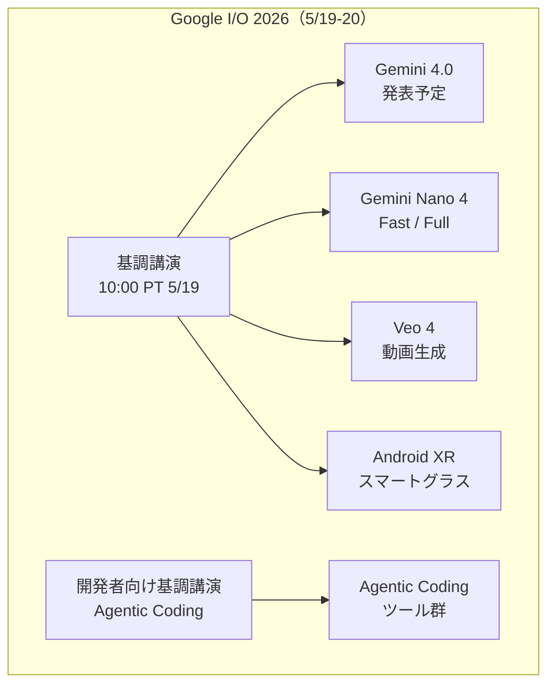
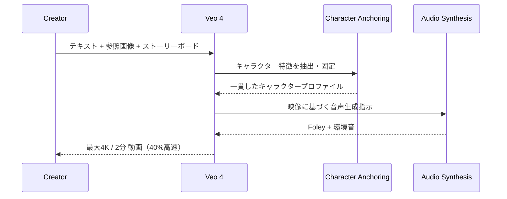
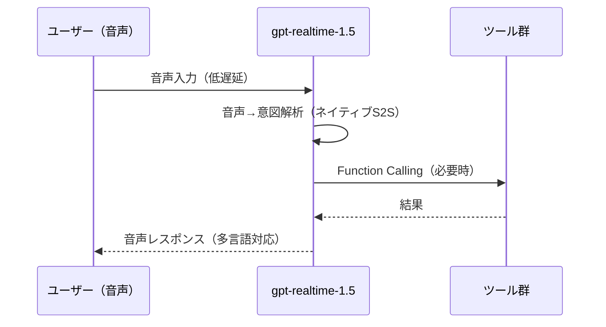
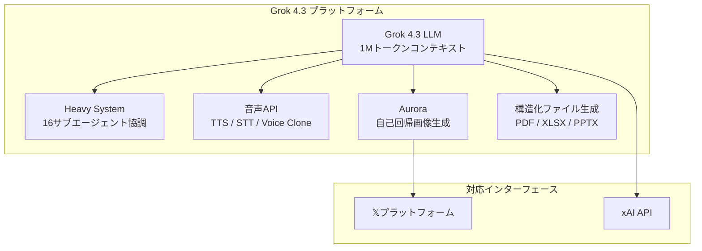
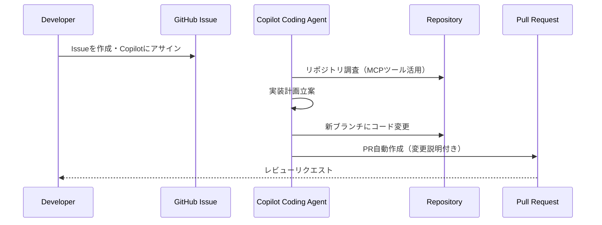
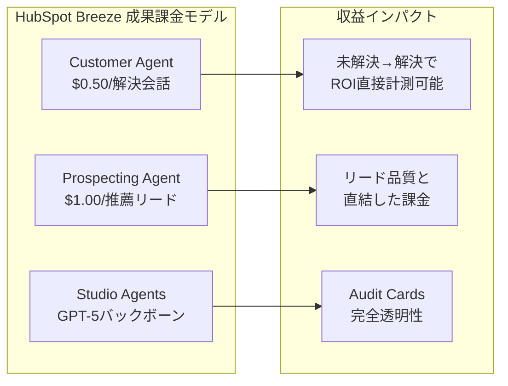
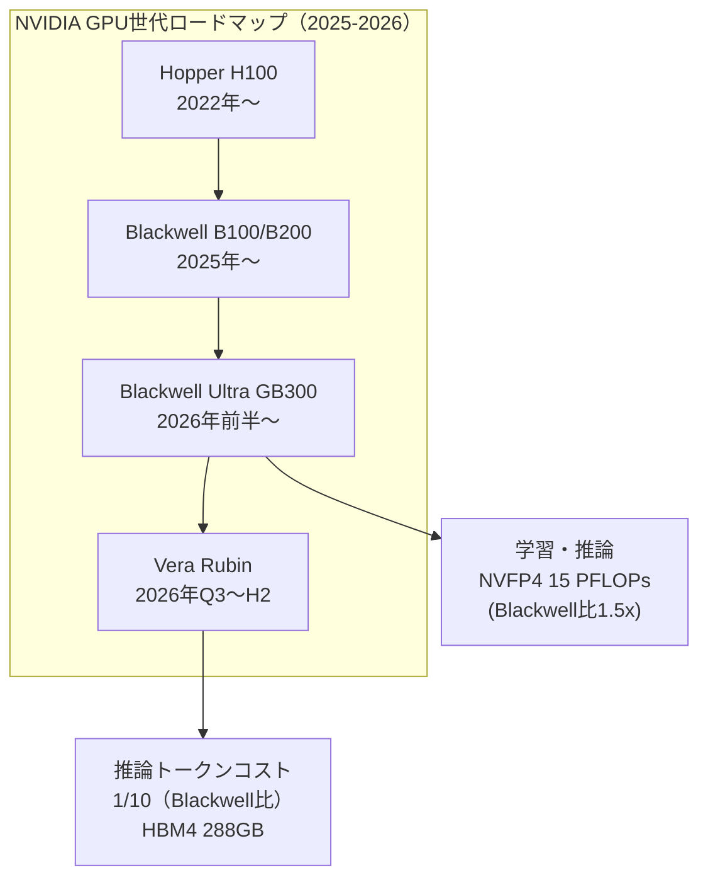
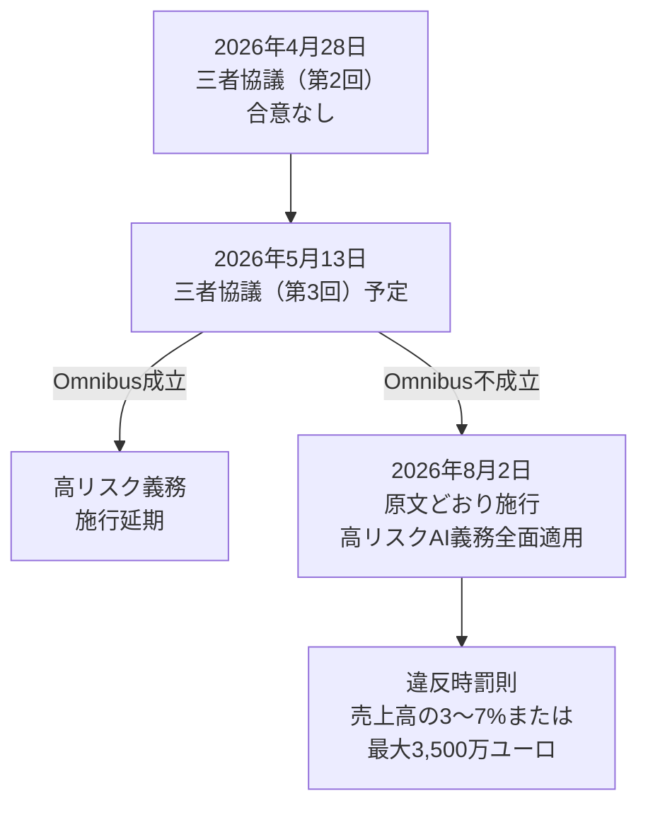

# LLM・AI Agent 最新情報レポート Vol.4

**作成日**: 2026年5月5日  
**対象期間**: 2026年4月下旬〜5月初旬（Vol.1〜3との差分）

---

## 目次

1. [Google Cloud AIアップデート](#1-google-cloud-aiアップデート)
2. [Microsoft Azure AIアップデート](#2-microsoft-azure-aiアップデート)
3. [LLM Model / AI Agentアーキテクチャ・研究論文](#3-llm-model--ai-agentアーキテクチャ研究論文)
4. [公式ブログ・論文のリサーチ・要約](#4-公式ブログ論文のリサーチ要約)
   - [xAI](#41-xai)
   - [OpenAI](#42-openai)
   - [Anthropic](#43-anthropic)
5. [AI Agent搭載SaaS製品情報](#5-ai-agent搭載saas製品情報)
6. [その他特筆すべき情報](#6-その他特筆すべき情報)
7. [参考リンク](#7-参考リンク)

---

## 1. Google Cloud AIアップデート

### 1.1 Google I/O 2026 プレビュー（5月19〜20日開催）

**開催日時:** 2026年5月19日（月）10:00 PT 基調講演 〜 20日（火）

年次開発者カンファレンスが約2週間後に迫っている。以下のAnnouncementが予告・リーク済み。

| カテゴリ | 予告内容 |
|---|---|
| **Gemini 4.0** | 次世代フロンティアモデル（詳細は当日発表） |
| **Gemini Nano 4** | スマートフォン/エッジ向け。Fast・Full の2バリアント。前世代Nano比3倍の速度改善 |
| **Veo 4** | 動画生成モデルの最新版（後述） |
| **Agentic Coding** | 開発者向け基調講演の主テーマ。ルーティンな開発タスクを自律処理するAIコーディングツール |
| **Android XR スマートグラス** | Gemini + Project Astraを搭載した2製品ライン（後述） |
| **Android 17** | 次期OS。AI統合の深化 |



### 1.2 Google Veo 4（2026年4月リリース済み）

Googleが2026年4月に正式リリースしたAI動画生成モデル。

**主要スペック・機能:**

| 項目 | 内容 |
|---|---|
| **生成長** | 単一プロンプトから最大2分のビデオ |
| **解像度** | 最大4K |
| **生成速度** | Veo 3比40%高速化（5分 → 約3分） |
| **キャラクター一貫性** | 「Character Anchoring」技術により、顔・服装・特徴をシーン全体で維持 |
| **音声同期** | Foley音効果と環境音楽を映像に合わせて自動生成 |
| **マルチモーダル入力** | テキスト + 画像 + ストーリーボード対応 |
| **アクセス** | Google Flow / Gemini Ultraの有料プランから利用可能 |



### 1.3 Android XR スマートグラス（2026年）

GeminiとProject Astraを搭載した2ラインの AI スマートグラスを2026年中にリリース予定。

| タイプ | パートナー | 特徴 |
|---|---|---|
| **スクリーンレス型** | Gentle Monster・Warby Parker | スピーカー・マイク・カメラ搭載。Geminiへの音声・視覚クエリ、周囲認識、コンテキスト記憶 |
| **ディスプレイ付き型** | 同上 | インレンズディスプレイ。ターンバイターンナビ、ライブ翻訳字幕 + Gemini機能 |

**デモされたユースケース:** カメラで撮影しながらGemini Nano（Nano Banana）でリアルタイム写真編集・加工

---

## 2. Microsoft Azure AIアップデート

### 2.1 Sora 2 on Azure AI Foundry（プレビュー）

OpenAIのフラグシップ動画・音声生成モデル**Sora 2**がAzure AI Foundryで利用可能に（プレビュー）。

**提供リージョン:** Sweden Central / East US 2

**主要機能:**

| 機能 | 内容 |
|---|---|
| **Text-to-Video** | テキストプロンプトから動画生成 |
| **Video-to-Video** | 短い動画を入力に、より長い動画へ変換・延長 |
| **Image-to-Video** | 静止画を入力として動画生成 |

### 2.2 GPT RealTime 1.5 / GPT Audio 1.5 一般提供（GA）

`gpt-realtime-1.5-2026-02-23` と `gpt-audio-1.5-2026-02-23` がAzure AI Foundry Direct ModelsでGA。

**改善点（前世代比）:**
- 命令フォロー精度の向上
- 多言語サポートの強化
- ツール呼び出し（Function Calling）対応
- 低レイテンシのリアルタイム音声インタラクションを維持

**用途:** 音声ファースト顧客サポート、教育AI、音声アシスタント構築



### 2.3 GPT-5.5 Pro on Microsoft Foundry（GA）

GPT-5.5に加え、**GPT-5.5 Pro**がMicrosoft Foundry上で一般提供。推論深度・タスク複雑性において最も高い要求水準のエンタープライズワークロードに対応。長文コンテキスト推論、信頼性の高いエージェント実行、Computer Use精度向上、トークン効率改善が特徴。

---

## 3. LLM Model / AI Agentアーキテクチャ・研究論文

### 3.1 SAGA: GPUクラスターにおけるAIエージェント推論スケジューリング（HPDC '26）

**論文:** "SAGA: Workflow-Atomic Scheduling for AI Agent Inference on GPU Clusters"  
**掲載:** HPDC '26（第35回 High-Performance Parallel and Distributed Computing）2026年7月、Cleveland

**背景:** AIエージェントはGPUクラスターにおいて支配的なワークロードになりつつあるが、複数ステップの推論チェーン（Compound AI Workload）が既存スケジューラのKVキャッシュ最適化と相性が悪いという問題がある。

**SAGAの中核貢献:**
- エージェントのワークフロー構造（DAG）をスケジューラに明示的に公開することで、オンラインKVキャッシュ管理をオフライン最適（Bélády policy）に近づける
- プロダクショントレースで **1.31倍** のスループット改善を達成
- オンラインスケジューラが達成可能な上限を初めて定量化

```mermaid
graph TD
    subgraph "従来のスケジューラ"
        OLD"[KVキャッシュ管理\n各ステップ独立]"
        OLD --> "MISS[キャッシュミス多発\nGPU利用効率低下]"
    end
    subgraph "SAGA"
        DAG"[ワークフローDAG\n事前公開]"
        DAG --> "SCHED[ワークフロー対応\nスケジューラ]"
        SCHED --> "CACHE[KVキャッシュ\nBélády近似管理]"
        CACHE --> PERF[1.31× スループット改善]
    end
```

### 3.2 Agentic AI Orchestration は Bayes一貫性を持つべき（ICML 2026 採択）

**論文:** "Position: Agentic AI Orchestration Should Be Bayes-Consistent"  
**採択:** ICML 2026（International Conference on Machine Learning）

**主旨:** マルチエージェントオーケストレーションにおける意思決定を**ベイズ推論の枠組みで整合性**を保つべきという立場論文。エージェント間の不確実性の伝播・集約が一貫しない場合、システム全体の挙動が予測不能になることを指摘。

**実践的含意:** オーケストレーターのエージェント選択・サブタスク割り当てに確率的な一貫性を設計段階で組み込むことで、エラー増幅とハルシネーション連鎖を抑制できる。

### 3.3 A11y-Compressor: GUIエージェント観察の効率化（ACL SRW 2026）

**論文:** "A11y-Compressor: A Framework for Enhancing the Efficiency of GUI Agent Observations through Visual Context Reconstruction and Redundancy Reduction"  
**採択:** ACL Student Research Workshop 2026

**課題:** GUIエージェントは画面全体のAccessibility Tree（A11yツリー）を観察するが、情報量が膨大でLLMのコンテキストを圧迫する。

**解決策:**
- 視覚コンテキストの再構成と冗長性削減により、A11yツリーのトークン量を大幅削減
- エージェントのアクション精度を維持しながら推論コストを低減

---

## 4. 公式ブログ・論文のリサーチ・要約

### 4.1 xAI

#### Grok 4.3 API 正式リリース（2026年4月30日）

xAIがGrok 4.3のフル展開を完了。前バージョンから大幅に機能・コストを刷新。

**コスト・スペックアップデート:**

| 項目 | 変更内容 |
|---|---|
| **入力価格** | 約40%引き下げ |
| **コンテキストウィンドウ** | 1Mトークン（2Mトークンコンテキストのheavy systemも継続） |
| **ネイティブ動画入力** | 初対応 |

**主要新機能:**

| 機能 | 詳細 |
|---|---|
| **構造化ファイル生成** | 会話から**ダウンロード可能なPDF・スプレッドシート・PowerPoint**を直接生成（整形済み） |
| **音声APIスタック** | TTS・STT・リアルタイム音声エージェント・**カスタム音声クローニング**を一体提供 |
| **Aurora 画像モデル** | xAI独自の新世代自己回帰（Autoregressive）画像生成モデル。𝕏プラットフォームで先行公開 |
| **16エージェント Heavy システム** | 4.20から継続。複雑なタスクに対し16のサブエージェントが協調 |



**市場へのインパクト:** テキストLLMに加え、音声・画像・動画・ファイル生成をワンプラットフォームで提供する「オールインワンAIプラットフォーム」戦略が鮮明化。

### 4.2 OpenAI

#### gpt-realtime 一般提供（GA）開始

OpenAIの最先端プロダクション向け音声モデル **gpt-realtime** がGAに。

| 指標 | gpt-realtime | 前世代（2024年12月） |
|---|---|---|
| MultiChallenge音声ベンチマーク | **30.5%** | 20.6% |
| 価格（入力） | $32/Mトークン（キャッシュ: $0.40） | ー |
| 価格（出力） | $64/Mトークン | 前世代比**20%引き下げ** |

**改善点:** 音声品質・インテリジェンス・命令フォロー・Function Calling  
**提供形態:** Realtime API（全開発者向け）。TypeScript用 `RealtimeAgent/Session`、Python用 `VoicePipeline` SDKサポート。

#### OpenAI × AWS 流通パートナーシップ拡大

OpenAIモデル（GPT-5.5、Codexを含む）がAmazon Bedrock経由で利用可能に（Limited Preview → 一般展開中）。

**背景:** Microsoftとの従来の独占的流通構造を緩和し、AWS・Googleへの展開を開始。  
**ビジネス指標:** OpenAI年間収益ラン率 **$25B**超達成。IPOへの初期ステップを踏み始めている。

```mermaid
graph LR
    OAI[OpenAI Models\nGPT-5.5 / Codex]
    OAI --> MS[Microsoft Foundry\n(継続)]
    OAI --> AWS[Amazon Bedrock\n(新規・Limited Preview)]
    OAI --> GCP[Google Cloud Vertex AI\n(Claudeと同様の戦略)]
    MS --> ENT1[エンタープライズ顧客]
    AWS --> ENT2[AWSエコシステム顧客]
    GCP --> ENT3[GCPエコシステム顧客]
```

### 4.3 Anthropic

#### Claude Opus 4.7 × GitHub Copilot（ロールアウト中）

Claude Opus 4.7がGitHub Copilotに統合され、段階的に展開中。

- 多段階タスク実行性能の強化
- 長期水平推論（Long-horizon Reasoning）の改善
- 複雑なツール依存ワークフローにおける実行信頼性向上
- GitHub上のIssueアサイン・PR作成タスクをCopilot Agentとして自律実行

---

## 5. AI Agent搭載SaaS製品情報

### 5.1 GitHub Copilot: Agent Mode + MCP対応（全VSCodeユーザーへ展開）

GitHubがAgent ModeのModel Context Protocol（MCP）サポートをVS Codeの**全ユーザー**に展開。Copilotがコード補完ツールからフル自律型開発パートナーへ進化。

**主要機能アップデート:**

| 機能 | 内容 |
|---|---|
| **Agent Mode（MCP対応）** | AIがアイデアをコードに変換。サブタスクを自律特定・複数ファイル横断実行 |
| **Coding Agent** | GitHubイシューをCopilotに割り当て → リポジトリ調査 → 実装計画 → ブランチへのコード変更 → PR作成まで完全自律 |
| **Terminal統合** | ターミナルからのビルド・デバッグ・デプロイをCopilot Coding Agentで直接実行 |
| **C++ Code Editing Tools（GA）** | `get_symbol_call_hierarchy` / `get_symbol_class_hierarchy` ツールで言語対応型C++コードナビゲーション |



### 5.2 Atlassian Jira AI Agents（2026年5月GA）

Atlassianが**Agents in Jira**をオープンベータで提供開始し、2026年5月初旬に全Jiraクラウド顧客へGA。

**コンセプト:** AIエージェントをJiraの「フルメンバー」として扱う。チームがエージェントに作業をアサインし、コメントでコラボレーションし、ワークフローに直接組み込める。

**主要機能:**

| 機能 | 詳細 |
|---|---|
| **Rovo Agents統合** | Atlassian Rovo AIエージェントをJiraタスクに直接アサイン可能 |
| **MCP対応 サードパーティエージェント** | Amplitude・Box・Canva・Figma・Intercomなど外部MCPエージェントと連携 |
| **@メンションコラボレーション** | イシューコメントでエージェントを@メンションし、インコンテキスト作業 |
| **ガバナンス準拠** | エージェントはJiraの既存パーミッション・ワークフロー・監査証跡内で動作 |

```mermaid
graph TD
    subgraph "Jira AI Agents エコシステム"
        ROVO[Atlassian Rovo Agent]
        MCP_A[Amplitude Agent\nMCP対応]
        MCP_B[Figma Agent\nMCP対応]
        MCP_C[Canva / Box / Intercom\nMCP対応]
    end
    subgraph "Jira プロジェクト"
        ISSUE[Issue / タスク]
        COMMENT[コメント\n@メンション]
        WORKFLOW[ワークフロー]
        AUDIT[監査証跡]
    end
    ROVO --> ISSUE
    MCP_A --> ISSUE
    MCP_B --> COMMENT
    MCP_C --> WORKFLOW
    ISSUE --> AUDIT
```

### 5.3 Perplexity: Computer Enterprise × Slack統合

**Perplexity Computer**（$200/月のMax/Enterpriseプラン向け）がエンタープライズに本格展開。

| 機能 | 内容 |
|---|---|
| **19モデル対応マルチエージェント** | 複雑なワークフローを19のAIモデルを使い分けるサブエージェントで処理 |
| **Slackネイティブ統合** | Slackチャンネル/スレッドで `@computer` を呼び出してタスク実行。Web UIやモバイルで会話継続 |
| **Comet ブラウザ（iOS）** | AI駆動ブラウザがiOSに登場。ブラウザエージェントのモデルをユーザーが選択可能（デフォルト: Claude Opus 4.6） |
| **Perplexity Health** | 医療記録（100万以上のプロバイダー）・FitbitなどのヘルスデータをAIで統合・分析（Pro/Maxでロールアウト中） |

### 5.4 HubSpot Breeze AI: 成果ベース課金モデルへの転換（2026年4月14日）

HubSpotが主力AIエージェントの料金体系を**Pay-per-Result（成果課金）**に移行。SaaS業界に新たな価格モデルを提示。

**新料金体系:**

| エージェント | 課金単位 | 価格 |
|---|---|---|
| **Customer Agent** | 解決済み会話1件 | **$0.50/件** |
| **Prospecting Agent** | 推薦リード1件 | **$1.00/件** |
| 無料トライアル | 28日間 | 無料 |

**主要アップデート（2026年4月）:**

| 機能 | 内容 |
|---|---|
| **9チャンネル対応** | SMS・Instagram・Telegram・LINE・音声（ベータ）など |
| **Customer Agent 解決率** | 平均65%（上位チームは90%） |
| **GPT-5へアップグレード** | Studio Agentsのバックボーンを GPT-4.1 → GPT-5 に更新 |
| **Audit Cards** | 各AIアクションのタイムスタンプ付き記録。どのCRMプロパティがどのデータで変更されたかを追跡 |
| **Breeze Studio** | 20以上のエージェント・アシスタントを管理 |



**市場的含意:** Vol.1でレポートしたSalesforce Agentforce（会話ベース）・ServiceNow（成果ベース）に続き、HubSpotも成果課金に移行。SMB〜エンタープライズ全域で「使用量・成果ベース」モデルへの移行が加速。

---

## 6. その他特筆すべき情報

### 6.1 NVIDIA Vera Rubin プラットフォーム（2026年Q3〜H2 リリース予定）

NVIDIAがCES 2026で発表したBlackwellの次世代プラットフォーム。Blackwell Ultraの翌世代として位置付け。

**主要スペック（Rubin GPU）:**

| 項目 | 数値 |
|---|---|
| トランジスタ数 | **336B（2レチクル構成）** |
| NVFP4 推論性能 | **50 PFLOPs**（Blackwell比5倍） |
| NVFP4 学習性能 | **35 PFLOPs**（Blackwell比3.5倍） |
| HBM | **HBM4（GPU当たり288GB / 22TB/s帯域）** |
| 製造プロセス | **TSMC 3nm** |

**Vera CPU（ペア）:**
- 227Bトランジスタ、Armカスタム「Olympus」コア
- 88コア/176スレッド（NVIDIA Spatial Multi-Threading）
- 最大1.5TB LPDDR5x / 1.2 TB/s帯域

**パフォーマンス対比:**

| 比較軸 | Vera Rubin vs Blackwell |
|---|---|
| 推論トークンコスト | **10分の1**（1/10） |
| MoEモデル学習GPU台数 | **4分の1**（1/4） |

**Vera Rubin NVL72 構成:** 72 GPU + 36 Vera CPU、260 TB/sスケールアップ帯域

**クラウドデプロイ予定:** AWS / Google Cloud / Microsoft Azure / OCI / CoreWeave / Lambda / Nebius / Nscale



### 6.2 Cohere Command A Reasoning：エンタープライズ向け推論モデル

**リリース:** 2026年初頭（OCI/Oracle Cloud経由で展開中）

| 項目 | 数値 |
|---|---|
| パラメータ数 | **111B** |
| コンテキスト長 | **256Kトークン** |
| 対応言語 | **英語 + 22言語**（多言語ハイブリッド推論） |
| 必要GPU | **2基**（A100 or H100）で動作 |
| 生成速度 | 156トークン/秒（GPT-4o比1.75倍速） |

**特徴:**
- 複雑なエージェントタスクに特化した**ハイブリッド推論モデル**
- 既存のCommand APIと互換性維持（移行コスト最小化）
- エンタープライズのオンプレミス・プライベートクラウドへの適合性重視

**Command A Vision（同時展開）:** 112Bパラメータ、OCR・画像分析特化のビジョンモデル。Oracle OCI Generative AI上で提供中。

### 6.3 EU AI Act：高リスクAI義務の施行期限迫る（2026年8月2日）

EU AI Actの主要マイルストーンが3ヶ月後に迫っており、グローバル企業の対応が急務。

**現状（2026年5月時点）:**

| 状況 | 内容 |
|---|---|
| **施行期限** | **2026年8月2日** — 高リスクAIシステムに関する義務が全適用 |
| **Omnibus交渉** | 欧州委員会・議会・理事会による2回目の三者協議（4月28日）で合意に至らず。次回5月13日予定 |
| **Omnibusの目的** | 高リスク義務の施行をさらに延期するための改正案。未成立の場合は原文どおり8月2日適用 |
| **支援予算** | 欧州委員会が€6,320万をAI健康・オンライン安全イノベーション支援に拠出（4月21日発表） |



**影響を受ける主なカテゴリ:** 採用・評価システム、医療診断AI、重要インフラ管理AI、教育評価、法執行AI、信用スコアリング

### 6.4 Apple Intelligence：iOS 26とSiri刷新

**iOS 26（2026年）の主要AI機能:**

| 機能 | 内容 |
|---|---|
| **Live Translation** | メッセージ・FaceTime・通話のリアルタイム翻訳（デバイスオンプレミス処理） |
| **Contact-based Genmoji** | 連絡先写真から友人のカリカチュア絵文字を生成（プライバシーセーフガード付き） |

**Siri次世代化（2026年内予定）:**
- 深いコンテキスト認識と**クロスアプリタスク処理**
- **Google Geminiモデルの統合**（Apple Intelligence経由）を交渉中との報道
- より自律的な複数アプリ横断実行能力

**WWDC 2026（開催予定）:** iOS 27、次世代Siri、AI ウェアラブル（スマートグラス・カメラ付きAirPods）の発表が期待される。

---

## 7. 参考リンク

### Google Cloud / Google I/O 2026
- [Google I/O 2026: What to expect, including AI announcements](https://tech.yahoo.com/general/article/google-io-2026-what-to-expect-including-ai-announcements-android-17-and-more-131200861.html)
- [Google I/O 2026 Official Site](https://io.google/2026/)
- [Google I/O 2026: AI Announcements for Startups](https://startupfortune.com/google-io-2026-is-about-to-happen-and-the-ai-announcements-could-change-how-startups-build/)
- [Google Veo 4: Everything You Need to Know](https://www.veo3ai.io/blog/veo-4-release-everything-you-need-to-know-2026)
- [Google unveils Veo 4 with pro-level AI filmmaking tools](https://www.msn.com/en-us/news/other/google-unveils-veo-4-with-pro-level-ai-filmmaking-tools/gm-GM2B858CB0)
- [Google Android XR Smart Glasses 2026](https://the-gadgeteer.com/2026/04/27/google-android-xr-ai-smart-glasses/)

### Microsoft Azure
- [Sora 2 now available in Azure AI Foundry](https://azure.microsoft.com/en-us/blog/sora-2-now-available-in-azure-ai-foundry/)
- [What's New in Azure OpenAI](https://learn.microsoft.com/en-us/azure/ai-services/openai/whats-new)
- [GPT-5.5 in Microsoft Foundry](https://azure.microsoft.com/en-us/blog/openais-gpt-5-5-in-microsoft-foundry-frontier-intelligence-on-an-enterprise-ready-platform/)
- [Azure OpenAI gpt-audio GA - Microsoft Q&A](https://learn.microsoft.com/en-us/answers/questions/5588373/azure-openai-gpt-audio-model-general-availability)

### xAI
- [Grok 4.3 API: 5 Major Upgrades + 40% Price Cut](https://help.apiyi.com/en/grok-4-3-api-release-may-2026-news-en.html)
- [XAI Unveils Grok 4.3 With Ultra-Low Pricing And Advanced Voice Cloning](https://softtechhub.us/2026/05/03/xai-unveils-grok-4-3/)
- [xAI News](https://x.ai/news)

### OpenAI
- [Introducing gpt-realtime and Realtime API updates](https://openai.com/index/introducing-gpt-realtime/)
- [AWS Weekly Roundup: OpenAI Partnership (May 4, 2026)](https://www.thenasguy.com/2026/05/04/aws-weekly-roundup-whats-next-with-aws-2026-amazon-quick-openai-partnership-and-more-may-4-2026/)
- [OpenAI Release Notes](https://releasebot.io/updates/openai)

### Anthropic
- [Claude Opus 4.7 now GA - GitHub Changelog](https://github.blog/changelog/2026-04-16-claude-opus-4-7-is-generally-available/)

### SaaS製品
- [GitHub Copilot: Agent Mode MCP Support](https://github.com/features/copilot/whats-new)
- [GitHub Copilot Complete Guide 2026](https://www.nxcode.io/resources/news/github-copilot-complete-guide-2026-features-pricing-agents)
- [Atlassian Introduces Agents in Jira](https://www.businesswire.com/news/home/20260224033792/en/Atlassian-Introduces-Agents-in-Jira-to-Drive-Human-AI-Collaboration-at-Enterprise-Scale)
- [Jira Spring Release 2026](https://community.atlassian.com/forums/Jira-articles/Introducing-the-Jira-2026-Spring-Release/ba-p/3227380)
- [Perplexity Computer Enterprise - VentureBeat](https://venturebeat.com/technology/perplexity-takes-its-computer-ai-agent-into-the-enterprise-taking-aim-at)
- [HubSpot Breeze AI Pay-per-Result Pricing](https://www.onthefuze.com/hubspot-insights-blog/hubspot-breeze-ai-agents-2026)

### NVIDIA
- [NVIDIA Vera Rubin Platform: Six New Chips](https://nvidianews.nvidia.com/news/rubin-platform-ai-supercomputer)
- [Inside NVIDIA Vera Rubin Platform](https://developer.nvidia.com/blog/inside-the-nvidia-rubin-platform-six-new-chips-one-ai-supercomputer/)
- [NVIDIA Blackwell Ultra Announcement](https://nvidianews.nvidia.com/news/nvidia-blackwell-ultra-ai-factory-platform-paves-way-for-age-of-ai-reasoning)

### Cohere
- [Cohere Command A Reasoning - VentureBeat](https://venturebeat.com/ai/cohere-targets-global-enterprises-with-new-highly-multilingual-command-a-model-requiring-only-2-gpus)
- [OCI adds Cohere Command A Vision and Reasoning](https://blogs.oracle.com/ai-and-datascience/oci-generative-ai-adds-cohere-command-a-models)

### 規制・その他
- [EU AI Act: European Digital Compliance Key Developments May 2026](https://www.mofo.com/resources/insights/260501-european-digital-compliance-key-digital-regulation)
- [The Digital AI Omnibus: Proposed Deferral - DLA Piper](https://knowledge.dlapiper.com/dlapiperknowledge/globalemploymentlatestdevelopments/2026/The-Digital-AI-Omnibus-Proposed-deferral-of-high-risk-AI-obligations-under-the-AI-Act)
- [Apple's New AI-Powered Siri Finally Coming in 2026](https://apple.gadgethacks.com/news/apples-new-ai-powered-siri-finally-coming-in-2026/)
- [SAGA: Workflow-Atomic Scheduling (arXiv:2605.00528)](https://arxiv.org/html/2605.00528v1)
