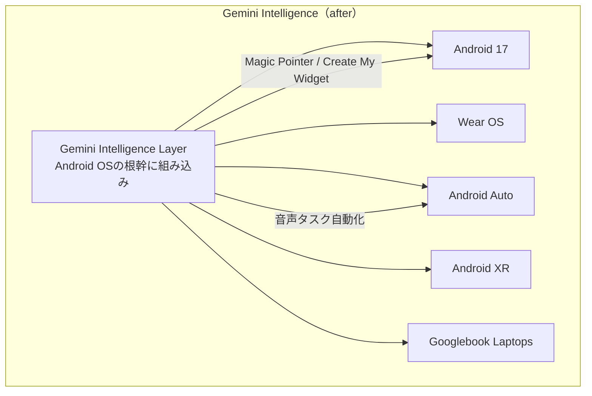
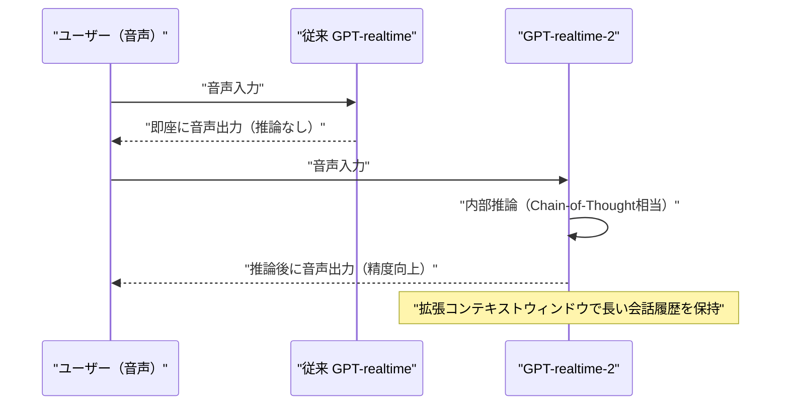
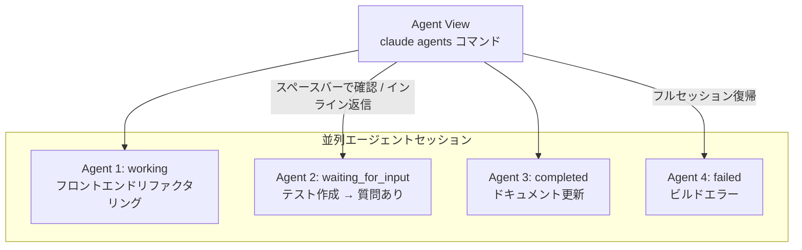
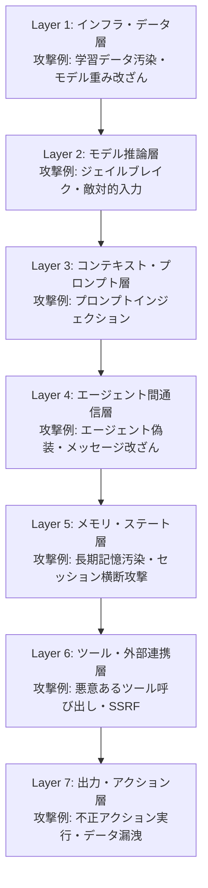
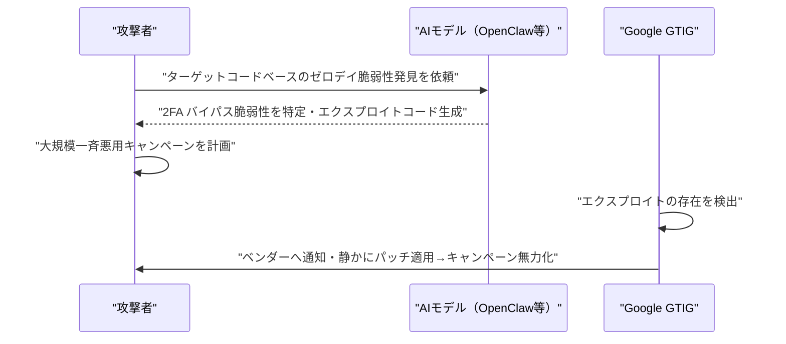
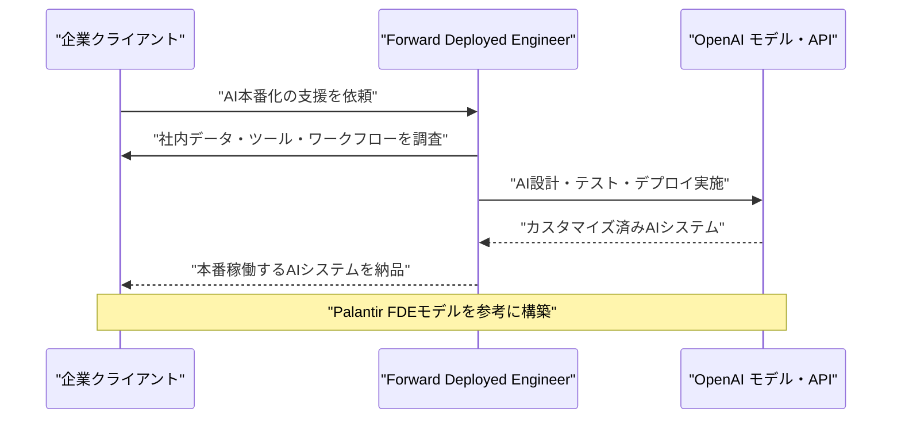
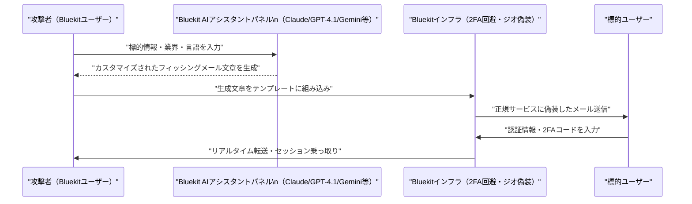
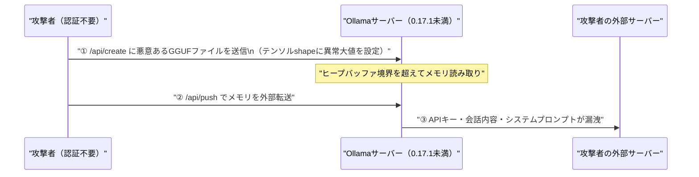

# LLM・AI Agent 週次サマリーレポート 2026年第3週（5月10日〜16日）

**作成日**: 2026年5月16日  
**対象期間**: 2026年5月10日（日）〜 5月16日（土）

---

## 目次

1. [ソースレポート](#1-ソースレポート)
2. [Google Cloud AIアップデート](#2-google-cloud-aiアップデート)
3. [Microsoft Azure AIアップデート](#3-microsoft-azure-aiアップデート)
4. [LLM Model / AI Agentアーキテクチャ・研究論文](#4-llm-model--ai-agentアーキテクチャ研究論文)
5. [公式ブログ・論文のリサーチ・要約](#5-公式ブログ論文のリサーチ要約)
   - [xAI](#51-xai)
   - [Google / DeepMind](#52-google--deepmind)
   - [OpenAI](#53-openai)
   - [Anthropic](#54-anthropic)
6. [AI Agent搭載SaaS製品情報](#6-ai-agent搭載saas製品情報)
7. [LLM/AI Agentセキュリティインシデント](#7-llmai-agentセキュリティインシデント)
8. [その他特筆すべき情報](#8-その他特筆すべき情報)
9. [参考文献](#9-参考文献)

---

## 1. ソースレポート

本レポートは以下のdailyレポートをソースとして作成しました：

- `daily/2026/05/2026-05-10.md`（Vol.14）
- `daily/2026/05/2026-05-11.md`（Vol.15）
- `daily/2026/05/2026-05-12.md`（Vol.16）
- `daily/2026/05/2026-05-13.md`（Vol.17）
- `daily/2026/05/2026-05-14.md`（Vol.18）
- `daily/2026/05/2026-05-15.md`（Vol.19）
- `daily/2026/05/2026-05-16.md`（Vol.20）

---

## 2. Google Cloud AIアップデート

### 2.1 The Android Show: I/O Edition 2026（5月12日）：Gemini Intelligence・Googlebook・Android 17発表

Google I/O 2026（5月19〜20日）の前哨戦として開催。AndroidのOSにGeminiを根幹から組み込む「**Gemini Intelligence**」を正式ブランド化し、新AIノートPC「**Googlebook**」を正式発表した。[[1]](#ref-1)[[2]](#ref-2)

**主要発表：**

| カテゴリ | 内容 |
|---|---|
| **Gemini Intelligence** | Android 17・Wear OS・Android Auto・Android XR・Googlebookに一貫して展開するOSレベルのAI知性層 |
| **Magic Pointer** | 画面上の任意要素を選択してGeminiに質問できる文脈認識UI |
| **Create My Widget** | 自然言語でカスタムウィジェットをその場で生成（"バイブコーディング"） |
| **Gemini in Chrome for Android** | Webページ要約・ブラウジングタスク自動化 |
| **Googlebook** | Acer・ASUS・Dell・HP・Lenovo製AIノートPC。全機種にキーボード上の「Glowbar」を搭載。2026年秋発売予定 |
| **Android 17** | 3D絵文字・量子耐性セキュリティ（PQC）・クロスプラットフォーム互換性強化 |

**Aluminum OS（5月14〜15日確認）：** Android 17をベースにChromeOS＋Androidを統合した新デスクトップOS。カスタムウィンドウマネージャー・タスクバー・仮想デスクトップを完全新設計。HP・Lenovo・Acer・ASUS・Samsungがパートナー。Q2〜Q3 2026リリース予定。[[3]](#ref-3)

### 2.2 Gemini Spark：バックグラウンド自律実行AIエージェント（5月14日リーク）

GeminiアプリのベータコードからI/O前に詳細が判明。ユーザーの手動操作を待たずバックグラウンドで継続稼働し、インボックス管理・会議前ブリーフ作成・マルチアプリワークフロー実行を自律で行う。UIは「Chat」と「Agent」の2タブ構成。[[4]](#ref-4)

> Googleの公式警告：「Gemini Sparkは実験的です。機密情報を第三者に共有したり、確認なしに購入を行う場合があります。」

### 2.3 Gemini API File Search マルチモーダルRAG対応（5月11日）

テキストと画像を同一ベクトルストアで横断検索できるRAGワークフローが可能に。`gemini-embedding-2`でPNG・JPEGをテキストと同一ストアにインデックス化し、グラフ・製品写真・図表をそのままRAGに組み込める。カスタムメタデータフィルタ・ページ単位の引用も追加。[[5]](#ref-5)

### 2.4 Vertex AI Lyria 3 音楽生成モデル（5月14日 パブリックプレビュー）

| モデル | 生成時間 | 用途 |
|---|---|---|
| `lyria-3-pro-preview` | 最大184秒 | 高品質楽曲生成 |
| `lyria-3-clip-preview` | 最大30秒 | 短尺クリップ生成 |

Gemini 2.5モデル群のサポート終了日は2026年10月16日に延長。[[6]](#ref-6)

### 2.5 Google I/O 2026直前：新Geminiモデル公開が秒読み（5月15〜16日）

複数メディアがI/O直前に「Gemini 3.5 または Gemini 4.0」と「Gemini Omni」（テキスト・画像・動画統合パイプライン）の公開が近いと報告。Gemini in Chrome「**Auto Browse**」（GeminiがChromeブラウザを自律操作してフォーム入力・検索を代行するアジェンティック機能）もI/OでGA見込み。[[7]](#ref-7)[[8]](#ref-8)

---

## 3. Microsoft Azure AIアップデート

### 3.1 ServiceNow AI Control Tower × Microsoft Agent 365 統合深化（5月5日）

前号で基本情報を報告済み。今号ではAI Control Towerの5新機能の詳細と、Microsoft Agent 365との双方向統合アーキテクチャを追記する。[[9]](#ref-9)

**AI Control Tower の5つのコア機能（詳細）：**

| 機能 | 詳細 |
|---|---|
| **Discover** | AWS・GCP・Azure・SAP・Oracle・Workday等30以上を通じ組織全体のAIアセットを自動検出 |
| **Observe** | Traceloop買収技術でエージェントのランタイム推論をリアルタイム可視化 |
| **Govern** | エージェントへのリアルタイムの一時停止・リダイレクト・Kill Switchが可能 |
| **Secure** | 異常動作・ポリシー違反を検出してインシデントアラートを発火 |
| **Measure** | OpenAI・Anthropic・Googleのトークン消費量を横断的に追跡するROIダッシュボード |

Agent 365との双方向統合により、ServiceNow AI Control TowerとMicrosoft Agent 365がガバナンスを相互補完するアーキテクチャが確立。AI Agent AdvisorおよびIntelligent ApprovalsはGAに到達。

### 3.2 Azure AI Foundry BYOM（Bring Your Own Model）GA（5月上旬）

Foundry Agent ServiceにカスタムモデルやプライベートモデルをAzure API ManagementやサードパーティAIゲートウェイ経由で接続できる機能が一般提供（GA）。APIキー / マネージドID / OAuth 2.0の3認証方式に対応。Foundry Portalでプレイグラウンドテストも可能。[[10]](#ref-10)

### 3.3 GPT-chat-latest・新GPT-realtimeモデル群が Microsoft Foundry に追加（5月12日）

**GPT-chat-latest**：GPT-5.5ベース。GPT-5.3-chat比で出力トークン約25〜30%削減。マルチターンアシスタント・RAGアプリ向けに最適化。[[11]](#ref-11)

**新GPT-realtimeモデル3種**：GPT-realtime-2が発話前に内部推論（Chain-of-Thought相当）を実行できるよう進化。リアルタイム多言語翻訳・ライブ文字起こし特化モデルも追加。[[12]](#ref-12)

### 3.4 Microsoft Agent 365 May 2026：Registry Sync 追加（5月12日）

外部エンタープライズ向けエージェントプラットフォームをAgent 365に接続し、外部エージェントとそのメタデータをAgent 365レジストリに統合する**Registry Sync**が追加。エージェントレベルのガバナンスアクション（削除等）をAgent 365から直接実行可能。Context Mapping（ポリシーベース制御）は2026年6月パブリックプレビュー予定。[[13]](#ref-13)

### 3.5 Red Hat Summit 2026：Azure Red Hat OpenShift × エンタープライズAI本番化（5月11〜14日）

Microsoft が Red Hat Summit **Platform Modernization Partner of the Year**を受賞。「真のエンタープライズAIプラットフォームはモデルではなく、モデルを取り巻くオペレーショナル基盤」というメッセージを共同発信。Azure Red Hat OpenShift（ARO）がKubernetesネイティブなAI本番基盤として注目された。[[14]](#ref-14)

---

## 4. LLM Model / AI Agentアーキテクチャ・研究論文

### 4.1 Cloudflare Unweight：BF16ロスレス圧縮でLLM推論を22%軽量化（5月10日）

BF16の冗長な指数バイトをHuffman符号化するロスレス重み圧縮技術。モデル全体で約**20%削減**（テンソル毎に15〜22%）。ビット単位で完全に同一の出力を保証し、精度劣化を一切許容できない本番環境（金融・医療・法律）でのLLM活用に貢献。専用ハードウェア不要。Cloudflare Workers AI（グローバルエッジ）に展開予定。[[15]](#ref-15)

### 4.2 Claude Code「Agent View」：並列AIエージェントをCLI一元管理（5月11日 Research Preview）

`claude agents`コマンドで複数セッションを1つのCLIダッシュボードから管理。バックグラウンド送信（`/bg`コマンド）・スペースバーで最新ターンのインラインプレビュー・インライン返信・フルセッション復帰が可能。Claude Code v2.1.139以降で利用可能。[[16]](#ref-16)

### 4.3 Mistral AI Workflows：Temporalベースの本番対応AIオーケストレーション（5月12日 公開プレビュー）

Netflix・Stripe・Salesforceが採用するデュラブル実行エンジンTemporalをAIワークロード向けに拡張。データプレーン（顧客Kubernetes Workers）とコントロールプレーン（Mistralホスト）を分離し、センシティブデータを外部に出さずにAI処理が可能。ASML・CMA-CGM等が日次数百万件の実行実績。[[17]](#ref-17)

### 4.4 Subquadratic「SubQ」：SSAアーキテクチャで1,200万トークンコンテキストを実現（5月13日）

標準TransformerのO(n²)密な注意機構を**SSA（Subquadratic Sparse Attention）**に置き換え、各トークンが最も関連するk個のみと注意計算（O(n·k)）。12Mトークン時の計算量を約1,000分の1に削減。Opus 4.7で同コンテキスト評価は約$2,600かかるところ、SubQでは約$8。50Mトークンウィンドウを2026年Q4目標。調達額$2,900万（評価額$5億）。[[18]](#ref-18)

### 4.5 LLMエージェントメモリ機構の進化サーベイ（arXiv:2605.06716・5月14日）

「Storage → Reflection → Experience」の3段階進化フレームワークで体系化。研究焦点が「LLMが訓練データを漏洩するか」から「永続的メモリを持つエージェントがセッション横断で毒化・不正アクセス・伝播されるか」へシフト。組織共有ステートにおける「Mnemonic Sovereignty（記憶主権）」が新たなセキュリティ概念として浮上。[[19]](#ref-19)

### 4.6 産業向けLLMエージェントシステム包括レビュー（arXiv:2505.16120・5月14日）

タスクが長期化・複雑化するにつれ、実行信頼性を左右するのはモデルの能力よりも**エージェント実行ハーネス（infrastructure layer）**。現代的なエージェントハーネスの5層構成：①LLM推論コア、②ゲートウェイ・セッション層、③コンテキスト管理・メモリ層、④指示・ツール層、⑤トリガー・出力層。[[20]](#ref-20)

### 4.7 エージェンティックAIの7層セキュリティ攻撃面モデル（arXiv:2604.23338・5月15日）

ステートレスLLMと異なり、エージェントAIは「永続メモリ・外部ツール呼び出し・エージェント間協調・セッション横断動作」を持つため質的に異なる攻撃面が生じると指摘。[[21]](#ref-21)

### 4.8 DeepSeek：ハードウェア制約下での効率アーキテクチャ革新（5月15〜16日整理）

H100等の高性能GPU調達制限を逆手に取った主要技術：MoEスパース化（計算コスト削減と大規模化の両立）・Multi-Latent Attention（KVキャッシュ圧縮）・推論時スケーリング（学習後の推論フェーズに計算資源集中）・単純タスクの軽量モデルへのオフロード。2026年は推論時スケーリングがLLMアーキテクチャの主要トレンドとなる見込み。[[22]](#ref-22)

---

## 5. 公式ブログ・論文のリサーチ・要約

### 5.1 xAI

新情報なし

---

### 5.2 Google / DeepMind

#### Google Threat Intelligence Group（GTIG）：AI生成ゼロデイエクスプロイトを世界初検出（5月11〜12日）

ハッカーグループがAIモデル「**OpenClaw**」を使って人気オープンソースウェブ管理プラットフォームの**2FA バイパスゼロデイ脆弱性**を発見・武器化した事例を確認・阻止。**北朝鮮系APT45**がAIで数千件のエクスプロイトをテスト・検証。**中国系グループ**もAI活用の脆弱性発見に「著しい関心」。GTIGはベンダーと連携して静かにパッチを適用し、大規模悪用キャンペーンの本格化前に阻止した。「AIが技術的ハードルを大幅に下げた」と警告。[[23]](#ref-23)

---

### 5.3 OpenAI

#### GPT-5.5-Cyber：サイバーセキュリティ向け制限緩和モデルを限定プレビュー（5月7〜8日）

**Trusted Access for Cyber（TAC）プログラム**最上位ティアに認定された組織向けに限定プレビュー。防御的セキュリティ業務（脆弱性トリアージ・マルウェア解析・PoC生成）に対してより寛容に動作するよう訓練されたバリアント。英国AISIは「32ステップの模擬コーポレートサイバー攻撃シナリオを10回中2回完遂できる」と評価。クレデンシャル窃取・マルウェア作成は引き続きブロック。2026年6月1日以降Advanced Account Securityが必須。[[24]](#ref-24)

#### OpenAI Daybreak：AI脆弱性検出・パッチ検証サイバーセキュリティ基盤（5月11〜12日）

GPT-5.5ベースの**Codex Security**エンジンを中核に、リポジトリの編集可能な脅威モデルを自動生成、攻撃パスと高影響コードにフォーカスし、隔離環境での脆弱性テストとパッチ案を提示。「数時間の分析を数分に短縮」。Anthropicの Claude Mythos Previewへの対抗として位置づけ。Akamai・Cisco・Cloudflare・CrowdStrike・Fortinet・Palo Alto Networks等がTAC統合を先行採用。[[25]](#ref-25)

#### OpenAI Deployment Company（DeployCo）：$40億・エンタープライズAI展開専門会社（5月11日）

TPGをリードに19の投資・コンサル・SIファームが参加し、**Forward Deployed Engineers（FDE）**が顧客企業に常駐してAI設計・デプロイを支援する専門会社を設立。英スコットランドのApplied AIコンサル**Tomoro**を買収し約150名のFDEを即日確保。評価額$140億。Bain & Company・Capgemini・McKinseyが参画。[[26]](#ref-26)

#### ChatGPT個人財務ツール：Plaid経由1万2,000以上の金融機関に接続（5月15日）

ChatGPT Proユーザー向けにプレビュー提供開始。Schwab・Fidelity・Chase・Robinhood等**12,000以上**の金融機関に接続。残高/取引/投資/負債の参照のみ（口座操作・口座番号閲覧は不可）。連携解除後30日以内に同期データを削除。将来はIntuit連携（節税分析等）を予定。「AI x 実口座データ」の大規模展開として業界初。[[27]](#ref-27)

---

### 5.4 Anthropic

#### Claude Managed Agents：Dreaming・Outcomes・Multiagent Orchestration 追加（5月7日）

前号でCode with Claude 2026での発表を簡報済み。今号では詳細を補足する。[[29]](#ref-29)

| 機能 | 概要 |
|---|---|
| **Dreaming** | 過去セッションを振り返り、パターンを発見して自己改善するリサーチプレビュー機能。自動更新 or ユーザーレビュー後適用の2モード |
| **Outcomes** | 過去の失敗から学習し、人間のステアリングを最小化しながら複雑なジョブを処理 |
| **Multiagent Orchestration** | リードエージェントがジョブを分割し、独自モデル・プロンプト・ツールを持つスペシャリストに並列委譲 |

Netflix がMultiagent Orchestrationをプラットフォームチームに既にデプロイ。

#### Claude Platform on AWS GA：AWSアカウント経由でAnthropicネイティブAPIを直接利用（5月11日）

AWSの初のAnthropicネイティブプラットフォーム体験。Messages API・Files API・Message Batches API・Claude Managed Agents等にAWS IAM認証・Billing統合でアクセス。17リージョンでGA。Amazon BedrockとはAWSセキュリティ境界の内外という点で本質的に異なる。[[30]](#ref-30)

#### Claude for Legal：12実務プラグイン＋20超のMCPコネクタ（5月12日）

商事・雇用法・訴訟アソシエイト等12の法律実務領域プラグインと、Thomson Reuters（CoCounsel Legal）・LexisNexis・iManage・NetDocuments・DocuSign・Everlawなど20超のMCPコネクタを一挙公開。[[31]](#ref-31)

**Thomson Reuters CoCounsel Legal** は Claude Agent SDK で完全再構築。単なるQ&AからエージェントワークフローへとRetoolが進化し、調査→起草→引用検証を一気通貫で実行。「AIアシスト」から「AIエージェント型法律業務」への転換点として業界が注目。

#### Anthropic評価額$850B〜$950B：資金調達交渉中（5月12〜13日）

調達規模$300〜500億・評価額$8,500〜$9,500億（最大の場合OpenAIを超える）で交渉中。前回ラウンド（2026年2月・$380億評価額）から急速に跳ね上がり。年間ARRは$400億まで成長。IPOは早ければ2026年10月の見込み。[[32]](#ref-32)

#### Anthropic × Bill & Melinda Gates Foundation：$200M・4年間パートナーシップ（5月14日）

グローバルヘルス・教育・農業・経済的格差解消を目的とした包括支援体制。主要フォーカス：①46億人が必須医療にアクセスできない低・中所得国での医療改善（ポリオ・HPV・子癇前症）、②K-12向けAIチューターリング（サハラ以南アフリカ・インド）、③約20億人の収入を支える小規模農家への農業AIサポート。[[33]](#ref-33)

#### PwC × Anthropic アライアンス大幅拡大：3万人研修・CoE設立（5月14日）

3万人のPwCプロフェッショナルをClaude認定研修し、共同Center of Excellenceを設立。Claude Code・Claude Coworkを米国チームから先行展開。既存導入での計測済み成果：案件デリバリー改善最大70%・保険引受サイクル10週間→10日間に短縮。[[34]](#ref-34)

#### Claude for Small Business 正式ローンチ・全国ツアー（5月13〜14日）

SMB（中小企業）向けAIパッケージ。Claude Cowork内のトグルで有効化。QuickBooks・PayPal・HubSpot・Canva・DocuSign・Google Workspace・Microsoft 365と統合。シカゴを皮切りに1日半のAIリテラシー研修＋ハンズオンワークショップを各都市100名の中小企業経営者対象で実施。[[35]](#ref-35)

#### Claude Code v2アップデート（5月15日）

Fastモードのデフォルトモデルが**Opus 4.6 → Opus 4.7**に変更。プラグイン依存管理（他プラグインが依存しているプラグインの無効化を拒否）・コンテキストコスト投影（ターンごとのトークン推定コスト表示）・バックグラウンドセッション強化・PowerShell対応改善を追加。[[36]](#ref-36)

#### Claude Agent SDK 独立課金プール：6月15日から適用（5月13〜15日確定）

Claude Agent SDK経由のプログラム的使用量をサブスクリプション通常枠から分離し独立した月次クレジットプールで管理。Pro $20/月・Max 5x $100/月・Max 20x $200/月（APIレート換算）。対象はClaude Agent SDK / `claude -p` コマンド / Claude Code GitHub Actions / OpenClaw・Conductor等サードパーティエージェント。開発者コミュニティでは12〜175倍の実質値上げという試算も出ており論議を呼んでいる。[[37]](#ref-37)

#### Claude Mythos Preview：SWE-bench 93.9%・USAMO 97.6%・Pentagon関心（5月15〜16日）

前号で基本情報を報告済み。今号では追加情報を補足する。SWE-bench Verifiedスコア**93.9%**・USAMO**97.6%**。17年間発見されていなかったFreeBSD NFS実装のRCE（CVE-2026-4747）を完全自律で発見・PoC実行。国防総省幹部がProject GlaswingとClaude Mythosに「機会を見出す」とコメント。[[38]](#ref-38)

---

## 6. AI Agent搭載SaaS製品情報

### 6.1 CTONE「Agent Computer」シリーズ：クラウドからエッジへのAIエージェント専用エンドポイント（5月9日）

深センのCTONE Groupが「Mini PCグローバルリーダーからAIコンピューティングエコシステムのビルダーへの戦略転換」を宣言。Agent ComputerシリーズとAI Agent Workstationシリーズを発表。「データプライバシー保護・コスト効率・低レイテンシ」を訴求するエッジAIエージェント専用端末として位置付け。Intel・AMD・Alibaba Cloud・SenseTimeが参加する1,500人規模のイベントで発表。[[39]](#ref-39)

### 6.2 Novo Nordisk × OpenAI：創薬・製造・商業化の全体をAIで変革（4月14日締結）

GLP-1肥満治療薬Wegovyのメーカーが研究開発から製造・サプライチェーン・商業化まで事業全体にAIを統合。2026年末までに完全デプロイを目指す。OpenAIがNovo全グローバル従業員のAIリテラシー向上も支援。創薬のような多段階・長期・規制厳格な産業領域でのOpenAI製品の本格統合事例として注目。[[40]](#ref-40)

### 6.3 Notion 3.5 Developer Platform：外部AIエージェントをワークスペースに統合（5月13日）

主要コンポーネント：**External Agents API**（Claude Code・Cursor・Codex・Decagon等を招待）・**Notion Workers**（セキュアサンドボックス上でカスタムコードをホスト実行）・**双方向Webhook**（外部アプリがNotionを直接トリガー）・**Database Sync**（任意APIデータソースをNotion DBにリアルタイム同期）。NotionがSaaSツールから「AIエージェントの制御室（Control Room）」へ転換する戦略的ピボット。[[41]](#ref-41)

### 6.4 Writer：プロンプト不要のイベントトリガー型AIエージェント（5月15〜16日）

Gmail・Gong・Google Calendar・Slack等のビジネスイベントをトリガーに自律的に動作。「rigid条件ロジック」ではなく、自然言語ゴールとイベントコンテキストを解釈してアクション要否を自律判断。BYOE（独自暗号鍵持ち込み）・Datadogプラグインによる全LLMリクエストログ記録でガバナンスを確保。Microsoft Copilot・Salesforce Agentforce・Amazon Q Businessに「プロンプト前から動く」で差別化。[[42]](#ref-42)

### 6.5 Harvey AI Magic Builder：自然言語でワークフローエージェントを構築（5月2026年）

法律AI SaaS Harvey（評価額$110億）が500以上の法律エージェントと自然言語からブロックベースのワークフロー構造を自動生成するMagic Builderを提供開始。会話型改善でワークフローを段階的に最適化し、Word・PowerPoint・Excel形式の成果物を自動生成。2026年5月5日よりEarly Access、順次一般展開中。[[43]](#ref-43)

---

## 7. LLM/AI Agentセキュリティインシデント

### 7.1 AIフィッシングキット「Bluekit」：Claude・GPT-4.1・Gemini対応クライムウェア（5月10日）

複数LLMモデルを統合した「AIアシスタントパネル」を搭載したフィッシングキット。Outlook・Gmail・GitHub・Ledger等多数のテンプレート・2FA回避・アンチボットクローキング・音声クローニングを提供。「クライムウェアサービスへのAI統合が進み、高品質フィッシングメール作成の技術的参入障壁が大幅に低下している」と研究者は警告。[[44]](#ref-44)

### 7.2 Five Eyes「エージェント型AIの慎重な導入」共同ガイダンス（5月1日）

米国（CISA・NSA）・オーストラリア・カナダ・ニュージーランド・英国の6機関が共同で、エージェント型AI特有のサイバーセキュリティリスクと対策をまとめた初の国際的政府連携ガイダンスを公開。[[45]](#ref-45)

**5つのリスクカテゴリ：** ①権限（過剰な権限付与・権限クリープ）、②設計・設定（設定ミスによる不安定動作）、③行動（目標の誤解釈・マルチエージェント連鎖での増幅）、④構造（プロンプトインジェクション・サプライチェーン攻撃）、⑤説明責任（ログ不足・不透明な実行経路）

**主要勧告：** 最小権限の原則・ローリスクから開始・検証可能なエージェントID・完全な監査証跡・ゼロトラスト統合・人間の監視（Human Oversight）。

### 7.3 LiteLLM CVE-2026-42208：CISA KEVカタログ追加・連邦機関への対応義務化（5月8日）

前号で初期開示（CVSS 9.3、パッチ公開後36時間以内の悪用）を報告済み。2026年5月8日付でCISAが**KEV（Known Exploited Vulnerabilities）カタログ**に追加。連邦民間行政機関（FCEB）は2026年6月5日までのパッチ適用が法的義務。修正バージョン：LiteLLM v1.83.10-stable以降。[[46]](#ref-46)

### 7.4 Bleeding Llama（CVE-2026-7482、CVSS 9.1）：Ollamaで認証不要メモリ漏洩（5月12日）

Cyera Researchが命名。GGUFファイルのテンソルオフセット境界チェック欠如によるヒープOOBリード。わずか**3つのAPIコール**でサーバーの全プロセスメモリ（APIキー・環境変数・システムプロンプト・会話内容）を漏洩させられる。世界で**30万台超**のOllamaサーバーがインターネット上に露出。修正：Ollama 0.17.1以上へ即刻アップグレード。[[47]](#ref-47)

### 7.5 Cline AI Coding AgentのWebSocketハイジャック脆弱性（CVE-2026-44211、CVSS 9.7）（5月12日）

Cline CLIのKanbanサーバー機能でOriginヘッダー検証なしにWebSocket（127.0.0.1:3484）を開放。**悪意あるWebサイトを訪問するだけでAIエージェントセッションを完全乗っ取り**。ワークスペースデータのリアルタイム取得・悪意あるプロンプト注入・任意コマンド実行（実質RCE相当）が可能。修正：Cline v0.1.66以上。[[48]](#ref-48)

### 7.6 Community Bank：顧客データを無許可AIアプリに誤送信（5月12日）

ペンシルバニア州等で営業するCommunity Bankの従業員が「unauthorized AI-based software application」に顧客の氏名・生年月日・社会保障番号（SSN）をアップロード。企業のAIガバナンス体制が整備されていない場合に発生する「**Shadow AI**」の典型事例として注目。自主的に規制当局および顧客に開示した。[[49]](#ref-49)

### 7.7 Hugging Faceで偽OpenAIモデルによるサプライチェーン攻撃：18時間で244,000ダウンロード（5月12日）

`Open-OSS/privacy-filter`がOpenAI公式Privacy Filterを完全模倣。Hugging Faceのトレンドリストに掲載されるほど拡散し、Rust製インフォスティーラーマルウェアを配布。ブラウザ認証情報・Discordトークン・仮想通貨ウォレット・FileZilla設定を窃取。HuggingFaceとClawHub（AIモデル・スキルの2大リポジトリ）に対する組織的なサプライチェーン攻撃キャンペーンの一環と見られる。[[50]](#ref-50)

### 7.8 Dragos：LLMを使ったOT攻撃の詳細が明らかに（追加詳報）

前号で初報を掲載済み。今号ではDragosが公開した詳細を補足する。主要ツール**BACKUPOSINT v9.0 APEX PREDATOR**（49モジュール・17,000行のPythonフレームワーク）が発見。Claudeが侵入計画立案・SCADAベンダードキュメント解析・デフォルト認証情報リスト生成、GPTがデータ処理・レポーティングに使用された。ClaudeはvNodeインターフェースをOT隣接インフラへのゲートウェイとして正確に認識・評価。**AIが重要インフラ攻撃への参入障壁を大幅に引き下げた**と警告。[[53]](#ref-53)

---

## 8. その他特筆すべき情報

### 8.1 GitHub Copilot：AI Credits（使用量ベース課金）への移行（2026年6月1日から）

急増する推論コストへの対応として、全CopilotプランをPremium Request Units（PRU）から**GitHub AI Credits（1クレジット = $0.01 USD）**に移行（4月28日発表、6月1日施行）。Copilot Pro+は$39/月（$39分のクレジット包含）。コード補完・Next Edit Suggestionsは引き続き無制限。開発者コミュニティからは「同額でより少ないサービスになる」という反発も出ている。[[51]](#ref-51)

### 8.2 Anthropic：エンタープライズAI採用でOpenAIを初めて逆転

VentureBeatのレポートによると、AnthropicがエンタープライズAI採用においてOpenAIを初めて上回った。一方で3つのリスク要因も指摘：①OpenAI DeployCo発足による大手SIとの関係構築でOpenAIが逆転する可能性、②GoogleがAnthropicへの$400億投資コミットを持ち利害関係を持つ、③オープンウェイトモデルのエンタープライズ採用増加。[[52]](#ref-52)

### 8.3 Google I/O 2026（5月19〜20日）期待発表まとめ

本週レポートの対象期間内に多数のプレビュー・リーク情報が蓄積された。I/O本番での主要期待発表：

| カテゴリ | 確認状況 |
|---|---|
| **新Geminiモデル（3.5 or 4.0）** | 期待（秒読み） |
| **Gemini Omni** | リーク多数 |
| **Gemini Spark** | ベータコードリーク確認 |
| **Aluminum OS** | 正式確認（Android 17ベース） |
| **Googlebook** | 正式発表済み（5社パートナー） |
| **Gemini in Chrome Auto Browse** | 確認済み |
| **Google ADK v2** | 期待（未確認） |
| **Android XR グラス** | 正式確認 |

---

## 9. 参考文献

**[1]** [The Android Show: I/O Edition 2026 | Google Blog](https://blog.google/products-and-platforms/platforms/android/android-show-io-edition-2026/)

**[2]** [Everything Google announced at its Android Show | TechCrunch](https://techcrunch.com/2026/05/12/everything-google-announced-at-its-android-show-from-googlebooks-to-vibe-coded-widgets/)

**[3]** [What to Expect from Google I/O 2026: Aluminium OS and more | Android Authority](https://www.androidauthority.com/what-to-expect-from-google-io-2026-3664979/)

**[4]** ['Gemini Spark' is Google's upcoming AI agent in the Gemini app | 9to5Google](https://9to5google.com/2026/05/14/gemini-spark-insight/)

**[5]** [Gemini API File Search is now multimodal: build efficient, verifiable RAG | Google AI Blog](https://blog.google/innovation-and-ai/technology/developers-tools/expanded-gemini-api-file-search-multimodal-rag/)

**[6]** [Vertex AI release notes | Generative AI on Vertex AI | Google Cloud](https://docs.cloud.google.com/vertex-ai/generative-ai/docs/release-notes)

**[7]** [Google I/O 2026 Live Blog | Android Central](https://www.androidcentral.com/phones/live/google-i-o-2026-live-blog-android-17-android-xr-glasses-and-all-the-gemini-ai-news)

**[8]** [Google is about to release a new Gemini model | Sources News](https://sources.news/p/google-about-to-release-new-gemini)

**[9]** [ServiceNow expands AI agent governance through deeper integration with Microsoft | ServiceNow Newsroom](https://newsroom.servicenow.com/press-releases/details/2026/ServiceNow-expands-AI-agent-governance-through-deeper-integration-with-Microsoft/default.aspx)

**[10]** [Bring Your Own Model to Foundry Agent Service Is Now Generally Available | Microsoft Community Hub](https://techcommunity.microsoft.com/blog/azure-ai-foundry-blog/bring-your-own-model-to-foundry-agent-service-is-now-generally-available/4515133)

**[11]** [Introducing OpenAI's newest chat model in Microsoft Foundry | Microsoft Community Hub](https://techcommunity.microsoft.com/blog/azure-ai-foundry-blog/introducing-openais-newest-chat-model-in-microsoft-foundry/4516848)

**[12]** [A New Chapter for Realtime AI: Reasoning, Translation, and Real-Time Transcription | Microsoft Community Hub](https://techcommunity.microsoft.com/blog/azure-ai-foundry-blog/a-new-chapter-for-realtime-ai-reasoning-translation-and-real-time-transcription/4517124)

**[13]** [What's New in Agent 365: May 2026 | Microsoft Community Hub](https://techcommunity.microsoft.com/blog/agent-365-blog/what%e2%80%99s-new-in-agent-365-may-2026/4516340)

**[14]** [Red Hat Summit 2026: Platform modernization and AI on Microsoft Azure Red Hat OpenShift | Microsoft Azure Blog](https://azure.microsoft.com/en-us/blog/red-hat-summit-2026-platform-modernization-and-ai-on-azure-microsoft-red-hat-openshift/)

**[15]** [Unweight: how we compressed an LLM 22% without sacrificing quality | Cloudflare Blog](https://blog.cloudflare.com/unweight-tensor-compression/)

**[16]** [Agent view in Claude Code | Claude Blog](https://claude.com/blog/agent-view-in-claude-code)

**[17]** [Workflows for work that runs the business | Mistral AI](https://mistral.ai/news/workflows)

**[18]** [The context window has been shattered: Subquadratic debuts a 12-million-token window | The New Stack](https://thenewstack.io/subquadratic-12-million-context-window/)

**[19]** [From Storage to Experience: A Survey on the Evolution of LLM Agent Memory Mechanisms | arXiv:2605.06716](https://arxiv.org/abs/2605.06716)

**[20]** [LLM-Powered AI Agent Systems and Their Applications in Industry | arXiv:2505.16120](https://arxiv.org/html/2505.16120v2)

**[21]** [A Systematic Survey of Security Threats and Defenses in LLM-Based AI Agents: A Layered Attack Surface Framework | arXiv:2604.23338](https://arxiv.org/abs/2604.23338)

**[22]** [DeepSeek looks to offload simple LLM tasks to save billions of parameters | SDxCentral](https://www.sdxcentral.com/news/deepseek-looks-to-offload-simple-llm-tasks-to-save-billions-of-parameters/)

**[23]** [Adversaries Leverage AI for Vulnerability Exploitation, Augmented Operations, and Initial Access | Google Cloud Blog](https://cloud.google.com/blog/topics/threat-intelligence/ai-vulnerability-exploitation-initial-access)

**[24]** [Scaling Trusted Access for Cyber with GPT-5.5 and GPT-5.5-Cyber | OpenAI](https://openai.com/index/gpt-5-5-with-trusted-access-for-cyber/)

**[25]** [Daybreak | OpenAI for cybersecurity | OpenAI](https://openai.com/daybreak/)

**[26]** [OpenAI launches the OpenAI Deployment Company to help businesses build around intelligence | OpenAI](https://openai.com/index/openai-launches-the-deployment-company/)

**[27]** [A new personal finance experience in ChatGPT | OpenAI](https://openai.com/index/personal-finance-chatgpt/)

**[28]** [OpenAI Considers Raising More Capital to Meet AI Demand | PYMNTS.com](https://www.pymnts.com/news/artificial-intelligence/2026/openai-considers-raising-more-capital-meet-ai-demand/)

**[29]** [Anthropic updates Claude Managed Agents with three new features | 9to5Mac](https://9to5mac.com/2026/05/07/anthropic-updates-claude-managed-agents-with-three-new-features/)

**[30]** [Introducing Claude Platform on AWS: Anthropic's native platform, through your AWS account | AWS Machine Learning Blog](https://aws.amazon.com/blogs/machine-learning/introducing-claude-platform-on-aws-anthropics-native-platform-through-your-aws-account/)

**[31]** [Anthropic Goes All-In on Legal, Releasing More Than 20 Connectors and 12 Practice-Area Plugins for Claude | LawSites](https://www.lawnext.com/2026/05/anthropic-goes-all-in-on-legal-releasing-more-than-20-connectors-and-12-practice-area-plugins-for-claude.html)

**[32]** [Anthropic in talks for funding at a valuation as high as $950 billion | Sherwood News](https://sherwood.news/tech/anthropic-in-talks-for-funding-at-a-valuation-as-high-as-950-billion-which-would-make-it-bigger-than-openai/)

**[33]** [Anthropic forms $200 million partnership with the Gates Foundation | Anthropic](https://www.anthropic.com/news/gates-foundation-partnership)

**[34]** [PwC is deploying Claude to build technology, execute deals, and reinvent enterprise functions for clients | Anthropic](https://www.anthropic.com/news/pwc-expanded-partnership)

**[35]** [Introducing Claude for Small Business | Anthropic](https://www.anthropic.com/news/claude-for-small-business)

**[36]** [Claude Code Updates by Anthropic - May 2026 | Releasebot](https://releasebot.io/updates/anthropic/claude-code)

**[37]** [Anthropic puts Claude agents on a meter across its subscriptions | InfoWorld](https://www.infoworld.com/article/4171274/anthropic-puts-claude-agents-on-a-meter-across-its-subscriptions.html)

**[38]** [Claude Mythos Preview | red.anthropic.com](https://red.anthropic.com/2026/mythos-preview/)

**[39]** [CTONE Group Unveils AI Strategy and New Agent Computer Series | The Manila Times](https://www.manilatimes.net/2026/05/09/tmt-newswire/pr-newswire/ctone-group-unveils-ai-strategy-and-new-agent-computer-series/2339988)

**[40]** [Novo Nordisk partners with OpenAI as AI drug discovery hopes mount | CNBC](https://www.cnbc.com/2026/04/14/novo-nordisk-openai-ai-drug-discovery-healthcare-nvo.html)

**[41]** [Introducing Notion's Developer Platform | Notion Blog](https://www.notion.com/blog/introducing-developer-platform)

**[42]** [Announcing WRITER AI HQ: AI agent platform for enterprise | Writer Blog](https://writer.com/blog/writer-ai-hq/)

**[43]** [Introducing Agent Builder: Build Smarter Agents for Complex Legal Work | Harvey AI Blog](https://www.harvey.ai/blog/introducing-agent-builder)

**[44]** [Weekly Recap: AI-Powered Phishing, Android Spying Tool, Linux Exploit, GitHub RCE & More | The Hacker News](https://thehackernews.com/2026/05/weekly-recap-ai-powered-phishing.html)

**[45]** [Careful Adoption of Agentic AI Services | CISA](https://www.cisa.gov/resources-tools/resources/careful-adoption-agentic-ai-services)

**[46]** [CISA Adds Critical LiteLLM SQL Injection Flaw (CVE-2026-42208) to KEV Catalog | Windows News](https://windowsnews.ai/article/cisa-adds-critical-litellm-sql-injection-flaw-cve-2026-42208-to-kev-catalog-amid-active-exploitation.417219)

**[47]** [Bleeding Llama: Critical Unauthenticated Memory Leak in Ollama | Cyera Research](https://www.cyera.com/research/bleeding-llama-critical-unauthenticated-memory-leak-in-ollama)

**[48]** [Cline Kanban WebSocket Vulnerability Enables Malicious Sites to Take Over AI Coding Agents | GBHackers](https://gbhackers.com/cline-kanban-websocket-vulnerability/)

**[49]** [U.S. bank disclose security lapse after sharing customer data with AI app | TechCrunch](https://techcrunch.com/2026/05/12/u-s-bank-disclose-security-lapse-after-sharing-customer-data-with-ai-app/)

**[50]** [Malicious Hugging Face model masquerading as OpenAI release hits 244K downloads | CSO Online](https://www.csoonline.com/article/4169407/malicious-hugging-face-model-masquerading-as-openai-release-hits-244k-downloads.html)

**[51]** [GitHub Copilot is moving to usage-based billing | GitHub Blog](https://github.blog/news-insights/company-news/github-copilot-is-moving-to-usage-based-billing/)

**[52]** [Anthropic finally beat OpenAI in business AI adoption — but 3 big threats could erase its lead | VentureBeat](https://venturebeat.com/technology/anthropic-finally-beat-openai-in-business-ai-adoption-but-3-big-threats-could-erase-its-lead)

**[53]** [AI in the Breach: How an Adversary Leveraged AI to Target a Water Utility's OT | Dragos Blog](https://www.dragos.com/blog/ai-assisted-ics-attack-water-utility)
