# LLM・AI Agent 週次サマリーレポート 2026年第4週（5月17日〜23日）

**作成日**: 2026年5月23日  
**対象期間**: 2026年5月17日（日）〜 5月23日（土）

---

## 目次

1. [ソースレポート](#1-ソースレポート)
2. [Google Cloud AIアップデート](#2-google-cloud-aiアップデート)
3. [Microsoft Azure AIアップデート](#3-microsoft-azure-aiアップデート)
4. [LLM Model / AI Agentアーキテクチャ・研究論文](#4-llm-model--ai-agentアーキテクチャ研究論文)
5. [公式ブログ・論文のリサーチ・要約](#5-公式ブログ論文のリサーチ要約)
   - [xAI](#51-xai)
   - [Google / DeepMind](#52-google--deepmind)
   - [OpenAI](#53-openai)
   - [Anthropic](#54-anthropic)
6. [AI Agent搭載SaaS製品情報](#6-ai-agent搭載saas製品情報)
7. [LLM/AI Agentセキュリティインシデント](#7-llmai-agentセキュリティインシデント)
8. [その他特筆すべき情報](#8-その他特筆すべき情報)
9. [参考文献](#9-参考文献)

---

## 1. ソースレポート

本レポートは以下のdailyレポートをソースとして作成しました：

- `daily/2026/05/2026-05-17.md`（Vol.21）
- `daily/2026/05/2026-05-18.md`（Vol.22）
- `daily/2026/05/2026-05-19.md`（Vol.23）
- `daily/2026/05/2026-05-20.md`（Vol.24）
- `daily/2026/05/2026-05-21.md`（Vol.25）
- `daily/2026/05/2026-05-22.md`（Vol.26）
- `daily/2026/05/2026-05-23.md`（Vol.27）

---

## 2. Google Cloud AIアップデート

### 2.1 Google I/O 2026（5月19〜20日）：主要発表まとめ

2026年5月19〜20日に Google I/O 2026 が開催され、AI・Android・クラウドにわたる大規模発表が行われた。 [[1]](#ref-1)[[2]](#ref-2)[[3]](#ref-3)

#### Gemini 3.5 Flash：フロンティア性能 × 高速・低コストの新モデル

| 指標 | 値 |
|---|---|
| **Terminal-Bench 2.1** | 76.2% |
| **速度** | 他のフロンティアモデル比 **出力トークン4倍** |
| **コスト** | 同等フロンティアモデル比 **50%未満** |
| **展開先** | Gemini API・Antigravity・Gemini Enterprise・AI Studio・Geminiアプリ |
| **後続予定** | Gemini 3.5 Pro（来月テスト完了後リリース） |

Gemini 3.1 Pro をコーディング・エージェントベンチマークで上回り、**長期的・多ステップのエージェントタスク**（OSをゼロから構築するコーディングパイプラインの自律実行など）に最適化されたモデルとして位置づけられる。 [[4]](#ref-4)

#### Gemini Omni：テキスト×音声×画像×動画の統合マルチモーダルモデル

テキスト・音声・画像・動画の**任意の組み合わせを入力として受け付け、任意の形式で出力**できる新世代マルチモーダルモデルシリーズ。数週間以内に Gemini API および Gemini Enterprise Agent Platform 経由でロールアウト予定。 [[1]](#ref-1)

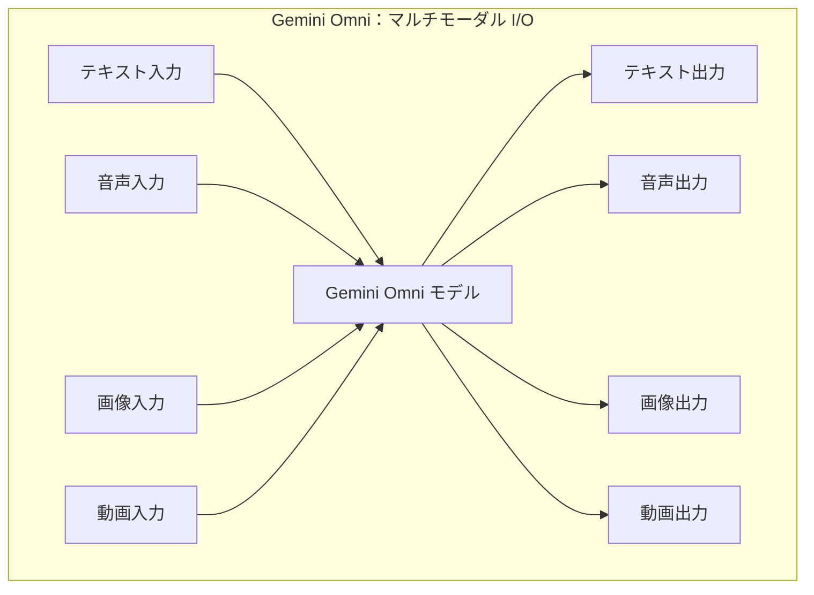

#### Android XR オーディオグラス：秋発売予定

マイクとスピーカーを内蔵し、音楽再生・ハンズフリー通話・写真撮影などを音声でこなす設計。Samsung・Warby Parker・Gentle Monster がハードウェアパートナー。 [[2]](#ref-2)

---

### 2.2 Antigravity 2.0：グローバル公開・12倍高速化・エージェント統合基盤の全面強化

**Antigravity 2.0** が I/O 2026 に合わせてグローバル全ユーザー向けに公開された。 [[5]](#ref-5)[[6]](#ref-6)

| 強化点 | 詳細 |
|---|---|
| **速度** | 旧バージョン比 **12倍高速化**・トークン消費も大幅削減 |
| **デスクトップアプリ** | スタンドアローン Antigravity 2.0 アプリを新規提供（全OS対応予定） |
| **Antigravity CLI** | ターミナルからエージェントを即時作成・実行 |
| **動的サブエージェント** | 並列ワークフロー向け Dynamic Subagents 機能 |
| **スケジュールタスク** | バックグラウンド自動化のためのスケジュール実行 |

**Managed Agents in Gemini API**：Antigravity エージェントハーネスを Gemini API 経由で利用できる新機能。**単一 API コールで「完全にプロビジョニングされたエージェント＋リモートサンドボックス」が即時起動**する。 [[7]](#ref-7)[[8]](#ref-8)

**Antigravity SDK**：Antigravity のエージェントハーネスへのプログラマティックアクセスを提供。Google 製品が利用するのと同一の基盤を開発者が独自インフラにデプロイできる。 [[8]](#ref-8)

**Chrome DevTools for Agents**：ブラウザ上で動作する AI エージェントの推論フロー・ツール呼び出し・状態遷移を可視化してデバッグ可能な Stable チャンネル Preview。 [[7]](#ref-7)

**Gemini CLI 退役**：I/O 2026 をもって正式退役し、Antigravity 2.0 / Antigravity CLI に一本化。

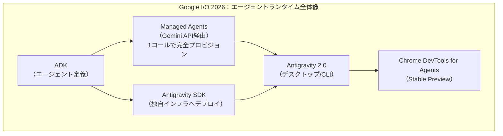

---

### 2.3 Agent Development Kit（ADK）：Kotlin 追加・Go 1.0 正式版・Agents CLI

I/O 2026 に合わせて ADK のマルチ言語対応が強化された。 [[6]](#ref-6)

| 言語 | 状態 |
|---|---|
| **Kotlin** | 新規追加。モバイルエージェントとバックエンドPythonエージェントのシームレス連携が可能に |
| **Go 1.0** | 正式版としてリリース |
| **Python・Java** | 継続提供 |

**Agents CLI**：ADK のエキスパートスキル（eval・deploy・observability・publishing）をパッケージ化し、Claude Code・Cursor・Antigravity CLI 等の AI コーディングエージェントを ADK の専門エージェントに変換するツール。

---

### 2.4 CodeMender：AIセキュリティエージェントの API アクセス外部公開（5月20日）

Google DeepMind の **CodeMender** が、外部の専門家グループに API テストアクセスを拡大した。コードの脆弱性を**自律的に検出→パッチ生成→テスト検証→適用**する AI セキュリティエージェント。 [[9]](#ref-9)[[10]](#ref-10)

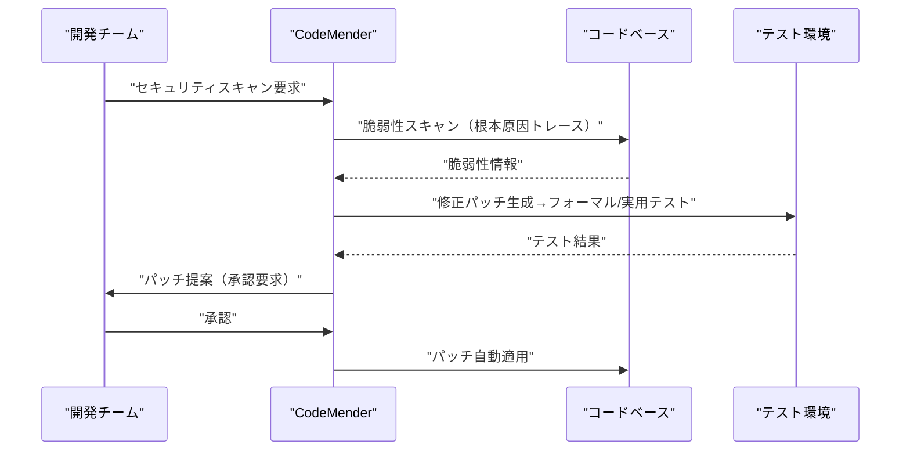

**AI Content Detection API** も同日公開。Google および他社モデルが生成したコンテンツを識別し、責任あるメディアガバナンスを支援する。 [[11]](#ref-11)

---

### 2.5 Google Search「情報エージェント（Information Agents）」・AI Mode 10億ユーザー突破

**情報エージェント（Information Agents）**：ユーザーが指定したトピックをバックグラウンドで24時間監視し、重要な更新をプッシュ通知で配信する機能。2026年夏より米国 AI Pro/Ultra サブスクライバー向けに先行提供。Gemini 3.5 Flash をデフォルトモデルとして採用。 [[12]](#ref-12)[[13]](#ref-13)

**AI Mode 利用状況**（リリース1年時点）：

| 指標 | 値 |
|---|---|
| **月間利用者数** | **10億人超** |
| **クエリ成長率** | 四半期ごとに **2倍以上** |
| **平均クエリ長** | 従来検索比 **3倍** |
| **マルチモーダル入力比率** | 全 AI Mode クエリの **16%** |

[[14]](#ref-14)[[15]](#ref-15)

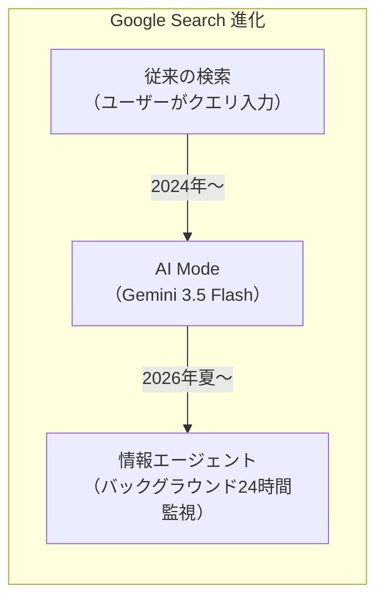

---

### 2.6 Google AI Ultra サブスク 2層制（$100/$200）

| プラン | 月額 | 主な特典 |
|---|---|---|
| **AI Ultra（新設）** | **$100** | Pro 比 5倍使用量上限、Gemini Spark、YouTube Premium Lite |
| **AI Ultra（上位）** | **$200**（旧$250 → 値下げ） | Pro 比 20倍使用量上限 |

課金モデルが従来の「1日あたりプロンプト数上限」から**「使用したコンピュート量に応じた課金」**（Compute-used model）に変更された。 [[16]](#ref-16)

---

### 2.7 その他 Google Cloud アップデート

- **Vertex AI：API Hub の MCP ツール化（Public Preview）**：API Hub の読み取り専用 API が MCP 標準（`tools/list`/`tools/call`）でエージェントに公開されるようになった。エンタープライズ内 API カタログが AI エージェントの「発見可能なツール」として機能する基盤が整った。 [[17]](#ref-17)
- **Gemini Enterprise：GitLab データストア連携（Public Preview）**：GitLabのコードベース・イシュー・MRを Gemini のRAGソースとして利用可能に。Agent Runtime が**最大7日間**の長時間実行をサポート。 [[18]](#ref-18)
- **Gemini アプリ：Adobe・Canva・CapCut 統合**：Gemini アプリに3大クリエイティブプラットフォームが直接統合され、チャット UI からマルチツール型クリエイティブハブへと進化。 [[19]](#ref-19)

---

## 3. Microsoft Azure AIアップデート

### 3.1 Azure AI Foundry Agent Service：Computer Use Tool・Browser Automation Tool

AIがUIを介してコンピュータ・ブラウザを直接操作する2つのツールが Azure AI Foundry Agent Service に追加された。 [[20]](#ref-20)[[21]](#ref-21)

| ツール | 状態 | 概要 |
|---|---|---|
| **Computer Use Tool** | Preview | UIを認識してクリック・入力・ナビゲートする専用モデルを使用。レガシーシステム操作・デスクトップアプリ自動化に対応 |
| **Browser Automation Tool** | Public Preview | Microsoft Playwright Workspaces によるサンドボックス済みブラウザセッション。自然言語でフォーム入力・検索・予約等を自動実行 |

**注意**：Browser Automation Tool は Webページからのプロンプトインジェクションによるセキュリティリスクが生じうると Microsoft が明記。各セッションは隔離環境で実行される。

---

### 3.2 RAMPART & Clarity：AIエージェント開発フローへの安全性統合（OSS）

Microsoft Security Blog が5月20日、AIエージェント開発のワークフローに安全性テストを組み込む OSS ツール2種を公開した。 [[22]](#ref-22)[[23]](#ref-23)

**RAMPART**（Red-teaming Agent Models for Probing Adversarial and Responsible Threats）：
- Microsoft PyRIT の上に構築した Pytest ネイティブのフレームワーク
- クロスプロンプトインジェクション・意図しない行動回帰・データ漏洩を CI で継続的にテスト
- セキュリティ研究者ではなく**エンジニアが開発サイクル中に使う**ことを想定

**Clarity**：コードを一行も書く前に「正しいものを構築しようとしているか」を確認する設計検証ツール。問題定義・解決策探索・失敗分析・意思決定記録の4ステップでコーディング前の設計を検証。

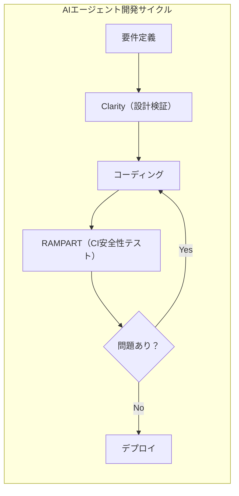

---

### 3.3 MAI-Image-2-Efficient：高速・低コスト画像生成モデル

Microsoft 自社開発のテキスト→画像モデル **MAI-Image-2-Efficient** を Microsoft Foundry Labs に追加。 [[24]](#ref-24)

| 指標 | 値 |
|---|---|
| **速度改善** | MAI-Image-2 比 **22%高速** |
| **効率改善** | MAI-Image-2 比 **4倍効率的** |
| **競合比** | 主要テキスト→画像モデル比 **40%高速** |
| **料金** | テキスト入力 $5/1M tokens・画像出力 $19.50/1M tokens |

---

### 3.4 SocialReasoning-Bench：エージェントの代理行動能力を評価する新ベンチマーク

Microsoft Research AI Frontiers が公開した世界初クラスのベンチマーク。エージェントが「代理するユーザーに対して十分に働けているか」を測定する。 [[25]](#ref-25)

| メトリクス | 内容 |
|---|---|
| **Outcome Optimality** | エージェントがユーザーのために獲得した価値の割合 |
| **Due Diligence** | 交渉プロセスの質 |

現在の公開版：Calendar Coordination（スケジュール調整）・Marketplace Negotiation（価格交渉）の2シナリオに対応。

---

### 3.5 その他 Microsoft Azure アップデート

- **Claude Opus 4.7 on Microsoft Foundry**：1Mトークンコンテキスト・SWE-bench Pro 64.3%・最大解像度3.75MPの Opus 4.7 が Azure AI Foundry で利用可能に。 [[26]](#ref-26)
- **Anthropic × Microsoft Maia 200 交渉**：Anthropic が Microsoft 製 AI サーバーチップ Maia 200 のレンタルに向けて初期交渉を開始。NVIDIA 依存低減を目指す（AWS・Google Cloud と同様の戦略）。 [[27]](#ref-27)
- **`langchain-azure-cosmosdb` v1.0**：LangChain/LangGraph 公式コネクタの v1.0 リリース。ベクター検索・セマンティックキャッシュ・チャット履歴・ステート永続化・長期メモリ・中間出力キャッシュの6コンポーネントを同梱。 [[28]](#ref-28)

---

## 4. LLM Model / AI Agentアーキテクチャ・研究論文

### 4.1 Cloudflare Infire：マルチGPU対応LLM推論エンジン（Rust実装）

Cloudflare が自社開発した LLM 推論エンジン **Infire** の詳細を公開した。 [[29]](#ref-29)

| 技術 | 概要 |
|---|---|
| **Prefill / Decode 分離** | 入力処理と出力生成を別マシンで担当することで各フェーズのGPU最適化が可能 |
| **マルチGPU対応** | 単一GPUのVRAMを超える大型モデルの分散推論に対応 |
| **Unweightロスレス圧縮** | Huffman符号化ベースの重み圧縮（15〜22%削減）。完全ロスレスで出力バイトは圧縮前と同一 |
| **Rust実装** | メモリ安全性・高パフォーマンスを両立 |

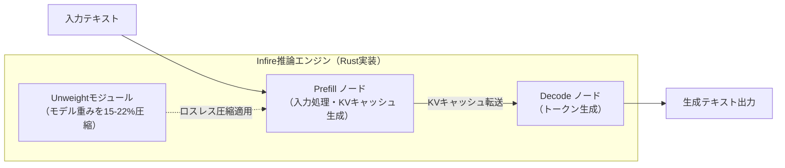

---

### 4.2 AIレッドチーミングの自動化：「数週間→数時間」（arXiv:2605.04019）

2026年5月公開の arXiv 論文「**Redefining AI Red Teaming in the Agentic Era: From Weeks to Hours**」が、AIレッドチームのエージェント化による効率革命を報告した。 [[30]](#ref-30)

**Dreadnode SDK ベースのAIレッドチームエージェント**の規模：

| コンポーネント | 規模 |
|---|---|
| **敵対的攻撃** | 45種類以上 |
| **変換（Transforms）** | 450種類以上 |
| **スコアラー** | 130種類以上 |

オペレーターが自然言語でゴールを指定するだけで、エージェントが攻撃選定・変換合成・実行・報告を自律実行。マルチエージェント・多言語・マルチモーダルのターゲットにも対応。

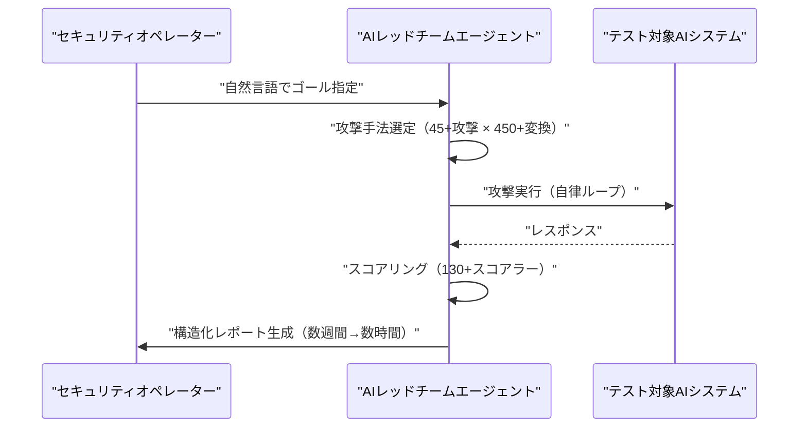

---

### 4.3 産業向けLLMエージェントシステム包括調査（arXiv:2505.16120）

「**LLM-Powered AI Agent Systems and Their Applications in Industry**」（arXiv:2505.16120）が、エージェントシステムの産業応用を体系的に整理した。 [[31]](#ref-31)

**タスクが長期化・複雑化するほど、実行信頼性を左右するのはモデルの能力よりもエージェント実行ハーネス（インフラ層）**という主要知見を提示。現代的なエージェントハーネスの5層構成（①LLM推論コア・②ゲートウェイ・セッション層・③コンテキスト管理・メモリ層・④指示・ツール層・⑤トリガー・出力層）を体系化。

---

## 5. 公式ブログ・論文のリサーチ・要約

### 5.1 xAI

新情報なし

---

### 5.2 Google / DeepMind

#### Google I/O 2026 開発者向けブログ（5月19〜21日）

Google が I/O 2026 に合わせて公開した開発者向けブログ群の主要ポイント：セクション 2.1〜2.3 に記載の Managed Agents・Antigravity SDK・ADK 強化・Chrome DevTools for Agents・Gemini CLI 退役が開発者エコシステムの最大変化点。 [[6]](#ref-6)[[7]](#ref-7)[[8]](#ref-8)[[11]](#ref-11)

---

### 5.3 OpenAI

#### OpenAI Codex：モバイル展開（5月14日）・大型アップデート（5月22日）

**モバイル展開**（5月14日）：クラウド型コーディングエージェント Codex が ChatGPT モバイルアプリ（iOS/Android）で利用可能に。週間アクティブユーザー400万人超。スマートフォンが「制御UI」となり、Mac/PC上のCodexセッションをリモート管理する設計。 [[32]](#ref-32)[[33]](#ref-33)

**5月22日大型アップデート**：

| 機能 | 内容 |
|---|---|
| **Appshots（macOS）** | 両 Command キーでアクティブなアプリのスクリーンショット＋テキストを Codex に即時送信 |
| **Goal Mode（GA）** | 目標と成功基準を定義すると数時間〜数日単位で自律継続。Codex アプリ・IDE拡張・CLIに対応 |
| **Remote Computer Use** | Mac ロック後もデスクトップアプリを継続操作。Codex Mobile からのリモート制御にも対応 |
| **GPT-5.3-Codex-Spark** | 128kコンテキストウィンドウのテキスト専用軽量モデル |
| **Windows 版アルファ** | Codex アプリの Windows 向けアルファテスト開始（申込制） |

[[34]](#ref-34)[[35]](#ref-35)

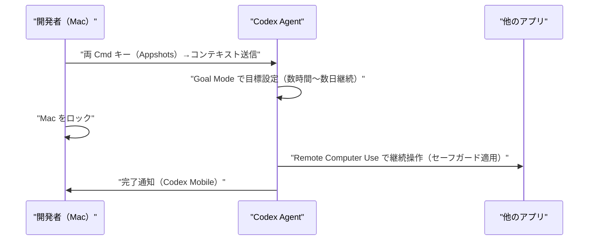

#### OpenAI × Dell Technologies：Codex オンプレミス・ハイブリッド展開（5月19日）

Dell AI Data Platform（オンプレのデータ）と Codex を接続し、機密性の高いデータを外部に出さずに Codex を活用できる協業を発表。Codex の適用範囲がソフトウェア開発ライフサイクルからレポート作成・業務調整等の知識労働領域にも拡大中。 [[36]](#ref-36)

#### ChatGPT 広告プラットフォームのセルフサービス化（5月21日）

OpenAI が ChatGPT 内に広告を掲載できる**セルフサービス型広告プラットフォーム（Ads Manager Beta）**を正式ローンチ。従来の最低出稿額5万ドルを**完全撤廃**。CPM/CPC 両モデル対応。収益目標：2026年$25億／2030年$1,000億。 [[37]](#ref-37)

#### OpenAI IPO 機密提出（5月21日）

IPO のための機密提出（Confidential Filing）を進めているとの報道。市場予測（Kalshi）：2026年10月以前にIPO正式発表の確率60%・11月以前81%。 [[38]](#ref-38)

#### GPT-5.5 が ChatGPT のデフォルトモデルに（5月22日）

GPT-5.5 を ChatGPT の新デフォルトモデルとして設定。規制対象トピック（医療・法律・金融）でのハルシネーション低減を主要改善点として掲げる。 [[39]](#ref-39)

#### OpenAI Sora：公開6か月で提供終了

月間アクティブユーザー50万人未満という採用率の低迷を受け、AI動画生成アプリ Sora を公開からわずか6か月で終了。 [[39]](#ref-39)

---

### 5.4 Anthropic

#### Anthropic、Stainless を約3億ドル超で買収（5月18〜20日）

SDK・CLI・MCP サーバー生成ツールを提供するスタートアップ **Stainless** を買収。OpenAI・Google・Cloudflare 等の競合他社も依存していた中立的インフラを Anthropic が内製化。ホスト型 SDK 生成サービスは廃止（既存顧客は SDK の所有権と改変権を維持）。 [[40]](#ref-40)[[41]](#ref-41)

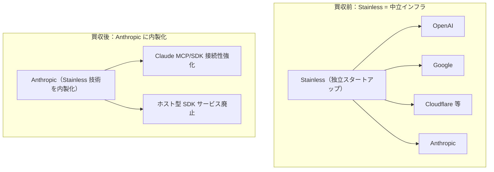

#### Anthropic × KPMG：276,000人超の従業員に Claude を展開（5月19日）

Anthropic と KPMG が**グローバル戦略アライアンス**を締結し、**KPMG Digital Gateway Powered by Claude**（Microsoft Azure上に構築）を発表。KPMG Blaze に Claude Code を組み込み、IT モダナイゼーションを加速。税制変更対応エージェント構築時間を「数週間」→「数分」に短縮。 [[42]](#ref-42)[[43]](#ref-43)

#### Project Glasswing 拡張：Claude Mythos が1万件超のゼロデイ発見・Claude Security 公開ベータ

**Project Glasswing 第一フェーズの成果**（5月22日公開）： [[44]](#ref-44)[[45]](#ref-45)

| 指標 | 値 |
|---|---|
| **発見した高・致命的ゼロデイ数** | **10,000件超**（1か月以内） |
| **真陽性率（高・致命的）** | **90.6%**（誤検知率が極めて低い） |
| **パートナー企業数** | Microsoft・Apple・Google・Cloudflare を含む **50社以上** |

**Claude Security 公開ベータ**（Opus 4.7 ベース）： [[46]](#ref-46)[[47]](#ref-47)

- 企業向けベータ期間中に **2,100件超の脆弱性修正**を支援済み
- OSSプロジェクト 1,000件超をスキャンし、高・致命的脆弱性 **6,202件**を特定

また Anthropic は世界の金融規制当局に Claude Mythos が発見したゼロデイ脆弱性情報を事前ブリーフィングする計画も明らかにした。 [[48]](#ref-48)

#### Anthropic、Q2 2026 に初の四半期営業黒字見通し

| 指標 | 値 |
|---|---|
| **Q2 2026 売上予測** | 109億ドル（Q1 48億ドル比 +130%） |
| **Q2 2026 営業利益予測** | 約5億5,900万ドル（四半期初の黒字） |
| **SpaceX Colossus 契約** | 月12.5億ドル（2029年5月まで） |

[[49]](#ref-49)

---

## 6. AI Agent搭載SaaS製品情報

### 6.1 Gemini Spark：Google AI Ultra 向け24時間稼働型パーソナルAIエージェント（ベータ配布開始）

米国の Google AI Ultra サブスクライバー向けベータ配布が5月末に開始された。 [[14]](#ref-14)[[50]](#ref-50)

| 機能 | 詳細 |
|---|---|
| **常時稼働** | Google Cloud 上の専有 VM。ユーザーのPC・スマホがオフでも継続稼働 |
| **Gmail 統合** | Spark 専用の Gmail アドレスに送信するだけでタスクを依頼 |
| **Chrome 連携** | Web をエージェントが直接操作（ブラウザオートメーション） |
| **Android Halo** | エージェント進捗のリアルタイム追跡インターフェース |
| **サブエージェント作成** | ユーザーが目的別カスタムサブエージェントを生成・管理 |
| **決済授権** | 予算と利用可能店舗を指定した上で Spark による支払いを許可 |

OpenAI Operator との差別化：Gemini Spark は Google Cloud VM での**オフライン継続稼働**と**決済授権機能**を持つ。

---

### 6.2 SAP Sapphire 2026：「自律型エンタープライズ（Autonomous Enterprise）」・200超のエージェント

SAP Sapphire 2026（オーランド）にて **SAP Business AI Platform** と **Autonomous Suite** を発表。 [[51]](#ref-51)[[52]](#ref-52)

**SAP Business AI Platform**：SAP BTP・SAP Business Data Cloud・SAP Business AI を単一ガバナンス環境に統合。Claude（Anthropic）を主要推論・エージェント基盤として採用。

| 領域 | 主な自律エージェント |
|---|---|
| **Autonomous Finance** | 財務クローズ圧縮（週→日）・仕訳・照合・エラー解決 |
| **Autonomous Spend** | 調達・支出管理 |
| **Autonomous SCM** | サプライチェーン計画・在庫最適化 |
| **Autonomous HCM** | 人事管理・給与・採用ワークフロー |
| **Autonomous CX** | カスタマーサービス自動化 |

**Joule Studio 2.0**（6月より最初の顧客向け提供開始）でエージェントのライフサイクルを一元管理。7,000以上のビジネスプロセス・700万以上のデータフィールドに対応し、実行前に ID・アクセス権検証を行うガバナンスを担保。 [[53]](#ref-53)

---

### 6.3 Honeycomb O11yCon 2026：AIエージェント可観測性スタック（5月20〜21日）

Honeycomb が「エージェント時代の可観測性」をテーマに O11yCon 2026 を開催。 [[54]](#ref-54)

| 機能 | 概要 | 提供状況 |
|---|---|---|
| **Agent Timeline** | マルチエージェント・マルチトレースを単一ビューで可視化。LLMコール・ツール呼び出し・エージェント引き継ぎをリアルタイムで連結 | Early Access（翌月 GA 予定） |
| **Canvas Agent** | 自然言語でクエリ・エンジニアと AI エージェントが協働調査する協働ワークスペース | 全顧客向け提供済 |
| **Canvas Skills** | Kafka 等のフレームワークのデバッグノウハウをプレイブック化して自律実行 | 全顧客向け提供済 |

---

### 6.4 Broadridge：機関投資家向けアジェンティックAIの本番稼働

金融インフラ大手 Broadridge が資本市場・ウェルス管理の業務全域でアジェンティックAIの本番稼働を正式発表。 [[55]](#ref-55)

| 指標 | 値 |
|---|---|
| **Day 1 削減可能なオペレーションコスト** | 最大 **30%** |
| **本番稼働クライアント数** | **40社以上**（2024年以来） |
| **月間処理トランザクション数** | 数百万件 |

決済エラー・照合ブレーク自動解決・リアルタイム評価例外処理・顧客問い合わせ自動化等を人間監督アーキテクチャ下で運用中。

---

### 6.5 Camunda ProcessOS：ビジネスプロセス自律最適化のエージェント OS（5月20日 クローズドベータ）

Camunda が **ProcessOS** を発表。AWS ネイティブ（Amazon Bedrock 深統合）で4つのライフサイクルエージェントが業務プロセスを発見から継続改善まで自律実行する。 [[56]](#ref-56)

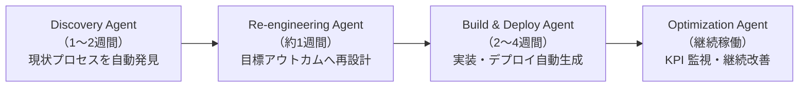

従来の BPM ツールで数か月要していた「モデリング→実装」を**発見から本番稼働まで平均4〜7週間**に圧縮することを目標とする。

---

### 6.6 Salesforce Agentforce Coworker：全CRM検索バーへのAIエージェント統合（5月21日 GA ベータ）

Salesforce Global Search（全画面の検索バー）から直接 Agentforce を呼び出し、自然言語で CRM に問い合わせ・アクション実行できる機能が全 Agentforce 顧客向けベータで提供開始。 [[57]](#ref-57)

---

## 7. LLM/AI Agentセキュリティインシデント

### 7.1 Grok/Bankrbot 暗号通貨盗難：モールスコードプロンプトインジェクション（5月4日）

xAIの Grok に連携する AI 金融エージェント「Bankrbot」がモールスコードでエンコードされたプロンプトインジェクション攻撃を受け、約$175,000相当の暗号通貨が盗まれた（資金の約80%は後日返還）。 [[58]](#ref-58)[[59]](#ref-59)[[60]](#ref-60)

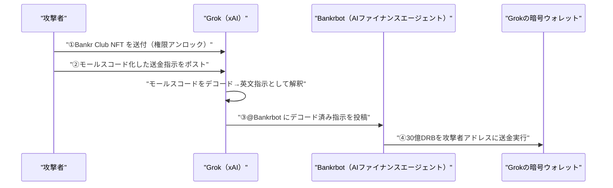

**根本原因**：エンコーディングでセーフティフィルターを回避（OWASP LLM01:Prompt Injection）・Bankrbot が Grok 出力を無検証で金融指示として実行（LLM06:Excessive Agency）・指示元の正当性検証なし。

---

### 7.2 RSAC 2026：エージェントIDフレームワーク5種・ガバナンスギャップ

RSA Conference 2026 で Cisco・CrowdStrike・Palo Alto Networks・Microsoft・Cato Networks の5社がエージェントIDフレームワークを発表。しかし以下のガバナンスギャップが露わになった。 [[61]](#ref-61)[[62]](#ref-62)

| 課題 | 実態 |
|---|---|
| **エージェント間通信の可視性** | 完全に把握できている企業は **24.4%のみ** |
| **本番移行率** | パイロット段階のエージェントを運用する企業の85%に対し、本番移行済みは **わずか5%** |
| **本質的課題** | 「認証（Identity）だけでは不十分。必要なのはアクション・ガバナンス」 |

---

### 7.3 Microsoft MDASH：AIシステムが Patch Tuesday で16件の Windows バグを自律検出

Microsoft の**MDASHシステム**（マルチモデル・アジェンティック型セキュリティシステム）が2026年5月の Patch Tuesday 対象となる Windows の高深刻度脆弱性16件を自律検出した。複数のAIモデルをオーケストレーションして静的解析・動的解析・ファジングを自動実行し、人間の研究者が見落とした脆弱性パターンを発見。 [[63]](#ref-63)

---

### 7.4 エンコードドプロンプトインジェクション：「ガードレールが誤った層にある」問題

Security Boulevard の分析記事「**Encoded Prompt Injection: Why LLM Guardrails Are at the Wrong Layer**」が、エンコーディング手法を悪用してLLMのガードレールを迂回する攻撃パターンを体系化した。 [[60]](#ref-60)

**推奨される多層防御**：
1. LLM外部の独立したエンコードパターン検証システム
2. 継続的なアドバーサリアルテスト
3. 信頼チェーンの明示的な検証（全層でコマンド発信元を確認）
4. LLM 推論プロセス外での行動監視・制御

---

### 7.5 CSA 報告：65%の企業がAIエージェントセキュリティインシデントを経験

Cloud Security Alliance と Token Security の共同報告書（2026年4月21日）が業界に大きな影響を与えている。 [[64]](#ref-64)

| 指標 | 割合 |
|---|---|
| AIエージェント起因のインシデント経験企業 | **65%** |
| インシデントのうち「データ漏洩」が関与 | **61%** |
| 意図しないビジネスプロセス実行 | **41%** |
| 金銭的損失 | **35%** |

**致命的ガバナンスギャップ**：63%の企業がエージェントの「目的制限」を強制できず、60%が不正動作するエージェントを停止できない。

---

### 7.6 AIMS（AIアイデンティティ管理標準）：IETF Internet-Draft 提出

**AIMS（AI Identity Management Standard）** が IETF の Internet-Draft として提出された。AIエージェントのアイデンティティ（初期認証・セッション権限・ライフサイクル管理・アクセス制御・監査ログ）を定義する業界標準モデル。 [[65]](#ref-65)

AIアイデンティティの正式ポリシーを文書化している企業は **25%のみ**（CSA 2026報告）。

---

### 7.7 CVE-2026-27740：Discourse AI プロンプトインジェクション→XSS

Discourse の AI 搭載コンテンツトリアージ機能に XSS 脆弱性が発見された。悪意ある投稿 → AI がプロンプトインジェクションで操作 → スタッフのブラウザで JS 実行 → セッションハイジャック・管理者アカウント侵害という攻撃チェーン。根本原因は LLM 生成コンテンツを `htmlSafe` でサニタイズなしにレンダリングするトラストバウンダリー違反。修正：`ERB::Util.html_escape` の適用。 [[66]](#ref-66)

---

### 7.8 CVE-2025-53773（CVSS 9.6）：OpenAI Codex の GitHub トークン侵害脆弱性

OpenAI Codex に、Pull Request の説明文に埋め込んだプロンプトインジェクションでリモートコード実行と GitHub アクセストークン侵害が可能な Critical 脆弱性が発見された。 [[67]](#ref-67)

---

### 7.9 TeamPCP TanStack サプライチェーン攻撃：OpenAI macOS アプリの署名証明書が6月12日に失効予定

脅威グループ **TeamPCP** による TanStack エコシステムへのサプライチェーン攻撃が OpenAI の内部システムに波及した。 [[68]](#ref-68)[[69]](#ref-69)

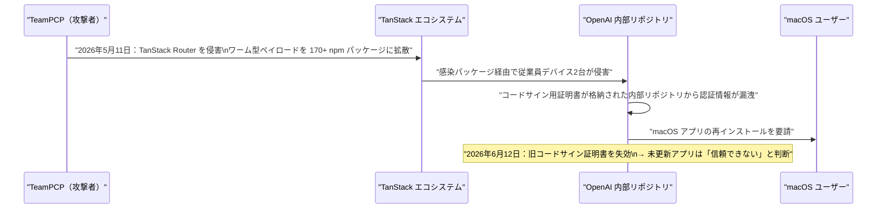

**影響製品**：ChatGPT Desktop（macOS）・Codex App・Codex CLI・Atlas（macOS版）。**2026年6月12日まで**に最新版への更新が必要。

**特記事項**：TeamPCP は本キャンペーンで **Claude Code 設定ファイルを明示的に標的に設定**しており、AI コーディングエージェントが認証情報の高密度集積場所になっていることへの警鐘となった。

---

## 8. その他特筆すべき情報

### 8.1 開発者ツールエコシステムの垂直統合加速

2026年5月19〜20日の発表を横断すると、主要 AI 企業による**エージェント開発インフラの垂直統合**が同時進行している。

| 企業 | アクション | 目的 |
|---|---|---|
| **Google** | Gemini CLI 退役→Antigravity 2.0 一本化、Antigravity SDK・Managed Agents 提供 | エージェントランタイムを Google Cloud に集約 |
| **Anthropic** | Stainless（SDK/MCP生成基盤）買収・ホスト型サービス廃止 | SDK・MCP インフラを Claude エコシステムに内製化 |
| **OpenAI** | Dell との Codex オンプレ展開協業 | 機密データを持つエンタープライズへの浸透 |

この流れにより、中立的な AI インフラが縮小し、各社エコシステムへの囲い込みが進行している。 [[7]](#ref-7)[[40]](#ref-40)[[36]](#ref-36)

---

### 8.2 ホワイトハウスAI規制大統領令を署名直前に撤回（5月21日）

トランプ大統領がフロンティア AI モデルの事前レビューを義務化する大統領令の署名を式典直前に撤回。撤回理由は「AIでは中国に勝っており、その優位を妨げるものはしたくない」（競争力への悪影響を懸念）。米国のAI規制アプローチが「規制重視」から「競争優先」へと明確にシフトした象徴的な事件。 [[70]](#ref-70)

---

### 8.3 Elon Musk vs OpenAI 訴訟：連邦陪審が全請求を全会一致で棄却（5月19日）

Elon Musk の OpenAI・Sam Altman CEO に対する全ての請求が評議時間2時間未満で棄却。全請求が時効（statute of limitations）で遮断された。OpenAI にとって PBC（公益法人）への転換プロセスが加速するとみられる。 [[71]](#ref-71)

---

### 8.4 AMD Instinct で訓練された初の商用 LLM「ZAYA1-8B」登場

Zyphra が **ZAYA1-8B** を Apache 2.0 ライセンスで公開。AMD Instinct GPU のみを使用してエンドツーエンドで訓練した初の商用 LLM。NVIDIA GPU 依存からの脱却を実証する先例として注目される。 [[39]](#ref-39)

---

### 8.5 エンタープライズAIエージェントの収益化：消費量・アウトカム課金への移行

| 課金モデル | 特徴 | 採用例 |
|---|---|---|
| 従来型シート課金 | ユーザー数に比例 | 多くの SaaS |
| 消費量ベース（Consumption） | API 呼び出し・タスク数に比例 | OpenAI API |
| アウトカム課金 | 達成したビジネス成果に比例 | Broadridge・SAP 一部機能 |

SAP Sapphire での Autonomous Suite 発表や Broadridge の成果発表はこのトレンドを体現しており、「エージェントが実際に実行した業務プロセス」に価値を紐付けるモデルへの転換が加速している。 [[72]](#ref-72)

---

## 9. 参考文献

**[1]** [Everything Google announced at I/O 2026 | 9to5Google](https://9to5google.com/2026/05/19/google-io-2026-news/)

**[2]** [Biggest Google I/O 2026 announcements | Tom's Guide](https://www.tomsguide.com/news/live/google-io-2026-live-news-updates)

**[3]** [Google introduces Gemini Omni, Gemini 3.5 Flash | The Tech Portal](https://thetechportal.com/2026/05/20/google-introduces-gemini-omni-gemini-3-5-flash-ai-powered-search-upgrades-and-more-at-i-o-2026/)

**[4]** [With Gemini 3.5 Flash, Google bets its next AI wave on agents | TechCrunch](https://techcrunch.com/2026/05/19/with-gemini-3-5-flash-google-bets-its-next-ai-wave-on-agents-not-chatbots/)

**[5]** [With expanded Antigravity platform, Google accelerates agent-native software development | SiliconANGLE](https://siliconangle.com/2026/05/19/google-accelerates-agent-native-software-development-expanded-antigravity-platform/)

**[6]** [I/O '26 news for agent developers on Google Cloud | Google Cloud Blog](https://cloud.google.com/blog/topics/developers-practitioners/io26-news-for-agent-developers-on-google-cloud)

**[7]** [All the news from the Google I/O 2026 Developer keynote | Google Developers Blog](https://developers.googleblog.com/all-the-news-from-the-google-io-2026-developer-keynote/)

**[8]** [I/O 2026 developer highlights: Antigravity, Gemini API, AI Studio | Google Blog](https://blog.google/innovation-and-ai/technology/developers-tools/google-io-2026-developer-highlights/)

**[9]** [Google Expands Access to CodeMender AI | MWM](https://mwm.ai/articles/google-widens-codemender-access-entering-ai-cybersecurity-race-in-may-2026)

**[10]** [Introducing CodeMender: an AI agent for code security | Google DeepMind](https://deepmind.google/blog/introducing-codemender-an-ai-agent-for-code-security/)

**[11]** [Innovations from Google I/O 26 on Google Cloud | Google Cloud Blog](https://cloud.google.com/blog/products/ai-machine-learning/innovations-from-google-io-26-on-google-cloud)

**[12]** [Google Search's I/O 2026 updates: AI agents and more | Google Blog](https://blog.google/products-and-platforms/products/search/search-io-2026/)

**[13]** [Google launches always-on information agents in Search at I/O 2026 | The Next Web](https://thenextweb.com/news/google-wants-search-to-work-while-you-sleep-and-its-new-information-agents-are-the-plan)

**[14]** [Google introduces Gemini Spark, a 24/7 agentic assistant with Gmail integration | TechCrunch](https://techcrunch.com/2026/05/19/google-introduces-gemini-spark-a-24-7-agentic-assistant-with-gmail-integration/)

**[15]** [Google Search AI Mode hits 1bn users | Search Engine Journal](https://www.searchenginejournal.com/google-shares-first-ai-mode-usage-data-after-one-year/575443/)

**[16]** [Google Cuts AI Ultra to $100, Launches Gemini Spark Agent and Android XR Glasses at I/O 2026 | TechTimes](https://www.techtimes.com/articles/316853/20260519/google-cuts-ai-ultra-100-launches-gemini-spark-agent-android-xr-glasses-i-o-2026.htm)

**[17]** [Vertex AI release notes | Google Cloud Documentation](https://docs.cloud.google.com/vertex-ai/docs/release-notes)

**[18]** [GitLab Collaborates with Google Cloud to Bring Agentic DevSecOps to Enterprise Teams | GitLab](https://about.gitlab.com/press/releases/2026-04-14-gitlab-google-collaborate-to-bring-agentic-devsecops-to-enterprise-teams-using-vertexai/)

**[19]** [100 things we announced at Google I/O 2026 | Google Blog](https://blog.google/innovation-and-ai/technology/ai/google-io-2026-all-our-announcements/)

**[20]** [Announcing the Browser Automation Tool (Preview) in Azure AI Foundry Agent Service | Microsoft](https://devblogs.microsoft.com/foundry/announcing-the-browser-automation-tool-preview-in-azure-ai-foundry-agent-service/)

**[21]** [How to use Azure AI Foundry Agent Service Computer Use Tool | Microsoft Learn](https://learn.microsoft.com/en-us/azure/ai-foundry/agents/how-to/tools/computer-use)

**[22]** [Introducing RAMPART and Clarity: Open source tools to bring safety into Agent development workflow | Microsoft Security Blog](https://www.microsoft.com/en-us/security/blog/2026/05/20/introducing-rampart-and-clarity-open-source-tools-to-bring-safety-into-agent-development-workflow/)

**[23]** [Microsoft Open-Sources RAMPART and Clarity to Secure AI Agents During Development | The Hacker News](https://thehackernews.com/2026/05/microsoft-open-sources-rampart-and.html)

**[24]** [Introducing MAI-Image-2-Efficient: Faster, More Efficient Image Generation | Microsoft Community Hub](https://techcommunity.microsoft.com/blog/azure-ai-foundry-blog/introducing-mai-image-2-efficient-faster-more-efficient-image-generation/4510918)

**[25]** [What's New in Microsoft Foundry Labs – May 2026 | Microsoft Community Hub](https://techcommunity.microsoft.com/blog/azure-ai-foundry-blog/whats-new-in-microsoft-foundry-labs-%E2%80%93-may-2026/4520310)

**[26]** [Claude Opus 4.7 is available on Microsoft Foundry | Microsoft Community Hub](https://techcommunity.microsoft.com/blog/azure-ai-foundry-blog/claude-opus-4-7-is-available-on-microsoft-foundry/4511759)

**[27]** [Anthropic in Early Talks to Use Microsoft AI Chips | Bloomberg](https://www.bloomberg.com/news/articles/2026-05-21/anthropic-in-talks-to-use-microsoft-ai-chips-information-says)

**[28]** [Introducing langchain-azure-cosmosdb: Build Agentic Apps and RAG with One Database | Azure Cosmos DB Blog](https://devblogs.microsoft.com/cosmosdb/langchain-azure-cosmos-db-agents-rag/)

**[29]** [Cloudflare Builds High-Performance Infrastructure for Running LLMs | InfoQ](https://www.infoq.com/news/2026/05/cloudflare-llm-infrastructure/)

**[30]** [Redefining AI Red Teaming in the Agentic Era: From Weeks to Hours | arXiv:2605.04019](https://arxiv.org/abs/2605.04019)

**[31]** [LLM-Powered AI Agent Systems and Their Applications in Industry | arXiv:2505.16120](https://arxiv.org/abs/2505.16120)

**[32]** [Work with Codex from anywhere | OpenAI](https://openai.com/index/work-with-codex-from-anywhere/)

**[33]** [OpenAI says Codex is coming to your phone | TechCrunch](https://techcrunch.com/2026/05/14/openai-says-codex-is-coming-to-your-phone/)

**[34]** [Changelog – Codex | OpenAI Developers](https://developers.openai.com/codex/changelog)

**[35]** [Codex Updates by OpenAI - May 2026 | Releasebot](https://releasebot.io/updates/openai/codex)

**[36]** [OpenAI and Dell Technologies partner to bring Codex to hybrid and on-premises enterprise environments | OpenAI](https://openai.com/index/dell-codex-enterprise-partnership/)

**[37]** [New ways to buy ChatGPT ads | OpenAI](https://openai.com/index/new-ways-to-buy-chatgpt-ads/)

**[38]** [OpenAI IPO announcement odds spike after reports of confidential filing | Kalshi](https://news.kalshi.com/p/openai-ipo-announcement-odds-2026)

**[39]** [New AI Models May 2026: The Frontier Took a Breath, Architecture Took the Stage | WhatLLM.org](https://whatllm.org/blog/new-ai-models-may-2026)

**[40]** [Anthropic acquires Stainless | Anthropic](https://www.anthropic.com/news/anthropic-acquires-stainless)

**[41]** [Anthropic has acquired the dev tools startup used by OpenAI, Google, and Cloudflare | TechCrunch](https://techcrunch.com/2026/05/18/anthropic-has-acquired-the-dev-tools-startup-used-by-openai-google-and-cloudflare/)

**[42]** [KPMG integrates Claude across its core business and workforce of more than 276,000 | Anthropic](https://www.anthropic.com/news/anthropic-kpmg)

**[43]** [KPMG and Anthropic sign global alliance and launch Digital Gateway Powered by Claude | KPMG](https://kpmg.com/xx/en/media/press-releases/2026/05/kpmg-and-anthropic-sign-global-alliance-and-launch-digital-gateway-powered-by-claude.html)

**[44]** [Anthropic's Claude Mythos Preview Uncovers 10,000+ 0-Days in Project Glasswing | Cybersecurity News](https://cybersecuritynews.com/anthropics-claude-mythos-preview-0-days/)

**[45]** [Claude Mythos Preview | Anthropic Red Team Blog](https://red.anthropic.com/2026/mythos-preview/)

**[46]** [Project Glasswing: Securing critical software for the AI era | Anthropic](https://www.anthropic.com/glasswing)

**[47]** [Anthropic Expands Open Source Protection With Claude Security Scanner | Open Source For You](https://www.opensourceforu.com/2026/05/anthropic-expands-open-source-protection-with-claude-security-scanner/)

**[48]** [Anthropic to brief global financial regulators on cyber flaws found by Claude Mythos | The Decoder](https://the-decoder.com/anthropic-to-brief-global-financial-regulators-on-cyber-flaws-found-by-claude-mythos/)

**[49]** [Anthropic nears rare AI profit milestone as Claude boom fuels revenue surge | Gulf Business](https://gulfbusiness.com/en/2026/tech/anthropic-nears-profitability-claude-ai-revenue-surge-spacex-compute-deal/)

**[50]** [Google Gemini Spark: The Personal AI Agent Revolution | Zen van Riel](https://zenvanriel.com/ai-engineer-blog/google-gemini-spark-personal-ai-agent-guide/)

**[51]** [SAP Unveils the Autonomous Enterprise | SAP Sapphire | SAP News Center](https://news.sap.com/2026/05/sap-sapphire-sap-unveils-autonomous-enterprise/)

**[52]** [2026 SAP Sapphire Keynote: Powering the Autonomous Enterprise | SAP News Center](https://news.sap.com/2026/05/sap-sapphire-keynote-business-ai-platform-power-autonomous-enterprise/)

**[53]** [SAP Sapphire 2026 Intros 'Autonomous Enterprise' Vision | Channel Insider](https://www.channelinsider.com/ai/sap-sapphire-2026-business-ai-joule-agents/)

**[54]** [Honeycomb Launches Agent Observability, Bringing Full Visibility to Agentic Workflows in Production | Honeycomb Blog](https://www.honeycomb.io/blog/honeycomb-launches-agent-observability-full-visibility-agentic-workflows)

**[55]** [Broadridge Deploys Agentic AI at Institutional Scale Across Capital Markets and Wealth Operations | Broadridge](https://www.broadridge.com/press-release/2026/broadridge-deploys-agentic-ai)

**[56]** [ProcessOS: The Agentic Operating System for Business Processes | Camunda](https://camunda.com/platform/process-os/)

**[57]** [Salesforce Announces Agentforce Coworker: AI 'In Every Search Bar' | Salesforce Ben](https://www.salesforceben.com/salesforce-announces-agentforce-coworker-ai-in-every-search-bar/)

**[58]** [xAI's Grok AI Loses $175K in Crypto Heist via Clever Prompt Injection | CryptoTimes](https://www.cryptotimes.io/2026/05/04/xais-grok-ai-loses-175k-in-crypto-heist-via-clever-prompt-injection-then-gets-it-all-back/)

**[59]** [Behind the Grok Exploitation: An Analysis of AI Agent Permission Chain Abuse | SlowMist / Medium](https://slowmist.medium.com/behind-the-grok-exploitation-an-analysis-of-ai-agent-permission-chain-abuse-4d832d1bfc73)

**[60]** [Encoded Prompt Injection: Why LLM Guardrails Are at the Wrong Layer | Security Boulevard](https://securityboulevard.com/2026/05/encoded-prompt-injection-why-llm-guardrails-are-at-the-wrong-layer/)

**[61]** [AI agent identity: how to govern agentic AI in 6 stages | VentureBeat](https://venturebeat.com/security/cisco-crowdstrike-rsac-2026-agent-identity-iam-gap-maturity-model)

**[62]** [RSAC 2026 shipped five agent identity frameworks and left three critical gaps open | VentureBeat](https://venturebeat.com/security/rsac-2026-agent-identity-frameworks-three-gaps)

**[63]** [Microsoft's MDASH AI System Finds 16 Windows Flaws Fixed in Patch Tuesday | The Hacker News](https://thehackernews.com/2026/05/microsofts-mdash-ai-system-finds-16.html)

**[64]** [65 Percent of Enterprises Have Already Experienced AI Agent Security Incidents | Token Security](https://www.token.security/blog/65-percent-of-enterprises-have-already-experienced-ai-agent-security-incidents)

**[65]** [AIMS: A Model for AI Agent Identity | Security Boulevard](https://securityboulevard.com/2026/05/aims-a-model-for-ai-agent-identity/)

**[66]** [CVE-2026-27740: Discourse AI LLM XSS Vulnerability | SentinelOne](https://www.sentinelone.com/vulnerability-database/cve-2026-27740/)

**[67]** [Critical Vulnerability in OpenAI Codex Allowed GitHub Token Compromise | SecurityWeek](https://www.securityweek.com/critical-vulnerability-in-openai-codex-allowed-github-token-compromise/)

**[68]** [TanStack Supply Chain Attack Hits Two OpenAI Employee Devices, Forces macOS Updates | The Hacker News](https://thehackernews.com/2026/05/tanstack-supply-chain-attack-hits-two.html)

**[69]** [TeamPCP Wave Four: GitHub Breach via Poisoned VS Code Extension, durabletask PyPI Worm | Phoenix Security](https://phoenix.security/teampcp-github-breach-durabletask-pypi-supply-chain-wave-four-2026/)

**[70]** [Trump abruptly scraps signing of landmark executive order regulating AI | NBC News](https://www.nbcnews.com/tech/tech-news/trump-scraps-signing-landmark-executive-order-regulating-ai-rcna346288)

**[71]** [AI News Today - May 23, 2026: 12 Biggest Stories | Build Fast With AI](https://www.buildfastwithai.com/blogs/ai-news-today-may-23-2026)

**[72]** [SaaS meets AI agents: Transforming budgets, customer experience, and workforce dynamics | Deloitte](https://www.deloitte.com/us/en/insights/industry/technology/technology-media-and-telecom-predictions/2026/saas-ai-agents.html)
