# LLM・AI Agent 週次サマリーレポート 2026年第5週（5月24日〜30日）

**作成日**: 2026年5月30日  
**対象期間**: 2026年5月24日（日）〜 5月30日（土）

---

## 目次

1. [ソースレポート](#1-ソースレポート)
2. [Google Cloud AIアップデート](#2-google-cloud-aiアップデート)
3. [Microsoft Azure AIアップデート](#3-microsoft-azure-aiアップデート)
4. [LLM Model / AI Agentアーキテクチャ・研究論文](#4-llm-model--ai-agentアーキテクチャ研究論文)
5. [公式ブログ・論文のリサーチ・要約](#5-公式ブログ論文のリサーチ要約)
   - [xAI](#51-xai)
   - [Google / DeepMind](#52-google--deepmind)
   - [OpenAI](#53-openai)
   - [Anthropic](#54-anthropic)
6. [AI Agent搭載SaaS製品情報](#6-ai-agent搭載saas製品情報)
7. [LLM/AI Agentセキュリティインシデント](#7-llmai-agentセキュリティインシデント)
8. [その他特筆すべき情報](#8-その他特筆すべき情報)
9. [参考文献](#9-参考文献)

---

## 1. ソースレポート

本レポートは以下のdailyレポートをソースとして作成しました：

- `daily/2026/05/2026-05-24.md`（Vol.28）
- `daily/2026/05/2026-05-25.md`（Vol.29）
- `daily/2026/05/2026-05-26.md`（Vol.30）
- `daily/2026/05/2026-05-27.md`（Vol.31）
- `daily/2026/05/2026-05-28.md`（Vol.32）
- `daily/2026/05/2026-05-29.md`（Vol.33）
- `daily/2026/05/2026-05-30.md`（Vol.34）

---

## 2. Google Cloud AIアップデート

### 2.1 Gemini Spark：MCP統合ベータ開始（Canva・OpenTable・Instacart）

Gemini Spark が MCP オープン標準を採用し、Canva（Magic Layers）・OpenTable・Instacart との統合ベータを Google AI Ultra サブスクライバー向けに提供開始した。夏以降、Adobe・Samsung・Spotify・CapCut 等数十社が追加予定。[[1]](#ref-1)[[2]](#ref-2)

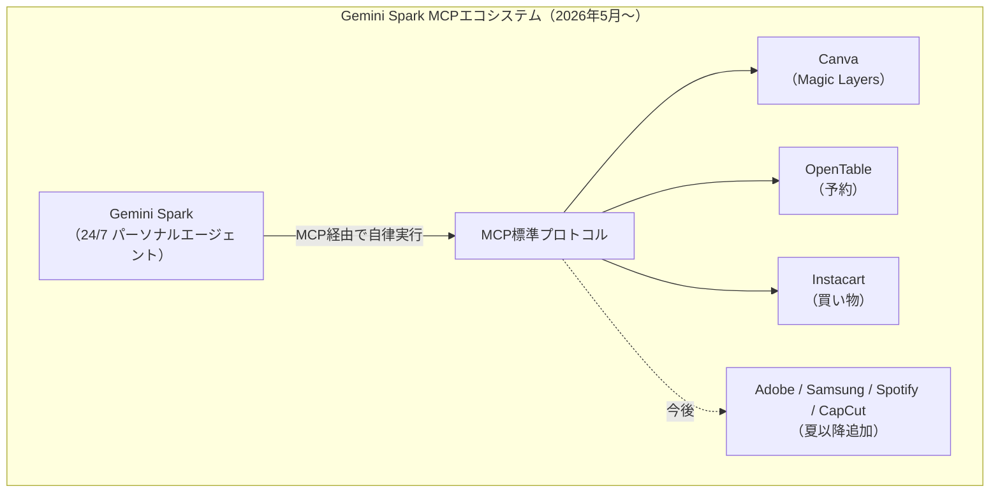

---

### 2.2 Gemini API Breaking Change・モデル廃止

`gemini-3.1-flash-lite-preview` が **2026年5月25日**に廃止。移行先は `gemini-3.5-flash`（Google I/O 2026 GA）。[[3]](#ref-3)

Interactions API v1beta の**破壊的変更（Breaking Change）**が **2026年5月26日**にデフォルト適用された。レスポンス構造が `outputs` 配列から `steps` 配列のタイムライン構造に変更。旧スキーマは **2026年6月8日**に完全廃止。[[4]](#ref-4)

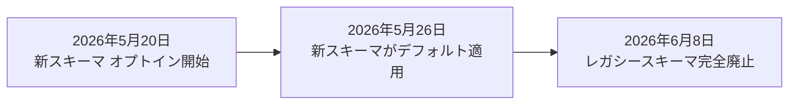

---

### 2.3 Gemini CLI → Antigravity CLI 移行：6月18日デッドライン

Google AI Pro / Ultra ユーザー向けの **Gemini CLI** が **2026年6月18日**に廃止され、**Antigravity CLI**（Go製）に一本化される。Antigravity CLI はマルチエージェント並列実行・バックグラウンドタスク・音声コマンド対応（デスクトップ版）。Gemini Code Assist Standard / Enterprise ライセンスは継続サポート。[[5]](#ref-5)[[6]](#ref-6)

---

### 2.4 Gemini Enterprise：Notion・Linear データソースをパブリックプレビューで追加

Gemini Enterprise のコネクタとして **Notion**（データベース・ページ）と **Linear**（Issue・プロジェクト）が Public Preview で追加。既存の Google Workspace・Salesforce コネクタと並んで社内ツール統合が強化された。[[7]](#ref-7)[[8]](#ref-8)

---

### 2.5 Looker Agentic Workflows：データ監視エージェントを自動生成（Preview）

Looker Conversational Analytics エージェントが「チャット回答」から「**プロアクティブな監視・アクション実行**」へ進化。自然言語でデータ条件を指定するとワークフローを自動生成し、条件充足時に通知・アクションを実行する。Gemini Enterprise でも Looker エージェントを公開可能に（Preview）。なお **Gemini Enterprise Assist** は同時期に廃止。[[9]](#ref-9)[[10]](#ref-10)

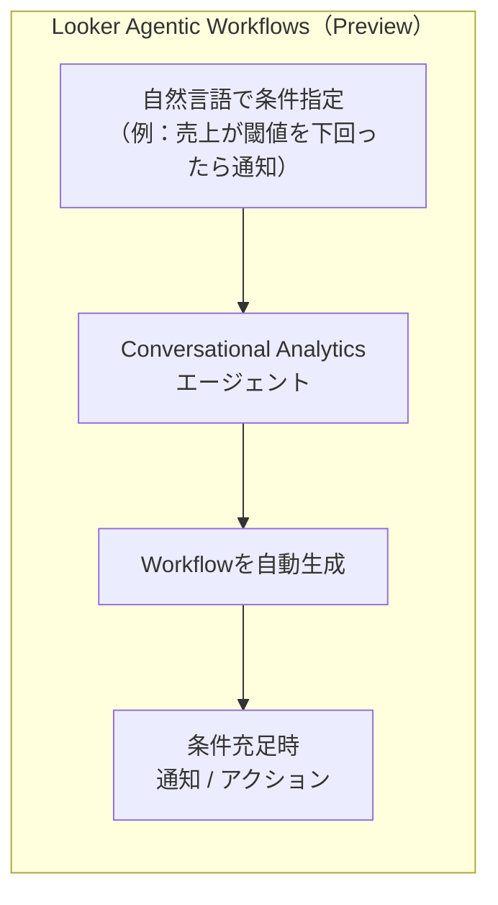

---

### 2.6 Google コア検索エンジンを Gemini 3.5 Flash へ全面切り替え（5月26日）

Google が **2026年5月26日**にコア検索エンジン全体を **Gemini 3.5 Flash** へ切り替えた。従来のテキストボックス検索 UI は事実上廃止され、デフォルトが会話型インターフェースに移行。Google I/O 2026 で発表した「AI Mode」戦略の実行フェーズにあたる。[[11]](#ref-11)

---

### 2.7 Vertex AI Agent Builder → Gemini Enterprise Agent Platform 改名完了

Google Cloud Next 2026（4月）で発表されていた **Vertex AI Agent Builder** の **Gemini Enterprise Agent Platform（GEAP）** への改名が、2026年5月末時点でコンソール UI 上の反映が完了。Agent Engine Sessions / Memory Bank・Express Mode・Layout Parser・Cloud API Registry 統合等が GA 済み。[[12]](#ref-12)[[13]](#ref-13)

---

## 3. Microsoft Azure AIアップデート

### 3.1 Azure AI Foundry Agent Framework v1.5.0：RAG・Skills・Memory サンプル拡充 + Grafana 監視ダッシュボード

Agent Framework v1.5.0 で RAG・Skills・Memory の3パターンのリファレンスサンプルを追加。**Azure Managed Grafana 向けプリビルトダッシュボード**が提供され、VS Code 上で動作するエージェントの OpenTelemetry シグナル（トークン使用量・ツール呼び出し頻度・TTFT 等）をリアルタイム可視化できるようになった。[[14]](#ref-14)[[15]](#ref-15)

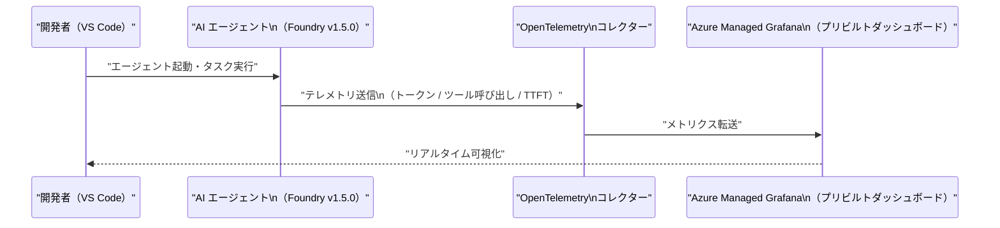

---

### 3.2 Microsoft Foundry Labs：EO/OS Object Detection（GeoAI）を新カテゴリとして追加

航空・衛星画像向けの **EO/OS Object Detection** マネージドエンドポイントが Foundry に新たな **GeoAI カテゴリ**として追加（バッチ処理向け設計・バウンディングボックス検出に最適化）。[[16]](#ref-16)

---

### 3.3 Fara1.5 + MagenticLite + MagenticBrain：小型モデル特化エージェントスタック（5月22日）

Microsoft Research が3種のモデル・ハーネスを一挙公開した。 [[17]](#ref-17)[[18]](#ref-18)[[19]](#ref-19)

**Fara1.5**：Qwen3.5 ベースのブラウザ操作エージェントモデル（4B / 9B / 27B）。Online-Mind2Web ベンチマーク（300タスク・136サイト）で Fara1.5-27B が **72.0%** を達成（OpenAI Operator 58.3%・Gemini 2.5 Computer Use 57.3% を上回る）。Fara1.5-9B には「クリティカルポイント（購入完了・送信等の不可逆操作直前）」でユーザー確認を求める安全機構を搭載。

**MagenticLite**：Magentic-UI の後継。ブラウザとローカルファイルシステムを横断する小型モデル最適化ハーネス。

**MagenticBrain**：Qwen 3 14B ファインチューンのオーケストレーションモデル。タスク分解・ツール選択・コード生成・Fara1.5 への委譲を担当。モデルウェイト・コードはオープンソース公開。

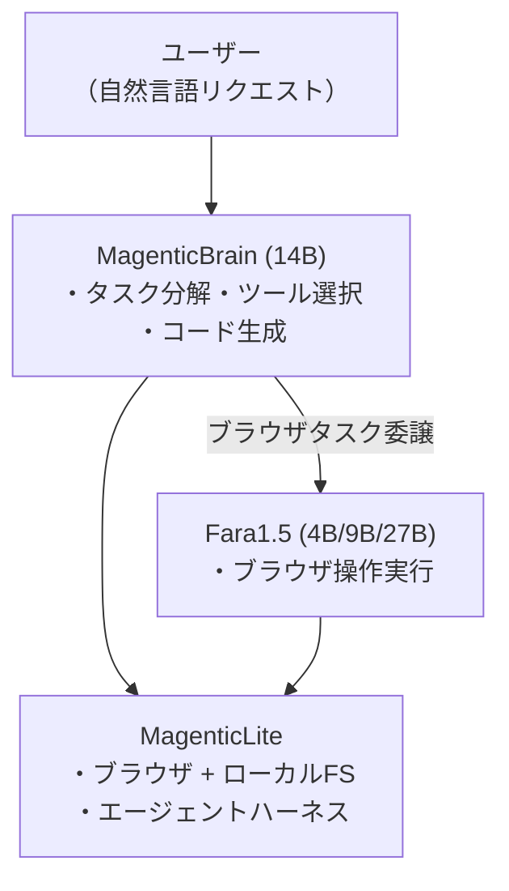

---

### 3.4 Copilot Studio May 2026：CUA一般提供・A2A・新オーケストレーション層

Copilot Studio 5月アップデートの主要機能。[[20]](#ref-20)[[21]](#ref-21)[[22]](#ref-22)

| 機能 | 状態 | 概要 |
|---|---|---|
| **Computer-Using Agents（CUA）** | **GA（5月13日）** | APIなしで任意のWeb・デスクトップUIを操作。OpenAI CUA と Claude Sonnet 4.5 を搭載 |
| **Real-Time Voice Agents** | **GA（北米）** | Dynamics 365 Contact Center と統合 |
| **Agent-to-Agent（A2A）通信** | **GA** | エージェント間での情報交換・タスク委譲・クロスシステム連携 |
| **Redesigned Workflows** | Preview | 統合ビジュアルデザイナーで自動化の全工程を1キャンバス上に構築 |
| **新オーケストレーション層** | Preview | 性能**約20%向上**・トークン消費量**約50%削減** |

認証情報は Azure Key Vault、監査ログは Microsoft Purview で管理。Human-in-the-loop 設定も標準装備。CUA を GA した主要ハイパースケーラー第1号となり、従来の RPA からの移行を加速させる。

---

### 3.5 Microsoft 365 Copilot 新デザイン：タスク対応ワークスペースとロード時間50%削減

プロンプト入力欄を「静的テキストボックス」から「タスク対応ワークスペース」へ刷新。Word/Excel/PowerPoint/Outlook 等の機能別エージェントへの統一エントリーポイントとなり、ロード時間50%以上削減・Word利用率+27%・Excel利用率+33%・PowerPoint利用率+43%を記録。[[23]](#ref-23)

---

## 4. LLM Model / AI Agentアーキテクチャ・研究論文

### 4.1 OpenAI汎用推論モデルが80年来のErdős単位距離予想を自律反証

OpenAI 内部の汎用推論モデル（数学専用学習なし）が、1946年提唱のエルデシュ単位距離問題（Unit Distance Problem）を自律的に反証した。正方格子より多項式因子で改善する無限族の点配置を発見（指数 n^(1+δ), δ=0.014）。代数的整数論（Golod-Shafarevich 理論・無限類体塔）を幾何学問題に横断適用したことが特徴。Princeton 数学者 Will Sawin が独立検証し、Fields 賞受賞者 Tim Gowers が「AI 数学のマイルストーン」と評価。[[24]](#ref-24)[[25]](#ref-25)

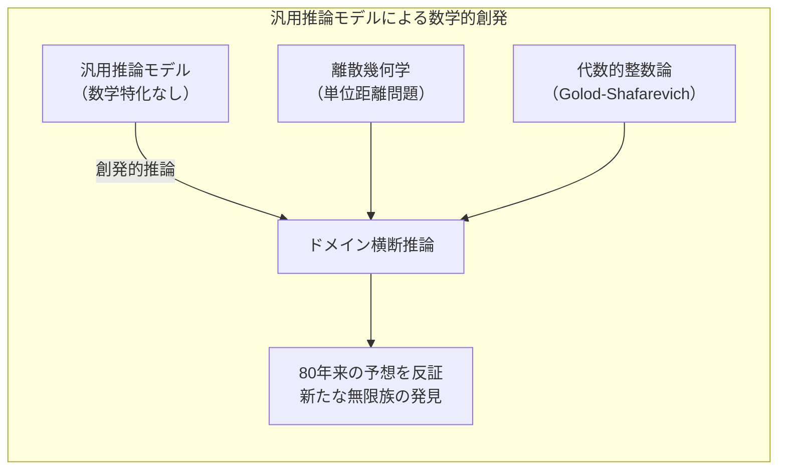

---

### 4.2 スプリット推論のプライバシー漏洩リスク：ActInv 攻撃（arXiv:2605.23158）

スプリット推論（エッジ側でモデルを前半だけ実行し、中間活性化のみをサーバーへ送信する方式）に対して、サーバーが中間活性化から**元入力テキストを高精度で復元する攻撃手法 ActInv** を実証した。[[26]](#ref-26)

ガウスノイズ注入・活性化スパース化等の既存防御を突破。新指標 **PAF（Perturbation Amplification Factor）** が高いレイヤーでスプリットするほど攻撃難易度が上がる。医療診断・個人財務・法律相談など機密用途でのスプリット推論設計の見直しが必要。

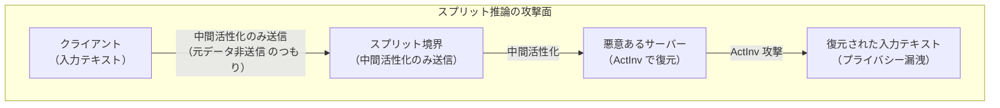

---

### 4.3 SkillOS：強化学習によるスキルキュレーションで自己進化エージェントを実現（arXiv:2605.06614）

Google・UIUC 研究チームが提案。**Frozen Agent Executor** と**訓練可能なスキルキュレーター（RL）**の二要素構成で、エージェントが経験から再利用可能なスキルを蓄積・改善する自己進化機構を実現。先行タスクの軌跡が SkillRepo を更新し、後続の関連タスクがその更新を評価するという構造で強化学習を実施。既存のメモリベースラインを有効性・効率性で上回り、異なる Executor バックボーンとタスクドメインにも汎化する。[[27]](#ref-27)[[28]](#ref-28)

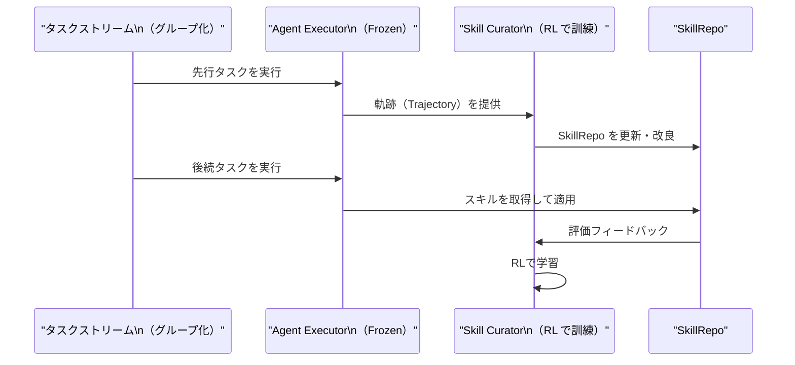

---

### 4.4 Claude Opus 4.8 Dynamic Workflows：最大1,000サブエージェントの並列オーケストレーション

Anthropic が 5月28日にリリースした **Claude Opus 4.8** とともに公開された **Dynamic Workflows（リサーチプレビュー）**は、1セッション内で最大1,000サブエージェント（同時16並列）をClaudeが動的に生成したオーケストレーションスクリプトで制御する新しいアーキテクチャ設計。[[29]](#ref-29)[[30]](#ref-30)[[31]](#ref-31)

| パラメータ | 仕様 |
|---|---|
| **最大サブエージェント数** | 1,000（1セッション内） |
| **同時実行上限** | 16サブエージェント（並列） |
| **収束戦略** | 複数エージェントが独立アプローチ → 対立エージェントが反証 → 収束まで反復 |
| **中断・再開** | セッション内で進行状況保存、完了エージェントはキャッシュ結果を返却 |

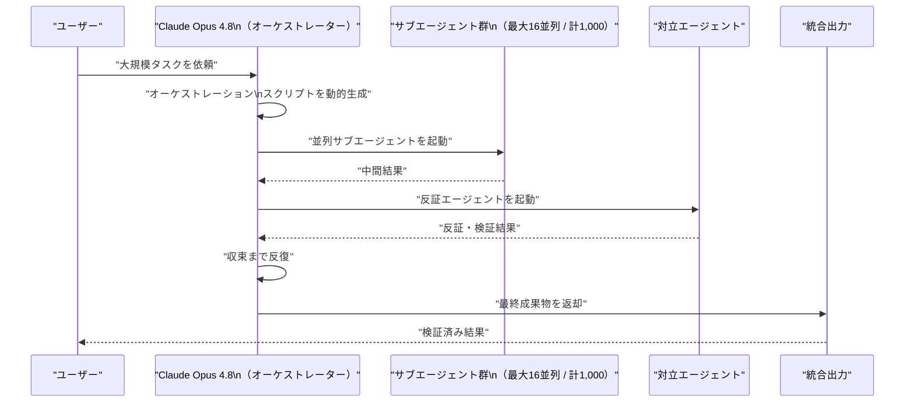

---

### 4.5 Deep Research Agents の系統的分類（arXiv:2506.18096）

静的/動的ワークフロー × シングル/マルチエージェント構成の分類軸で DR エージェントを整理したサーベイ論文。逐次実行の非効率性と並列化設計の重要性、現行ベンチマークによる能力過小評価の問題を指摘。[[32]](#ref-32)

---

### 4.6 Multi-Agent によるハルシネーション抑制アーキテクチャ（arXiv:2603.07728）

複数エージェントが独立推論して相互検証し、「提案→批評→改訂」サイクルを繰り返すことで多段階構造モデリングにおけるハルシネーションを低減する手法を提案。構造化アウトプット（スキーマ準拠・コード生成等）での効果を示す。[[33]](#ref-33)

---

### 4.7 ゴール指向 LLM エージェント参照アーキテクチャ（arXiv:2602.10479）

ステートレスなプロンプト駆動モデルから、**知覚→計画→行動→適応の反復制御ループ**を持つゴール指向システムへの設計パラダイムシフトを体系化。マルチエージェントトポロジー分類（Hierarchical / Peer-to-Peer / Pipeline）とエンタープライズ展開チェックリスト（15項目）を提供。[[34]](#ref-34)

---

## 5. 公式ブログ・論文のリサーチ・要約

### 5.1 xAI

新情報なし

---

### 5.2 Google / DeepMind

#### Gemini 3.5 Flash 詳細ベンチマーク（追加情報）

Google I/O 2026 で発表済みの Gemini 3.5 Flash について、追加のベンチマーク情報が公開された。[[35]](#ref-35)[[36]](#ref-36)

| ベンチマーク | Gemini 3.5 Flash | 特記事項 |
|---|---|---|
| **Terminal-Bench 2.1** | **76.2%** | 長時間エージェントタスク |
| **GDPval-AA** | **1656 Elo** | エージェント汎用性評価 |
| **MCP Atlas** | **83.6%** | MCP ツール使用精度 |
| **CharXiv（マルチモーダル）** | **84.2%** | 画像・グラフ理解 |
| **出力速度** | 他フロンティアモデル比 **4倍** | リアルタイム推論 |
| **コスト** | 比較可能モデルの **半額以下** | 経済効率 |

Flash 系列でフロンティアモデルに匹敵する精度と速度・コストを両立。**Gemini 3.5 Pro**（内部利用中）が来月ロールアウト予定。

---

### 5.3 OpenAI

#### Gartner 2026 Magic Quadrant for Enterprise AI Coding Agents：Leader 選出

Gartner が **「2026年版 エンタープライズ AI コーディングエージェント マジッククアドラント」** を初めて独立カテゴリとして設定し、**OpenAI（Codex）**・**GitHub（Copilot、3年連続）**・**Cursor** が Leader に選出された。AI コーディング市場が「エンタープライズグレードの評価対象」として成熟した指標。[[37]](#ref-37)[[38]](#ref-38)

---

#### OpenAI Codex 大型アップデート（5月26日）

Goal Mode の一般提供（GA）、プラグインワークスペース共有、MCP の改善（サーバーごとの環境ターゲティング・OAuth オプション）、Codex Mobile（ChatGPT アプリ統合）、TUI の Vim モーダル編集対応等を追加。[[39]](#ref-39)

---

#### C2PA + SynthID：AI生成画像の出所証明標準化（5月19日〜）

OpenAI が Google DeepMind と連携し、ChatGPT・Codex・OpenAI API で生成した画像に **C2PA メタデータ**（署名付き詳細情報）と **SynthID 不可視透かし**（クロップ・フィルタ・圧縮後も残存）の二層方式を採用。C2PA が失われても SynthID による検出が可能な相互補完構造。公開検証ツール「Verify」も提供開始。[[40]](#ref-40)[[41]](#ref-41)[[42]](#ref-42)

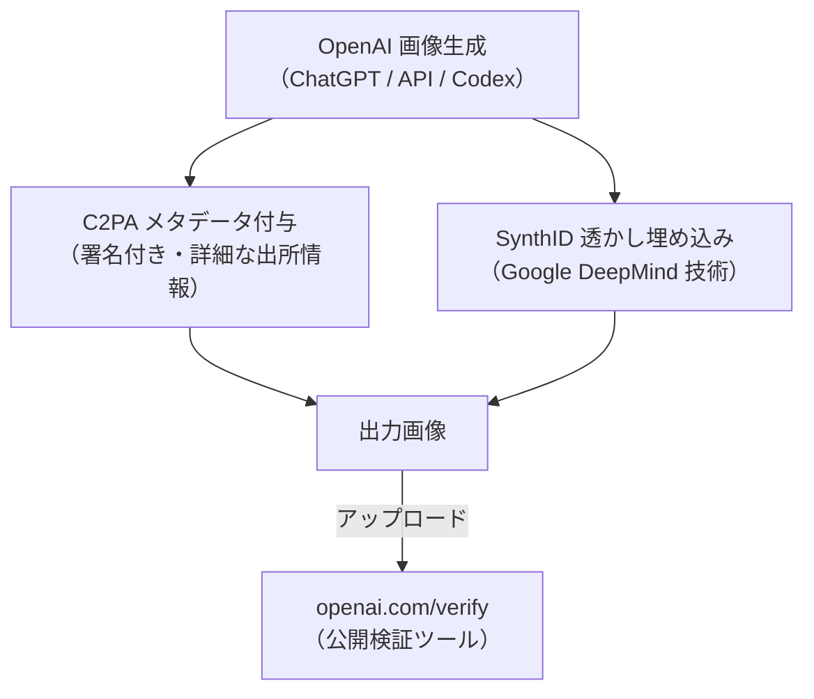

---

#### OpenAI Frontier Governance Framework 公開（5月29日）

カリフォルニア州 **Transparency in Frontier AI Act** および EU の **AI Act（汎用AI行動規範）** に対する OpenAI の規制遵守アプローチを体系化した文書。リスク評価領域はサイバー攻撃・CBRN・有害操作・制御喪失の4カテゴリ。既存の Preparedness Framework を基盤として維持しつつ、規制要件に特化した公開文書として整備。[[43]](#ref-43)

---

#### 信頼できるサードパーティ評価のための共通プレイブック（5月29日）

「能力の最大化評価（このモデルはXができるか？）」には**タスク最適化ハーネス**を、「比較評価（A対B）」には**固定・共有ハーネス**を使用する方針を示した評価方法論のガイドライン。EU AI Act・カリフォルニア SB 53 等の外部評価義務化に向けた評価エコシステム整備の布石と位置付けられる。[[44]](#ref-44)

---

### 5.4 Anthropic

#### Jack Clark、Oxford 講演：12ヶ月以内のノーベル賞級発見・存在リスクは非ゼロ（5月21日）

Anthropic 共同創業者 Jack Clark がオックスフォード大学で以下を予測した。商業的成功（評価額9,000億ドル超・四半期初の黒字見通し）を追う一方で「AIの存在リスクは現実のものだ」と公言する姿勢が異色の立場として業界で注目された。[[45]](#ref-45)[[46]](#ref-46)

| 予測テーマ | 期間目標 |
|---|---|
| AI + 人間協働でのノーベル賞級科学的発見 | **12ヶ月以内** |
| AI のみで運営される収益企業の出現 | **18ヶ月以内** |
| 二足歩行ロボットが職場に展開 | **2年以内** |
| AI が自身の後継モデルを設計 | **2028年末まで** |
| 存在リスク（Existential Risk） | **「現時点で非ゼロ」** |

---

#### Code with Claude 2026（ロンドン・5月19〜21日）：新エージェント機能とインフラ強化

Anthropic のデベロッパーカンファレンスで5つの新エージェント機能とインフラ2機能を発表・シップした。[[47]](#ref-47)[[48]](#ref-48)[[49]](#ref-49)

| 機能 | 概要 |
|---|---|
| **Dreaming** | 実行前に複数シナリオをシミュレートして最適アプローチを選択 |
| **Outcomes** | タスクを「成功基準」で定義し、エージェントが達成判定を自律実行 |
| **Multi-Agent Orchestration** | リードエージェントがタスクを分割し、独自モデル・プロンプト・ツールを持つスペシャリストに並列委譲 |
| **Claude Finance** | 財務分析・報告・予測向けに事前設定された10種のエージェント群 |
| **Add-ins** | サードパーティ機能をワンクリックでエージェントに追加するプラグイン機構 |

**インフラ面**では以下の2機能も追加された。[[50]](#ref-50)[[51]](#ref-51)

| インフラ機能 | 状態 | 概要 |
|---|---|---|
| **カスタムサンドボックス（セルフホステッド）** | パブリックベータ | ツール実行を顧客インフラ（Cloudflare・Daytona・Modal・Vercel等）に移行可能 |
| **MCP トンネル** | リサーチプレビュー | 社内 MCP サーバーにパブリックインターネットを経由せずに接続 |

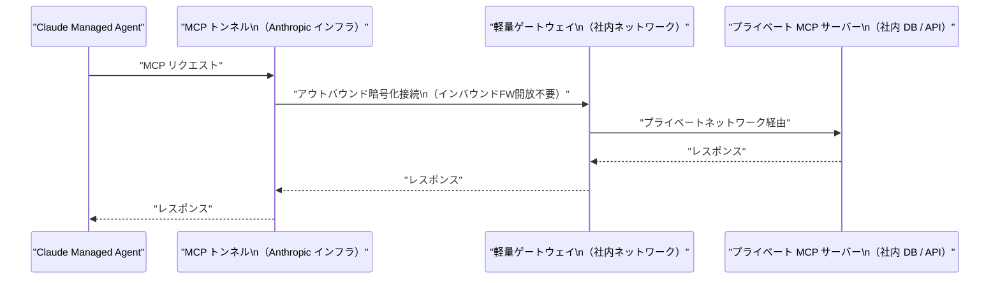

---

#### Claude Mythos が Claude Code UI に一時出現・消失（5月25日）

制限付きモデル `claude-mythos-1-preview` の切り替えトグルが Claude Code・Claude Security の UI に一時的に出現し、その後削除された。Project Glasswing の Coordinated Vulnerability Disclosure ダッシュボード（5月22日更新）は**開示済み脆弱性 1,596件・対象 OSS 281プロジェクト・パッチ適用済み 97件**を記録。今回の「一時出現」が Anthropic の一般公開に向けた最終段階の検討を示唆すると業界は受け止めた。[[52]](#ref-52)[[53]](#ref-53)[[54]](#ref-54)

---

#### Claude Compliance API：28セキュリティ統合でエンタープライズガバナンスを強化（5月21日発表）

**28社のセキュリティ・コンプライアンスツール統合**を追加し、企業の既存ガバナンス体制に Claude の利用状況を組み込む手段を提供。[[55]](#ref-55)[[56]](#ref-56)[[57]](#ref-57)

| カテゴリ | 主要ベンダー |
|---|---|
| セキュリティ / SIEM | CrowdStrike・Palo Alto Networks・Trellix・ReliaQuest |
| DLP / CASB | Zscaler・Netskope・Forcepoint・Mimecast |
| ID管理 | Okta・SailPoint |
| クラウドセキュリティ | Wiz・Tenable・Snyk |
| オブザバビリティ | Datadog・Sumo Logic・Cribl |
| データ保護 | Microsoft Purview・IBM Guardium・Varonis・Rubrik・Cyera |
| eDiscovery / コンプライアンス | Relativity・Theta Lake・Smarsh・Proofpoint |

**注意**：Claude Cowork は現時点で Compliance API の対象外。規制対象業務への Cowork 展開には注意が必要。

---

#### Claude Opus 4.8 リリース（5月28日）

Opus 4.7 からわずか41日というスピードでのアップデート。[[58]](#ref-58)

| 機能 | 詳細 |
|---|---|
| **Dynamic Workflows** | リサーチプレビュー（§4.4 参照） |
| **Effort Control** | ユーザーがタスクへの投入リソースを選択可能 |
| **Fast Mode 高速化** | 約2.5倍高速・Opus 4.7 比でコスト1/3 |
| **Honesty 強化** | 過信率が Opus 4.7 比10倍以上削減、欠陥結果の無批判受け入れ率 **0%** |

ベンチマーク：アジェンティックコーディング 64.3% → 69.2%（+4.9pt）、知識業務スコア 1753 → 1890（+137）。

---

#### Anthropic Series H クローズ：評価額$965B・$65B 調達（5月28日）

Vol.32 で「今週クローズ見込み」と報じていた大型資金調達が正式にクローズ。当初予想（$30B・評価額$900B）を大幅に上回る結果となった。[[59]](#ref-59)[[60]](#ref-60)[[61]](#ref-61)

| 項目 | 確定値 |
|---|---|
| **調達額** | **$65B** |
| **評価額（ポストマネー）** | **$965B** |
| **ランレート収益（5月時点）** | **$47B/年** |
| **想定 IPO** | 2026年10月（最短） |
| **コリード** | Sequoia / Dragoneer / Altimeter / Greenoaks（各〜20億ドル） |

OpenAI の直近評価額 $852B（2026年3月）を上回り**世界最高値の民間AIスタートアップ**に。

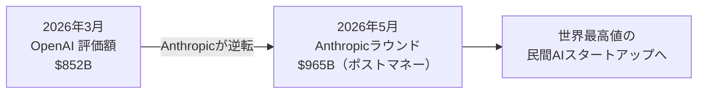

---

#### Claude Mythos-class モデルの一般公開予告（5月28〜29日）

現在 Project Glasswing 限定提供の Mythos-class を**「今後数週間以内に全顧客へ提供開始」**と予告。[[62]](#ref-62)[[63]](#ref-63)

| 指標 | Claude Mythos Preview |
|---|---|
| **SWE-bench Verified** | 93.9% |
| **SWE-bench Pro** | 77.8% |
| **Terminal-Bench 2.0** | 82.0% |
| **USAMO 2026** | 97.6% |

自律的なゼロデイ脆弱性発見で OpenBSD の27年前の TCP SACK RCE（CVE-2026-4747）等を発見。一般提供は Zvi 氏推定で 2026年9月以降（確約なし）。

---

#### Anthropic、ミラノ・ソウルへ同時進出（5月27日）

1年未満で欧州6拠点・アジア2拠点体制を確立した。[[64]](#ref-64)[[65]](#ref-65)[[66]](#ref-66)

**ミラノ**（欧州第6拠点）：Generali・Pirelli・Enel が顧客として名称公開済み。EMEA ランレート収益が前年同期比9倍超に成長。

**ソウル**：Google Cloud Korea・Adobe・Autodesk 等で30年超のキャリアを持つ **KiYoung Choi（チェ・キヨン）氏**を代表取締役に任命。韓国でのClaudeトラフィックは人口比の3.5倍超（東アジア第2位、日本に次ぐ）。

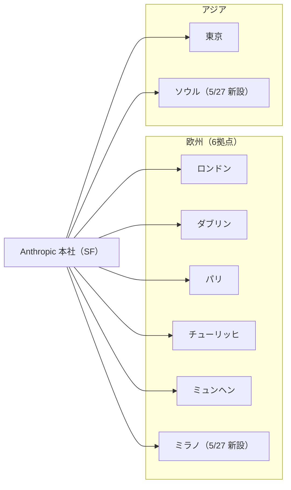

---

## 6. AI Agent搭載SaaS製品情報

### 6.1 AI Agent ビジネスモデルの4分岐（TechTimes 分析、5月24日）

AI エージェント市場が4つの根本的に異なるビジネスモデルに分化しつつある。従来の「SaaS 対 API」という二項対立を超えた市場の多極化を示している。[[67]](#ref-67)

| モデル | 代表例 | 特徴 |
|---|---|---|
| **オープンソース・コミュニティ型** | OpenClaw（GitHub Stars 37万超）・Hermes Agent（Nous Research） | Hermes Agent が5月10日に OpenRouter 1日推論量1位（2,240億トークン）を記録 |
| **トークン課金型** | 各種 API エージェント | APIコール数・トークン数ベースで課金。従来のシート課金から脱却 |
| **SaaS サブスクリプション型** | Genspark（ARR $2億超、Series B $3.85億） | 月次・年次定額型。「1ユーザー＝1ライセンス」モデルはエージェント化で崩壊しつつある |
| **アクイジション/統合型** | Manus（Meta が $20億で買収合意 → 中国当局が阻止） | 大手プラットフォームへの吸収統合 |

---

### 6.2 GPTBots.ai 大規模アップグレード：「チャットから実行へ」のトランジション（5月27日）

Aurora Mobile の **GPTBots.ai** が「エージェントは会話はできるが業務システムに接続できない」という根本的なボトルネックへの解答を示すアップグレードを実施した。[[68]](#ref-68)[[69]](#ref-69)

**コアアップグレード3本柱：**
- **ナレッジグラフ**（ベクトル+グラフのハイブリッド検索）
- **Agent Loop Engine**（多ターン自律推論・Agent-to-Agent プロトコル）
- **エンタープライズガバナンス強化**（監査ログ・セーフガード）

14チャネル（WhatsApp・Slack・Teams・WeChat・DingTalk等）でのデータ収集とエージェント主導フォーム収集に対応。

---

### 6.3 Copilot Studio Computer-Using Agents GA：エンタープライズ UIオートメーション実用化

§3.4 で詳述。APIなしで ERP・CRM・レガシーシステムの UI を自律操作。従来の RPA から AI Agent への大規模移行を加速させるマイルストーン。[[20]](#ref-20)[[21]](#ref-21)

---

## 7. LLM/AI Agentセキュリティインシデント

### 7.1 TeamPCP Wave 4：毒入り VS Code 拡張でGitHub 内部リポジトリ 3,800件が流出（5月19〜20日）

Vol.27 で報告した TanStack 攻撃（Wave 3）の直後、TeamPCP が **Wave 4** を展開した。[[70]](#ref-70)[[71]](#ref-71)[[72]](#ref-72)

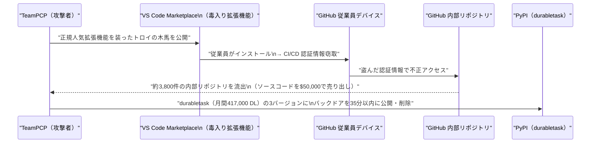

VS Code Marketplace という開発者の日常的な信頼先を新たな感染経路として確立しつつある。

---

### 7.2 Pwn2Own Berlin 2026：47件のゼロデイで$1,298,250・AIコーディングエージェントカテゴリが初登場

AIカテゴリが初めて本格導入された Pwn2Own で、47件のゼロデイに対して総額 $1,298,250 が支払われた。[[73]](#ref-73)[[74]](#ref-74)

**AIカテゴリ主要結果：**
- **OpenAI Codex** が Compass Security と Doyensec の maitai チームにより独立して攻略（各 $40,000）
- **Claude Code** に Compass Security が挑戦 → 既存エントリとの脆弱性衝突により $20,000（フル攻略なし）

コーディングエージェントへの攻撃ベクターは「一般的な開発フローで触れるリポジトリ・Webコンテンツ」と規定されており、現実の開発フローが攻撃面になりうることを公式競技の場で確認した初の事例。

---

### 7.3 SUDP：エージェントシステム向け「秘密委任プロトコル」の提唱（arXiv:2604.24920）

現在のエージェントが採用する「**Authorization by Exposure**（再利用可能 API キーをランタイムに平文配置）」の問題に対し、SUDP は操作ごとに有効期限付きグラントを発行し、再利用可能な認証情報がエージェント境界を越えない設計を提案する。[[75]](#ref-75)[[76]](#ref-76)

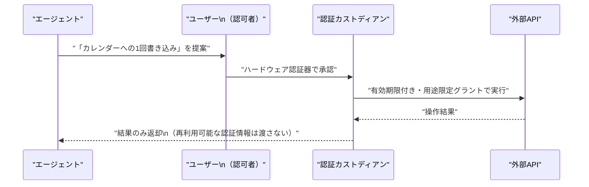

---

### 7.4 Cisco 研究：マルチターン反復攻撃（iMIST）でLLM安全性が崩壊・エンタープライズ環境成功率90%超

シングルプロンプト攻撃の成功率は約5%だが、悪意あるクエリを通常のツール呼び出しに偽装しながら段階的にエスカレートさせる**iMIST 攻撃**（平均5ターン・42秒）では、オープンウェイトモデル8種で 39.5〜54.6%、エンタープライズ環境では **90%超** に達する。[[77]](#ref-77)

現行の LLM 安全性評価はシングルプロンプトベースのベンチマークに依存しており、実際の攻撃シナリオを反映していない。エンタープライズ展開では会話全体を通じた動的な安全性モニタリングと行動分析レイヤーが不可欠。

---

### 7.5 Azure OpenAI Service グローバル障害（5月29日）

2026年5月29日 09:39〜12:46 UTC（約3時間7分）にわたる Azure OpenAI Service グローバルエンドポイントの障害が発生。グローバルエンドポイントの単一障害点リスクが改めて浮き彫りになった。[[78]](#ref-78)

---

### 7.6 CVE-2026-32243：Discourse AI 共有会話 Onebox の保存型XSS

Discourse の AI 共有会話 Onebox 機能に保存型 XSS 脆弱性。AI 生成コンテンツが関与する攻撃面が複数存在することが確認された（CVE-2026-27740 は Week 4 既報）。[[79]](#ref-79)

---

### 7.7 CVE-2026-26030 + CVE-2026-25592：Microsoft Semantic Kernel Prompt Injection → RCE（CVSS 9.8）

AIエージェントフレームワーク自体が RCE の入口となる事例として業界に広く警戒されている。[[80]](#ref-80)[[81]](#ref-81)[[82]](#ref-82)

| CVE番号 | 影響コンポーネント | 攻撃手法 | CVSS |
|---|---|---|---|
| **CVE-2026-26030** | Python SDK InMemoryVectorStore（<1.39.4） | フィルタ式を eval() で実行 → 任意コード実行 | **9.8（Critical）** |
| **CVE-2026-25592** | Python/NET DownloadFileAsync | パスバリデーションなしでファイル書き込み | 高 |

**修正バージョン**：Python SDK 1.39.4以降・.NET SDK 1.71.0以降。  
**影響**：外部ドキュメント1件を取得させるだけで RCE が成立。プロンプト → ツール呼び出し → システム操作のパイプラインを持つ構造上、未検証の外部コンテンツはそのままシェルへの入口になりうる。

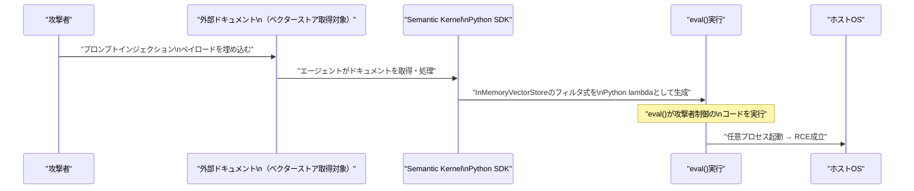

---

### 7.8 AI活用による制裁回避・拡散資金調達（RUSI レポート）

英国王立国防安全保障研究所（RUSI）のレポート「*Algorithms of Evasion*」を引用。AI が**偽造書類の大量生成・シェルカンパニー管理の自動化・金融取引パターンの偽装**を可能にしている。今後3〜5年で「AIアシスト型」から「AIイネーブル型」の制裁回避へ移行すると予測。AML システムへの AI 生成コンテンツ検知機能の統合と、CIO・CISO・コンプライアンス担当・取締役会レベルでの横断的ガバナンスモデルの整備が求められる。[[83]](#ref-83)[[84]](#ref-84)

---

## 8. その他特筆すべき情報

### 8.1 中国、AI人材（DeepSeek・Alibaba等）に海外渡航規制を開始（5月26〜28日）

中国政府が DeepSeek・Alibaba 等の先端 AI 研究者・幹部に対し、**海外渡航前に当局承認を義務付ける規制**を開始した（2025年12月に DeepSeek 幹部へ非公式適用済み）。Stanford 2026 AI Index によると中国のモデル性能は米国比わずか **2.7% 差** に接近しており、技術・人材の国外流出防止を目的とした対応と見られる。米国・欧州の AI 企業が中国出身の研究者を採用する際の新たな障壁となりうる。[[85]](#ref-85)[[86]](#ref-86)

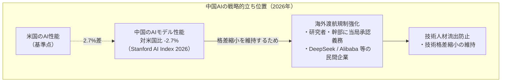

---

### 8.2 カリフォルニア州 AI 法案30本、本会議をほぼ全て通過（5月29日）

5月29日のクロスオーバー締め切りまでに30本の AI 関連法案がほぼ全て各発議院を通過。今後4週間の交差審議を経て、2026年7月2日の夏期閉会前の成立を目指す。[[87]](#ref-87)

| 主要法案 | 概要 |
|---|---|
| **SB 574** | 弁護士のAI使用に関する倫理基準・保護規定 |
| **SB 719** | 州機関が使用する高リスク自動意思決定システムの年次報告要件の改正 |
| **SB 813** | カリフォルニア州AI標準・安全委員会の設置 |
| **SB 867** | おもちゃへのコンパニオンチャットボット搭載禁止 |

**Transparency in Frontier AI Act（SB 53）**はフロンティア AI モデルの公開前評価義務化に関する米国初の州法として既に施行済み。

---

### 8.3 Microsoft Build 2026（6月2〜3日）：AI Agent 総力発表へ

**Microsoft Build 2026** が 2026年6月2〜3日にサンフランシスコで開催予定。Windows Agent Framework・Copilot Agent Mode（VS Code）・Windows Agent Store・Azure AI Foundry 強化等の発表が注目される。詳細は次週レポートで報告予定。[[88]](#ref-88)

---

## 9. 参考文献

**[1]** [Gemini Spark: Google's 24/7 AI Agent — I/O 2026 Developer Guide | DEV Community](https://dev.to/akaranjkar08/gemini-spark-googles-247-ai-agent-io-2026-developer-guide-6gn)

**[2]** [Google's Gemini Spark agent launches in major app overhaul | Resultsense](https://www.resultsense.com/news/2026-05-20-gemini-spark-app-evolution/)

**[3]** [Release notes | Gemini API | Google AI for Developers](https://ai.google.dev/gemini-api/docs/changelog)

**[4]** [Interactions API: Breaking changes migration guide (May 2026) | Gemini API | Google AI for Developers](https://ai.google.dev/gemini-api/docs/interactions-breaking-changes-may-2026)

**[5]** [An important update: Transitioning Gemini CLI to Antigravity CLI | Google Developers Blog](https://developers.googleblog.com/an-important-update-transitioning-gemini-cli-to-antigravity-cli/)

**[6]** [Gemini CLI → Antigravity CLI Migration Guide (June 18, 2026 Deadline) | Agentpedia](https://agentpedia.codes/blog/gemini-cli-to-antigravity-cli-migration)

**[7]** [Gemini Enterprise release notes | Google Cloud Documentation](https://docs.cloud.google.com/gemini/enterprise/docs/release-notes)

**[8]** [Notion configuration | Gemini Enterprise | Google Cloud Documentation](https://docs.cloud.google.com/gemini/enterprise/docs/connectors/notion/config)

**[9]** [Gemini for Google Cloud release notes | Google Cloud Documentation](https://docs.cloud.google.com/gemini/docs/release-notes)

**[10]** [Gemini Enterprise Agent Platform release notes | Google Cloud Documentation](https://docs.cloud.google.com/gemini-enterprise-agent-platform/release-notes)

**[11]** [AI News Recap: May 29, 2026 | NeuralBuddies](https://www.neuralbuddies.com/p/ai-news-recap-may-29-2026)

**[12]** [Google Retired Vertex AI for Agent Platform in May 2026 | RoboRhythms](https://www.roborhythms.com/gemini-enterprise-agent-platform-launch/)

**[13]** [Vertex AI Agent Builder 2026 guide | UI Bakery Blog](https://uibakery.io/blog/vertex-ai-agent-builder)

**[14]** [Azure Updates in May 2026 | Azure Charts](https://azurecharts.com/updates?monthback=0)

**[15]** [New Microsoft tools connect AI agents with proper data | TechTarget](https://www.techtarget.com/searchdatamanagement/news/366634490/New-Microsoft-tools-connect-AI-agents-with-proper-data)

**[16]** [What's New in Microsoft Foundry Labs – May 2026 | Microsoft Community Hub](https://techcommunity.microsoft.com/blog/azure-ai-foundry-blog/whats-new-in-microsoft-foundry-labs-%E2%80%93-may-2026/4520310)

**[17]** [MagenticLite, MagenticBrain, Fara1.5: An agentic experience optimized for small models | Microsoft Research Blog](https://www.microsoft.com/en-us/research/blog/magenticlite-magenticbrain-fara1-5-an-agentic-experience-optimized-for-small-models/)

**[18]** [Fara1.5 - A family of frontier computer use agent models | Microsoft Research](https://www.microsoft.com/en-us/research/articles/fara1-5-computer-use-agent/)

**[19]** [Microsoft Releases Fara1.5: A Family of Browser Computer-Use Agents (4B/9B/27B) That Outperform OpenAI Operator and Gemini 2.5 Computer Use on Online-Mind2Web | MarkTechPost](https://www.marktechpost.com/2026/05/22/microsoft-releases-fara1-5-a-family-of-browser-computer-use-agents-4b-9b-27b-that-outperform-openai-operator-and-gemini-2-5-computer-use-on-online-mind2web/)

**[20]** [What's new in Copilot Studio: May 2026 updates | Microsoft Copilot Blog](https://www.microsoft.com/en-us/microsoft-copilot/blog/copilot-studio/new-and-improved-computer-using-agents-a-new-workflows-experience-and-real-time-voice-experiences/)

**[21]** [Computer-using agents in Microsoft Copilot Studio are now generally available | Microsoft Community Hub](https://techcommunity.microsoft.com/blog/copilot-studio-blog/computer-using-agents-in-microsoft-copilot-studio-are-now-generally-available/4519427)

**[22]** [Copilot Studio Gets Smarter Agents, Voice, and Workflow Overhaul | Windows News](https://windowsnews.ai/article/copilot-studio-gets-smarter-agents-voice-and-workflow-overhaul-whats-new-in-may-2026.419696)

**[23]** [Introducing a new design for Microsoft 365 Copilot | Microsoft 365 Blog](https://www.microsoft.com/en-us/microsoft-365/blog/2026/05/28/introducing-a-new-design-for-microsoft-365-copilot/)

**[24]** [An OpenAI model has disproved a central conjecture in discrete geometry | OpenAI](https://openai.com/index/model-disproves-discrete-geometry-conjecture/)

**[25]** [OpenAI solves 80-year Erdős geometry problem: AI autonomously disproves the square grid conjecture | explainx.ai](https://explainx.ai/blog/openai-planar-unit-distance-erdos-problem-solved-2026)

**[26]** [What Does the Server See? Understanding Privacy Leakage from Large Language Models in Split Inference | arXiv:2605.23158](https://arxiv.org/abs/2605.23158)

**[27]** [SkillOS: Learning Skill Curation for Self-Evolving Agents | arXiv:2605.06614](https://arxiv.org/abs/2605.06614)

**[28]** [Paper page - SkillOS: Learning Skill Curation for Self-Evolving Agents | Hugging Face](https://huggingface.co/papers/2605.06614)

**[29]** [Anthropic releases Opus 4.8 with new 'dynamic workflow' tool | TechCrunch](https://techcrunch.com/2026/05/28/anthropic-releases-opus-4-8-with-new-dynamic-workflow-tool/)

**[30]** [Anthropic Ships Claude Opus 4.8 Alongside Dynamic Workflows and Cheaper Fast Mode, With Workflows Capped at 1,000 Subagents | MarkTechPost](https://www.marktechpost.com/2026/05/28/anthropic-ships-claude-opus-4-8-alongside-dynamic-workflows-and-cheaper-fast-mode-with-workflows-capped-at-1000-subagents/)

**[31]** [Claude Opus 4.8 is here: effort controls, dynamic workflows, cheaper fast mode, better honesty, less deception | The New Stack](https://thenewstack.io/claude-opus-48-release/)

**[32]** [Deep Research Agents: A Systematic Examination And Roadmap | arXiv:2506.18096](https://arxiv.org/html/2506.18096v2)

**[33]** [A Novel Multi-Agent Architecture to Reduce Hallucinations of Large Language Models in Multi-Step Structural Modeling | arXiv:2603.07728](https://arxiv.org/pdf/2603.07728)

**[34]** [From Prompt-Response to Goal-Directed Systems: The Evolution of Agentic AI Software Architecture | arXiv:2602.10479](https://arxiv.org/pdf/2602.10479)

**[35]** [Gemini 3.5: frontier intelligence with action | Google Blog](https://blog.google/innovation-and-ai/models-and-research/gemini-models/gemini-3-5/)

**[36]** [Google Introduces Gemini 3.5 Flash at I/O 2026: A Faster and Cheaper Model for AI Agents and Coding | MarkTechPost](https://www.marktechpost.com/2026/05/20/google-introduces-gemini-3-5-flash-at-i-o-2026-a-faster-and-cheaper-model-for-ai-agents-and-coding/)

**[37]** [OpenAI named a Leader in enterprise coding agents by Gartner | OpenAI](https://openai.com/index/gartner-2026-agentic-coding-leader/)

**[38]** [Cursor named a Leader in the 2026 Gartner® Magic Quadrant™ for Enterprise AI Coding Agents | Cursor](https://cursor.com/blog/cursor-leads-gartner-mq-2026)

**[39]** [Changelog – Codex | OpenAI Developers](https://developers.openai.com/codex/changelog)

**[40]** [Advancing content provenance for a safer, more transparent AI ecosystem | OpenAI](https://openai.com/index/advancing-content-provenance/)

**[41]** [OpenAI Adopts C2PA and SynthID for Image Verification | Let's Data Science](https://letsdatascience.com/news/openai-adopts-c2pa-and-synthid-for-image-verification-ed2f7b5f)

**[42]** [OpenAI joins C2PA and adds Google SynthID watermarks to provenance stack | Result Sense](https://www.resultsense.com/news/2026-05-20-openai-c2pa-synthid-content-provenance/)

**[43]** [OpenAI's Frontier Governance Framework | OpenAI](https://openai.com/index/openai-frontier-governance-framework/)

**[44]** [A shared playbook for trustworthy third party evaluations | OpenAI](https://openai.com/index/trustworthy-third-party-evaluations-foundations/)

**[45]** [Jack Clark: AI will help win a Nobel within 12 months | Resultsense](https://www.resultsense.com/news/2026-05-21-jack-clark-anthropic-ai-nobel-prize-prediction/)

**[46]** ["There is a non-zero chance AI could kill everyone," warns Anthropic co-founder Jack Clark | Startuppedia](https://startuppedia.in/trending/jack-clark-claims-that-advanced-ai-systems-could-eventually-wipe-out-humanity-11866896)

**[47]** [Code with Claude — Anthropic's Developer Conference | claude.com](https://claude.com/code-with-claude)

**[48]** [Code with Claude 2026: 5 New Agent Features Anthropic Just Shipped | MindStudio](https://www.mindstudio.ai/blog/code-with-claude-2026-new-agent-features)

**[49]** [Anthropic's Code with Claude showed off coding's future—whether you like it or not | MIT Technology Review](https://www.technologyreview.com/2026/05/21/1137735/anthropics-code-with-claude-showed-off-codings-future-whether-you-like-it-or-not/)

**[50]** [New in Claude Managed Agents: self-hosted sandboxes and MCP tunnels | Claude Blog](https://claude.com/blog/claude-managed-agents-updates)

**[51]** [Anthropic Introduces MCP Tunnels for Private Agent Access to Internal Systems | InfoQ](https://www.infoq.com/news/2026/05/claude-mcp-tunnels/)

**[52]** [Anthropic's secretive Mythos AI appears inside Claude code, then vanishes | Techlusive](https://www.techlusive.in/artificial-intelligence/anthropics-secretive-mythos-ai-appears-inside-claude-code-then-vanishes-1663641/)

**[53]** [Anthropic's Mythos Moves Closer to Claude Code | Winbuzzer](https://winbuzzer.com/2026/05/26/anthropics-mythos-moves-closer-to-claude-code-xcxwbn/)

**[54]** [Anthropic's Restricted Claude Mythos Moves Toward Public Release via Claude Code and Security | Cyber Security News](https://cybersecuritynews.com/claude-mythos-moves-toward-public/)

**[55]** [Anthropic adds 28 security and compliance integrations for Claude | Help Net Security](https://www.helpnetsecurity.com/2026/05/25/anthropic-security-compliance-integrations-claude/)

**[56]** [Anthropic Expands Claude Compliance API With 28 Enterprise Security Integrations | Security Boulevard](https://securityboulevard.com/2026/05/anthropic-expands-claude-compliance-api-with-28-enterprise-security-integrations/)

**[57]** [Claude Enterprise Security Integrations: 28 Vendors Now Route AI Activity Into Existing SIEM and DLP Tools | TechTimes](https://www.techtimes.com/articles/317272/20260527/claude-enterprise-security-integrations-28-vendors-now-route-ai-activity-existing-siem-dlp-tools.htm)

**[58]** [Anthropic upgrades Claude with new Opus 4.8 model, details here | 9to5Mac](https://9to5mac.com/2026/05/28/anthropic-upgrades-claude-with-new-opus-4-8-model-heres-whats-new/)

**[59]** [Anthropic Eclipses OpenAI With Valuation of $965 Billion | Bloomberg](https://www.bloomberg.com/news/articles/2026-05-28/anthropic-raises-at-965-billion-valuation-eclipsing-openai)

**[60]** [Anthropic raises $65 billion, nears $1T valuation ahead of IPO | TechCrunch](https://techcrunch.com/2026/05/28/anthropic-raises-65-billion-nears-1t-valuation-ahead-of-ipo/)

**[61]** [Anthropic tops OpenAI as most valuable AI startup, with $965B valuation | Axios](https://www.axios.com/2026/05/28/anthropic-ai-fundraising-openai)

**[62]** [Anthropic confirms Claude Mythos-class models will roll out to the public | BleepingComputer](https://www.bleepingcomputer.com/news/artificial-intelligence/anthropic-confirms-claude-mythos-class-models-will-roll-out-to-the-public/)

**[63]** [Anthropic leapfrogs OpenAI with a record $965 billion valuation and says its 'Mythos' AI model is coming soon | Fortune](https://fortune.com/2026/05/29/anthropic-raises-65-billion-at-record-965-billion-valuation-promises-mythos-ai-model-in-wide-release-in-coming-weeks-releases-claude-opus-4-8/)

**[64]** [Anthropic's Milan office lands with Generali, Pirelli and Enel as named Italian customers | The Next Web](https://thenextweb.com/news/anthropic-milan-office-italy-enterprise-customers)

**[65]** [Anthropic appoints KiYoung Choi as Representative Director of Korea | Anthropic](https://www.anthropic.com/news/kiyoung-choi-representative-director-anthropic-korea)

**[66]** [Anthropic Opens Seoul Office, Appoints Choi Ki Young as Korea Head | Asiae](https://www.asiae.co.kr/en/article/science/2026052709020555911)

**[67]** [AI Agent Business Models Split Four Ways: Open-Source Infrastructure, Token Distribution, SaaS, Acquisition | TechTimes](https://www.techtimes.com/articles/317075/20260524/ai-agent-business-models-split-four-ways-open-source-infrastructure-token-distribution-saas.htm)

**[68]** [Aurora Mobile's GPTBots.ai Upgrades AI Agents from Chat to Execution | GlobeNewswire](https://www.globenewswire.com/news-release/2026/05/27/3301765/0/en/aurora-mobile-s-gptbots-ai-upgrades-ai-agents-from-chat-to-execution.html)

**[69]** [Aurora Mobile upgrades GPTBots.ai with workflow execution capabilities | StreetInsider](https://www.streetinsider.com/Corporate+News/Aurora+Mobile+upgrades+GPTBots.ai+with+workflow+execution+capabilities/26553372.html)

**[70]** [GitHub confirms 3,800 internal repos stolen through poisoned VS Code extension | VentureBeat](https://venturebeat.com/security/github-confirms-3800-repos-stolen-poisoned-vs-code-extension-supply-chain-worm-microsoft-python-sdk)

**[71]** [TeamPCP Wave Four: GitHub Breach via Poisoned VS Code Extension, durabletask PyPI Worm | Phoenix Security](https://phoenix.security/teampcp-github-breach-durabletask-pypi-supply-chain-wave-four-2026/)

**[72]** [durabletask: TeamPCP's Latest PyPI Compromise | Wiz Blog](https://www.wiz.io/blog/durabletask-teampcp-supply-chain-attack)

**[73]** [Hackers earn $1,298,250 for 47 zero-days at Pwn2Own Berlin 2026 | BleepingComputer](https://www.bleepingcomputer.com/news/security/hackers-earn-1-298-250-for-47-zero-days-at-pwn2own-berlin-2026/)

**[74]** [Pwn2Own Berlin 2026, 47 Zero-Days and the New AI Toolchain Attack Surface | Penligent](https://www.penligent.ai/hackinglabs/pwn2own-berlin-2026-47-zero-days/)

**[75]** [SUDP: Secret-Use Delegation Protocol for Agentic Systems | arXiv:2604.24920](https://arxiv.org/abs/2604.24920)

**[76]** [Weekly Threat Report 2026-05-25 | Xloggs AI Security and News](https://www.xloggs.com/2026/05/25/weekly-threat-report-2026-05-25/)

**[77]** [AI models more vulnerable than claimed when faced with iterative attacks | CSO Online](https://www.csoonline.com/article/4177903/ai-models-more-vulnerable-than-claimed-when-faced-with-iterative-attacks.html)

**[78]** [Microsoft Foundry Status — Incident History | Microsoft](https://status.ai.azure.com/history)

**[79]** [CVE-2026-32243: Discourse Stored XSS Vulnerability in AI Shared Conversations Onebox | Vulert](https://vulert.com/vuln-db/CVE-2026-32243)

**[80]** [When prompts become shells: RCE vulnerabilities in AI agent frameworks | Microsoft Security Blog](https://www.microsoft.com/en-us/security/blog/2026/05/07/prompts-become-shells-rce-vulnerabilities-ai-agent-frameworks/)

**[81]** [Microsoft Semantic Kernel RCE via Prompt Injection (CVE-2026-25592, CVE-2026-26030) | PointGuard AI](https://www.pointguardai.com/ai-security-incidents/semantic-kernel-lets-a-prompt-open-a-shell-cve-2026-25592-cve-2026-26030)

**[82]** [CVE-2026-26030: Critical RCE in Microsoft Semantic Kernel Python SDK | Windows News](https://windowsnews.ai/article/cve-2026-26030-critical-rce-in-microsoft-semantic-kernel-python-sdk-exposes-ai-applications.404644)

**[83]** [Another IT governance headache: AI-enabled sanction evasion | CIO](https://www.cio.com/article/4177854/another-it-governance-headache-ai-enabled-sanction-evasion.html)

**[84]** [Another IT governance headache: AI-enabled sanction evasion | CSO Online](https://www.csoonline.com/article/4177936/another-it-governance-headache-ai-enabled-sanction-evasion-3.html)

**[85]** [China Limits Overseas Travel for AI Talent at DeepSeek, Alibaba, Private Firms | Bloomberg](https://www.bloomberg.com/news/articles/2026-05-26/china-expands-travel-curbs-to-top-ai-talent-at-private-firms)

**[86]** [China AI Travel Curbs Reach Alibaba, DeepSeek: Private-Sector Researchers Need Beijing Approval | TechTimes](https://www.techtimes.com/articles/317325/20260528/china-ai-travel-curbs-reach-alibaba-deepseek-private-sector-researchers-need-beijing-approval.htm)

**[87]** [AI Legislative Update: May 29, 2026 | Transparency Coalition](https://www.transparencycoalition.ai/news/ai-legislative-update-may29-2026)

**[88]** [Microsoft Build 2026: AI Agents, Copilot, Azure AI Foundry, and Windows Local AI | Windows News](https://windowsnews.ai/article/microsoft-build-2026-ai-agents-copilot-azure-ai-foundry-and-windows-local-ai.420861)
