# Weekly LLM・AI Agent情報レポート
## 2026年6月 第3週（6月14日〜6月20日）

**作成日**: 2026年6月20日（JST）  
**対象期間**: 2026年6月14日〜2026年6月20日

---

## 目次

1. [ソースレポート](#1-ソースレポート)
2. [Google Cloud AIアップデート](#2-google-cloud-aiアップデート)
3. [Microsoft Azure AIアップデート](#3-microsoft-azure-aiアップデート)
4. [LLM Model / AI Agentアーキテクチャ・研究論文](#4-llm-model--ai-agentアーキテクチャ研究論文)
5. [公式ブログ・論文のリサーチ・要約](#5-公式ブログ論文のリサーチ要約)
   - [5.1 Google / Google DeepMind](#51-google--google-deepmind)
   - [5.2 OpenAI](#52-openai)
   - [5.3 Anthropic](#53-anthropic)
6. [AI Agent搭載SaaS製品情報](#6-ai-agent搭載saas製品情報)
7. [LLM/AI Agentセキュリティインシデント](#7-llmai-agentセキュリティインシデント)
8. [その他特筆すべき情報](#8-その他特筆すべき情報)
9. [参考文献](#9-参考文献)

---

## 1. ソースレポート

本レポートは以下のdailyレポートを基に作成した：

| Vol. | 作成日 | リンク |
|---|---|---|
| Vol.49 | 2026-06-14 | [daily/2026/06/2026-06-14.md](../../daily/2026/06/2026-06-14.md) |
| Vol.50 | 2026-06-15 | [daily/2026/06/2026-06-15.md](../../daily/2026/06/2026-06-15.md) |
| Vol.51 | 2026-06-16 | [daily/2026/06/2026-06-16.md](../../daily/2026/06/2026-06-16.md) |
| Vol.52 | 2026-06-17 | [daily/2026/06/2026-06-17.md](../../daily/2026/06/2026-06-17.md) |
| Vol.53 | 2026-06-18 | [daily/2026/06/2026-06-18.md](../../daily/2026/06/2026-06-18.md) |
| Vol.54 | 2026-06-19 | [daily/2026/06/2026-06-19.md](../../daily/2026/06/2026-06-19.md) |
| Vol.55 | 2026-06-20 | [daily/2026/06/2026-06-20.md](../../daily/2026/06/2026-06-20.md) |

---

## 2. Google Cloud AIアップデート

### 2.1 Gemini Enterprise Agent Platform：Claude Opus 4.8 が正式提供開始（6月14日）

Gemini Enterprise Agent Platform の Model Garden に **Claude Opus 4.8** が正式追加された。Google CloudのセキュリティとコンプライアンスのもとでAnthropicモデルを利用可能になり、Gemini 3.xと両フロンティアモデルを単一プラットフォーム上で選択できる。 [[1]](#ref-1)[[2]](#ref-2)

| 項目 | 内容 |
|---|---|
| **モデルID** | `claude-opus-4-8` |
| **廃止予定日** | 2027年5月28日以降 |
| **主な用途** | 高度なコーディングエージェント・システムエンジニアリング・マルチステップデバッグ |

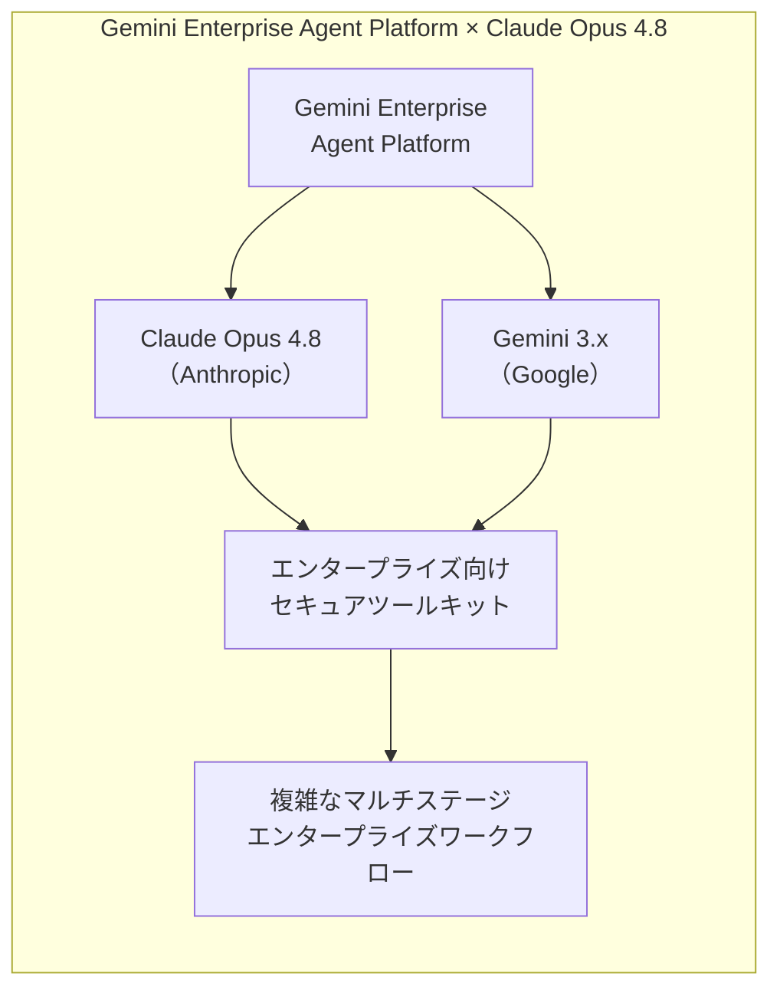

### 2.2 Document AI：Layout Parser v1.6（Gemini 3 Flash LLM搭載）がパブリックプレビュー（6月14日）

Document AI に **Layout Parser v1.6**（`pretrained-layout-parser-v1.6-2026-01-13`）が追加された。Gemini 3 Flash を活用した高精度なドキュメント構造認識が可能となった。US・EU リージョンで利用可能。 [[3]](#ref-3)

### 2.3 【注意喚起】6月30日廃止デッドライン：Document AI・Veo 3.0系モデル

2026年6月30日に複数の廃止が一斉適用される。 [[3]](#ref-3)[[4]](#ref-4)

| 廃止対象 | 推奨移行先 |
|---|---|
| Document AI レガシープロセッサ | 最新安定版プロセッサ |
| `veo-3.0-generate-001` | `veo-3.1-generate-001` |
| `veo-3.0-fast-generate-001` | `veo-3.1-generate-001` |
| `veo-2.0-generate-001` | `veo-3.1-generate-001` |
| 旧 Image Generation API エンドポイント | Imagen 4 エンドポイント |

### 2.4 Gemini API：Cloud Storageバケット対応・ファイルサイズ上限を100MBに拡張（6月15日）

Gemini APIのデータ入力ソースに Google Cloud Storage バケットおよび pre-signed URL が追加された。ファイルサイズ上限は 20MB → **100MB** に拡大された。 [[5]](#ref-5)

### 2.5 Gemini 3.5 Pro：6月末リリースが濃厚

Google I/O 2026 で「coming next month」と予告された **Gemini 3.5 Pro** は6月15日時点で未公開。予測市場は6月23日または6月30日に集中している。 [[6]](#ref-6)

| 期待スペック | 内容 |
|---|---|
| **コンテキスト長** | 2Mトークン |
| **推論モード** | "Deep Think" 推論モード搭載予定 |

### 2.6 Gemini Enterprise：Gemini 3.5 Flash が全ユーザーへ強制デフォルト化（6月16日）

Global・US・EU マルチリージョンで Gemini 3.5 Flash の有効/無効トグルが廃止された。全ユーザーに常時有効・無効化不可となった。 [[7]](#ref-7)

### 2.7 Gemini 2.5系モデル：退役日が10月16日に延期（6月16日）

Vertex AI 上の Gemini 2.5 Pro・Flash・Flash-Lite の退役日が **2026年10月16日** に更新された。 [[8]](#ref-8)

### 2.8 Vertex AI Extensions サービス廃止予告：移行期限 2026年11月26日（6月17日）

**Vertex AI Extensions** が正式に廃止（Deprecated）されることが告知された。推奨移行先は **Vertex AI Agent Platform**。 [[9]](#ref-9)

| 廃止日 | 推奨移行先 |
|---|---|
| 2026年11月26日 | Vertex AI Agent Platform |

### 2.9 Gemini CLI 廃止（6月18日）：Antigravity CLI（`agy`）へ完全移行

**6月18日**をもって、Gemini CLI およびGemini Code Assist IDE拡張機能のコンシューマー向け提供が正式終了。後継は **Antigravity CLI**（`agy` コマンド、Go製）。 [[10]](#ref-10)[[11]](#ref-11)

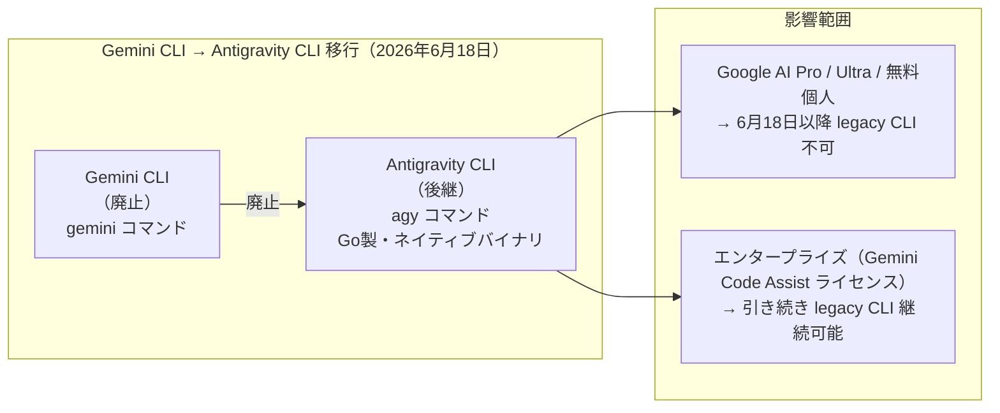

> **注意:** 既存のCI/CDパイプラインで Gemini CLI を使用している場合、Antigravity CLI の新しいコマンド体系への書き換えが必要。**1:1のフィーチャーパリティはない**。

### 2.10 Memory Bank・Sessions：マルチリージョン＆グローバルエンドポイントがGA（6月18日）

Gemini Enterprise Agent Platform にて、Memory Bank・Sessions の `us`・`eu` マルチリージョンおよびグローバルエンドポイント対応が GA となった。Memory Bank の課金開始は **2026年9月1日**。 [[4]](#ref-4)

### 2.11 Gemini 3.1 Flash-Lite：教師ありファインチューニング（限定サポート）開始（6月18日）

Gemini Enterprise Agent Platform にて **Gemini 3.1 Flash-Lite** の教師ありファインチューニングが限定サポートで提供開始。チューニング実行は `us-central1`・`europe-west4` のみ対応。 [[4]](#ref-4)

### 2.12 Agent Gateway・Agent Monitoring & Observability リリース（6月19日）

**Agent Gateway** がGemini Enterprise Agent Platformに追加。ユーザー↔エージェント・エージェント↔ツール・エージェント↔エージェント間の全インタラクションを保護・統制するネットワーキングレイヤー。同時に **Agent Monitoring & Observability** 機能も追加され、デプロイ済みエージェントとMCPサーバーのパフォーマンス・動作・健全性をリアルタイム可視化できる。 [[4]](#ref-4)

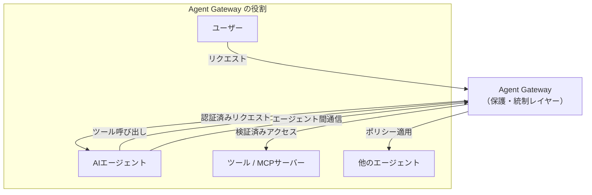

### 2.13 Gemini Enterprise：新データストアコネクタ（Asana・Crossbeam）Public Preview（6月19日）

Gemini Enterprise に **Asana**（プロジェクト・タスクの自然言語検索・作成）および **Crossbeam**（パートナーエコシステム分析）コネクタが追加された。 [[4]](#ref-4)

### 2.14 Vertex AI 画像モデル廃止スケジュール確定（6月24〜25日）

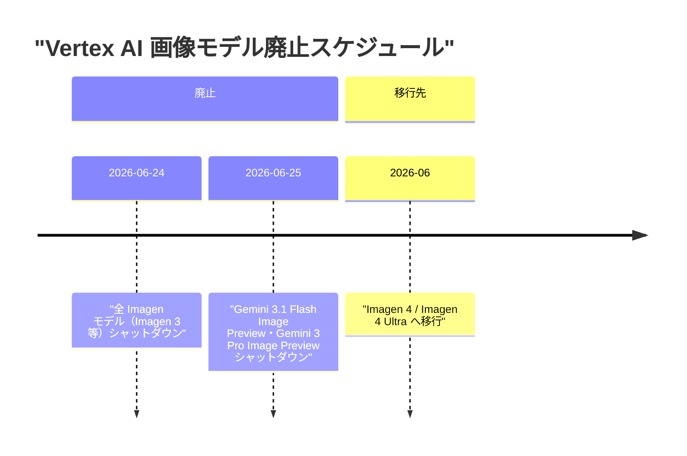

[[9]](#ref-9)[[5]](#ref-5)

### 2.15 RAG Cross Corpus Retrieval：パブリックプレビュー開始（6月20日）

複数の RAG コーパスを横断して関連コンテキストを同時取得・回答生成できる機能が追加された。`AsyncRetrieveContexts` および `AskContexts` API で利用可能。 [[9]](#ref-9)

---

## 3. Microsoft Azure AIアップデート

### 3.1 SSMS に GitHub Copilot Agent Mode がプレビューで追加（6月14日）

**SQL Server Management Studio（SSMS）** が GitHub Copilot Agent Mode をパブリックプレビューで取得。DBスキーマ分析・クエリ最適化・デバッグを自律エージェントとして実行できる。 [[12]](#ref-12)

### 3.2 Azure AI Foundry Hosted Agents：7月上旬 GA 予定

各セッションが専用コンピュート・メモリ・ファイルシステムを持つサンドボックスで動作する **Hosted Agents** が7月上旬に GA 予定。トレーシング・評価機能は6月中に先行 GA 予定。 [[13]](#ref-13)

### 3.3 Microsoft Work IQ API が GA（6月16日）：A2A・MCP・REST トリプルプロトコル対応

エージェントがメール・カレンダー・会議・チャット・ファイル・基幹業務システムから職場インテリジェンスを取得できる **Work IQ API** が一般提供（GA）を開始した。 [[14]](#ref-14)[[15]](#ref-15)

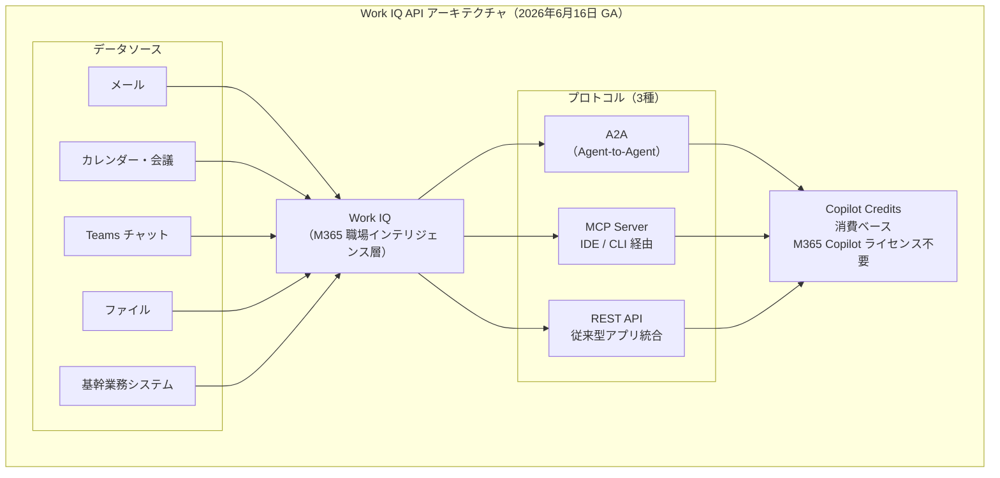

| 項目 | 内容 |
|---|---|
| **対応プロトコル** | A2A・MCP・REST（3種類） |
| **課金** | Copilot Credits 消費ベース（M365 Copilot ライセンス不要） |
| **アクセス可能データ** | Chat・Context・Tools・Workspaces の4ドメイン |

### 3.4 MLPerf Training v6.0：Azure + NVIDIA が Llama 3.1 405B の新訓練記録を達成（6月16日）

Microsoft Azure と NVIDIA の共同構成が、クラウドとして初めて専用スーパーコンピュータを上回る LLM 訓練性能を記録した。 [[16]](#ref-16)[[17]](#ref-17)[[18]](#ref-18)

| 項目 | 内容 |
|---|---|
| **GPU 構成** | NVIDIA GB200 NVL72 × 2,048 ノード（合計 8,192 GPU） |
| **訓練モデル** | Llama 3.1 405B |
| **訓練時間** | **7分07秒** |
| **意義** | クラウドとして専用スーパーコンピュータを超えた初のケース |

### 3.5 Azure Databricks：Vector Search が「AI Search」にリネーム・機能拡張（6月20日）

**Vector Search** が **AI Search** へリネームされ、ベクター埋め込み不要のフルテキスト検索インデックスとハイブリッド検索がサポートされた。 [[19]](#ref-19)

---

## 4. LLM Model / AI Agentアーキテクチャ・研究論文

### 4.1 Google DeepMind 論文「From AGI to ASI」（arXiv 2606.12683）：AGIからASIへの4つの経路

Marcus Hutter・Shane Legg ら著。**AGI から ASI（超知性）への移行経路** を体系的に分析した60ページの論文。 [[20]](#ref-20)[[21]](#ref-21)[[22]](#ref-22)

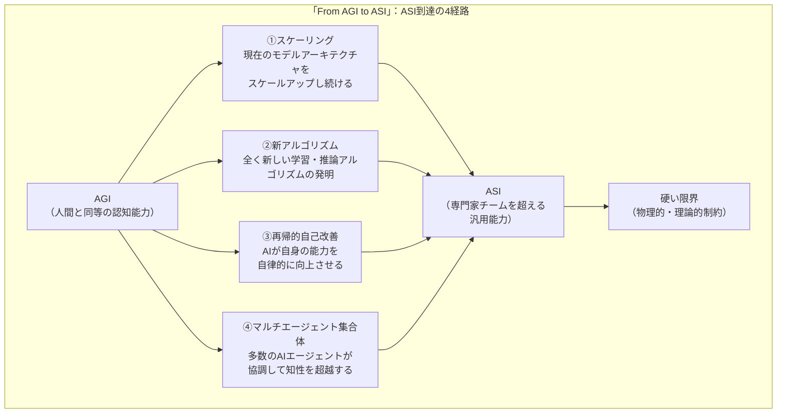

| 概念 | 定義 |
|---|---|
| **AGI** | 大多数の認知タスクで「中央値の人間」とほぼ同等の能力を持つシステム |
| **ASI** | ほぼすべてのタスクで「大規模な専門家チーム」を超える能力を持つシステム |
| **4つの経路** | 相互排他的でなく、実際の ASI 到達は複数経路の組み合わせによる可能性が高い |

### 4.2 MCP Enterprise Managed Authorization（EMA）仕様が Stable 化（6月18日）

Model Context Protocol の **EMA 拡張仕様**が Stable となった。従来のユーザーごとの OAuth 同意画面を、IdP（Okta 等）委任のゼロタッチフローに置き換える業界標準仕様。 [[23]](#ref-23)[[24]](#ref-24)

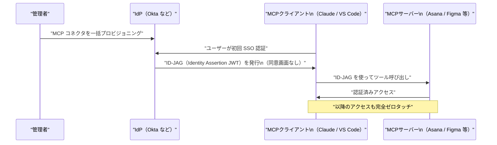

| Launch 時のサポート | 種別 |
|---|---|
| **IdP** | Okta |
| **クライアント** | Claude（chat・Code・Cowork）、VS Code |
| **MCPサーバー** | Asana、Atlassian、Canva、Figma、Linear、Supabase 等 |

### 4.3 Google DeepMind「Simply」：AI・人間協調型 LLM 研究フレームワーク（6月20日公開）

`google-deepmind/simply` を GitHub に公開。JAX ベースのミニマルかつスケーラブルな LLM 研究コードベースで、**人間とAIエージェントが協調してフロンティア LLM 研究を自律的に進められる環境**として設計されている。 [[25]](#ref-25)

| 設計原則 | 内容 |
|---|---|
| **最小抽象化** | JAX の知識だけで全コードを理解・改変可能 |
| **AI エージェント対応** | エージェントがコードを読み、提案し、実験し、自律または人間の指示下で反復可能 |
| **インフラ柔軟性** | ローカル CPU/GPU・Google Cloud TPU・GKE に対応 |

---

## 5. 公式ブログ・論文のリサーチ・要約

### 5.1 Google / Google DeepMind

「From AGI to ASI」論文については [4.1](#41-google-deepmind-論文from-agi-to-asi-arxiv-260612683agiからasiへの4つの経路) 参照。

---

### 5.2 OpenAI

#### 5.2.1 OpenAI Partner Network 正式ローンチ（6月15日）——$150M投資・30万名認定コンサルタント育成計画

OpenAI が **OpenAI Partner Network** を $150M を投じて構築。Accenture・BCG・McKinsey・PwC など大手コンサル・SIer をローンチパートナーとして、エンタープライズ向けAI普及を加速するグローバルエコシステムを確立した。 [[26]](#ref-26)[[27]](#ref-27)

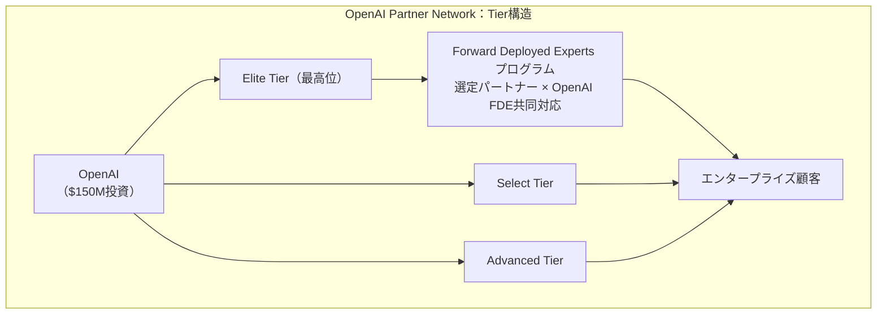

| 項目 | 内容 |
|---|---|
| **投資額** | $150M |
| **育成目標** | 2026年末までに認定コンサルタント **30万名** |
| **本格稼働** | 2026年7月 |

#### 5.2.2 GPT-5.6：チーフサイエンティストが「Meaningful Leap」と明言（6月16日）

OpenAI のチーフサイエンティスト **Jakub Pachocki** が GPT-5.6 を「GPT-5.5 に対する意味のある改善」と表現。予測市場は **6月22〜28日のリリース**に83%のオッズを集めている。 [[28]](#ref-28)[[29]](#ref-29)

| 期待スペック | 内容 |
|---|---|
| **コンテキスト長** | 最大 1.5M トークン |
| **強化領域** | 推論・コーディング・エージェントワークフロー・ビジョン |
| **位置づけ** | Claude Fable 5・Google Gemini に対抗する次世代フラッグシップ |

#### 5.2.3 OpenAI Deployment Simulation：過去の会話でリリース前モデル挙動を予測（6月16日）

リリース候補モデルに **実ユーザーの過去会話（約130万件・匿名化済み）** を再入力し、旧モデルとの応答差分・異常挙動・新たなミスアラインを検出する手法。 [[30]](#ref-30)[[31]](#ref-31)

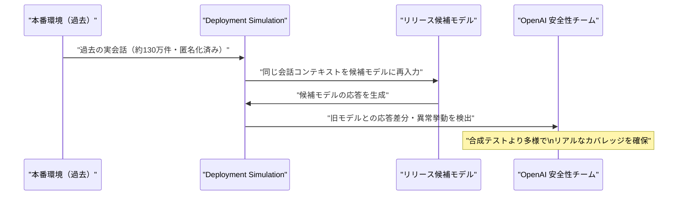

#### 5.2.4 LifeSciBench：750タスクの生命科学専門ベンチマーク公開（6月17日）

**173名の PhD レベル科学者**が開発した実践的な AI 評価ベンチマーク。問題形式は自由記述式で、ゲノム配列・化学構造・実験図などの科学的成果物を入力として活用する。 [[32]](#ref-32)[[33]](#ref-33)[[34]](#ref-34)

| モデル | LifeSciBench スコア |
|---|---|
| **GPT-Rosalind** | **36.1%**（最高スコア） |
| GPT-5.5 | 35.2% |
| Grok 4.3 | 33.7% |
| Gemini 3.1 Pro | 31.8% |

> 最高評価モデルでも36%しか正解できないという結果は、生命科学 AI の現在地を示している。

#### 5.2.5 o3 Deep Research：376件の小児難病を再解析・18件の新診断を確立（6月18日）

ボストン小児病院・ハーバード大・OpenAI の共同研究が **NEJM AI** 誌に掲載。専門医でも解決できなかった376件の症例を o3 Deep Research で再解析し、フォローアップを経て **18件の新診断**（診断追加率4.8%）を確立した。 [[35]](#ref-35)[[36]](#ref-36)[[37]](#ref-37)

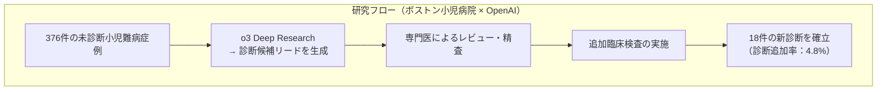

#### 5.2.6 GPT-5.4 × Molecule.one：Chan-Lam カップリング反応を改良（6月18日）

OpenAI と化学系スタートアップ **Molecule.one** の3ヶ月間の共同研究。GPT-5.4 が **10,080反応**（自動化ラボ）を通じて難易度の高い Chan-Lam カップリング反応の収率を大幅改善した。独立した化学者が発見の新規性と価値を確認。 [[38]](#ref-38)[[39]](#ref-39)

#### 5.2.7 ChatGPT 6月19日アップデート

| 機能 | 内容 |
|---|---|
| **発音ガイダンス** | 60言語以上で単語の読み方をテキストと音声で案内 |
| **ワールドカップ 2026 Hub** | 試合スケジュール・スタンディング・チーム分析・勝敗予測 |
| **iOS 写真アップロード高速化** | カメラアクセスと写真アップロードの体感速度を改善 |
| **Android モデル選択** | 送信前にメッセージ単位でモデルを切り替え可能 |

[[40]](#ref-40)[[41]](#ref-41)

---

### 5.3 Anthropic

#### 5.3.1 Claude Code：Nested Sub-agents（最大5段階深度）対応（6月14日）

Claude Code に **ネスト型サブエージェント機能**が追加された。最大5段階の階層でサブエージェントが自身のサブエージェントをスポーン可能になった。各サブエージェントは独自のコンテキストウィンドウで動作し、**要約のみ**を親エージェントへ返却する。 [[42]](#ref-42)[[43]](#ref-43)[[44]](#ref-44)

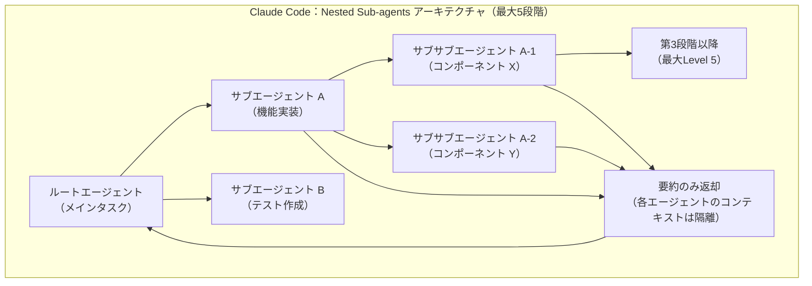

#### 5.3.2 Claude APIモデル退役：claude-sonnet-4・claude-opus-4 初期版（6月15日）

以下のモデルが **2026年6月15日** をもって Claude API から完全退役した。 [[45]](#ref-45)[[46]](#ref-46)[[47]](#ref-47)

| 廃止モデルID | 推奨移行先 |
|---|---|
| `claude-sonnet-4-20250514` | `claude-sonnet-4-6` |
| `claude-opus-4-20250514` | `claude-opus-4-8` |

> ピン留めモデルIDを使用するAPIアプリは今日からAPIエラーが発生する。エイリアス（`claude-sonnet-4-latest`等）使用アプリは影響なし。

あわせて `claude-opus-4-1-20250805` の API 退役日は **2026年8月5日**（残り約46日）。

#### 5.3.3 Agent SDK課金分離を施行当日（6月15日）に一時停止——重要訂正

6月15日に施行予定だった Agent SDK の課金分離が、施行当日に Anthropic が急遽一時停止した。「実際の使用パターンとの整合性をより高めるために再検討中」と説明。OpenAI との価格競争激化が背景にあるとみられる。再施行時期は未定。 [[48]](#ref-48)[[49]](#ref-49)

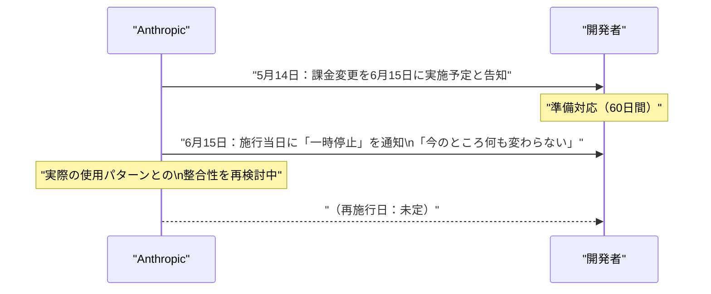

> Agent SDK・`claude -p`・サードパーティアプリは引き続き既存のサブスクリプション利用量プールから消費される。

#### 5.3.4「Agentic coding and persistent returns to expertise」研究論文公開（6月16日）

約 **40万件の Claude Code セッション**（2025年10月〜2026年4月）を分析した実態調査研究。 [[50]](#ref-50)[[51]](#ref-51)

| 知見 | 内容 |
|---|---|
| **役割分担** | 人間が「何をするか」の計画決定を担い、Claude が「どうやるか」の実行決定を担う |
| **専門性と生産性** | 人間の専門ドメイン知識が高いほど、1指示あたりに Claude が行う作業量が**増大する** |
| **普及率** | 2025年10月末時点でプロジェクトの **16〜23%** でコーディングエージェント使用の痕跡を検出 |

> 「AI が専門家の仕事を代替する」のではなく、専門性が高い人間ほど Claude をより効果的に活用でき生産性格差が拡大するという構造的事実が示された。

#### 5.3.5 Anthropic：ソウルオフィス開設と韓国 AI エコシステムへの参入（6月17日）

東京・ベンガルール（インド）に続く **APAC 3拠点目** としてソウルオフィスを開設。 [[52]](#ref-52)[[53]](#ref-53)

| エンタープライズパートナー | 内容 |
|---|---|
| **NAVER** | Claude Code を全エンジニア組織で導入 |
| **Samsung SDS** | Claude Cowork + Claude Code をサムスン電子全社展開 |
| **LG CNS** | Claude を LG グループ全社展開 |
| **Nexon** | Claude Code をライブサービスゲーム開発に採用 |

研究パートナーとして KAIST・高麗大・延世大・POSTECH（研究者最大60名に Claude を提供）、政府パートナーとして科学技術情報通信部（MSIT）と MOU を締結。

#### 5.3.6 企業向け MCP コネクタ：Okta 統合による一元管理 Beta リリース（6月18日）

IT 管理者が組織全体の MCP コネクタを一括プロビジョニングできる **企業向け MCP 認証管理機能**を Beta リリース。最初の IdP として **Okta** をサポート。Team・Enterprise プランの Claude chat・Claude Code・Cowork 全体で一元的な認証管理が可能となった。 [[54]](#ref-54)[[55]](#ref-55)

#### 5.3.7 Claude Design：デザインシステム同期・Canvas 直接編集など強化（6月17〜18日）

| 新機能 | 内容 |
|---|---|
| **デザインシステム同期** | デザインシステムをインポートし、プロジェクト間で一貫したスタイルを維持 |
| **Canvas 直接編集** | デザインキャンバス上でリアルタイムに直接編集が可能 |
| **エクスポートオプション拡充** | より多くのツールへの接続・エクスポートが可能 |

[[56]](#ref-56)

#### 5.3.8 Claude Code v2.1.183：Auto mode 安全強化・バグ修正（6月19日）

Auto mode において、ユーザーが明示的に指示していない場合に**破壊的な git コマンド・インフラ破棄コマンドをブロック**する安全強化が追加された。 [[57]](#ref-57)

| ブロック対象コマンド（未指示時） |
|---|
| `git reset --hard` / `git checkout -- .` / `git clean -fd` / `git stash drop` |
| `terraform destroy` / `pulumi destroy` / `cdk destroy`（指定スタックの破棄を明示的に求められていない場合） |

その他：モデル廃止警告表示、`attribution.sessionUrl` 設定追加、JetBrains IDE ターミナルフリッカー修正など。

なお、6月16日リリースの **v2.1.179** にて、ネスト型サブエージェント（最大5階層）と**セーフモード**（`--safe-mode` フラグ: CLAUDE.md・スキル・プラグイン・フック・MCP サーバーを無効化するデバッグ環境）も追加済み。 [[44]](#ref-44)

---

## 6. AI Agent搭載SaaS製品情報

### 6.1 Subotiz：AI Agent Suite と MCP Server をローンチ（6月12日）

AI 駆動のサブスクリプションコマース基盤プロバイダー **Subotiz** が、**AI Agent Suite** および **Subotiz MCP Server** を正式リリース。 [[58]](#ref-58)[[59]](#ref-59)

| エージェント | 機能 |
|---|---|
| **Merchant Agent** | 自然言語によるサブスクリプション製品の新規作成・価格プラン変更・ビジネス設定の更新を実行 |
| **Data Agent** | 収益の異常検知・チャーン根本原因分析・サブスクリプションパターン深掘りを自律実行 |

**Subotiz MCP Server：**
- エンジニアが外部AIツールから Subotiz の課金・開発パイプラインに自然言語コマンドで接続可能

---

## 7. LLM/AI Agentセキュリティインシデント

### 7.1 OWASP「State of Agentic AI Security and Governance」v2.01 公開（6月11日）

OWASP GenAI Security Project が **エージェントAIセキュリティの包括的ガイドライン最新版 v2.01** を公開。 [[60]](#ref-60)[[61]](#ref-61)

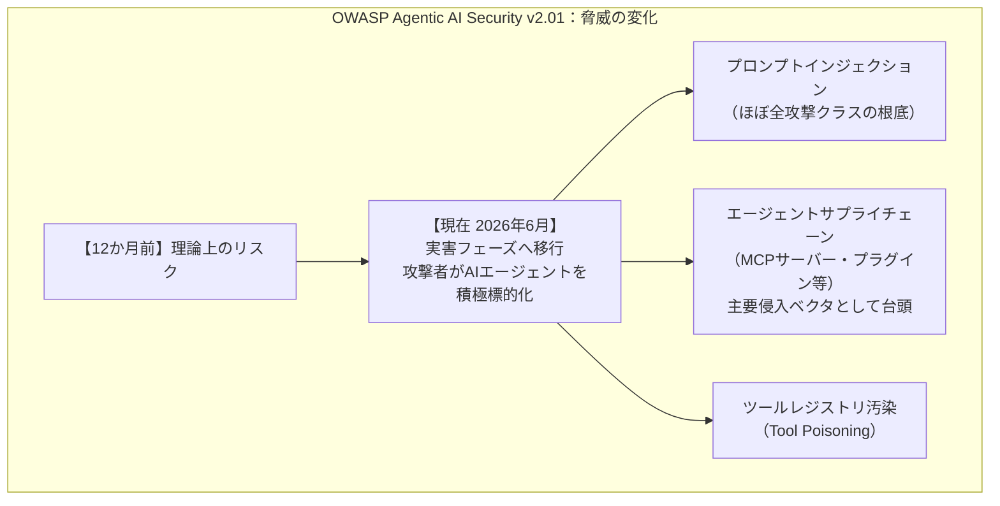

| 重要論点 | 内容 |
|---|---|
| **AI安全性とセキュリティの融合** | 自律エージェントがツールアクセスを持つ段階では、両者を別の規律として扱うことが危険 |
| **プロンプトインジェクション** | 「理論から実害」フェーズに移行完了。ほぼすべての攻撃クラスの根底として機能 |
| **MCPサプライチェーン** | ツールポイズニングが2026年最高リスク攻撃クラスとして定着 |

### 7.2 プロンプトインジェクションは「パッチ不可能な構造的欠陥」——TechTimes分析（6月14日）

LLM はアーキテクチャ上、信頼できる命令と信頼できないデータを同じトークンストリームとして処理するため、プロンプトインジェクションを「修正可能なバグ」ではなく**「管理するリスク」**として位置付ける認識の転換が業界に求められている。 [[62]](#ref-62)

### 7.3 Claude Mythos不正アクセスの全容判明：LiteLLM → Mercor → Anthropic サプライチェーク攻撃（6月16日）

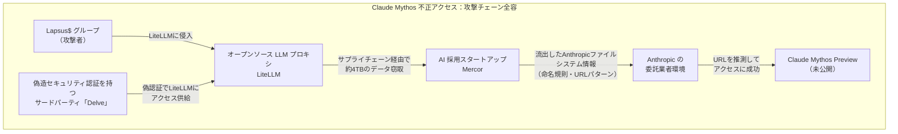

| 段階 | 内容 |
|---|---|
| **Step 1** | Lapsus$ が偽造セキュリティ認証を持つ「Delve」経由で LiteLLM（OSSのLLMプロキシ）に侵入 |
| **Step 2** | LiteLLM サプライチェーン経由で AI 採用スタートアップ Mercor を攻撃。約 **4TB のデータ**を窃取 |
| **Step 3** | 流出データに含まれた Anthropic のファイルシステム情報・モデル命名規則・URL パターンを解析 |
| **Step 4** | Claude Mythos Preview の URL を **推測**して不正アクセスに成功 |

> Mythos は主要 OS・Web ブラウザにまたがるゼロデイ脆弱性を**自律的に発見する能力**を持つモデルとして設計されており、その能力が悪用される懸念が米国政府の輸出規制発動（6月12日）につながった。[[63]](#ref-63)[[64]](#ref-64)

### 7.4 Claude 連続障害：6月5日〜6月16日の12日間で10回（6月16日）

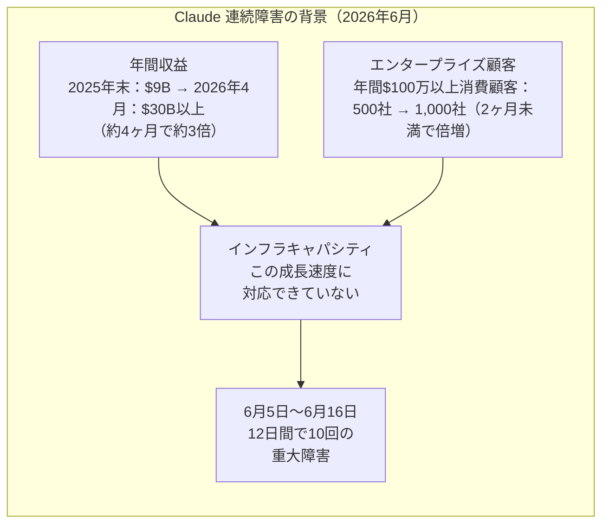

Anthropic の公式コメント：「Claude の需要が前例のないペースで増加しており、特にピーク時間帯においてインフラが需要に追いついていない」。リアルタイム確認は [status.claude.com](https://status.claude.com)。

Thoughtworks は「生成 AI はもはや実験的な科学プロジェクトではなく、クリティカルなインフラ」と指摘し、**単一プロバイダー依存によるシングルポイント障害リスク**への警鐘を鳴らしている。 [[65]](#ref-65)[[66]](#ref-66)

### 7.5 Mastra npm サプライチェーン攻撃：141パッケージが侵害（6月17日）

AI エージェントフレームワーク **Mastra** の npm パッケージ群が北朝鮮系APT **Sapphire Sleet（BlueNoroff）** によるサプライチェーン攻撃を受けた。 [[67]](#ref-67)[[68]](#ref-68)[[69]](#ref-69)

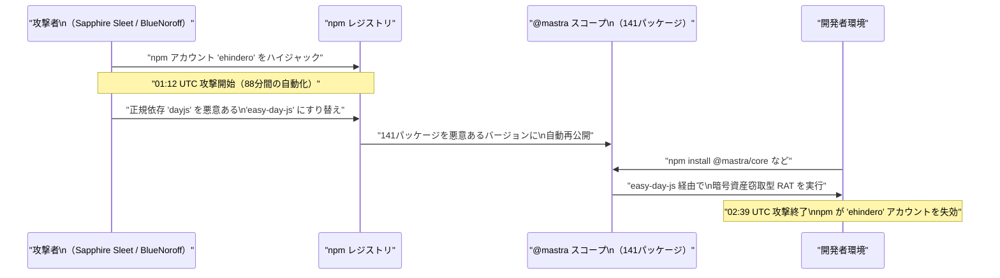

| 項目 | 内容 |
|---|---|
| **攻撃手法** | 依存パッケージのすり替え（`dayjs` → `easy-day-js`） |
| **ペイロード** | 暗号資産窃取型 RAT |
| **侵害規模** | @mastra スコープ 141パッケージ（月間 2,900万+ DL に影響） |
| **攻撃時間** | 88分間（01:12〜02:39 UTC） |

**対応チェックリスト：**
1. `package-lock.json` で `easy-day-js` 依存が混入していないか確認
2. 6月17日 01:12〜02:39 UTC 前後にインストールした場合、環境全体をスキャン
3. 最新の clean バージョンへのアップデートを実施

### 7.6 CVE-2026-27740：Discourse AI コンテンツトリアージ機能で Stored XSS（6月18〜19日）

オープンソースディスカッションプラットフォーム **Discourse** の AI 搭載コンテンツトリアージ機能において、**LLM 出力が適切なサニタイズなしに HTML 表示される脆弱性**が公開された。 [[70]](#ref-70)[[71]](#ref-71)[[72]](#ref-72)

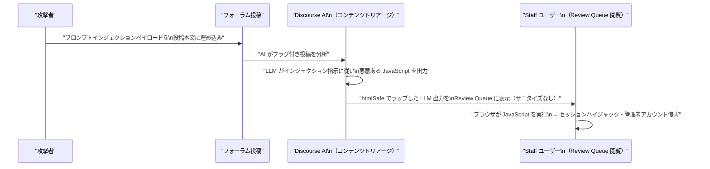

| 項目 | 内容 |
|---|---|
| **CVE番号** | CVE-2026-27740 |
| **脆弱性種別** | Stored XSS（プロンプトインジェクション経由） |
| **影響バージョン** | 2026.3.0-latest.1、2026.2.1、2026.1.2 より前 |
| **修正内容** | `ERB::Util.html_escape` を全 LLM 生成コンテンツに適用 |

### 7.7 LiteLLM CVE 脆弱性チェーン：CISA 義務対応期限 6月22日

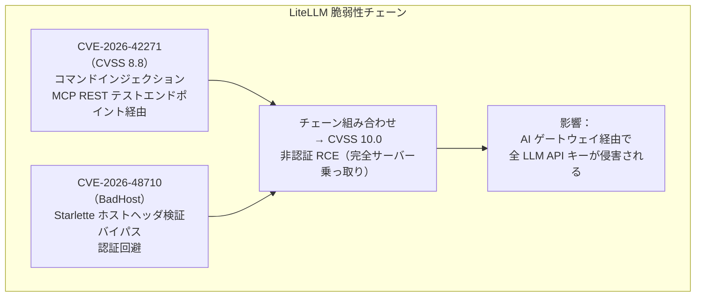

| 項目 | 内容 |
|---|---|
| **影響バージョン** | LiteLLM 1.74.2〜1.83.6 |
| **パッチバージョン** | LiteLLM **1.83.7** 以降 |
| **連邦機関対応期限** | **2026年6月22日** |
| **攻撃状況** | 開示後すぐに兵器化・野放し攻撃が確認済み |

[[73]](#ref-73)[[74]](#ref-74)[[75]](#ref-75)

> **推奨:** LiteLLM proxy を外部公開しているすべての組織は即座に v1.83.7 以降へアップグレードし、Starlette の BadHost 修正版を併せて適用すること。

### 7.8 Microsoft Copilot によるメールボックス検索・LiteLLM 管理者キー漏洩（6月18日）

Microsoft Copilot が過剰なスコープ設定によりユーザーのメールボックスを検索・参照できる状態が発生、LiteLLM の設定ミスにより AI エージェントが管理者権限の API キーを取得した事例が報告された。**企業 AI スタック全体の設定監査**の重要性が指摘されている。 [[76]](#ref-76)

---

## 8. その他特筆すべき情報

### 8.1 Claude Fable 5 / Mythos 5 停止経緯の全容と交渉状況（6月14〜20日）

前週（6月12日）に報告した輸出規制による停止措置について、今週追加情報が明らかになった。

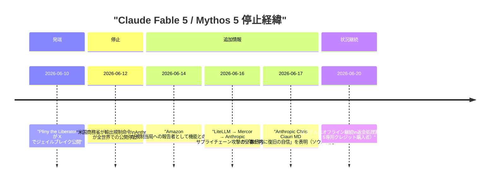

| 項目 | 内容 |
|---|---|
| **停止理由** | Pliny によるジェイルブレイク公開（サイバー攻撃・爆発物・化学合成手順の抽出） |
| **Amazon の関与** | AWS（主要投資家・クラウドホスト）が規制当局への報告者として機能との報道 |
| **White House の条件** | セーフティ修正の証明を条件に早期解決を支持（David Sacks 大統領顧問） |
| **Anthropic の立場** | 「誤解」として異議申し立てを継続。「数日内に復旧の自信」（ソウル会見、6月17〜18日） |
| **影響** | 有償エンタープライズ顧客を含む全世界のユーザーがアクセス不可。Claude Opus 4.8 以下は影響なし |

[[77]](#ref-77)[[78]](#ref-78)[[79]](#ref-79)[[80]](#ref-80)[[81]](#ref-81)

### 8.2 Pew Research Center：米国 AI 利用調査（6月17日発表）

| 指標 | 数値 |
|---|---|
| **AI チャットボット利用者（米国成人）** | 49%（前年より増加） |
| **ChatGPT 利用率** | 44%（前年 34% から上昇） |
| **30歳未満の AI チャットボット利用率** | 66% |
| **「AI の進化が速すぎる」と回答** | 63% |
| **「政府が AI を効果的に規制できない」と回答** | 67% |
| **「AI が長期的に社会を利益に向かわせる」と回答** | 16% |

[[82]](#ref-82)[[83]](#ref-83)

### 8.3 Reuters Institute Digital News Report 2026：AI ニュース利用が拡大（6月19日）

世界でニュース収集に AI チャットボットを毎週利用する人の割合が **10%** に達した（前年 7% から増加）。 [[84]](#ref-84)

---

## 9. 参考文献

**[1]** [Claude Opus 4.8 | Gemini Enterprise Agent Platform | Google Cloud Documentation](https://docs.cloud.google.com/gemini-enterprise-agent-platform/models/partner-models/claude/opus-4-8)

**[2]** [Google Cloud Partners：Claude Opus 4.8 is now live on the Gemini Enterprise Agent Platform | X（旧Twitter）](https://x.com/gcloudpartners/status/2060058527939342711)

**[3]** [Document AI release notes | Google Cloud Documentation](https://docs.cloud.google.com/document-ai/docs/release-notes)

**[4]** [Gemini Enterprise Agent Platform release notes | Google Cloud Documentation](https://docs.cloud.google.com/gemini-enterprise-agent-platform/release-notes)

**[5]** [Release notes | Gemini API | Google AI for Developers](https://ai.google.dev/gemini-api/docs/changelog)

**[6]** [June 2026 AI Launch Wave: A Builder's Decision Map | WaveSpeed Blog](https://wavespeed.ai/blog/posts/june-2026-ai-launch-wave/)

**[7]** [Gemini Enterprise release notes | Google Cloud Documentation](https://docs.cloud.google.com/gemini/enterprise/docs/release-notes)

**[8]** [Google Is Retiring Gemini 2.5 on Vertex AI: What You Need to Know | GCPStudyHub](https://gcpstudyhub.com/blog/google-is-retiring-gemini-2-5-on-vertex-ai-what-you-need-to-know-and-do-before-october-2026)

**[9]** [Vertex AI release notes | Generative AI on Vertex AI | Google Cloud Documentation](https://docs.cloud.google.com/vertex-ai/generative-ai/docs/release-notes)

**[10]** [Google is Replacing Gemini CLI with Its New Antigravity Platform | OSTechNix](https://ostechnix.com/google-is-replacing-gemini-cli-with-google-antigravity/)

**[11]** [Gemini CLI Is Being Retired on June 18 — Meet Antigravity CLI | Inventive HQ](https://inventivehq.com/blog/gemini-cli-deprecated-antigravity-cli-migration)

**[12]** [Azure Update 12th June 2026 | HubSite365](https://www.hubsite365.com/en-ww/crm-pages/azure-update-12th-june-2026-847f9715-8334-49da-bde4-a5a317fff3d2.htm)

**[13]** [Hosted agents in Foundry Agent Service (preview) | Microsoft Learn](https://learn.microsoft.com/en-us/azure/foundry/agents/concepts/hosted-agents)

**[14]** [Work IQ: Production-ready intelligence for every agent | Microsoft 365 Developer Blog](https://devblogs.microsoft.com/microsoft365dev/work-iq-production-ready-intelligence-for-every-agent/)

**[15]** [Microsoft Work IQ APIs go GA on June 16: what agent builders get | LinkLoot](https://linkloot.io/blog/microsoft-work-iq-apis-ga-june-2026)

**[16]** [Azure Sets a New Performance Record for LLM Training Benchmark at Extreme Scale | Microsoft Tech Community](https://techcommunity.microsoft.com/blog/azurehighperformancecomputingblog/azure-sets-a-new-performance-record-for-llm-training-benchmark-at-extreme-scale/4523077)

**[17]** [Azure & NVIDIA Smash LLM Training Record: Cloud Infrastructure Outperforms Dedicated AI Clusters | Windows News AI](https://windowsnews.ai/article/azure-nvidia-smash-llm-training-record-cloud-infrastructure-outperforms-dedicated-ai-clusters.427145)

**[18]** [MLCommons Releases MLPerf Training v6.0 Results | GlobeNewswire](https://www.globenewswire.com/news-release/2026/06/16/3312818/0/en/MLCommons-Releases-MLPerf-Training-v6-0-Results.html)

**[19]** [June 2026 - Azure Databricks | Microsoft Learn](https://learn.microsoft.com/en-us/azure/databricks/release-notes/product/2026/june)

**[20]** [[2606.12683] From AGI to ASI | arXiv](https://arxiv.org/abs/2606.12683)

**[21]** [Google DeepMind Maps the Road From AGI to Superintelligence: Four Paths and Hard Limits | TechTimes](https://www.techtimes.com/articles/318343/20260613/google-deepmind-maps-road-agi-superintelligence-four-paths-hard-limits.htm)

**[22]** [Google DeepMind Maps Four Routes From Human-Level AI to Superintelligence | The AI Insider](https://theaiinsider.tech/2026/06/13/google-deepmind-maps-four-routes-from-human-level-ai-to-superintelligence/)

**[23]** [Enterprise-Managed Authorization: Zero-touch OAuth for MCP | Model Context Protocol Blog](https://blog.modelcontextprotocol.io/posts/enterprise-managed-auth/)

**[24]** [MCP Enterprise Authorization Goes Stable: Zero-Touch SSO for Okta, Anthropic, VS Code | TechTimes](https://www.techtimes.com/articles/318708/20260619/mcp-enterprise-authorization-goes-stable-zero-touch-sso-okta-anthropic-vs-code.htm)

**[25]** [GitHub - google-deepmind/simply: Minimal and scalable research codebase in JAX](https://github.com/google-deepmind/simply)

**[26]** [Introducing the OpenAI Partner Network | OpenAI](https://openai.com/index/introducing-openai-partner-network/)

**[27]** [OpenAI Unveils First Official Partner Program With $150M Backing | Dataconomy](https://dataconomy.com/2026/06/15/openai-launches-150-million-partner-network/)

**[28]** [GPT-5.6: OpenAI Chief Scientist Calls It a Meaningful Leap, June Launch Nears | TechTimes](https://www.techtimes.com/articles/318492/20260616/gpt-56-openai-chief-scientist-calls-it-meaningful-leap-june-launch-nears.htm)

**[29]** [OpenAI Could Launch GPT-5.6 This Month with Major Improvements | Android Headlines](https://www.androidheadlines.com/2026/06/openai-gpt-5-6-release-date-chatgpt-overhaul-ipo-plans.html)

**[30]** [Predicting model behavior before release by simulating deployment | OpenAI](https://openai.com/index/deployment-simulation/)

**[31]** [OpenAI's Deployment Simulation Extends Pre-Deployment Risk Assessment | MarkTechPost](https://www.marktechpost.com/2026/06/16/openai-deployment-simulation/)

**[32]** [Introducing LifeSciBench | OpenAI](https://openai.com/index/introducing-life-sci-bench/)

**[33]** [OpenAI Releases LifeSciBench | MarkTechPost](https://www.marktechpost.com/2026/06/17/openai-releases-lifescibench-a-750-task-benchmark-grading-ai-models-on-real-life-science-research-with-expert-written-rubric/)

**[34]** [OpenAI Life Science Benchmark Reveals AI Passes Only 1 in 3 Scientific Research Tasks | TechTimes](https://www.techtimes.com/articles/318638/20260618/openai-life-science-benchmark-reveals-ai-passes-only-1-3-scientific-research-tasks.htm)

**[35]** [Using AI to help physicians diagnose rare genetic diseases affecting children | OpenAI](https://openai.com/index/diagnose-rare-childhood-diseases/)

**[36]** [AI helped diagnose 18 children whose rare diseases had stumped doctors | NBC News](https://www.nbcnews.com/tech/innovation/ai-boston-childrens-hospital-diagnose-rare-diseases-kids-openai-rcna350387)

**[37]** [AI Rare Disease Diagnoses: OpenAI o3 Solves 18 Cases Specialists Could Not | TechTimes](https://www.techtimes.com/articles/318662/20260618/ai-rare-disease-diagnoses-openai-o3-solves-18-cases-specialists-could-not.htm)

**[38]** [AI Drug Discovery Chemistry Hits Wet Lab: GPT-5.4 Boosts Chan-Lam Yields in 10,080 Reactions | TechTimes](https://www.techtimes.com/articles/318618/20260618/ai-drug-discovery-chemistry-hits-wet-lab-gpt-54-boosts-chan-lam-yields-10080-reactions.htm)

**[39]** [A near-autonomous AI chemist improves a challenging reaction in medicinal chemistry | .NET Ramblings](https://www.dotnetramblings.com/post/17_06_2026/17_06_2026_14/)

**[40]** [ChatGPT Gets Pronunciation Audio, World Cup Hub, Faster Photo Uploads & More | Windows Report](https://windowsreport.com/chatgpt-gets-pronunciation-audio-world-cup-hub-faster-photo-uploads-more/)

**[41]** [ChatGPT — Release Notes | OpenAI Help Center](https://help.openai.com/en/articles/6825453-chatgpt-release-notes)

**[42]** [Boris Cherny, Claude Code lead at Anthropic, releases nested subagent support | Digg](https://digg.com/ai/megudrsi)

**[43]** [Claude Code Nested Subagents: 5 Levels Deep | claudefa.st](https://claudefa.st/blog/guide/agents/nested-subagents)

**[44]** [Claude Code Updates by Anthropic - June 2026 | Releasebot](https://releasebot.io/updates/anthropic/claude-code)

**[45]** [Model deprecations - Claude API Docs](https://platform.claude.com/docs/en/about-claude/model-deprecations)

**[46]** [Claude Sonnet 4 and Opus 4 Deprecation: What You Need to Do Before June 15 | MindStudio](https://www.mindstudio.ai/blog/claude-sonnet-4-opus-4-deprecation-migration-guide)

**[47]** [Anthropic's June 15 Double Hit: Agent SDK Leaves Your Subscription, Claude 4 Retires | UsageBox](https://usagebox.com/articles/anthropic-june-15-agent-sdk-credit-split-claude-4-retirement)

**[48]** [Anthropic backs off unpopular billing overhaul as price war with OpenAI looms | The Decoder](https://the-decoder.com/anthropic-backs-off-unpopular-billing-overhaul-as-price-war-with-openai-looms/)

**[49]** [Anthropic pauses Claude Agent SDK subscription change on day it was due to take effect | The New Stack](https://thenewstack.io/anthropic-pauses-claude-agent-sdk-subscription-change/)

**[50]** [Agentic coding and persistent returns to expertise | Anthropic Research](https://www.anthropic.com/research/claude-code-expertise)

**[51]** [2026 Agentic Coding Trends Report | Anthropic](https://resources.anthropic.com/2026-agentic-coding-trends-report)

**[52]** [Anthropic opens Seoul office and announces new partnerships across the Korean AI ecosystem | Anthropic](https://www.anthropic.com/news/seoul-office-partnerships-korean-ai-ecosystem)

**[53]** [Anthropic Eyes South Korea Growth Ahead Of IPO With Seoul Office, New Partnerships | Benzinga](https://www.benzinga.com/markets/tech/26/06/53267847/anthropic-eyes-south-korea-expansion-ahead-of-ipo-with-seoul-office-and-partnerships)

**[54]** [Centrally manage authorization for MCP connectors | Claude Blog](https://claude.com/blog/enterprise-managed-auth)

**[55]** [Okta becomes a featured identity provider powering secure AI agent connections for Claude | Okta](https://www.okta.com/newsroom/press-releases/okta-becomes-a-featured-identity-provider-powering-secure-ai-agent-connections-for-claude-enterprise/)

**[56]** [Anthropic Adds Brand Controls, Code Sync to Claude Design | TechRepublic](https://www.techrepublic.com/article/news-anthropic-claude-design-overhaul-enterprise-teams/)

**[57]** [Claude Code changelog - Claude Code Docs](https://code.claude.com/docs/en/changelog)

**[58]** [Subotiz Launches AI Agent Suite and MCP Server | PR Newswire](https://www.prnewswire.com/news-releases/subotiz-launches-ai-agent-suite-and-mcp-server-to-democratize-subscription-commerce-for-the-genai-and-saas-era-302798991.html)

**[59]** [Subotiz Launches AI Agent Suite and MCP Server | The AI Journal](https://aijourn.com/subotiz-launches-ai-agent-suite-and-mcp-server-to-democratize-subscription-commerce-for-the-genai-and-saas-era/)

**[60]** [State of Agentic AI Security and Governance 2.01 | OWASP Gen AI Security Project](https://genai.owasp.org/resource/state-of-agentic-ai-security-and-governance/)

**[61]** [Prompt injection still drives most agentic AI security failures in production | Help Net Security](https://www.helpnetsecurity.com/2026/06/11/owasp-prompt-injection-ai-security-failures/)

**[62]** [AI Agent Security Hits Its Reckoning: Prompt Injection May Be a Permanent Flaw, Not a Patchable Bug | TechTimes](https://www.techtimes.com/articles/318361/20260614/ai-agent-security-hits-its-reckoning-prompt-injection-may-permanent-flaw-not-patchable-bug.htm)

**[63]** [How a cavalcade of blunders gave unauthorized users access to Claude Mythos | Tom's Hardware](https://www.tomshardware.com/tech-industry/cyber-security/how-a-cavalcade-of-blunders-gave-unauthorized-users-access-to-claude-mythos-restricted-model-accessed-by-third-parties-thanks-to-knowledge-from-data-breach)

**[64]** [Mercor Breach Linked to LiteLLM Supply-Chain Attack | Bank Info Security](https://www.bankinfosecurity.com/mercor-breach-linked-to-litellm-supply-chain-attack-a-31340)

**[65]** [Claude Outage: Tenth Disruption in 12 Days Exposes Anthropic Infrastructure Strain | TechTimes](https://www.techtimes.com/articles/318514/20260616/claude-outage-tenth-disruption-12-days-exposes-anthropic-infrastructure-strain.htm)

**[66]** [Claude outage, June 2026: Reckoning with AI's increasing status as infrastructure | Thoughtworks](https://www.thoughtworks.com/en-us/insights/blog/generative-ai/claude-outage-june-2026)

**[67]** [easy-day-js Supply Chain Attack Hits Mastra AI in npm | OX Security](https://www.ox.security/blog/easy-day-js-supply-chain-attack-hits-mastra-ai-in-npm/)

**[68]** [Mastra npm Supply Chain Attack Backdoors 144 Packages | AI Weekly](https://aiweekly.co/alerts/mastra-npm-supply-chain-attack-backdoors-144-packages)

**[69]** [Mastra npm packages compromised in 'easy-day-js' supply chain attack | SC Media](https://www.scworld.com/brief/mastra-npm-packages-compromised-in-easy-day-js-supply-chain-attack)

**[70]** [CVE-2026-27740: Discourse AI LLM XSS Vulnerability | SentinelOne](https://www.sentinelone.com/vulnerability-database/cve-2026-27740/)

**[71]** [CVE-2026-27740 LLM Output Causes Stored XSS | PointGuard AI](https://www.pointguardai.com/ai-security-incidents/llm-output-triggers-stored-xss-in-discourse-cve-2026-27740)

**[72]** [CVE-2026-27740 | NVD NIST](https://nvd.nist.gov/vuln/detail/CVE-2026-27740)

**[73]** [LiteLLM vulnerability under active attack, CISA warns (CVE-2026-42271) | Help Net Security](https://www.helpnetsecurity.com/2026/06/09/litellm-vulnerability-under-active-attack-cisa-warns-cve-2026-42271/)

**[74]** [CISA KEV Highlights LiteLLM RCE (CVE-2026-42271) | SOCRadar](https://socradar.io/blog/cisa-kev-litellm-cve-2026-42271-check-point-cve-2026-50751/)

**[75]** [LiteLLM Vulnerability Chain: What Security Teams Running AI Gateways Need to Do Now | Latest Hacking News](https://latesthackingnews.com/2026/06/16/litellm-vulnerability-chain-ai-gateway-patch/)

**[76]** [Copilot searched your mailbox. LiteLLM handed out admin keys. Run this 5-check audit before your stack is next | VentureBeat](https://venturebeat.com/security/copilot-searched-your-mailbox-litellm-handed-out-admin)

**[77]** [Why US has restricted foreign access to Anthropic's Claude Fable 5, Mythos | Business Standard](https://www.business-standard.com/technology/tech-news/us-anthropic-claude-fable-5-mythos-access-restricted-ai-export-controls-126061400194_1.html)

**[78]** [Anthropic blocks all public access to Claude Fable 5, Mythos 5 following US government order | VentureBeat](https://venturebeat.com/technology/anthropic-blocks-all-public-access-to-claude-fable-5-mythos-5-following-us-government-order-what-enterprises-should-do)

**[79]** [Amazon Triggered Claude Fable 5 Shutdown: Investor, Cloud Host, Now Regulator | TechTimes](https://www.techtimes.com/articles/318350/20260614/amazon-triggered-claude-fable-5-shutdown-investor-cloud-host-now-regulator.htm)

**[80]** [Anthropic's advanced Claude AI models could be restored shortly | Android Authority](https://www.androidauthority.com/anthropic-fable-5-ai-models-optimistic-return-3679377/)

**[81]** [Is Fable Back? - Live status of Claude Fable 5 & Mythos 5 access](https://isfableback.org/)

**[82]** [Americans' Views on AI Chatbots, Smart Devices and AI's Impact | Pew Research Center](https://www.pewresearch.org/internet/2026/06/17/americans-and-ai-2026-chatbots-smart-devices-and-views-on-impact/)

**[83]** [Pew Study: Americans Rely on AI but Fear Fast Advancement | Android Headlines](https://www.androidheadlines.com/2026/06/pew-research-ai-study-public-skepticism.html)

**[84]** [AI News Today - June 19, 2026: 16 Biggest Stories | Build Fast With AI](https://www.buildfastwithai.com/blogs/ai-news-today-june-19-2026)
