# Weekly LLM・AI Agent情報レポート
## 2026年6月 第4週（6月21日〜6月27日）

**作成日**: 2026年6月27日（JST）  
**対象期間**: 2026年6月21日〜2026年6月27日

---

## 目次

1. [ソースレポート](#1-ソースレポート)
2. [Google Cloud AIアップデート](#2-google-cloud-aiアップデート)
3. [Microsoft Azure AIアップデート](#3-microsoft-azure-aiアップデート)
4. [LLM Model / AI Agentアーキテクチャ・研究](#4-llm-model--ai-agentアーキテクチャ研究)
5. [公式ブログ・論文のリサーチ・要約](#5-公式ブログ論文のリサーチ要約)
   - [5.1 Google / Google DeepMind](#51-google--google-deepmind)
   - [5.2 OpenAI](#52-openai)
   - [5.3 Anthropic](#53-anthropic)
6. [AI Agent搭載SaaS製品情報](#6-ai-agent搭載saas製品情報)
7. [LLM/AI Agentセキュリティインシデント](#7-llmai-agentセキュリティインシデント)
8. [その他特筆すべき情報](#8-その他特筆すべき情報)
9. [参考文献](#9-参考文献)

---

## 1. ソースレポート

本レポートは以下のdailyレポートを基に作成した：

| Vol. | 作成日 | リンク |
|---|---|---|
| Vol.56 | 2026-06-21 | [daily/2026/06/2026-06-21.md](../../daily/2026/06/2026-06-21.md) |
| Vol.57 | 2026-06-22 | [daily/2026/06/2026-06-22.md](../../daily/2026/06/2026-06-22.md) |
| Vol.58 | 2026-06-23 | [daily/2026/06/2026-06-23.md](../../daily/2026/06/2026-06-23.md) |
| Vol.59 | 2026-06-24 | [daily/2026/06/2026-06-24.md](../../daily/2026/06/2026-06-24.md) |
| Vol.60 | 2026-06-25 | [daily/2026/06/2026-06-25.md](../../daily/2026/06/2026-06-25.md) |
| Vol.61 | 2026-06-26 | [daily/2026/06/2026-06-26.md](../../daily/2026/06/2026-06-26.md) |
| Vol.62 | 2026-06-27 | [daily/2026/06/2026-06-27.md](../../daily/2026/06/2026-06-27.md) |

---

## 2. Google Cloud AIアップデート

### 2.1 Gemini 3.5 Pro：6月末も一般公開に至らず——約束違反が確定

Google I/O（5月19日）で Sundar Pichai が「6月中に GA」と約束していた **Gemini 3.5 Pro** は、6月27日（週末）時点で一般公開されなかった。週を通じて Vertex AI エンタープライズ顧客向け限定プレビューのみ継続し、第3週（前週）の「6月末リリースが濃厚」という見通しは外れた結果となった。[[1]](#ref-1)[[2]](#ref-2)

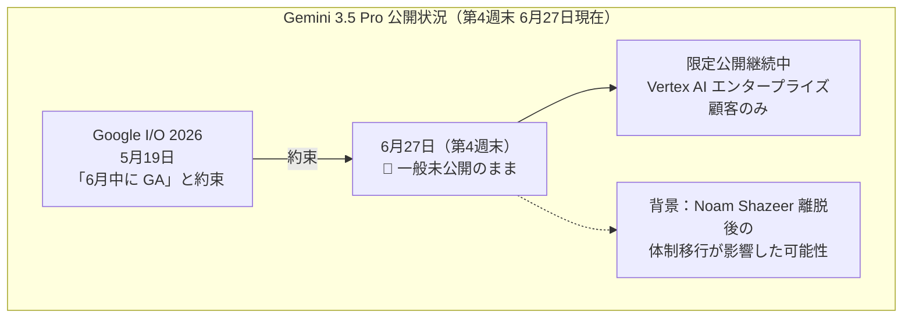

**確認済みスペック（限定プレビューより）：**

| 仕様 | 内容 |
|---|---|
| コンテキストウィンドウ | 200万トークン（Gemini 1.5 Pro の2倍） |
| 推論モード | "Deep Think"（拡張推論） |
| 予想価格 | 入力 $15 / 出力 $60 per 1M tokens |

---

### 2.2 Gemini for Science 発表：マルチエージェント科学研究エンジン（6月25日）

Google が **Gemini for Science** を6月25日に発表した。科学探索の規模と精度を拡大する AI ツール群で、Co-Scientist・Computational Discovery・Science Skills の3コンポーネントで構成される。[[3]](#ref-3)

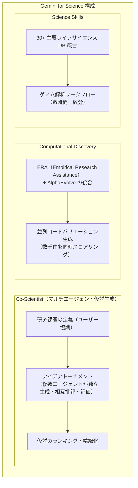

**Gemini Paper Assistant（PAT）** も STOC 2026 で実証。提出前24時間以内に AI が論文フィードバックを提供し、参加者の94%が有用と評価、85%が論文の明瞭さ改善を報告した。ICML・NeurIPS 等を含む主要会議で累積10,000+論文をレビュー済み。[[4]](#ref-4)

---

### 2.3 Vertex AI → Gemini Enterprise Agent Platform への統合（6月）

Google Cloud が **Vertex AI のスタンドアロン・ロードマップを廃止し、Gemini Enterprise Agent Platform への統合**を進める方針を公表した。[[5]](#ref-5)[[6]](#ref-6)

**廃止スケジュール（第4週時点でのアップデート）：**

| エンドポイント / サービス | 廃止期限 | 移行先 |
|---|---|---|
| Image / Video Generation Endpoints（旧版） | **2026年6月30日（3日後）** | Imagen 3 / Veo 3.1 Lite |
| Vertex AI Extensions | 2026年11月26日 | Gemini Enterprise Agent Platform |

**同時期 GA・プレビューリリース：**

| 機能 | 状態 | 概要 |
|---|---|---|
| **Vector Search 2.0** | **GA** | AI 開発向け高性能ベクトル検索エンジン。スケーラビリティと精度を強化 |
| **Vertex AI RAG Engine Serverless** | パブリックプレビュー | 完全マネージドの RAG データベース。インフラ管理不要 |
| **Veo 3.1 Lite** | パブリックプレビュー | Veo シリーズ最もコスト効率の高い動画生成モデル |
| **Claude Opus 4.7** | Vertex AI 提供開始 | Anthropic のモデル。曖昧な指示への対処・複雑なタスクの徹底的解決・ビジョン機能が強化 |

[[6]](#ref-6)[[7]](#ref-7)

---

### 2.4 Vertex AI Python SDK 廃止完了（6月24日）

2025年6月24日に非推奨宣告されていた **Vertex AI Python SDK の生成 AI モジュール群**が、本日（6月24日）をもって正式削除された。移行先は `google-genai`（Google Gen AI SDK）。[[8]](#ref-8)[[9]](#ref-9)

| 廃止モジュール（vertexai.*） | 移行先（google.genai.*） |
|---|---|
| `vertexai.generative_models` | `google.genai.GenerativeModel` |
| `vertexai.language_models` | `google.genai.models` |
| `vertexai.vision_models` | `google.genai.files` + `google.genai.models` |
| `vertexai.tuning` | `google.genai.tuning` |
| `vertexai.caching` | `google.genai.caches` |

> **実務影響:** 本番サービスで Vertex AI SDK を使用している組織は、`vertexai.generative_models` 等への依存が原因でエラーが発生する。`google-cloud-aiplatform` パッケージ自体は残るが、生成 AI モジュール部分は削除済み。

---

## 3. Microsoft Azure AIアップデート

### 3.1 Azure Cobalt 200 Arm-based VMs：エージェント AI ワークロード向け早期アクセスプレビュー（6月21日）

Microsoft が **Azure Cobalt 200 Arm ベース仮想マシン** の早期アクセスプレビューを発表した。Linux ベースのエージェント AI ワークロード向けに最適化され、従来の Azure VM 比 **50% の性能向上** を実現する。[[10]](#ref-10)

また、同時期に **Claude Opus 4.8** が Microsoft Foundry で利用可能となった（コーディング・エージェンティックタスク・プロフェッショナル業務向け）。

---

### 3.2 Microsoft Foundry Agent Service：Teams / M365 Copilot への展開が6月 GA 目標

Microsoft Build 2026 で予告されていた **Foundry Agent Service** の Teams・M365 Copilot への展開が6月 GA 目標として進行中。Hosted Agents は7月初頭 GA 予定。[[11]](#ref-11)[[12]](#ref-12)

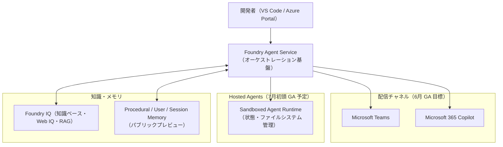

---

### 3.3 Azure OpenAI：GPT Realtime 2.0 プレビュー・PII 検出フィルタ GA（6月23日）

- **GPT Realtime 2.0（プレビュー）**：リアルタイム音声インタラクションに推論モードを追加。Preamble（内部推論）と Final Answer（最終回答）の2フェーズで複雑な質問に対応。[[13]](#ref-13)
- **PII 検出フィルタ GA**：LLM 出力中の氏名・住所・電話番号等の個人識別情報を検出・ブロックする組み込みフィルタが一般提供。EU AI Act・HIPAA・個人情報保護法等への対応に活用できる。[[13]](#ref-13)

---

### 3.4 Azure OpenAI Service：5月29日障害の Incident Retrospective 実施（6月25日）

2026年5月29日の Azure OpenAI Service 大規模障害（09:39〜17:05 UTC、約7時間26分、Europe/Australia East に影響）について、6月25日に Incident Retrospective ライブストリームが実施された。[[14]](#ref-14)

**根本的な改善策：** 大規模ファーストパーティの生成 AI ワークロードを**共有ルーティングインフラから専用ルーティングインフラへ移行**（2026年6月中に完了見込み）。

---

## 4. LLM Model / AI Agentアーキテクチャ・研究

### 4.1 Google DeepMind AI Control Roadmap：アライメント失敗を前提とした多層防御フレームワーク（6月18日公開）

Google DeepMind が **AI Control Roadmap** を公開した。高度化する AI エージェントのアライメント失敗を前提とした **defense-in-depth（多層防御）** アーキテクチャを提示する35ページの技術文書。[[15]](#ref-15)[[16]](#ref-16)

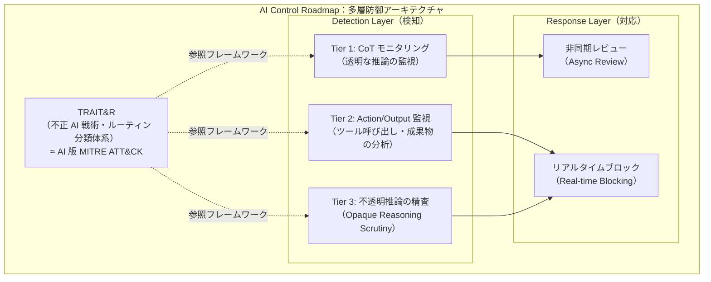

| 概念 | 内容 |
|---|---|
| **前提の転換** | 「アライメントは完全には解決できないかもしれない」を前提に system-level security を追加 |
| **Zero Trust for AI** | 高度な AI エージェントを「インサイダー脅威」として扱い内部からの不正行動に備える |
| **TRAIT&R** | MITRE ATT&CK をモデルにした「不正 AI 戦術・ルーティン分類体系」を新規定義 |
| **制御数** | 検知から対応まで15の実践的制御を定義 |

---

### 4.2 AWS Summit NY 2026：Continuum・Context・AgentCore 新機能（6月17日）

AWS Summit New York 2026（6月17日）で Swami Sivasubramanian（AWS VP of Agentic AI）が複数の新機能を発表した。[[17]](#ref-17)[[18]](#ref-18)

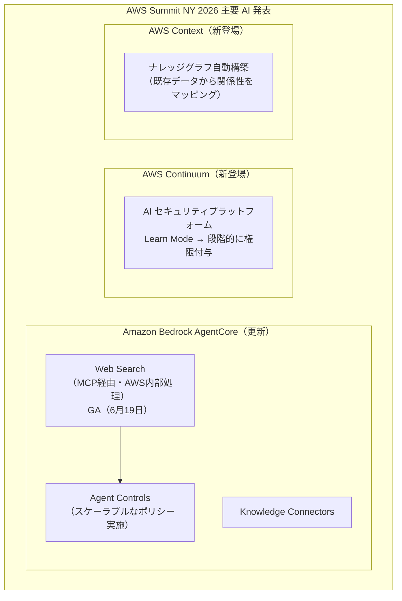

| サービス | 内容 | 状態 |
|---|---|---|
| **AWS Continuum** | AI ネイティブセキュリティプラットフォーム。「Learn モード」でまず環境を学習し、ユーザーが権限付与するにつれ自律動作を拡大するトラストモデル | ゲーテッドプレビュー |
| **AWS Context** | 組織の既存データから関係性・知識を自動ナレッジグラフ化し、エージェントがアクセス可能に | 発表済み |
| **AgentCore Web Search** | Amazon Web Index + Knowledge Graph を組み合わせたリアルタイム Web 検索（MCP 経由）。$7 / 1,000 クエリ | **GA（6月19日）** |

[[19]](#ref-19)

> **アーキテクチャ的意義:** AWS Continuum の「Learn → Permission」段階的トラストモデルは、Google DeepMind AI Control Roadmap の「Zero Trust for AI」と同じ思想を実装面から具体化。自律 AI エージェントに対し「事後的な監視」でなく「事前的なポリシー定義」で統制するアプローチがクラウド業界の標準になりつつある。

---

### 4.3 Survey of LLM Agent Communication with MCP（arXiv:2506.05364）

arXiv に **MCP を軸に LLM エージェント間通信を設計パターンの観点から体系化**した調査論文が公開された。[[20]](#ref-20)

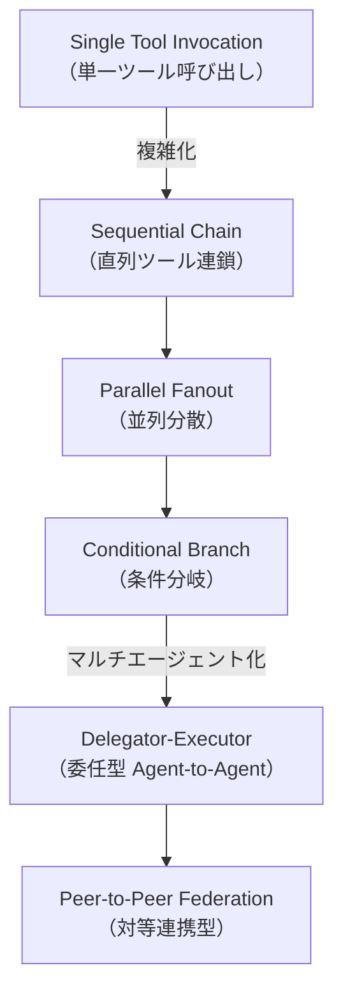

主要知見：**ツール爆発問題**（管理ツール数増加による選択精度低下）への対策として、セマンティッククラスタリングによる2段階選択（グループ選択 → ツール選択）を推奨。MCP が事実上の「エージェント間通信標準」として急速に普及している。

---

### 4.4 GPT-5.6 Sol アーキテクチャ：「Ultra Mode」と専門サブエージェント活用（6月26日発表）

OpenAI が公開した **GPT-5.6 Sol** は、従来のシングルモデル推論を超えた新アーキテクチャを採用している。[[21]](#ref-21)

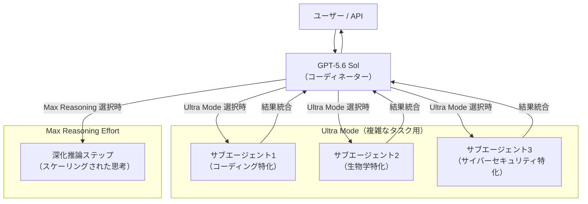

**GPT-5.6 シリーズ比較：**

| モデル | 位置付け | 特徴 | 価格目安 |
|---|---|---|---|
| **GPT-5.6 Sol** | フラッグシップ | Ultra Mode（専門サブエージェント）+ Max Reasoning | 高コスト |
| **GPT-5.6 Terra** | バランス型 | GPT-5.5 同等性能、コスト効率 2 倍改善 | GPT-5.5 の約半額 |
| **GPT-5.6 Luna** | 軽量・高速型 | 最高速・最低コスト・エッジ用途向け | 最低コスト |

---

### 4.5 Google Research「エージェントシステムスケーリングの科学に向けて」（6月）

Google Research が **「Towards a science of scaling agent systems: When and why agent systems work」** を公開し、マルチエージェントシステムの成立条件と有効性を理論的に整理した。[[22]](#ref-22)

| 知見 | 説明 |
|---|---|
| **スマートモデルがマルチエージェントの必要性を加速** | 基盤モデルの能力が向上するほど、エージェント分業によるスケーリング効果が大きくなる |
| **シングルエージェントの限界** | 単一エージェントでは到達できないタスク複雑度の領域が存在する |
| **有効条件** | タスクが並列化可能・専門知識ドメインが明確・検証コストが低い場合に特に有効 |

> GPT-5.6 Sol の「Ultra Mode」や Gemini for Science の「Co-Scientist」のような実装が科学的に裏付けられる。マルチエージェントアーキテクチャは「凝り過ぎな実装」ではなく、基盤モデルの能力向上とともに**必然的なスケーリング手段**として位置付けられる。

---

## 5. 公式ブログ・論文のリサーチ・要約

### 5.1 Google / Google DeepMind

#### 5.1.1 Gemini for Science（6月25日）
→ [2.2 参照](#22-gemini-for-science-発表マルチエージェント科学研究エンジン6月25日)

#### 5.1.2 AI Control Roadmap（6月18日公開）
→ [4.1 参照](#41-google-deepmind-ai-control-roadmapアライメント失敗を前提とした多層防御フレームワーク6月18日公開)

---

### 5.2 OpenAI

#### 5.2.1 GPT-5.6 Sol プレビュー公開（6月26日）

OpenAI は6月26日、**GPT-5.6 Sol / Terra / Luna** の限定プレビューを開始した。White House からの要請（→ [8.4 参照](#84-ホワイトハウスが-gpt-56-のリリース制限を要請史上初のフロンティアモデル公開前規制6月25日)）を受け、政府承認済みパートナー約20社への先行アクセスに変更。一般公開は数週間後を予定。[[21]](#ref-21)

ChatGPT 関連アップデート（同日）：
- 簡略化されたモデルピッカー（「スピード」vs「推論深度」を直感的に選択）
- 「Thinking Light」オプションを廃止
- ChatGPT Business 向けプラグイン管理コントロール追加

---

#### 5.2.2 Codex Record & Replay（macOS、6月18日）

OpenAI が Codex アプリ（macOS）に **Record & Replay** 機能を追加。ワークフローを一度デモンストレーションするだけで、Codex が自動的に SKILL.md として記憶・再利用できる。[[23]](#ref-23)[[24]](#ref-24)

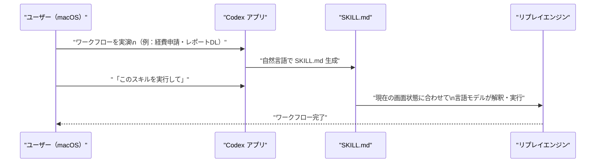

対応プラン：Plus / Pro / Business / Enterprise / Edu（macOS のみ・EU/英国/スイス除外）

---

#### 5.2.3 Daybreak 拡張：GPT-5.5-Cyber GA・Codex Security・Patch the Planet（6月22日）

OpenAI がサイバーセキュリティ支援プログラム **Daybreak** を大幅に拡張した。[[25]](#ref-25)[[26]](#ref-26)[[27]](#ref-27)[[28]](#ref-28)

| リリース | 内容 |
|---|---|
| **GPT-5.5-Cyber（完全版 GA）** | CyberGym: 85.6%（vs GPT-5.5: 81.8%）。7カ国＋ENISA の Trusted Defender に限定配布 |
| **Codex Security** | 開発ワークフローへの脆弱性スキャン統合プラグイン |
| **Patch the Planet** | Trail of Bits / HackerOne 協力でオープンソース（cURL・Go・Python・Sigstore 等30+プロジェクト）へのパッチ自動化支援 |

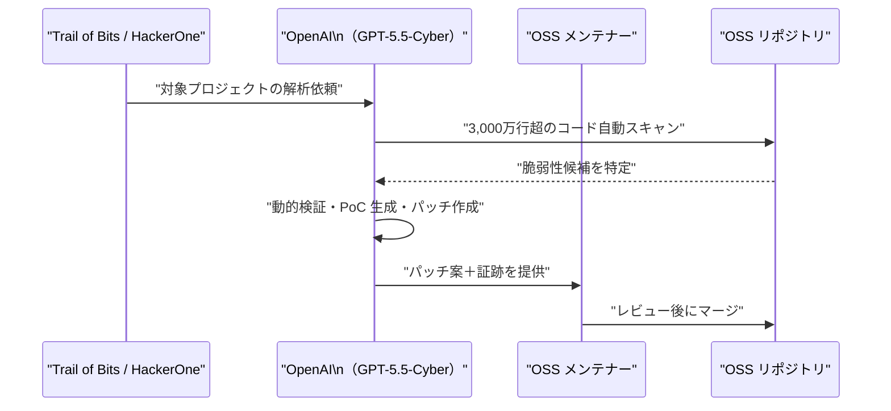

---

#### 5.2.4 GPT-5.5 Instant 会話品質アップデート（6月24日）

ChatGPT 全ユーザー向けデフォルトモデル **GPT-5.5 Instant** の会話品質特化アップデートを実施。ベンチマークスコアではなく「話して楽しい」体験の向上を主眼とした改修。意思決定支援・アドバイス提供・計画立案・リサーチ・ショッピング支援で実用性が大幅改善。[[29]](#ref-29)

---

#### 5.2.5 ChatGPT Enterprise 利用状況分析＆支出管理コントロール（6月21日）

**Usage Analytics**（ChatGPT・Codex 横断のクレジット消費をユーザー/製品/モデル別に表示）と **Spend Controls**（グループ単位のキャップ設定 + ユーザー自己管理）を ChatGPT Enterprise 向けに公開。Cost API 経由でプログラマティックにデータ取得可能。[[30]](#ref-30)

---

#### 5.2.6 GPT-4.5 の ChatGPT 退役（6月27日）

**GPT-4.5 が6月27日をもって ChatGPT から正式に退役**。30日間のサンセット期間を経て、既存の会話は GPT-5.5 に自動引き継ぎとなった。次の退役予定は OpenAI o3（8月26日予定）。

---

### 5.3 Anthropic

#### 5.3.1 Workload Identity Federation（WIF）GA（6月17日頃）

Anthropic が **WIF** を Claude プラットフォームで GA した。静的な API キーを廃止し、既存の ID プロバイダーから**短命アクセストークン**を発行するキーレス認証の仕組み。[[31]](#ref-31)[[32]](#ref-32)

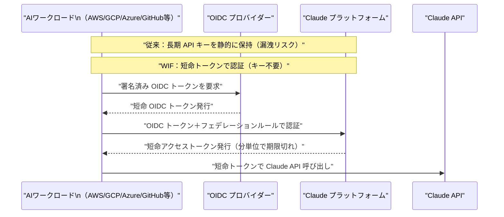

| 対応 ID プロバイダー | 種別 |
|---|---|
| AWS IAM Role | クラウド |
| GCP サービスアカウント / Kubernetes SA | クラウド / コンテナ |
| Azure マネージド ID | クラウド |
| GitHub Actions トークン | CI/CD |
| Okta / 任意の OIDC 準拠プロバイダー | IdP |

---

#### 5.3.2 Claude Tag for Slack ベータリリース（6月23日）

Anthropic が **Claude Tag** を Slack 向けにベータリリースした。Claude がチャンネルに常駐する「チームメイト」として機能し、非同期タスク処理・コンテキストメモリ・スケジュール実行を提供する。[[33]](#ref-33)[[34]](#ref-34)

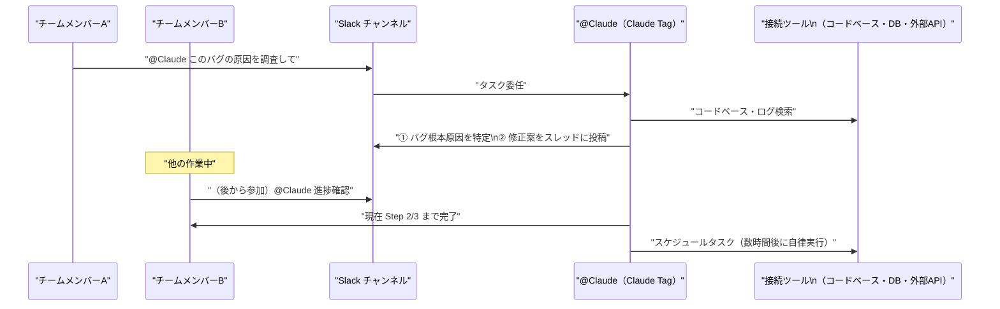

| 機能 | 内容 |
|---|---|
| **チャンネル共有 AI** | 1チャンネルに1つの @Claude が常駐。チームメンバー全員が同じ Claude と対話しコンテキストを引き継ぎ可能 |
| **非同期タスク処理** | @Claude に依頼すれば自律的にタスクを段階分解して実行 |
| **コンテキストメモリ** | チャンネル内のやり取りから関連情報を記憶し継続的なプロジェクト文脈を把握 |
| **スケジュール実行** | 数時間〜数日後のタスクを自律的にスケジュールして実行 |
| **ベースモデル** | Claude Opus 4.8 |
| **対象プラン** | Claude Enterprise・Claude Team（ベータ） |
| **旧アプリ廃止** | 旧 Claude in Slack は 2026年8月3日に廃止 |
| **Anthropic 社内実績** | コードの約 **65%** が社内版 Claude Tag 経由で生成 |

---

#### 5.3.3 Claude Fable 5 / Mythos 5：週内の主要アップデート（第4週）

6月12日の輸出規制命令による全停止（前週報告済み）から進展があった本週の状況をまとめる。

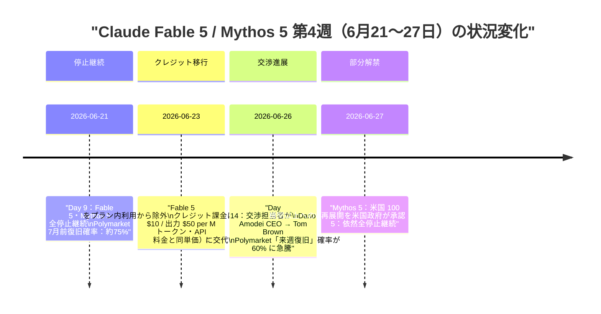

**6月27日時点の現状：**

| モデル | 状態 | 詳細 |
|---|---|---|
| **Mythos 5** | **部分解禁（6月27日）** | 米国の主要企業・政府機関を含む 100 機関以上に再展開 |
| **Fable 5** | 停止継続 | 一般公開への復旧日は未発表。Commerce Department との交渉継続中 |

**今後の注目日程：**

| 日程 | イベント | 復元への影響 |
|---|---|---|
| **2026年7月8日** | Anthropic プライバシーポリシー改定発効 | gov-ID 検証追加 → US ユーザー優先復元の技術的手段が整う見込み |
| **2026年8月1日** | EO 60日期限（NSA 等による Frontier Model Framework 整備完了目標） | 規制の正規ルート確立の構造的節目 |

[[35]](#ref-35)[[36]](#ref-36)

---

## 6. AI Agent搭載SaaS製品情報

### 6.1 xAI Grok 4.3 on Amazon Bedrock（6月15日）

xAI の推論特化モデル **Grok 4.3** が **Amazon Bedrock** で利用可能となった（xAI モデルの主要クラウドプラットフォーム初登場）。Bedrock 独自推論エンジン「**Mantle**」上で動作し、米国ラボのフロンティア推論モデルとして Bedrock **最安値**水準の価格設定。[[37]](#ref-37)[[38]](#ref-38)

| 項目 | 内容 |
|---|---|
| 価格 | $1.25 / 入力 M トークン、$2.50 / 出力 M トークン |
| コンテキスト | 100万トークン |
| 推論エンジン | Mantle（`bedrock-mantle` 専用エンドポイント） |
| 注意点 | 既存の Bedrock SDK コードは変更なしでは動作しない（Mantle 専用エンドポイントを使用） |

---

### 6.2 Claude Tag for Slack（Anthropic、6月23日〜）

→ [5.3.2 参照](#532-claude-tag-for-slack-ベータリリース6月23日)

**競合状況との比較：**

| 製品 | 提供元 | 統合先 | ステータス |
|---|---|---|---|
| **Claude Tag** | Anthropic | Slack | ベータ（6/23〜）|
| **Microsoft 365 Copilot Chat** | Microsoft | Teams | GA |
| **Gemini for Google Workspace** | Google | Google Chat / Docs 等 | GA |

---

### 6.3 Snowflake ML エージェント機能（6月）

**Snowflake ML** がデータサイエンス・ML チーム向けのエージェント機能を新導入。データウェアハウス内データを AI エージェントが直接操作し、ML パイプライン構築・モデル学習・評価のワークフローを自動化する。[[39]](#ref-39)

| 機能 | 説明 |
|---|---|
| Agentic データ探索 | 自然言語でデータを探索し、前処理・特徴量エンジニアリングを自動提案 |
| ML パイプライン自動化 | エージェントがハイパーパラメータ探索・モデル評価を自律的に実行 |
| Snowflake Cortex 統合 | 既存の LLM 機能との統合でテキストデータの解析も組み合わせ可能 |

---

### 6.4 Gartner 予測：2026年 AI エージェントソフトウェア支出は $2,065億（前年比 +139%）

Gartner が2026年の AI エージェントソフトウェア支出を **$2,065億（前年比 +139%）** と予測した。[[40]](#ref-40)

| 年 | 市場規模 | 前年比成長率 |
|---|---|---|
| 2025年 | $864億 | ― |
| **2026年** | **$2,065億** | **+139%** |

---

## 7. LLM/AI Agentセキュリティインシデント

### 7.1 Gravitee「State of AI Agent Security 2026」：88%の組織でセキュリティインシデント発生

API 管理プラットフォーム **Gravitee** が公開した調査レポートで、AI エージェントの急速な採用がセキュリティ管理を大幅に上回っている実態が明らかになった。[[41]](#ref-41)[[42]](#ref-42)

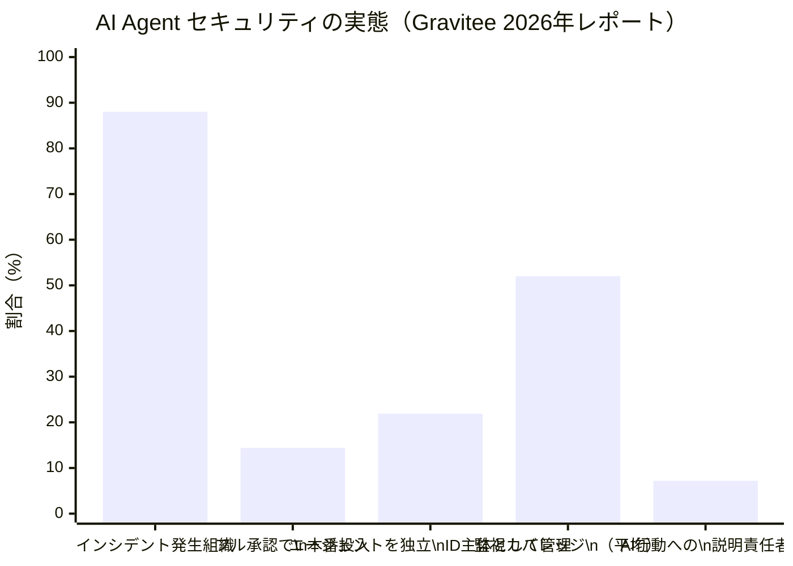

| 指標 | 数値 |
|---|---|
| **セキュリティインシデント発生組織** | **88%** |
| ヘルスケア業界のインシデント率 | **92.7%**（最高セクター） |
| フル承認でエージェントを本番投入 | **14.4%** |
| エージェントを独立した ID 主体として管理 | **21.9%** |
| エージェントの平均監視カバレッジ | **52%** |
| AI 行動への正式な説明責任者が存在 | **7.2%** |

**推奨事項：** ① エージェントに独自 ID（サービスアカウント）を付与し共有 API キーを廃止、② 全エージェントに監視を適用、③ agent-to-agent 委譲には承認チェックポイントを設置、④ AI 行動への正式な説明責任者を任命。

---

### 7.2 LiteLLM 脆弱性：CISA 期限到来（6月22日）＋ 追加 CVE 報告（6月27日）

前週報告した LiteLLM CVE チェーン（CVE-2026-42271 + CVE-2026-48710、CVSS 10.0、パッチ済み v1.83.7 以降）の **CISA 連邦機関対応義務期限が6月22日に到来**した。本週さらに新たな脆弱性も報告された。[[43]](#ref-43)[[44]](#ref-44)

**新規報告 CVE（6月27日）：**

| CVE 番号 | 種別 | CVSS | 影響 |
|---|---|---|---|
| **CVE-2026-49468** | ホストヘッダインジェクション | Critical | 認証バイパスが可能 |
| **CVE-2026-42208** | SQL インジェクション（プロキシ API キー検証） | **9.3** | データベースへの不正アクセス・認証情報漏洩 |

> **対応:** LiteLLM を使用しているすべての環境で、最新のパッチ済みバージョンへの速やかな更新が必要。本番 LLM プロキシ環境への影響が特に大きい。AI ゲートウェイは社内の全 LLM API キーへのアクセスを持つため、侵害時の被害が甚大となる。

---

### 7.3 CVE-2026-27740：Discourse AI プラグインに LLM 出力経由の格納型 XSS（6月23日）

Discourse の AI プラグインに、**間接プロンプトインジェクション → LLM 出力に埋め込まれた悪意ある JS payload が管理画面に描画される格納型 XSS** が発見された。[[45]](#ref-45)[[46]](#ref-46)

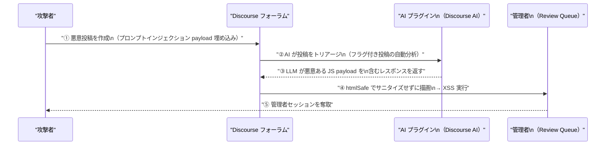

| 項目 | 内容 |
|---|---|
| **CVE** | CVE-2026-27740 |
| **種別** | 格納型 XSS（Stored Cross-Site Scripting）|
| **影響範囲** | Staff 権限ユーザー（管理者・モデレーター）のセッション奪取 |
| **脆弱バージョン** | 2026.3.0-latest.1, 2026.2.1, 2026.1.2 より前 |
| **修正バージョン** | 2026.3.0-latest.1, 2026.2.1, 2026.1.2 |

**根本原因：** LLM の出力を「信頼された入力」として扱ったこと。LLM 出力は外部ユーザーの入力と同様に「Untrusted データ」として扱い、描画前に必ずサニタイズが必要。LLM を組み込んだ Web アプリケーション全般に共通するアーキテクチャ上の教訓。

---

### 7.4 CVE-2026-7482「Bleeding Llama」：Ollama 重大メモリリーク（CVSS 9.1）（6月27日）

**Ollama の GGUF モデルローダーに Heap Out-of-Bounds Read 脆弱性**が報告された。研究者が「Bleeding Llama」と命名。世界中の **30 万台以上のサーバー** に影響する可能性がある。[[47]](#ref-47)[[48]](#ref-48)

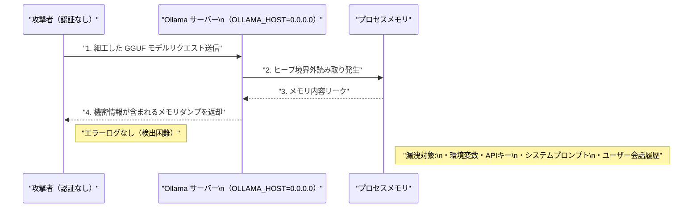

| 項目 | 内容 |
|---|---|
| **CVSS スコア** | 9.1（Critical） |
| **攻撃条件** | 認証不要。ネットワーク越しに 3 回の API 呼び出しで攻撃可能 |
| **影響範囲** | `OLLAMA_HOST=0.0.0.0` 設定のサーバー（全インターフェース公開） |
| **漏洩対象** | 環境変数・API キー・システムプロンプト・ユーザー会話履歴 |
| **検出困難性** | 攻撃がエラーログを残さない |
| **推定影響サーバー数** | 世界で 30 万台以上 |
| **修正版** | **Ollama v0.17.1 以降** |

> **緊急対応：** Ollama を使用している場合は直ちに v0.17.1 以降へのアップグレードと、`OLLAMA_HOST` を `127.0.0.1` に制限することを強く推奨。

---

### 7.5 ClawWorm：LLM エージェントエコシステムを横断する自己拡散型攻撃（arXiv 論文）

arXiv に **「ClawWorm: Self-Propagating Attacks Across LLM Agent Ecosystems」** が公開された。一つのエージェントが感染すると共有メモリやツール呼び出しを介して他エージェントへ自律的に拡散する新攻撃ベクターを実証している。[[49]](#ref-49)

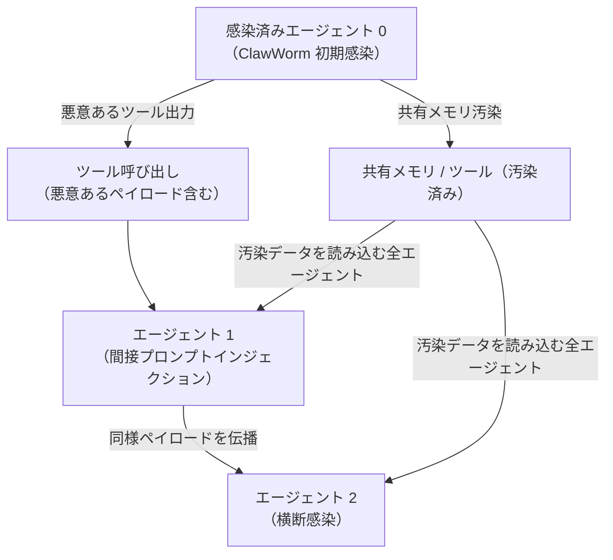

| 知見 | 説明 |
|---|---|
| **ワーム的自己拡散** | 1つのエージェント感染がツール呼び出し・共有メモリ経由で他エージェントへ自律拡散 |
| **間接プロンプトインジェクションが基盤** | 外部データ（ツール出力・Web コンテンツ）に埋め込まれた悪意ある指示が感染源 |
| **マルチエージェントの脆弱性** | 単体 LLM より複雑なマルチエージェントシステムが特に脆弱 |

> 間接プロンプトインジェクションが「単一エージェントへの攻撃」から「エコシステム全体への自己拡散型攻撃」へ進化していることを示す重要な研究。マルチエージェントシステムを設計・運用する際の必読文献。

---

## 8. その他特筆すべき情報

### 8.1 Noam Shazeer が Google を離れ OpenAI へ（6月18日）

Transformer 論文「Attention Is All You Need」共著者の **Noam Shazeer** 氏が Google を離れ、**OpenAI に「AI Architecture Research Lead」として入社**することを6月18日に公表した。[[50]](#ref-50)[[51]](#ref-51)

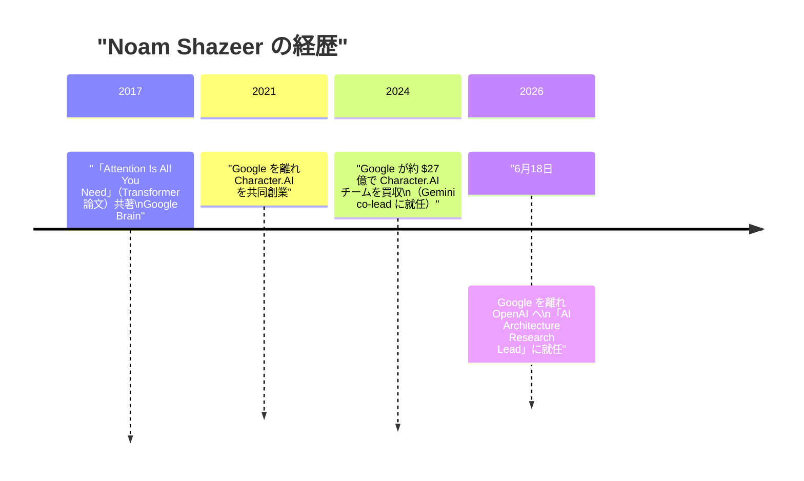

**影響：** Google は Gemini の技術統括者を失う（Gemini 3.5 Pro 遅延の背景の一因とも見られる）。Transformer 論文の主著者クラスが Google から競合へ移籍——「AI 人材争奪戦の象徴」とも評される。

---

### 8.2 SpaceX が AI コーディングツール Cursor を $600億で買収合意（6月16日）

SpaceX が AI コーディングエディタ「**Cursor**」の開発元 Anysphere を **$600億（全額 SpaceX 株式交換）** で買収合意。スタートアップ史上最大規模の買収となる可能性がある。クローズ予定は2026年Q3。[[52]](#ref-52)[[53]](#ref-53)

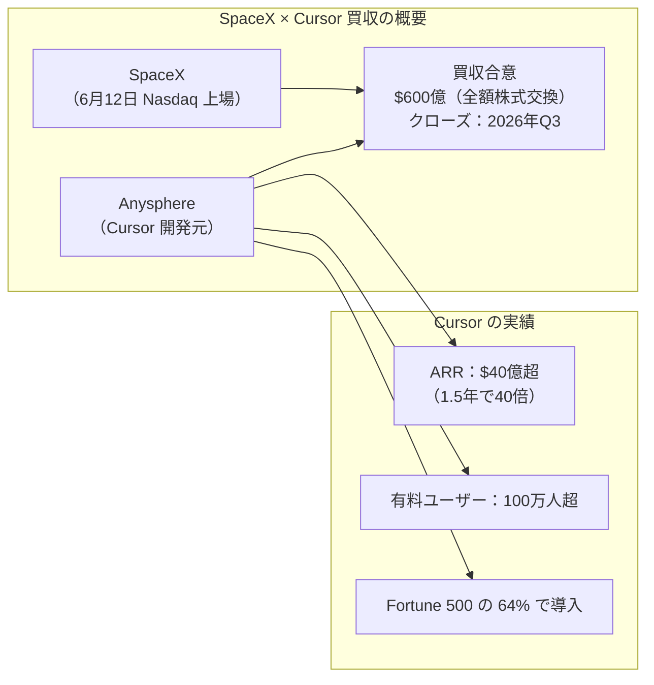

---

### 8.3 FERC：AI データセンターのグリッド接続を優先する「ショーコーズ命令」発令（6月18日）

米国連邦エネルギー規制委員会（**FERC**）が6月18日、AI データセンターを含む大規模電力利用者のグリッド接続を加速させるための「ショーコーズ命令」を6つの地域グリッド運営者（PJM・MISO・SPP・CAISO・ISO-NE・NYISO）に対して発令した。[[54]](#ref-54)[[55]](#ref-55)

- 30日以内：十分な発電容量確保計画の提出を要求
- 60日以内：現行タリフの妥当性説明または改革案の提出を要求
- AI の電力需要が国家インフラ政策レベルの対応を必要とする段階に達したことを示す重要な先例。

---

### 8.4 ホワイトハウスが GPT-5.6 のリリース制限を要請：史上初のフロンティアモデル公開前規制（6月25日）

White House ONCD（国家サイバー長官室）・OSTP が OpenAI に対し **GPT-5.6 の広範なリリースを制限するよう要請**した。史上初となる米国政府によるフロンティアモデルの公開前リリース制限。[[56]](#ref-56)[[57]](#ref-57)

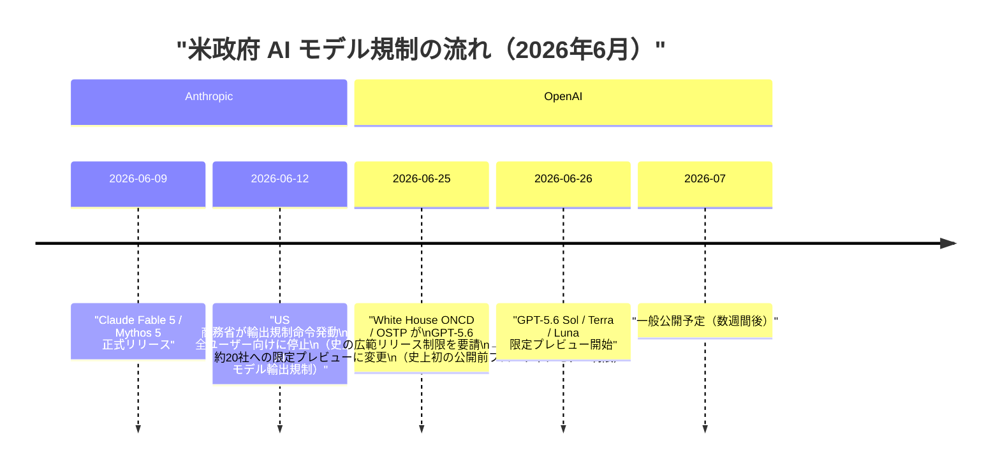

| 項目 | 内容 |
|---|---|
| **要請主体** | White House ONCD・OSTP |
| **理由** | GPT-5.6 の先進サイバーセキュリティ能力が「前例のないリスク」 |
| **初期アクセス対象** | 政府承認済みパートナー約20社（Amazon Bedrock を含む） |
| **Altman CEO のコメント** | 「一般公開は数週間後を予定」「長期的に好ましいモデルではない」 |
| **意義** | EO に基づく Frontier Model Framework（8月1日期限）の制度整備を待たずに個別ケースで先取り適用 |

> Claude Fable 5 規制（輸出規制）と GPT-5.6 規制（リリース前制限）は法的根拠が異なるが、いずれも「政府が AI モデルの公開をコントロールする」という実態は同じ。次世代モデルを開発する他社（Meta・Google 等）のリリース戦略にも影響する可能性がある。

---

### 8.5 Trump AI 大統領令：30日期限（7月2日）まで1週間

2026年6月2日署名の **「Advanced AI Innovation and Security」大統領令** において、**30日期限（7月2日）** まで残り7日となった。[[58]](#ref-58)

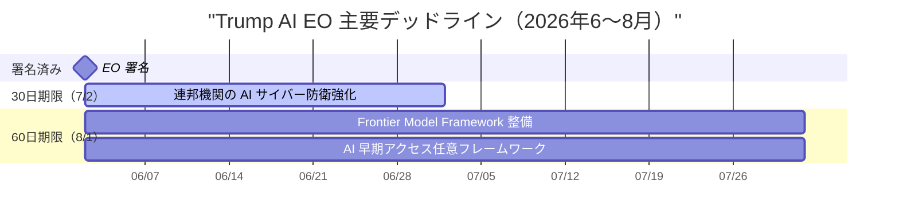

| 期限 | 要件 |
|---|---|
| **7月2日（30日）** | CNSS・国防長官・連邦機関が AI サイバー防衛強化の行動計画を策定 |
| **8月1日（60日）** | NSA 等による「対象フロンティアモデル」分類基準策定、AI 開発者への政府早期アクセス任意フレームワーク確立 |

---

### 8.6 OpenAI × Broadcom：Jalapeño AI 推論チップ発表（6月24日）

OpenAI と Broadcom が共同開発した初のカスタム AI チップ **「Jalapeño（Intelligence Processor）」** を正式発表した。[[59]](#ref-59)[[60]](#ref-60)[[61]](#ref-61)

```mermaid
graph LR
    subgraph "Jalapeño Intelligence Processor"
        OPENAI["OpenAI\n（ソフトウェア・モデル設計）"]
        BROADCOM["Broadcom\n（ASIC 実装・製造）"]
        CHIP["Jalapeño\nLLM 推論専用チップ"]
        AZURE["Microsoft Azure\n（2026年末 初期展開）"]
    end
    OPENAI -->|"9ヶ月で設計"| CHIP
    BROADCOM -->|"製造"| CHIP
    CHIP --> AZURE
```

| 項目 | 内容 |
|---|---|
| **開発期間** | わずか9ヶ月（ASIC 開発史上最速水準） |
| **コスト削減** | 従来の AI GPU 比 **約 50% のコスト削減**（Broadcom CEO 発言） |
| **用途** | LLM 推論（ChatGPT ユーザーへのサービング）専用 |
| **初期展開** | 2026年末目標（ギガワット規模 DC に展開） |
| **特記事項** | チップ設計プロセス自体に OpenAI モデルを活用 |

---

### 8.7 Google DeepMind と A24 が $7,500 万の映画制作 AI パートナーシップ締結（6月）

**Google DeepMind が映画スタジオ A24 に $7,500 万を投資**し、AI を活用した映画制作ツールの共同開発に乗り出した。[[62]](#ref-62)[[63]](#ref-63)

| 項目 | 内容 |
|---|---|
| **投資額** | $7,500 万（Google DeepMind → A24） |
| **Google のメリット** | A24 コンテンツライブラリへのアクセスなし（明示） |
| **開発対象** | AI 生成絵コンテ・制作プロセス自動化ツール |
| **設計方針** | 「クリエイター制御型」—— 生成 AI が制作者を補助する位置付けを明記 |

> 高品質コンテンツとアーティスト保護で知られる A24 との提携は、Hollywood における AI 活用の「クリエイター中心モデル」の確立を目指す試み。Google DeepMind がコンテンツライブラリアクセスを得ないと明示した点は、訓練データ問題への配慮と読める。

---

## 9. 参考文献

<a id="ref-1"></a>
**[[1]](#ref-1)** [Google Gemini 3.5 Pro Nears June Launch With 2 Million Token Context And Deep Think Reasoning | TechTimes](https://www.techtimes.com/articles/317919/20260606/google-gemini-35-pro-nears-june-launch-2-million-token-context-deep-think-reasoning.htm)

<a id="ref-2"></a>
**[[2]](#ref-2)** [Gemini 3.5 Pro Release Date June 2026: Confirmed Specs, Pricing & Launch Window | GrowwingAssistant](https://growwingassistant.com/ai-news/gemini-3-5-pro-release-date-june-2026-every-confirmed-spec-pricing-when-it-drops/)

<a id="ref-3"></a>
**[[3]](#ref-3)** [Gemini for Science: AI experiments and tools for a new era of discovery | Google Blog](https://blog.google/innovation-and-ai/technology/research/gemini-for-science-io-2026/)

<a id="ref-4"></a>
**[[4]](#ref-4)** [Gemini-backed Paper Assistant Tool provides automated feedback for theoretical computer scientists at STOC 2026 | Google Research](https://research.google/blog/gemini-provides-automated-feedback-for-theoretical-computer-scientists-at-stoc-2026/)

<a id="ref-5"></a>
**[[5]](#ref-5)** [What Google Cloud announced in AI this month | Google Cloud Blog](https://cloud.google.com/blog/products/ai-machine-learning/what-google-cloud-announced-in-ai-this-month)

<a id="ref-6"></a>
**[[6]](#ref-6)** [Vertex AI release notes | Google Cloud Documentation](https://cloud.google.com/vertex-ai/docs/release-notes)

<a id="ref-7"></a>
**[[7]](#ref-7)** [Claude Opus 4.7 on Vertex AI | Google Cloud Blog](https://cloud.google.com/blog/products/ai-machine-learning/claude-opus-4-7-on-vertex-ai)

<a id="ref-8"></a>
**[[8]](#ref-8)** [Vertex AI SDK migration guide | Generative AI on Vertex AI | Google Cloud](https://cloud.google.com/vertex-ai/generative-ai/docs/deprecations/genai-vertexai-sdk)

<a id="ref-9"></a>
**[[9]](#ref-9)** [The Vertex AI Generative Models SDK is Being Deprecated | GCP Study Hub](https://gcpstudyhub.com/blog/the-vertex-ai-generative-models-sdk-is-being-deprecated)

<a id="ref-10"></a>
**[[10]](#ref-10)** [What's new in Microsoft Foundry | Build Edition | Microsoft Foundry Blog](https://devblogs.microsoft.com/foundry/whats-new-in-microsoft-foundry-build-2026/)

<a id="ref-11"></a>
**[[11]](#ref-11)** [What's New in Hosted Agents in Foundry Agent Service | Microsoft Foundry Blog](https://devblogs.microsoft.com/foundry/hosted-agents-build26/)

<a id="ref-12"></a>
**[[12]](#ref-12)** [Microsoft Foundry Adds Runtime, Tooling, and Governance for Production Agents | InfoQ](https://www.infoq.com/news/2026/06/microsoft-foundry-agents/)

<a id="ref-13"></a>
**[[13]](#ref-13)** [What's new in Azure OpenAI in Microsoft Foundry Models? | Microsoft Learn](https://learn.microsoft.com/en-us/azure/foundry-classic/openai/whats-new)

<a id="ref-14"></a>
**[[14]](#ref-14)** [Azure Incident Retrospective: AOAI availability degradation | YouTube](https://www.youtube.com/watch?v=2eW7K3kWvPg)

<a id="ref-15"></a>
**[[15]](#ref-15)** [Securing internal systems against increasingly capable and imperfectly aligned AI — Google DeepMind](https://deepmind.google/blog/securing-the-future-of-ai-agents/)

<a id="ref-16"></a>
**[[16]](#ref-16)** [Google DeepMind AI Control Roadmap: When Alignment Fails, Defense-in-Depth Takes Over | TechTimes](https://www.techtimes.com/articles/318758/20260620/google-deepmind-ai-control-roadmap-when-alignment-fails-defense-depth-takes-over.htm)

<a id="ref-17"></a>
**[[17]](#ref-17)** [Top announcements of the AWS Summit in New York, 2026 | Amazon Web Services](https://aws.amazon.com/blogs/aws/top-announcements-of-the-aws-summit-in-new-york-2026/)

<a id="ref-18"></a>
**[[18]](#ref-18)** [AWS Summit New York 2026: New AI agent innovations | About Amazon](https://www.aboutamazon.com/news/aws/aws-summit-nyc-2026-ai-agents)

<a id="ref-19"></a>
**[[19]](#ref-19)** [Announcing Web Search on Amazon Bedrock AgentCore: Ground your AI agents in current, accurate web knowledge | Amazon Web Services](https://aws.amazon.com/blogs/aws/announcing-web-search-on-amazon-bedrock-agentcore-ground-your-ai-agents-in-current-accurate-web-knowledge/)

<a id="ref-20"></a>
**[[20]](#ref-20)** [Survey of LLM Agent Communication with MCP: A Software Design Pattern Centric Review | arXiv:2506.05364](https://arxiv.org/pdf/2506.05364)

<a id="ref-21"></a>
**[[21]](#ref-21)** [Previewing GPT-5.6 Sol: a next-generation model | OpenAI](https://openai.com/index/previewing-gpt-5-6-sol/)

<a id="ref-22"></a>
**[[22]](#ref-22)** [Towards a science of scaling agent systems: When and why agent systems work | Google Research](https://research.google/blog/towards-a-science-of-scaling-agent-systems-when-and-why-agent-systems-work/)

<a id="ref-23"></a>
**[[23]](#ref-23)** [OpenAI Adds Record & Replay to Codex for macOS Business Users | AI Weekly](https://aiweekly.co/alerts/openai-adds-record-replay-to-codex-for-macos-business-users)

<a id="ref-24"></a>
**[[24]](#ref-24)** [OpenAI Codex Automation Gains Record and Replay: Show It Once, Skip the Script | TechTimes](https://www.techtimes.com/articles/318759/20260620/openai-codex-automation-gains-record-replay-show-it-once-skip-script.htm)

<a id="ref-25"></a>
**[[25]](#ref-25)** [Daybreak: Tools for securing every organization in the world | OpenAI](https://openai.com/index/daybreak-securing-the-world/)

<a id="ref-26"></a>
**[[26]](#ref-26)** [OpenAI expands Daybreak with Patch the Planet and full GPT-5.5-Cyber release | SiliconANGLE](https://siliconangle.com/2026/06/22/openai-expands-daybreak-patch-planet-full-gpt-5-5-cyber-release/)

<a id="ref-27"></a>
**[[27]](#ref-27)** [Patch the Planet: a Daybreak initiative to support open source maintainers | OpenAI](https://openai.com/index/patch-the-planet/)

<a id="ref-28"></a>
**[[28]](#ref-28)** [OpenAI Expands Daybreak With GPT-5.5-Cyber to Help Defenders Patch Security Flaws | The Hacker News](https://thehackernews.com/2026/06/openai-expands-daybreak-with-gpt-55.html)

<a id="ref-29"></a>
**[[29]](#ref-29)** [GPT-5.5 Instant: smarter, clearer, and more personalized | OpenAI](https://openai.com/index/gpt-5-5-instant/)

<a id="ref-30"></a>
**[[30]](#ref-30)** [New usage analytics and updated spend controls for enterprises | OpenAI](https://openai.com/index/chatgpt-enterprise-spend-controls/)

<a id="ref-31"></a>
**[[31]](#ref-31)** [Workload Identity Federation (WIF) is now generally available on the Claude Platform | claude.com](https://claude.com/blog/workload-identity-federation)

<a id="ref-32"></a>
**[[32]](#ref-32)** [Anthropic Workload Identity Federation: What It Gets Right – and What It Still Doesn't Solve | Security Boulevard](https://securityboulevard.com/2026/06/anthropic-workload-identity-federation-what-it-gets-right-and-what-it-still-doesnt-solve/)

<a id="ref-33"></a>
**[[33]](#ref-33)** [Anthropic's Claude Tag is learning your company, one Slack message at a time | TechCrunch](https://techcrunch.com/2026/06/23/anthropics-claude-tag-is-learning-your-company-one-slack-message-at-a-time/)

<a id="ref-34"></a>
**[[34]](#ref-34)** [Anthropic introduces Claude Tag, a new AI teammate for Slack | Neowin](https://www.neowin.net/news/anthropic-introduces-claude-tag-a-new-ai-teammate-for-slack/)

<a id="ref-35"></a>
**[[35]](#ref-35)** [Statement on the US government directive to suspend access to Fable 5 and Mythos 5 | Anthropic](https://www.anthropic.com/news/fable-mythos-access)

<a id="ref-36"></a>
**[[36]](#ref-36)** [Anthropic cleared to release Claude Mythos 5 to over 100 US institutions | 9to5Mac](https://9to5mac.com/2026/06/26/anthropic-cleared-to-release-claude-mythos-5-to-over-100-us-institutions/)

<a id="ref-37"></a>
**[[37]](#ref-37)** [Grok 4.3 from xAI now available in Amazon Bedrock | AWS](https://aws.amazon.com/about-aws/whats-new/2026/06/grok-amazon-bedrock/)

<a id="ref-38"></a>
**[[38]](#ref-38)** [Grok 4.3 Lands on Amazon Bedrock With 1M Token Context | Basenor](https://www.basenor.com/blogs/news/grok-4-3-lands-on-amazon-bedrock-with-1m-token-context)

<a id="ref-39"></a>
**[[39]](#ref-39)** [Snowflake ML agentic capabilities for data science and ML teams | Snowflake](https://www.snowflake.com/en/blog/snowflake-ml-agents/)

<a id="ref-40"></a>
**[[40]](#ref-40)** [AI Agents News June 2026 | Mean CEO Blog](https://blog.mean.ceo/ai-agents-news-june-2026/)

<a id="ref-41"></a>
**[[41]](#ref-41)** [State of AI Agent Security 2026 Report: When Adoption Outpaces Control | Gravitee](https://www.gravitee.io/blog/state-of-ai-agent-security-2026-report-when-adoption-outpaces-control)

<a id="ref-42"></a>
**[[42]](#ref-42)** [The enforcement gap: 88% of enterprises reported AI agent security incidents last year | VentureBeat](https://venturebeat.com/security/most-enterprises-cant-stop-stage-three-ai-agent-threats-venturebeat-survey-finds)

<a id="ref-43"></a>
**[[43]](#ref-43)** [LiteLLM CVE-2026-42271: Vulnerability Chain Details | CISA KEV](https://www.cisa.gov/known-exploited-vulnerabilities-catalog)

<a id="ref-44"></a>
**[[44]](#ref-44)** [LiteLLM Vulnerability: Host Header Injection Allows Authentication Bypass | CyberSecurityNews](https://cybersecuritynews.com/litellm-vulnerability-host-header-injection/)

<a id="ref-45"></a>
**[[45]](#ref-45)** [CVE-2026-27740 LLM Output Causes Stored XSS | PointGuard AI](https://www.pointguardai.com/ai-security-incidents/llm-output-triggers-stored-xss-in-discourse-cve-2026-27740)

<a id="ref-46"></a>
**[[46]](#ref-46)** [CVE-2026-27740: Discourse AI LLM XSS Vulnerability | SentinelOne](https://www.sentinelone.com/vulnerability-database/cve-2026-27740/)

<a id="ref-47"></a>
**[[47]](#ref-47)** [CVE-2026-7482: Critical Ollama Memory Leak — Bleeding Llama Explained | Indusface](https://www.indusface.com/blog/cve-2026-7482-bleeding-llama-vulnerability/)

<a id="ref-48"></a>
**[[48]](#ref-48)** [Bleeding Llama: Critical Unauthenticated Memory Leak in Ollama | Cyera Research](https://www.cyera.com/research/bleeding-llama-critical-unauthenticated-memory-leak-in-ollama)

<a id="ref-49"></a>
**[[49]](#ref-49)** [ClawWorm: Self-Propagating Attacks Across LLM Agent Ecosystems | arXiv](https://arxiv.org/pdf/2603.15727)

<a id="ref-50"></a>
**[[50]](#ref-50)** [Google Gemini co-lead Noam Shazeer leaves for OpenAI | CNBC](https://www.cnbc.com/2026/06/18/google-gemini-co-lead-noam-shazeer-leaves-for-openai.html)

<a id="ref-51"></a>
**[[51]](#ref-51)** [Noam Shazeer Joins OpenAI, Delivering Major Talent Win Over Google | citybiz](https://www.citybiz.co/article/862235/noam-shazeer-joins-openai-delivering-major-talent-win-over-google/)

<a id="ref-52"></a>
**[[52]](#ref-52)** [SpaceX to acquire Cursor for $60B in stock, days after blockbuster IPO | TechCrunch](https://techcrunch.com/2026/06/16/spacex-to-acquire-cursor-for-60b-in-stock-days-after-blockbuster-ipo/)

<a id="ref-53"></a>
**[[53]](#ref-53)** [SpaceX to acquire the AI coding startup Cursor for $60 billion | CNBC](https://www.cnbc.com/2026/06/16/spacex-spcx-cursor-acquisition-ipo.html)

<a id="ref-54"></a>
**[[54]](#ref-54)** [FERC Orders Grid Operators to Rework Data Center Power Rules | Engineering News-Record](https://www.enr.com/articles/63195-ferc-orders-grid-operators-to-rework-data-center-power-rules)

<a id="ref-55"></a>
**[[55]](#ref-55)** [FERC fast-tracks data centre grid connections | The Next Web](https://thenextweb.com/news/ferc-data-centre-grid-fast-lane-ai)

<a id="ref-56"></a>
**[[56]](#ref-56)** [The White House is asking OpenAI to slow roll the release of its new model over safety concerns | TechCrunch](https://techcrunch.com/2026/06/25/the-white-house-is-asking-openai-to-slow-roll-the-release-of-its-new-model-over-safety-concerns/)

<a id="ref-57"></a>
**[[57]](#ref-57)** [Trump administration asks OpenAI to limit release of GPT-5.6 | Axios](https://www.axios.com/2026/06/25/trump-administration-openai-gpt-model-release)

<a id="ref-58"></a>
**[[58]](#ref-58)** [Promoting Advanced Artificial Intelligence Innovation and Security | The White House](https://www.whitehouse.gov/presidential-actions/2026/06/promoting-advanced-artificial-intelligence-innovation-and-security/)

<a id="ref-59"></a>
**[[59]](#ref-59)** [OpenAI and Broadcom unveil LLM-optimized inference chip | OpenAI](https://openai.com/index/openai-broadcom-jalapeno-inference-chip/)

<a id="ref-60"></a>
**[[60]](#ref-60)** [OpenAI unveils its first custom chip, built by Broadcom | TechCrunch](https://techcrunch.com/2026/06/24/openai-unveils-its-first-custom-chip-built-by-broadcom/)

<a id="ref-61"></a>
**[[61]](#ref-61)** [OpenAI and Broadcom reveal Jalapeno, first AI chip in partnership | CNBC](https://www.cnbc.com/2026/06/24/openai-and-broadcom-reveal-jalapeno-first-ai-chip-in-partnership.html)

<a id="ref-62"></a>
**[[62]](#ref-62)** [Google DeepMind and A24 announce first-of-its-kind research partnership | Google DeepMind Blog](https://blog.google/innovation-and-ai/models-and-research/google-deepmind/deepmind-a24-research-partnership/)

<a id="ref-63"></a>
**[[63]](#ref-63)** [Google DeepMind bets $75M on AI's future in Hollywood with A24 deal | TechCrunch](https://techcrunch.com/2026/06/22/google-deepmind-bets-75m-on-ais-future-in-hollywood-with-a24-deal/)
